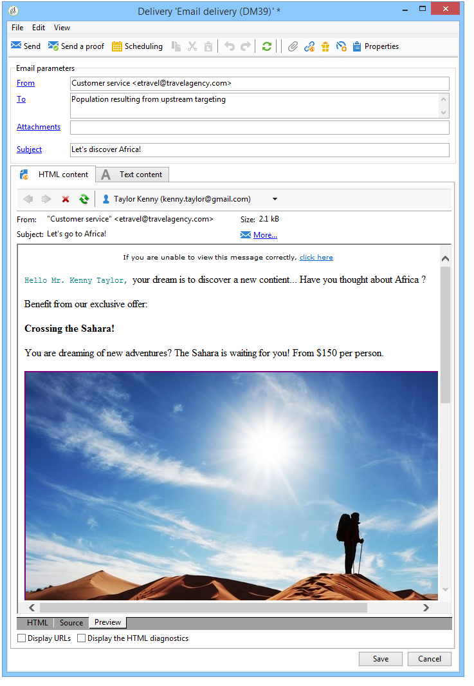
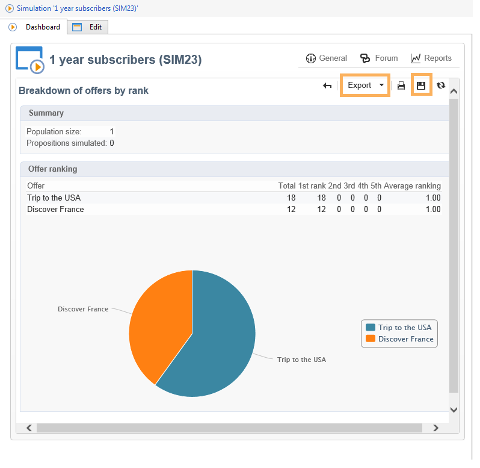

# Offerte su un canale in uscita{#offers-on-an-outbound-channel}

## Consegna delle offerte e-mail {#email-offer-delivery}

Nel nostro database, c&#39;è una categoria di offerte di viaggio in Africa. L’idoneità, i contesti e le rappresentazioni di ogni offerta sono stati configurati. Ora vogliamo creare una campagna per presentare le nostre offerte via e-mail.

1. Crea una campagna di marketing e un flusso di lavoro di targeting.

   

1. Modifica la consegna e-mail e fai clic su **[!UICONTROL Offers]** icona.

   

1. Scegli lo spazio e-mail per l’ambiente delle offerte che corrisponde alle festività.

   

1. Scegli la categoria che contiene le offerte di viaggio Africa.

   

1. Imposta su due il numero di offerte nella consegna.

   

1. Chiudi la finestra di gestione delle offerte e crea il contenuto della consegna.

   

1. Utilizza i menu per inserire una prima proposta di offerta e scegliere la funzione di rendering HTML.

   

1. Inserisci la seconda proposta di offerta.

   

1. Clic **[!UICONTROL Preview]** per visualizzare in anteprima le offerte nella consegna, seleziona un destinatario per visualizzare in anteprima le offerte così come verranno ricevute.

   

1. Salva la consegna e avvia il flusso di lavoro di targeting.
1. Apri la consegna e fai clic su **[!UICONTROL Audit]** scheda della consegna: puoi vedere che il motore di offerta ha selezionato le proposte da effettuare tra le varie offerte del catalogo.

   

## Eseguire una simulazione di offerta {#perform-an-offer-simulation}

1. In **[!UICONTROL Profiles and Targets]** , fare clic sulla scheda **[!UICONTROL Simulations]** , quindi fare clic sul pulsante **[!UICONTROL Create]** pulsante.

   

1. Scegli un’etichetta e specifica le impostazioni di esecuzione, se necessario.

   

1. Salva la simulazione. Viene quindi aperta in una nuova scheda.

   

1. Fai clic su **[!UICONTROL Edit]** , quindi **[!UICONTROL Scope]**.

   

1. Scegli la categoria per la quale vuoi simulare le offerte.

   

1. Scegli lo spazio dell’offerta da utilizzare per la simulazione.

   

1. Inserire le date di validità. Immettere almeno una data di inizio. Questo consente al motore di offerta di filtrare le offerte e scegliere quelle valide in una determinata data.
1. Se necessario, specifica uno o più temi per limitare il numero di offerte a quelle che contengono questa parola chiave nelle loro impostazioni.

   Nel nostro esempio, il **Viaggi** La categoria contiene due sottocategorie con due temi separati. Vogliamo eseguire una simulazione per le offerte con **Clienti > 1 anno** tema.

   

1. Scegli i destinatari di cui desideri eseguire il targeting.

   

1. Configura il numero di offerte da inviare a ciascun destinatario.

   Nel nostro esempio, il motore di offerta sceglierà le 3 offerte con il peso più alto per ogni destinatario.

   

1. Salva le impostazioni, quindi fai clic su **[!UICONTROL Start]** nel **[!UICONTROL Dashboard]** per eseguire la simulazione.

   

1. Al termine della simulazione, consultare **[!UICONTROL Results]** per una ripartizione dettagliata delle proposte per offerta.

   Nel nostro esempio, il motore di offerta ha basato il raggruppamento dell’offerta su 3 proposte.

   

1. Visualizza **[!UICONTROL Breakdown of offers by rank]** per visualizzare l’elenco delle offerte selezionate dal motore di offerta.

   

1. Se necessario, è possibile modificare le impostazioni dell&#39;ambito ed eseguire di nuovo la simulazione facendo clic su **[!UICONTROL Start simulation]**.

   

1. Per salvare i dati della simulazione, utilizza la cronologia o le funzioni di esportazione disponibili nel rapporto.

   
