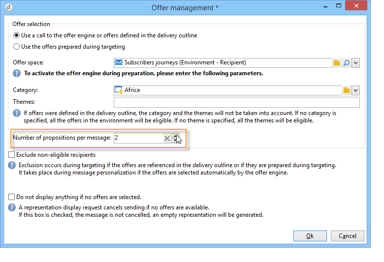
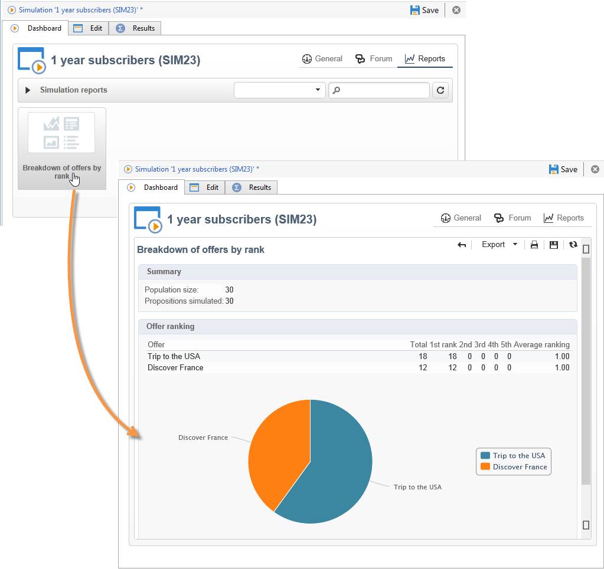

# Offerte su un canale in uscita{#offers-on-an-outbound-channel}

## Email delivery {#email-offer-delivery}

Nel nostro database c&#39;è una categoria di offerte di viaggio per l&#39;Africa. Sono stati configurati l’idoneità, i contesti e le rappresentazioni di ogni offerta. Ora vogliamo creare una campagna per presentare le nostre offerte via e-mail.

1. Crea una campagna di marketing e un flusso di lavoro di targeting.

   

1. Modifica la consegna e-mail e fai clic sull’icona **[!UICONTROL Offers]** .

   

1. Scegli lo spazio e-mail per l’ambiente delle offerte che corrisponde alle festività.

   

1. Scegli la categoria che contiene le offerte di viaggio in Africa.

   

1. Imposta il numero di offerte nella consegna su due.

   

1. Chiudi la finestra di gestione delle offerte e crea il contenuto della consegna.

   

1. Utilizza i menu per inserire una prima proposta di offerta e scegli la funzione di rendering HTML.

   

1. Inserisci la seconda proposta di offerta.

   

1. Fai clic su **[!UICONTROL Preview]** per visualizzare in anteprima le offerte nella consegna, quindi seleziona un destinatario per visualizzare in anteprima le offerte così come le riceverà.

   

1. Salva la consegna e avvia il flusso di lavoro di targeting.
1. Apri la consegna e fai clic sulla scheda **[!UICONTROL Audit]** della consegna: puoi vedere che il motore di offerte ha selezionato le proposte da creare dalle varie offerte del catalogo.

   

## Eseguire una simulazione di offerta {#perform-an-offer-simulation}

1. Nella scheda **[!UICONTROL Profiles and Targets]** , fai clic sul collegamento **[!UICONTROL Simulations]** , quindi sul pulsante **[!UICONTROL Create]** .

   

1. Scegli un’etichetta e specifica le impostazioni di esecuzione, se necessario.

   

1. Salva la simulazione. Viene quindi aperta in una nuova scheda.

   

1. Fare clic sulla scheda **[!UICONTROL Edit]**, quindi **[!UICONTROL Scope]**.

   

1. Scegli la categoria per la quale simulare le offerte.

   

1. Scegli lo spazio di offerta da utilizzare per la simulazione.

   

1. Immettere le date di validità. Immettere almeno una data di inizio. Questo consente al motore di offerta di filtrare le offerte e scegliere quelle valide in una data specificata.
1. Se necessario, specifica uno o più temi per limitare il numero di offerte a quelli che contengono questa parola chiave nelle loro impostazioni.

   Nel nostro esempio, la categoria **Viaggi** contiene due sottocategorie con due temi separati. Vogliamo eseguire una simulazione per le offerte con il tema **Clienti>1 anno**.

   

1. Scegli i destinatari a cui desideri rivolgerti.

   

1. Configura il numero di offerte da inviare a ciascun destinatario.

   Nel nostro esempio, il motore di offerta sceglierà le 3 offerte con il peso più elevato per ciascun destinatario.

   

1. Salva le impostazioni, quindi fai clic su **[!UICONTROL Start]** nella scheda **[!UICONTROL Dashboard]** per eseguire la simulazione.

   

1. Al termine della simulazione, consulta la sezione **[!UICONTROL Results]** per una suddivisione dettagliata delle proposte per offerta.

   Nel nostro esempio, il motore di offerta ha basato la suddivisione dell’offerta su 3 proposte.

   

1. Visualizza l’ **[!UICONTROL Breakdown of offers by rank]** per visualizzare l’elenco delle offerte selezionate dal motore di offerta.

   

1. Se necessario, puoi modificare le impostazioni dell&#39;ambito ed eseguire nuovamente la simulazione facendo clic su **[!UICONTROL Start simulation]**.

   

1. Per salvare i dati di simulazione, utilizza la cronologia o le funzioni di esportazione disponibili nel rapporto.

   
