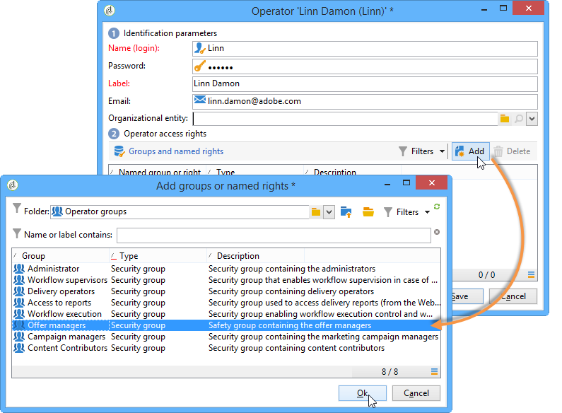

# Profili operatore{#operator-profiles}

Esistono due tipi di operatori che utilizzano l’interazione: responsabili dell&#39;offerta e responsabili della consegna. Ognuno di essi ha diritti specifici che gli danno accesso solo ad alcune parti dell&#39;albero e della piattaforma.

* **[!UICONTROL Offer manager]** : crea e gestisce le offerte. Se nel flusso di lavoro vengono utilizzate le offerte, l’operatore dovrà trovarsi nel gruppo di operatori **[!UICONTROL Administrator]** o **[!UICONTROL Offer managers]** per eseguire il flusso di lavoro.
* **[!UICONTROL Delivery manager]** : approva e utilizza le offerte

I passaggi per la creazione di operatori specifici dell’interazione sono identici a quelli utilizzati per creare tutti gli altri operatori sulla piattaforma. Per ulteriori informazioni al riguardo, consulta [questa sezione](../../platform/using/access-management.md). I diritti vengono configurati durante la creazione dell’operatore.

## Gestione delle offerte {#offer-manager}

1. Crea un nuovo operatore.
1. Vai alla finestra **[!UICONTROL Groups and named rights]**, fai clic su **[!UICONTROL Add]** e seleziona il gruppo **[!UICONTROL Offer manager]**.

   

I diritti assegnati al gestore delle offerte consentono loro di eseguire le seguenti attività:

* Modificare gli ambienti **[!UICONTROL Design]**.
* Visualizzare gli ambienti **[!UICONTROL Live]**.
* Configura le funzioni di amministrazione (spazi e filtri predefiniti).
* Creare e modificare le categorie.
* Creare offerte.
* Configura l’idoneità delle offerte.
* Approvare le offerte.

   >[!NOTE]
   >
   >Il gestore delle offerte può approvare un’offerta solo in due casi specifici. Il primo è se nessuno in particolare è stato specificato come revisore e il secondo se l’operatore responsabile della creazione di modelli (con il diritto di assegnare i revisori) lo ha specificato come revisore nel modello di offerta su cui si basa l’offerta.

## Responsabile consegna {#delivery-manager}

1. Crea un nuovo operatore.
1. Vai alla finestra **[!UICONTROL Groups and named rights]**, fai clic su **[!UICONTROL Add]** e seleziona il gruppo **[!UICONTROL Delivery manager]**.

   

I diritti assegnati al gestore della consegna sono/consentono loro di eseguire le seguenti attività:

* Visualizzare gli ambienti **[!UICONTROL Live]**.
* Visualizza e modifica le categorie di offerte.
* Approva le offerte se s/he è specificato come uno dei suoi revisori.

   >[!NOTE]
   >
   >Il gestore della consegna può approvare un’offerta solo se è stato definito come revisore durante la configurazione dell’offerta.

## Recupero dei diritti in base all&#39;operatore {#recap-of-rights-according-to-operator}

<table> 
 <tbody> 
  <tr> 
   <td> </td> 
   <td> <strong>Gestione delle offerte (modifica)</strong>  </td> 
   <td> <strong>Gestione delle offerte (in diretta)</strong>  </td> 
  </tr> 
  <tr> 
   <td> <strong>Livello struttura ad albero</strong>  </td> 
   <td> </td> 
   <td> </td> 
  </tr> 
  <tr> 
   <td> Offerte in corso di modifica / Offerte live  </td> 
   <td> Lettura/scrittura  </td> 
   <td> Leggi  </td> 
  </tr> 
  <tr> 
   <td> Destinatario - Ambiente  </td> 
   <td> Lettura/scrittura  </td> 
   <td> Leggi  </td> 
  </tr> 
  <tr> 
   <td> Administration  </td> 
   <td> Lettura/scrittura  </td> 
   <td> Leggi  </td> 
  </tr> 
  <tr> 
   <td> Spaces  </td> 
   <td> Lettura/scrittura  </td> 
   <td> Leggi  </td> 
  </tr> 
  <tr> 
   <td> Filtri di offerta predefiniti  </td> 
   <td> Lettura/scrittura  </td> 
   <td> Leggi  </td> 
  </tr> 
  <tr> 
   <td> Tipologia  </td> 
   <td> Lettura/scrittura  </td> 
   <td> Leggi  </td> 
  </tr> 
  <tr> 
   <td> Regole di tipologia  </td> 
   <td> Lettura/scrittura  </td> 
   <td> Leggi  </td> 
  </tr> 
  <tr> 
   <td> Catalogo delle offerte  </td> 
   <td> Lettura/scrittura  </td> 
   <td> Leggi  </td> 
  </tr> 
  <tr> 
   <td> Categoria offerta  </td> 
   <td> Lettura/scrittura  </td> 
   <td> Leggi  </td> 
  </tr> 
 </tbody> 
</table>

<table> 
 <tbody> 
  <tr> 
   <td> </td> 
   <td> <strong>Gestione consegne (modifica)</strong>  </td> 
   <td> <strong>Direttore consegna (dal vivo)</strong>  </td> 
  </tr> 
  <tr> 
   <td> <strong>Livello struttura ad albero</strong>  </td> 
   <td> </td> 
   <td> </td> 
  </tr> 
  <tr> 
   <td> Offerte in corso di modifica / Offerte live  </td> 
   <td> </td> 
   <td> Leggi  </td> 
  </tr> 
  <tr> 
   <td> Destinatario - Ambiente  </td> 
   <td> </td> 
   <td> Leggi  </td> 
  </tr> 
  <tr> 
   <td> Amministrazione  </td> 
   <td> </td> 
   <td> </td> 
  </tr> 
  <tr> 
   <td> Spaces  </td> 
   <td> </td> 
   <td> </td> 
  </tr> 
  <tr> 
   <td> Filtri di offerta predefiniti  </td> 
   <td> Leggi  </td> 
   <td> Leggi  </td> 
  </tr> 
  <tr> 
   <td> Tipologia  </td> 
   <td> Leggi  </td> 
   <td> Leggi  </td> 
  </tr> 
  <tr> 
   <td> Regole di tipologia  </td> 
   <td> </td> 
   <td> Leggi  </td> 
  </tr> 
  <tr> 
   <td> Catalogo delle offerte  </td> 
   <td> Leggi  </td> 
   <td> Leggi  </td> 
  </tr> 
  <tr> 
   <td> Categoria offerta  </td> 
   <td> </td> 
   <td> Leggi  </td> 
  </tr> 
 </tbody> 
</table>
