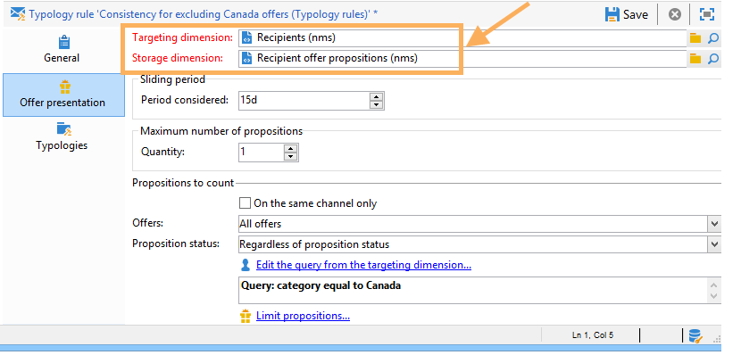
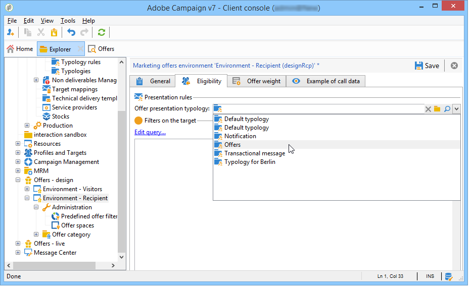

# Regole di presentazione{#presentation-rules}

## Creating a presentation rule {#creating-a-presentation-rule}

Nel nostro database ci sono diverse offerte di viaggio per Europa, Africa, Stati Uniti e Canada. Desideriamo inviare offerte per un viaggio in Canada, ma se il destinatario rifiuta questo tipo di offerta, non vogliamo inviarle di nuovo

Configureremo il nostro regolamento in modo che il viaggio in Canada venga offerto una sola volta per ogni destinatario e non venga offerto di nuovo se rifiutato.

1. Nella struttura  di Adobe Campaign, passare al **[!UICONTROL Administration]** > **[!UICONTROL Campaign management]** > **[!UICONTROL Typology management]** > **[!UICONTROL Typology rules]** nodo.
1. Creare una nuova regola di **[!UICONTROL Offer presentation]** tipo.

   

1. Se necessario, cambiatene l’etichetta e la descrizione.

   

1. Scegliete l&#39; **[!UICONTROL All channels]** opzione per estendere la regola a tutti i canali.

   

1. Fate clic sul **[!UICONTROL Edit expression]** collegamento e scegliete il **[!UICONTROL Category]** nodo come espressione.

   

1. Scegliete la categoria che corrisponde all’offerta di viaggio per il Canada e fate clic **[!UICONTROL OK]** per chiudere la finestra della query.

   

1. Nella **[!UICONTROL Offer presentation]** scheda, scegliete le stesse dimensioni di quelle configurate nell&#39;ambiente.

   

1. Specificare il periodo durante il quale verrà applicata la regola.

   

1. Limitare l&#39;offerta a uno in modo che i destinatari che hanno già rifiutato un viaggio in Canada non ricevano un&#39;altra offerta simile.

   

1. Selezionate il **[!UICONTROL Offers for the same category]** filtro per escludere tutte le offerte dalla categoria **Canada** .

   

1. Selezionare il **[!UICONTROL Rejected propositions]** filtro per tenere conto solo delle proposizioni rifiutate dal destinatario.

   

1. Scegliete i destinatari per i quali applicare la regola.

   Nel nostro esempio, sceglieremo i **Frequent Traveler** Recipients.

   

1. Fate riferimento alla regola in una tipologia di offerta.

   

1. Andate all&#39;ambiente delle offerte (**Ambiente - Destinatario** in questo caso) e fate riferimento alla nuova tipologia appena creata utilizzando l&#39;elenco a discesa nella **[!UICONTROL Eligibility]** scheda.

   

## Applicazione della regola di presentazione {#applying-the-presentation-rule}

Esempio di applicazione della regola di tipologia creata in precedenza.

Vogliamo inviare una prima proposta di offerta appartenente alla categoria Canada. Se l&#39;offerta viene rifiutata una volta da uno dei destinatari, non verrà loro offerta di nuovo.

1. Nella cartella dei destinatari dei **viaggiatori** frequenti, scegli uno dei profili per controllare le offerte per le quali sono idonei: fare clic sulla **[!UICONTROL Propositions]** scheda, quindi sulla **[!UICONTROL Preview]** scheda.

   Nel nostro esempio, **Tim Ramsey** è idoneo per un&#39;offerta che fa parte della categoria **America** .

   

1. Per iniziare, create un&#39;e-mail di consegna che verrà inviata ai destinatari **frequenti** con offerte.
1. Selezionate i parametri di chiamata del motore di offerta.

   Nel nostro esempio, la categoria **Viaggi in America** è selezionata, che contiene le sottocategorie **Canada** e Stati **** Uniti.

   

1. Inserite le offerte nel corpo del messaggio e inviate la consegna. Per ulteriori informazioni, vedere [Informazioni sui canali](../../interaction/using/about-outbound-channels.md)in uscita.

   Il destinatario ha ricevuto l&#39;offerta per la quale è idoneo.

1. Il destinatario ha rifiutato l&#39;offerta canadese, come mostrato nella cronologia delle proposte.

   

1. Controllate le offerte per le quali sono adesso idonee.

   Possiamo vedere che non sono state selezionate offerte per il Canada.

   

**Argomento correlato**

* [Gestione delle offerte e controllo della ridondanza tra i canali](https://helpx.adobe.com/campaign/kb/simplifying-campaign-management-acc.html#Manageoffersandcontrolredundancyacrosschannels)