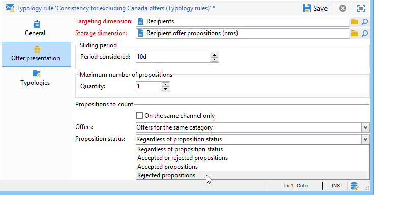

# Regole di presentazione{#presentation-rules}

## Creazione di una regola di presentazione {#creating-a-presentation-rule}

Nel nostro database ci sono diverse offerte di viaggio per Europa, Africa, Stati Uniti e Canada. Vogliamo inviare offerte per un viaggio in Canada, ma se il destinatario rifiuta questo tipo di offerta, non vogliamo inviarla nuovamente a lui

Stiamo per configurare la nostra regola in modo che il viaggio in Canada venga offerto una sola volta per destinatario e non offerto di nuovo se rifiutato.

1. Nella struttura di Adobe Campaign, passa al nodo **[!UICONTROL Administration]** > **[!UICONTROL Campaign management]** > **[!UICONTROL Typology management]** > **[!UICONTROL Typology rules]** .
1. Crea una nuova regola di tipo **[!UICONTROL Offer presentation]**.

   

1. Se necessario, modificarne l’etichetta e la descrizione.

   

1. Scegli l&#39;opzione **[!UICONTROL All channels]** per estendere la regola a tutti i canali.

   

1. Fai clic sul collegamento **[!UICONTROL Edit expression]** e scegli il nodo **[!UICONTROL Category]** come espressione.

   

1. Scegli la categoria che corrisponde alla tua offerta di viaggio per il Canada e fai clic su **[!UICONTROL OK]** per chiudere la finestra della query.

   

1. Nella scheda **[!UICONTROL Offer presentation]** , scegli le stesse dimensioni di quelle configurate nell’ambiente.

   

1. Specifica il periodo durante il quale la regola verrà applicata.

   

1. Limitare la proposta a una in modo che i destinatari che hanno già rifiutato un viaggio in Canada non ricevano un&#39;altra offerta simile.

   

1. Seleziona il filtro **[!UICONTROL Offers for the same category]** per escludere tutte le offerte dalla categoria **Canada** .

   

1. Seleziona il filtro **[!UICONTROL Rejected propositions]** per tenere conto solo delle proposte rifiutate dal destinatario.

   

1. Scegli i destinatari per i quali verrà applicata questa regola.

   Nel nostro esempio, sceglieremo i destinatari **Viaggiatori frequenti**.

   

1. Fai riferimento alla regola in una tipologia di offerta.

   

1. Vai all&#39;ambiente delle offerte, (**Ambiente - Destinatario** in questo caso) e fai riferimento alla nuova tipologia appena creata utilizzando l&#39;elenco a discesa nella scheda **[!UICONTROL Eligibility]** .

   

## Applicazione della regola di presentazione {#applying-the-presentation-rule}

Ecco un esempio di applicazione della regola di tipologia creata in precedenza.

Vogliamo inviare una prima proposta di offerta appartenente alla categoria Canada. Se l’offerta viene rifiutata una volta da uno dei destinatari, non verrà loro offerta nuovamente.

1. Nella cartella dei destinatari **Viaggiatori frequenti** , scegli uno dei profili per controllare le offerte per le quali sono idonei: fare clic sulla scheda **[!UICONTROL Propositions]** , quindi sulla scheda **[!UICONTROL Preview]** .

   Nel nostro esempio, **Tim Ramsey** è idoneo per un&#39;offerta che fa parte della categoria **Americhe**.

   

1. Inizia creando una consegna e-mail indirizzata ai destinatari **Frequent Traveller** con offerte.
1. Seleziona i parametri di chiamata del motore di offerta.

   Nel nostro esempio, viene selezionata la categoria **Viaggi in America**, che contiene le sottocategorie **Canada** e **Stati Uniti**.

   

1. Inserisci le offerte nel corpo del messaggio e invia la consegna. Per ulteriori informazioni, consulta [Informazioni sui canali in uscita](../../interaction/using/about-outbound-channels.md).

   Il destinatario ha ricevuto l’offerta per la quale sono idonei.

1. Il destinatario ha rifiutato l’offerta canadese, come illustrato nella cronologia delle proposte.

   

1. Controlla le offerte per le quali sono ora idonee.

   Vediamo che non sono state scelte offerte per il Canada.

   

**Argomento correlato**

* [Gestire le offerte e controllare la ridondanza tra i canali](https://helpx.adobe.com/campaign/kb/simplifying-campaign-management-acc.html#Manageoffersandcontrolredundancyacrosschannels)
