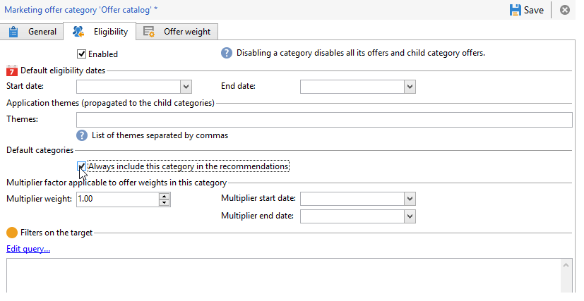

# Raccomandazione di una categoria{#recommending-a-category}

Può accadere che un destinatario non sia considerato idoneo per tutte le offerte. Al fine di garantire che tutti i destinatari ricevano una proposta di offerta, è possibile aggiungere sistematicamente una o più categorie di offerta nelle raccomandazioni. A differenza delle offerte principali, queste offerte di &quot;backup&quot; devono avere un peso basso (ma non zero), in modo che vengano prese in considerazione solo se non sono idonee offerte di peso elevato. Inoltre, a queste offerte non deve essere applicata alcuna regola di presentazione per garantire che vengano sempre incluse nelle raccomandazioni. Ciò significa che, durante una proposta, se non è disponibile alcuna offerta di peso elevato, il destinatario riceverà almeno un’offerta da questa categoria.

Per includere sempre una categoria nei consigli, effettua le seguenti operazioni:

1. Apri l’Explorer e fai clic su un catalogo di offerte dalla struttura ad albero.
1. Fare clic sulla scheda **[!UICONTROL Eligibility]** e selezionare la casella **[!UICONTROL Always include this category in the recommendations]**.
1. Terminare e approvare facendo clic su **[!UICONTROL Save]**.

   
