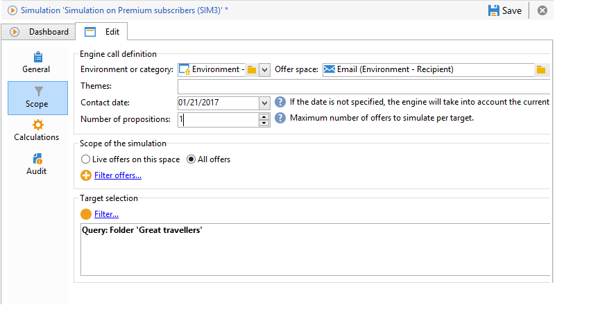

# Ambito della simulazione{#simulation-scope}

## Definizione dell&#39;ambito di applicazione {#definition-of-the-scope}

Apri **[!UICONTROL Scope]** scheda per scegliere le impostazioni.

Sono obbligatori i seguenti elementi:

* Ambiente o categoria di offerta.
* Spazio di offerta.
* Data di contatto. Le offerte non idonee alla data di contatto non vengono prese in considerazione.
* Popolazione target.

   Se non configuri un filtro sulla destinazione, verrà presa in considerazione l’intera tabella dei destinatari.

* Numero di proposte da simulare per target.

   Il destinatario riceverà queste numerose proposte. Ad esempio, se immetti 5, ogni destinatario riceverà un massimo di 5 proposte di offerta.

   

Per perfezionare le offerte da prendere in considerazione per la simulazione, puoi aggiungere uno o più temi (precedentemente specificati nelle categorie).

Puoi anche scegliere di eseguire la simulazione su tutte le offerte o solo su quelle online. Alcuni filtri consentono di modificare la selezione, se lo desideri.

>[!NOTE]
>
>È necessario specificare una data di contatto. Questo consente al motore di interazione di ordinare le offerte nell’ambiente o nella categoria selezionati. Se non è configurata alcuna data, la simulazione genererà un errore.

## Aggiunta di assi di reporting {#adding-reporting-axes}

Puoi migliorare l’analisi di simulazione aggiungendo assi di reporting sul target o le offerte stesse tramite il **[!UICONTROL Calculations]** scheda .

A questo scopo, fai clic sul pulsante **[!UICONTROL Add]** e scegliere i campi appropriati. Gli assi verranno utilizzati per calcolare la simulazione e saranno visualizzati nel rapporto di analisi. Per ulteriori informazioni, consulta [Tracking della simulazione](../../interaction/using/simulation-tracking.md).

