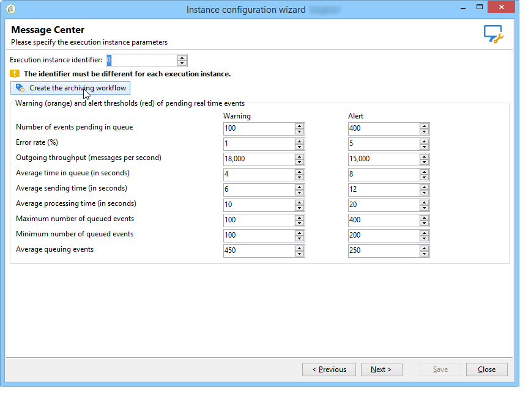

# Configurazioni aggiuntive {#mc-additional-configurations}


## Monitorare le soglie {#monitoring-thresholds}

È possibile configurare le soglie di avviso (arancione) e di avviso (rosso) degli indicatori visualizzati nella **Livello di servizio del Centro messaggi** e **Tempo di elaborazione del Centro messaggi** rapporti (fare riferimento a [Accedere ai rapporti di messaggistica transazionale](../../message-center/using/about-transactional-messaging-reports.md)).

A questo scopo, segui la procedura indicata di seguito:

1. Apri la procedura guidata di distribuzione su **istanza di esecuzione**.

1. Vai a **[!UICONTROL Message Center]** pagina.

1. Utilizzare le frecce per modificare le soglie.

   

>[!NOTE]
>
>Il numero di eventi in attesa nella coda viene visualizzato nel [Indicatori di sistema](../../production/using/monitoring-processes.md#system-indicators) sezione della pagina di monitoraggio dei processi di Adobe Campaign. Per ulteriori informazioni sulla procedura guidata di distribuzione, fare riferimento a [questa sezione](../../installation/using/deploying-an-instance.md#deployment-wizard).

## Eliminare gli eventi {#purging-events}

È possibile utilizzare [procedura guidata di distribuzione](../../production/using/database-cleanup-workflow.md#deployment-wizard) per configurare la durata di memorizzazione dei dati nel database.

La rimozione degli eventi viene eseguita automaticamente dall&#39; [Flusso di lavoro di pulizia database](../../production/using/database-cleanup-workflow.md). Questo flusso di lavoro elimina gli eventi ricevuti e memorizzati nelle istanze di esecuzione e gli eventi archiviati in un&#39;istanza di controllo.

Utilizzare le frecce appropriate per modificare le impostazioni di rimozione.

Impostazioni di eliminazione degli eventi in un&#39;istanza di controllo:


Impostazioni di eliminazione degli eventi in un&#39;istanza di esecuzione:


Per ulteriori informazioni sul flusso di lavoro di pulizia del database, consulta [questa sezione](../../production/using/database-cleanup-workflow.md).


## Flussi di lavoro tecnici {#technical-workflows}

Prima di distribuire modelli di messaggi transazionali, è necessario assicurarsi che i flussi di lavoro tecnici sull’istanza di controllo e sulle diverse istanze di esecuzione siano stati effettivamente creati e avviati.

I vari flussi di lavoro tecnici relativi alla messaggistica transazionale (Centro messaggi) sono suddivisi tra l’istanza di controllo e le istanze di esecuzione.

### Controllare i flussi di lavoro delle istanze {#control-instance-workflows}

Nell’istanza di controllo, indipendentemente dal fatto che siano registrate una o più istanze di esecuzione, è necessario creare un flusso di lavoro di archiviazione per ogni istanza **[!UICONTROL Message Center execution instance]** account esterno. Fai clic su **[!UICONTROL Create the archiving workflow]** per creare e avviare il workflow.


Questi flussi di lavoro sono quindi accessibili da **Amministrazione > Produzione > Centro messaggi** cartella. Una volta creati, i flussi di lavoro di archiviazione vengono avviati automaticamente.

<!--**Minimal architecture**

Once the control and execution modules are installed on the same instance, you must create the archiving workflow using the deployment wizard. Click the **[!UICONTROL Create the archiving workflow]** button to create and start the workflow.

-->

### Flussi di lavoro dell’istanza di esecuzione {#execution-instance-workflows}

Nelle istanze di esecuzione, è possibile accedere ai flussi di lavoro tecnici per la messaggistica transazionale da **Amministrazione > Produzione > Centro messaggi** cartella. Devi solo avviarli. I flussi di lavoro nell’elenco sono:

* **[!UICONTROL Processing batch events]** (nome interno: **[!UICONTROL batchEventsProcessing]** ): questo flusso di lavoro ti consente di suddividere gli eventi batch in una coda prima che siano collegati a un modello di messaggio.
* **[!UICONTROL Processing real time events]** (nome interno: **[!UICONTROL rtEventsProcessing]** ): questo flusso di lavoro ti consente di suddividere gli eventi in tempo reale in una coda prima che vengano collegati a un modello di messaggio.
* **[!UICONTROL Update event status]** (nome interno: **[!UICONTROL updateEventStatus]** ): questo flusso di lavoro ti consente di attribuire uno stato all’evento.

  Sono disponibili i seguenti stati dell’evento:

   * **[!UICONTROL Pending]** : l’evento è in coda. Non è ancora stato assegnato alcun modello di messaggio.
   * **[!UICONTROL Pending delivery]** : l’evento è in coda, gli è stato assegnato un modello di messaggio e viene elaborato dalla consegna.
   * **[!UICONTROL Sent]** : questo stato viene copiato dai registri di consegna. Significa che la consegna è stata inviata.
   * **[!UICONTROL Ignored by the delivery]** : questo stato viene copiato dai registri di consegna. Significa che la consegna è stata ignorata.
   * **[!UICONTROL Delivery failed]** : questo stato viene copiato dai registri di consegna. Significa che la consegna è non è andata a buon fine.
   * **[!UICONTROL Event not taken into account]** : impossibile collegare l’evento a un modello di messaggio. L’evento non verrà elaborato.

### Pianificazione del flusso di lavoro di archiviazione

Evita di modificare **workflow di archiviazione** pianificazione in esecuzione sull&#39;istanza di controllo. In caso contrario, alcuni dati di tracciamento estratti dall’istanza di esecuzione potrebbero andare persi.

Se si modifica la pianificazione del flusso di lavoro di archiviazione, è necessario modificare anche **workflow di tracciamento** pianifica l’istanza di esecuzione in modo che corrisponda alla pianificazione del flusso di lavoro di archiviazione nell’istanza di controllo.

## Configurare più brand {#configuring-multibranding}

Questa sezione descrive una soluzione per configurare il tracciamento e gli URL delle pagine mirror per marchio, per i messaggi transazionali in Adobe Campaign.

### Prerequisiti {#prerequisites}

* Tutti gli host devono essere aggiunti al file di configurazione dell’istanza (`config-<instance>.xml`).
* A ogni marchio deve essere assegnato un sottodominio.
* Se il tracciamento web viene eseguito su pagine HTTPS, è necessario disporre di un certificato HTTPS per tutti i brand.

Per configurare il multibranding, è necessario configurare sia le istanze di esecuzione che l’istanza di controllo.

### Istanza di esecuzione {#execution-instance}

Nelle istanze di esecuzione, segui i passaggi seguenti:

1. Crea un account esterno per marchio.

   >[!NOTE]
   >
   >Scopri come creare un account esterno di tipo istanza di esecuzione in [questa sezione](../../message-center/using/configuring-instances.md#control-instance).

1. Estendere lo schema nms:extAccount per aggiungere l&#39;URL di tracciamento:

   ```
   <attribute advanced="true" desc="URL of the tracking servers" label="Tracking server URL"
   length="100" name="trackingURL" type="string"/>
   ```

   >[!NOTE]
   >
   >Scopri come estendere uno schema esistente in [Estensione di uno schema](../../configuration/using/extending-a-schema.md) sezione.

1. Modificare il modulo nms:extAccount:

   ```
   <container label="Message domain branding" type="frame">
        <static type="help"> These parameters are used to override the DNS alias and addresses used during message delivery. When not populated, the values of the 'NmsServer_MirrorPageUrl' and 'NmsEmail_DefaultErrorAddr' options are used.</static>
        <input xpath="@mirrorURL"/>
        <input xpath="@trackingURL"/>
        <input img="nms:sendemail.png" menuId="deliveryMenuBuilder" type="scriptEdit">
               xpath="errorAddress"/>
      </container>
   ```

1. Modificare le opzioni NmsTracking_OpenFormula e NmsTracking_ClickFormula per utilizzare il conto esterno anziché un&#39;opzione globale.

   Per eseguire questa operazione, sostituisci:

   ```
   <%@ include option='NmsTracking_ServerUrl' %>
   ```

   con:

   ```
   <%@ value object="provider" xpath="@trackingURL" %>
   ```

   >[!IMPORTANT]
   >
   >Queste modifiche potrebbero causare conflitti durante l&#39;aggiornamento. Potrebbe essere necessario unire manualmente queste formule con la nuova versione.

### Istanza di controllo {#control-instance}

Nell’istanza di controllo, devi collegare i modelli di consegna e gli account esterni.

A questo scopo, segui la procedura indicata di seguito:

1. Crea un account esterno per marchio con lo stesso nome interno definito nel [istanza di esecuzione](#execution-instance) (passaggio 1).

1. Crea un modello di consegna predefinito per marchio.

   >[!NOTE]
   >
   >    Scopri come creare un modello di consegna in [questa sezione](../../delivery/using/creating-a-delivery-template.md#creating-a-new-template).

1. Nel modello di consegna di **[!UICONTROL Properties]**, imposta il routing sull’account esterno del brand.
