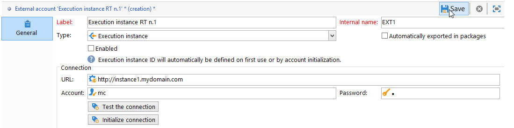
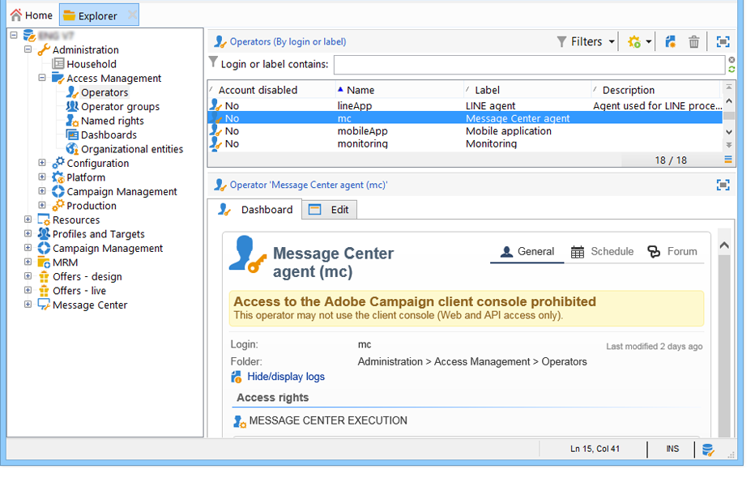

# Configurare le istanze {#creating-a-shared-connection}

Per utilizzare le funzionalità di messaggistica transazionale, devi configurare le istanze di controllo ed esecuzione. Puoi utilizzare:
* [Un&#39;istanza di controllo](#control-instance) associata a una o più istanze di esecuzione
* [Diverse istanze di controllo](#using-several-control-instances) associate a diverse istanze di esecuzione

>[!IMPORTANT]
>
>Le estensioni dello schema hanno interessato le risorse utilizzate da [Flussi di lavoro tecnici del Centro messaggi](../../message-center/using/additional-configurations.md#technical-workflows) su istanze di controllo o di esecuzione devono essere duplicati sulle altre istanze utilizzate dal modulo di messaggistica transazionale.

È inoltre necessario specificare e connettere le istanze di esecuzione alle istanze di controllo.

In questa sezione sono descritti tutti i passaggi necessari per configurare e connettere le istanze di controllo ed esecuzione.

>[!IMPORTANT]
>
>L&#39;istanza di controllo e le istanze di esecuzione devono essere installate su computer diversi. Non possono condividere la stessa istanza di Campaign.

## Configurare l’istanza di controllo {#control-instance}

Per connettere l&#39;istanza di controllo e le istanze di esecuzione, è innanzitutto necessario creare e configurare un account esterno di tipo **[!UICONTROL Execution instance]** **nell&#39;istanza di controllo**. Pertanto, una volta [pubblicati](../../message-center/using/publishing-message-templates.md#template-publication), i modelli di messaggi transazionali possono essere distribuiti nelle istanze di esecuzione.

Se utilizzi più istanze di esecuzione, devi creare tanti account esterni quanti sono le istanze di esecuzione.

>[!NOTE]
>
>Quando le istanze di esecuzione vengono utilizzate da più istanze di controllo, i dati possono essere suddivisi per cartella e per operatore. Per ulteriori informazioni, vedere [Utilizzare più istanze di controllo](#using-several-control-instances).

### Creare un account esterno

>[!NOTE]
>
>I passaggi seguenti devono essere eseguiti **sull&#39;istanza di controllo**.

Per creare un account esterno di tipo **[!UICONTROL Execution instance]**, applicare quanto segue:

1. Passare alla cartella **[!UICONTROL Administration > Platform > External accounts]**.
1. Selezionare uno degli account esterni di tipo istanza di esecuzione forniti con Adobe Campaign, fare clic con il pulsante destro del mouse e scegliere **[!UICONTROL Duplicate]**.

   

1. Modifica l’etichetta in base alle tue esigenze.

   

1. Selezionare l&#39;opzione **[!UICONTROL Enabled]** per rendere operativo l&#39;account esterno.

   

1. Specificare l&#39;indirizzo del server in cui è installata l&#39;istanza di esecuzione.

   

1. L&#39;account deve corrispondere all&#39;agente del Centro messaggi definito nella cartella dell&#39;operatore. Per impostazione predefinita, l&#39;account predefinito fornito da Adobe Campaign è **[!UICONTROL mc]**.

   

1. Immetti la password dell’account come definito nella cartella dell’operatore.

   >[!NOTE]
   >
   >Per evitare di immettere una password ogni volta che si accede all&#39;istanza, è possibile specificare l&#39;indirizzo IP dell&#39;istanza di controllo nell&#39;istanza di esecuzione. Per ulteriori informazioni, consulta [Configurare le istanze di esecuzione](#execution-instance).

1. Specificare il metodo di ripristino da utilizzare per l&#39;istanza di esecuzione. I dati da recuperare vengono inoltrati all’istanza di controllo dall’istanza di esecuzione, per essere aggiunti agli archivi dei messaggi transazionali e degli eventi.

   

   La raccolta dei dati avviene tramite un servizio web che utilizza l’accesso HTTP/HTTPS o tramite il modulo Federated Data Access (FDA).

   >[!NOTE]
   >
   >Tieni presente che quando utilizzi FDA su HTTP, sono supportate solo le istanze di esecuzione che utilizzano un database PostgreSQL. Database MSSQL o Oracle non supportati.

   Il secondo metodo (FDA) è consigliato se l’istanza di controllo ha accesso diretto al database delle istanze di esecuzione. In caso contrario, scegliere l&#39;accesso al servizio Web. L’account FDA da specificare coincide con la connessione ai database delle varie istanze di esecuzione create nell’istanza di controllo.

   

   Per ulteriori informazioni su Federated Data Access (FDA), fare riferimento a [questa sezione](../../installation/using/about-fda.md).

1. Fare clic su **[!UICONTROL Test the connection]** per verificare che l&#39;istanza di controllo e l&#39;istanza di esecuzione siano collegate.

   

Quando utilizzi più istanze di esecuzione, ripeti questi passaggi per creare tanti account esterni quanti sono le istanze di esecuzione.

### Identificare le istanze di esecuzione {#identifying-execution-instances}

Ogni istanza di esecuzione deve essere associata a un identificatore univoco per differenziare la cronologia di ogni istanza di esecuzione durante la visualizzazione nell’istanza di controllo.

Questo identificatore può essere attribuito manualmente a ogni istanza di esecuzione **&#x200B;**. In questo caso, il passaggio deve essere eseguito **su ogni istanza di esecuzione**. A questo scopo, utilizza la procedura guidata di distribuzione come descritto di seguito:

1. Aprire la procedura guidata di distribuzione in un&#39;istanza di esecuzione.
1. Passare alla finestra **[!UICONTROL Message Center]**.
1. Assegna l’identificatore scelto all’istanza.

   

1. Ripeti i passaggi precedenti per ogni istanza di esecuzione.

L&#39;identificatore può anche essere **automaticamente** attribuito. A tale scopo, passare all&#39;**istanza di controllo** e fare clic sul pulsante **[!UICONTROL Initialize connection]**.

## Configurare le istanze di esecuzione {#execution-instance}

>[!NOTE]
>
>I passaggi seguenti devono essere eseguiti **sulle istanze di esecuzione**.

Per collegare le istanze di esecuzione all’istanza di controllo, segui i passaggi seguenti.

Affinché l&#39;istanza di controllo possa connettersi all&#39;istanza di esecuzione senza dover fornire una password, è sufficiente immettere l&#39;indirizzo IP dell&#39;istanza di controllo nella sezione dei diritti di accesso del **Centro messaggi**. Le password vuote non sono tuttavia consentite per impostazione predefinita.

Per utilizzare una password vuota, vai alle istanze di esecuzione e definisci un’area di sicurezza limitata all’indirizzo IP del sistema informativo che distribuisce gli eventi. Questa area di sicurezza deve consentire password vuote e accettare connessioni di tipo `<identifier> / <password>`. Per ulteriori informazioni al riguardo, consulta [questa sezione](../../installation/using/security-zones.md).

>[!NOTE]
>
>Quando le istanze di esecuzione vengono utilizzate da più istanze di controllo, i dati possono essere suddivisi per cartella e per operatore. Per ulteriori informazioni, vedere [Utilizzare più istanze di controllo](#using-several-control-instances).

1. In un&#39;istanza di esecuzione, passare alla cartella dell&#39;operatore ( **[!UICONTROL Administration > Access management > Operators]** ).
1. Selezionare l&#39;agente **Centro messaggi**.

   

1. Selezionare la scheda **[!UICONTROL Edit]**, fare clic su **[!UICONTROL Access rights]** e quindi fare clic sul collegamento **[!UICONTROL Edit the access parameters...]**.

   

1. Nella finestra **[!UICONTROL Access settings]**, fare clic sul collegamento **[!UICONTROL Add a trusted IP mask]** e aggiungere l&#39;indirizzo IP dell&#39;istanza di controllo.

   

Quando utilizzi più istanze di esecuzione, ripeti questi passaggi per ogni istanza di esecuzione.

## Utilizzare più istanze di controllo {#using-several-control-instances}

È possibile condividere un cluster di esecuzione con varie istanze di controllo. Questo tipo di architettura richiede la seguente configurazione.

Si supponga, ad esempio, che la società gestisca due marchi, ciascuno con la propria istanza di controllo: **Controllo 1** e **Controllo 2**. Vengono utilizzate anche due istanze di esecuzione. È necessario immettere un operatore Centro messaggi diverso per ogni istanza di controllo: un operatore **mc1** per l&#39;istanza **Control 1** e un operatore **mc2** per l&#39;istanza **Control 2**.

Nella struttura di tutte le istanze di esecuzione, creare una cartella per operatore (**Cartella 1** e **Cartella 2**) e limitare l&#39;accesso ai dati di ogni operatore alla propria cartella.

### Configurare le istanze di controllo {#configuring-control-instances}

>[!NOTE]
>
>I passaggi seguenti devono essere eseguiti **sulle istanze di controllo**.

1. Nell&#39;istanza di controllo **Control 1** creare un account esterno per ogni istanza di esecuzione e immettere l&#39;operatore **mc1** in ogni account esterno. L&#39;operatore **mc1** verrà quindi creato in tutte le istanze di esecuzione (vedere [Configurare le istanze di esecuzione](#configuring-execution-instances)).

   

1. Nell&#39;istanza di controllo **Control 2** creare un account esterno per ogni istanza di esecuzione e immettere l&#39;operatore **mc2** in ogni account esterno. L&#39;operatore **mc2** verrà quindi creato in tutte le istanze di esecuzione (vedere [Configurare le istanze di esecuzione](#configuring-execution-instances)).

   

   >[!NOTE]
   >
   >Per ulteriori informazioni sulla configurazione di un&#39;istanza di controllo, vedere [questa sezione](#control-instance).

### Configurare le istanze di esecuzione {#configuring-execution-instances}

>[!NOTE]
>
>I passaggi seguenti devono essere eseguiti **sulle istanze di esecuzione**.

Per utilizzare più istanze di controllo, questa configurazione deve essere eseguita su TUTTE le istanze di esecuzione.

1. Creare una cartella per operatore nel nodo **[!UICONTROL Administration > Production > Message Center]**: **Cartella 1** e **Cartella 2**. Ulteriori informazioni sulle cartelle e sulle visualizzazioni sono disponibili nella [documentazione di Campaign v8 (console)](https://experienceleague.adobe.com/it/docs/campaign/campaign-v8/config/configuration/folders-and-views){target=_blank}.

   

1. Creare gli operatori **mc1** e **mc2** duplicando l&#39;operatore del Centro messaggi fornito per impostazione predefinita (**mc**). Per ulteriori informazioni sulla creazione degli operatori, consulta [questa sezione](../../platform/using/access-management-operators.md).

   

   >[!NOTE]
   >
   >Gli operatori **mc1** e **mc2** devono disporre di diritti **[!UICONTROL Message Center execution]** e non possono accedere alla console client di Adobe Campaign. Un operatore deve sempre essere collegato a un’area di sicurezza. Per ulteriori informazioni al riguardo, consulta [questa sezione](../../installation/using/security-zones.md).

1. Per ogni operatore, selezionare la casella **[!UICONTROL Restrict to information found in sub-folders of]** e selezionare la cartella pertinente (**Cartella 1** per l&#39;operatore **mc1** e **Cartella 2** per l&#39;operatore **mc2**).

   

1. Assegna a ogni operatore autorizzazioni di lettura e scrittura per la propria cartella. A tale scopo, fare clic con il pulsante destro del mouse sulla cartella e selezionare **[!UICONTROL Properties]**. Selezionare quindi la scheda **[!UICONTROL Security]** e aggiungere l&#39;operatore pertinente (**mc1** per **Folder 1** e **mc2** per **Folder 2**). Verificare che le caselle **[!UICONTROL Read/Write data]** siano selezionate.

   
