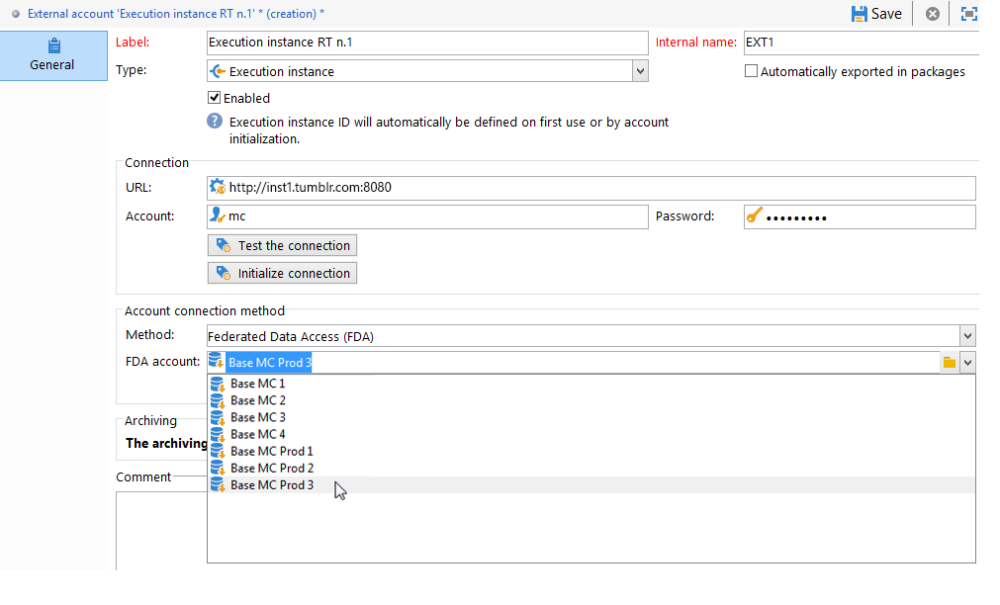
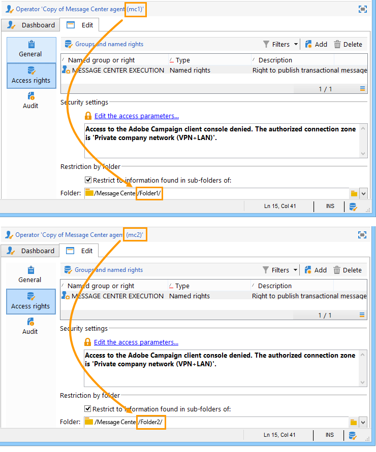

# Creazione di una connessione condivisa{#creating-a-shared-connection}

>[!IMPORTANT]
>
>* Le estensioni dello schema eseguite sugli schemi utilizzati dai flussi di lavoro [tecnici del Centro](../../message-center/using/technical-workflows.md) messaggi nelle istanze di controllo o esecuzione devono essere duplicate nelle altre istanze utilizzate dal modulo di messaggistica transazionale di Adobe Campaign.
>* L&#39;istanza di controllo e le istanze di esecuzione devono essere installate su computer diversi. Non possono condividere la stessa istanza Campaign.
>

## Istanza di controllo {#control-instance}

Se si dispone di un&#39;architettura suddivisa, è necessario specificare le istanze di esecuzione collegate all&#39;istanza di controllo e collegarle. I modelli di messaggi transazionali vengono distribuiti alle istanze di esecuzione. La connessione tra l&#39;istanza di controllo e le istanze di esecuzione viene creata configurando il **[!UICONTROL Execution instance]** tipo di account esterni. È necessario creare un numero illimitato di account esterni, al pari delle istanze di esecuzione.

>[!NOTE]
>
>Quando le istanze di esecuzione vengono utilizzate da più istanze di controllo, i dati possono essere suddivisi per cartella e per operatore. Per ulteriori informazioni, vedere [Uso di più istanze](#using-several-control-instances)di controllo.

Per creare un account esterno di tipo istanza di esecuzione, procedere come segue:

1. Andate alla **[!UICONTROL Administration > Platform > External accounts]** cartella.
1. Seleziona uno dei tipi di account esterni forniti out-of-the-box con Adobe Campaign, fai clic con il pulsante destro del mouse e scegli **[!UICONTROL Duplicate]** .

   

1. Modificate l’etichetta in base alle vostre esigenze.

   

1. Selezionare l&#39; **[!UICONTROL Enabled]** opzione per rendere operativo il conto esterno.

   

1. Specificate l&#39;indirizzo del server in cui è installata l&#39;istanza di esecuzione.

   

1. L&#39;account deve corrispondere all&#39;agente del Centro messaggi come definito nella cartella dell&#39;operatore. Per impostazione predefinita, l&#39;account out-of-the-box fornito da Adobe Campaign è **[!UICONTROL mc]** .

   

1. Immettete la password dell’account come definito nella cartella dell’operatore.

   >[!NOTE]
   >
   >Per evitare di immettere una password ogni volta che si accede all&#39;istanza, è possibile specificare l&#39;indirizzo IP dell&#39;istanza di controllo nell&#39;istanza di esecuzione. Per ulteriori informazioni, vedere [Esecuzione](#execution-instance).

1. Specificare il metodo di ripristino da utilizzare per l&#39;istanza di esecuzione.

   I dati da recuperare vengono inoltrati all&#39;istanza di controllo dall&#39;istanza di esecuzione, da aggiungere agli archivi dei messaggi e degli eventi transazionali.

   

   La raccolta dei dati avviene tramite un servizio Web che utilizza l&#39;accesso HTTP/HTTPS, oppure tramite il modulo FDA (Federated Data Access).

   >[!NOTE]
   >
   >Quando si utilizza FDA su HTTP, sono supportate solo le istanze di esecuzione che utilizzano un database Postgres. MSSQL o database Oracle non sono supportati.

   Il secondo metodo è consigliato se l&#39;istanza di controllo ha accesso diretto al database delle istanze di esecuzione. In caso contrario, scegliete l&#39;accesso al servizio Web. L&#39;account FDA da specificare coincide con la connessione ai database delle varie istanze di esecuzione create nell&#39;istanza di controllo.

   

   Per ulteriori informazioni su Federated Data Access (FDA), vedere [Accesso a un database](../../platform/using/about-fda.md)esterno.

1. Fare clic **[!UICONTROL Test the connection]** per assicurarsi che l&#39;istanza di controllo e l&#39;istanza di esecuzione siano collegate.

   

1. Ogni istanza di esecuzione deve essere associata a un identificatore. Questo identificatore può essere attribuito a ogni istanza di esecuzione manualmente, utilizzando la procedura guidata di distribuzione (fare riferimento a [Identificazione delle istanze](../../message-center/using/identifying-execution-instances.md)di esecuzione) o automaticamente, facendo clic sul pulsante **Inizializza connessione** dall&#39;istanza di controllo.

   

## Esecuzione, istanza {#execution-instance}

Affinché l&#39;istanza di controllo possa connettersi all&#39;istanza di esecuzione senza dover fornire una password, è sufficiente immettere l&#39;indirizzo IP dell&#39;istanza di controllo nella sezione Diritti di accesso di **Message Center** . Tuttavia, per impostazione predefinita le password vuote sono vietate.

Per utilizzare una password vuota, andate alle istanze di esecuzione e definite una zona di protezione limitata all&#39;indirizzo IP del sistema di informazione che distribuisce gli eventi. Questa area di protezione deve consentire password vuote e accettare connessioni di `<identifier> / <password>` tipo. For more on this, refer to [this section](../../installation/using/configuring-campaign-server.md#defining-security-zones).

>[!NOTE]
>
>Quando le istanze di esecuzione vengono utilizzate da più istanze di controllo, i dati possono essere suddivisi per cartella e per operatore. Per ulteriori informazioni, vedere [Uso di più istanze](#using-several-control-instances)di controllo.

1. Passate alla cartella dell&#39;operatore nell&#39;istanza di esecuzione ( **[!UICONTROL Administration > Access management > Operators]** ).
1. Selezionare l&#39;agente **Centro** messaggi.

   

1. Selezionate la **[!UICONTROL Edit]** scheda, fate clic **[!UICONTROL Access rights]** , quindi fate clic sul **[!UICONTROL Edit the access parameters...]** collegamento.

   

1. Nella **[!UICONTROL Access settings]** finestra, fare clic sul **[!UICONTROL Add a trusted IP mask]** collegamento e aggiungere l&#39;indirizzo IP dell&#39;istanza di controllo.

   

## Uso di più istanze di controllo {#using-several-control-instances}

È possibile condividere un cluster di esecuzione con diverse istanze di controllo. Questo tipo di architettura richiede la seguente configurazione.

Ad esempio, se la società gestisce due marchi, ciascuno con una propria istanza di controllo: **Controllo 1** e **controllo 2**. Vengono utilizzate anche due istanze di esecuzione. È necessario immettere un operatore del Centro messaggi diverso per ogni istanza di controllo: un operatore **mc1** per l&#39;istanza **Control 1** e un operatore **mc2** per l&#39;istanza **Control 2** .

Nella struttura ad albero di tutte le istanze di esecuzione, create una cartella per operatore (**Cartella 1** e **Cartella 2**) e limitate l&#39;accesso ai dati di ciascun operatore alla propria cartella.

### Configurazione delle istanze di controllo {#configuring-control-instances}

1. Nell&#39;istanza di controllo **Control 1** , creare un account esterno per istanza di esecuzione e immettere l&#39;operatore **mc1** in ciascun account esterno. L&#39;operatore **mc1** verrà successivamente creato su tutte le istanze di esecuzione (vedere [Configurazione delle istanze](#configuring-execution-instances)di esecuzione).

   

1. Nell&#39;istanza di controllo **Control 2** , creare un account esterno per istanza di esecuzione e immettere l&#39;operatore **mc2** in ciascun account esterno. L&#39;operatore **mc2** verrà successivamente creato su tutte le istanze di esecuzione (vedere [Configurazione delle istanze](#configuring-execution-instances)di esecuzione).

   

   >[!NOTE]
   >
   >Per ulteriori informazioni sulla configurazione di un&#39;istanza di controllo, fare riferimento a istanza [di](#control-instance)controllo.

### Configurazione delle istanze di esecuzione {#configuring-execution-instances}

Per utilizzare più istanze di controllo, questa configurazione deve essere eseguita su TUTTE le istanze di esecuzione.

1. Crea una cartella per operatore nel **[!UICONTROL Administration > Production > Message Center]** nodo: **Cartella 1** e **Cartella 2**. Per ulteriori informazioni sulla creazione di cartelle e viste, consultate [Piattaforma](../../platform/using/access-management.md#folders-and-views).

   

1. Creare gli operatori **mc1** e **mc2** duplicando l&#39;operatore Message Center fornito per impostazione predefinita (**mc**). For more on creating operators, refer to [this section](../../platform/using/access-management.md#operators).

   

   >[!NOTE]
   >
   >**gli operatori mc1** e **mc2** devono avere **[!UICONTROL Message Center execution]** diritti e non possono accedere alla console client di Adobe Campaign. Un operatore deve sempre essere collegato a una zona di sicurezza. For more on this, refer to [this section](../../installation/using/configuring-campaign-server.md#defining-security-zones).

1. Per ciascun operatore, selezionate la **[!UICONTROL Restrict to information found in sub-folders of]** casella e selezionate la cartella desiderata (**Cartella 1** per l&#39;operatore **mc1** e **Cartella 2** per l&#39;operatore **mc2** ).

   

1. Consentire a ciascun operatore di leggere e scrivere le autorizzazioni per la propria cartella. A tale scopo, fare clic con il pulsante destro del mouse sulla cartella e selezionare **[!UICONTROL Properties]** . Quindi selezionate la **[!UICONTROL Security]** scheda e aggiungete l&#39;operatore appropriato (**mc1** per **Cartella 1** e **mc2** per **Cartella 2**). Assicurarsi che le **[!UICONTROL Read/Write data]** caselle siano selezionate.

   

