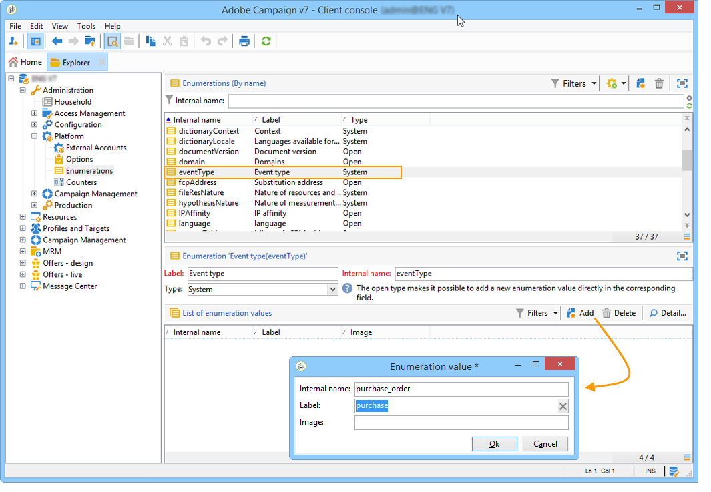

# Creare tipi di evento {#creating-event-types}

Per assicurarsi che ogni evento possa essere modificato in un messaggio personalizzato, devi innanzitutto creare **tipi di evento**.

Quando [si crea un modello di messaggio](../../message-center/using/creating-the-message-template.md), verrà selezionato il tipo di evento corrispondente al messaggio che si desidera inviare.

>[!IMPORTANT]
>
>È necessario creare tipi di evento prima di poterli utilizzare nei modelli di messaggio.

Per creare tipi di evento che verranno elaborati da Adobe Campaign, segui questi passaggi:

1. Accedere all&#39;**istanza di controllo**.

1. Passare alla cartella **[!UICONTROL Administration > Platform > Enumerations]** della struttura.

1. Selezionare **[!UICONTROL Event type]** dall&#39;elenco.

1. Fare clic su **[!UICONTROL Add]** per creare un valore di enumerazione. Può trattarsi di una conferma d’ordine, di una modifica della password, di una modifica della consegna dell’ordine, ecc.

   

   >[!IMPORTANT]
   >
   >Ogni tipo di evento deve corrispondere a un valore nell&#39;enumerazione **[!UICONTROL Event type]**.

1. Una volta creati i valori dell’elenco dettagliati, disconnettiti e accedi di nuovo all’istanza per rendere effettiva la creazione.

>[!NOTE]
>
>Scopri come **utilizzare le enumerazioni** nella [documentazione di Adobe Campaign v8 (console)](https://experienceleague.adobe.com/en/docs/campaign/campaign-v8/config/settings/enumerations){target=_blank}.

