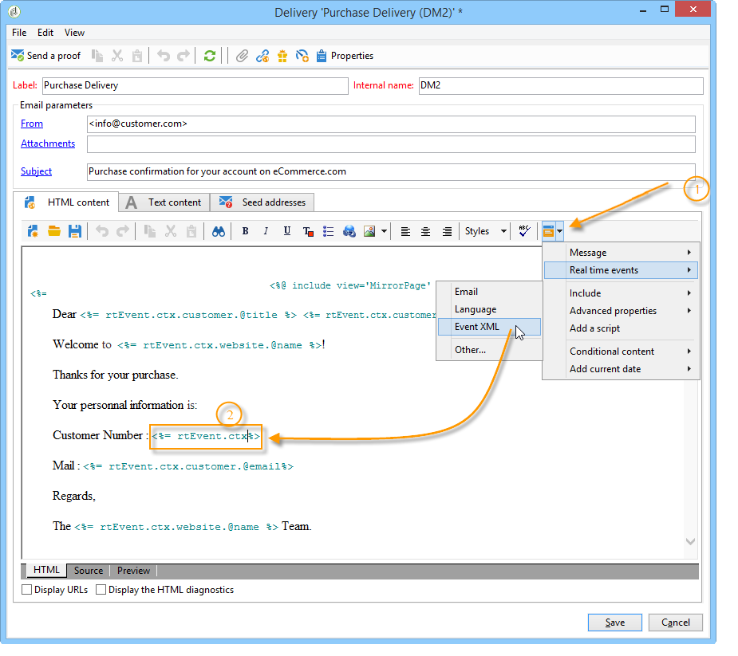

# Creazione del contenuto del messaggio{#creating-message-content}

La definizione del contenuto dei messaggi transazionali è la stessa utilizzata per le consegne regolari in  Adobe Campaign. Ad esempio, per la consegna tramite e-mail potete creare contenuto in formato HTML o testo, aggiungere allegati o personalizzare l&#39;oggetto di consegna. Per ulteriori informazioni, consultare il capitolo relativo alla [distribuzione tramite e-mail](../../delivery/using/about-email-channel.md).

>[!IMPORTANT]
>
>Le immagini incluse nel messaggio devono essere accessibili al pubblico.  Adobe Campaign non fornisce alcun meccanismo di caricamento delle immagini per i messaggi transazionali.\
>A differenza di JSSP o webApp, `<%=` non dispone di escape predefinito.
>
>In questo caso, è necessario eseguire correttamente l&#39;escape di ogni dato proveniente dall&#39;evento. Questa escape dipende dalla modalità di utilizzo del campo. Ad esempio, all’interno di un URL, utilizzate encodeURIComponent. Per essere visualizzato nell’HTML, è possibile utilizzare escapeXMLString.

Una volta definito il contenuto del messaggio, potete integrare le informazioni sull&#39;evento nel corpo del messaggio e personalizzarlo. Le informazioni sull’evento vengono inserite nel corpo del testo grazie ai tag di personalizzazione.

* Tutti i campi di personalizzazione provengono dal payload.
* È possibile fare riferimento a uno o più blocchi di personalizzazione in un messaggio transazionale. Il contenuto del blocco verrà aggiunto al contenuto del recapito durante la pubblicazione nell&#39;istanza di esecuzione.

Per inserire tag di personalizzazione nel corpo di un messaggio e-mail, effettua i seguenti passaggi:

1. Nel modello del messaggio, fai clic sulla scheda che corrisponde al formato dell&#39;e-mail (HTML o testo).
1. Immettere il corpo del messaggio.
1. Nel corpo del testo, inserite il tag utilizzando i menu **[!UICONTROL Real time events>Event XML]**.

   

1. Compilate il tag utilizzando la sintassi seguente: **nome elemento**.@**nome attributo** come mostrato di seguito.

   

