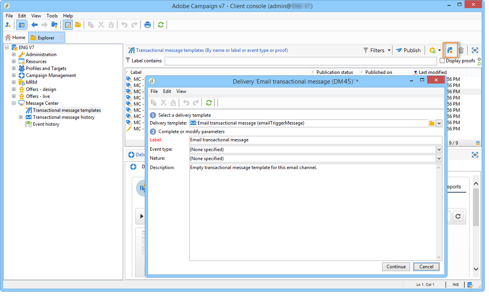

# Progettare modelli di messaggi transazionali {#creating-the-message-template}

Per garantire che ogni evento possa essere trasformato in un messaggio personalizzato, devi creare un modello di messaggio corrispondente a ciascun tipo di evento.

>[!IMPORTANT]
>
>I tipi di evento devono essere creati in anticipo. Per ulteriori informazioni, consulta [Creare tipi di evento](../../message-center/using/creating-event-types.md).

I modelli per messaggi transazionali contengono le informazioni necessarie per personalizzare il messaggio transazionale. Puoi inoltre utilizzare i modelli per verificare l’anteprima dei messaggi e inviare bozze utilizzando indirizzi di seed prima della consegna al target finale. Per ulteriori informazioni, consulta [Testare modelli di messaggi transazionali](../../message-center/using/testing-message-templates.md).

## Creare il modello di messaggio {#creating-message-template}

1. Vai a **[!UICONTROL Message Center >Transactional message templates]** nella struttura Adobe Campaign.

1. Nell’elenco dei modelli di messaggi transazionali, fai clic con il pulsante destro del mouse e seleziona **[!UICONTROL New]** nel menu a discesa o fai clic sul pulsante **[!UICONTROL New]** sopra l’elenco dei modelli di messaggi transazionali.

   

1. Nella finestra di dialogo di consegna, seleziona il modello di consegna adatto al canale che desideri utilizzare.

   

1. Se necessario, modificane l’etichetta.

1. Seleziona il tipo di evento che corrisponde al messaggio da inviare.

   

   I tipi di evento devono essere creati in anticipo nella console. Per ulteriori informazioni, consulta [Creare tipi di evento](../../message-center/using/creating-event-types.md).

   >[!IMPORTANT]
   >
   >Un tipo di evento non può essere collegato a più modelli.

1. Inserisci una natura e una descrizione, quindi fai clic su **[!UICONTROL Continue]** per creare il corpo del messaggio (fare riferimento a [Creare il contenuto del messaggio](#creating-message-content)).

   

## Creare il contenuto del messaggio {#creating-message-content}

La definizione del contenuto dei messaggi transazionali è la stessa utilizzata per le consegne regolari in Adobe Campaign. Ad esempio, per una consegna e-mail, puoi creare contenuto in formato HTML o testo, aggiungere allegati o personalizzare l’oggetto di consegna. Per ulteriori informazioni, consulta [Consegna e-mail](../../delivery/using/about-email-channel.md) capitolo.

>[!IMPORTANT]
>
>Le immagini incluse nel messaggio devono essere accessibili al pubblico. Adobe Campaign non fornisce alcun meccanismo di caricamento di immagini per i messaggi transazionali.\
>A differenza di JSSP o webApp, `<%=` non ha alcun escape predefinito.
>
>In questo caso, è necessario eseguire correttamente l’escape di ogni dato proveniente dall’evento. L’escape dipende da come viene utilizzato questo campo. Ad esempio, all’interno di un URL, utilizza encodeURIComponent. Per essere visualizzato in HTML, è possibile utilizzare escapeXMLString.

Dopo aver definito il contenuto del messaggio, puoi integrare le informazioni sull’evento nel corpo del messaggio e personalizzarlo. Le informazioni sull’evento vengono inserite nel corpo del testo grazie ai tag di personalizzazione.

* Tutti i campi di personalizzazione provengono dal payload.
* È possibile fare riferimento a uno o più blocchi di personalizzazione in un messaggio transazionale. Il contenuto del blocco verrà aggiunto al contenuto della consegna durante la pubblicazione nell’istanza di esecuzione.

Per inserire i tag di personalizzazione nel corpo di un messaggio e-mail, effettua le seguenti operazioni:

1. Nel modello del messaggio, fai clic sulla scheda corrispondente al formato e-mail (HTML o testo).

1. Inserisci il corpo del messaggio.

1. Nel corpo del testo, inserisci il tag utilizzando **[!UICONTROL Real time events > Event XML]** menu.

   

1. Compila il tag utilizzando la sintassi seguente: **nome elemento**.@**nome attributo** come mostrato di seguito.

   

1. Salva il contenuto.

Il messaggio è pronto per essere [testato](../../message-center/using/testing-message-templates.md).
