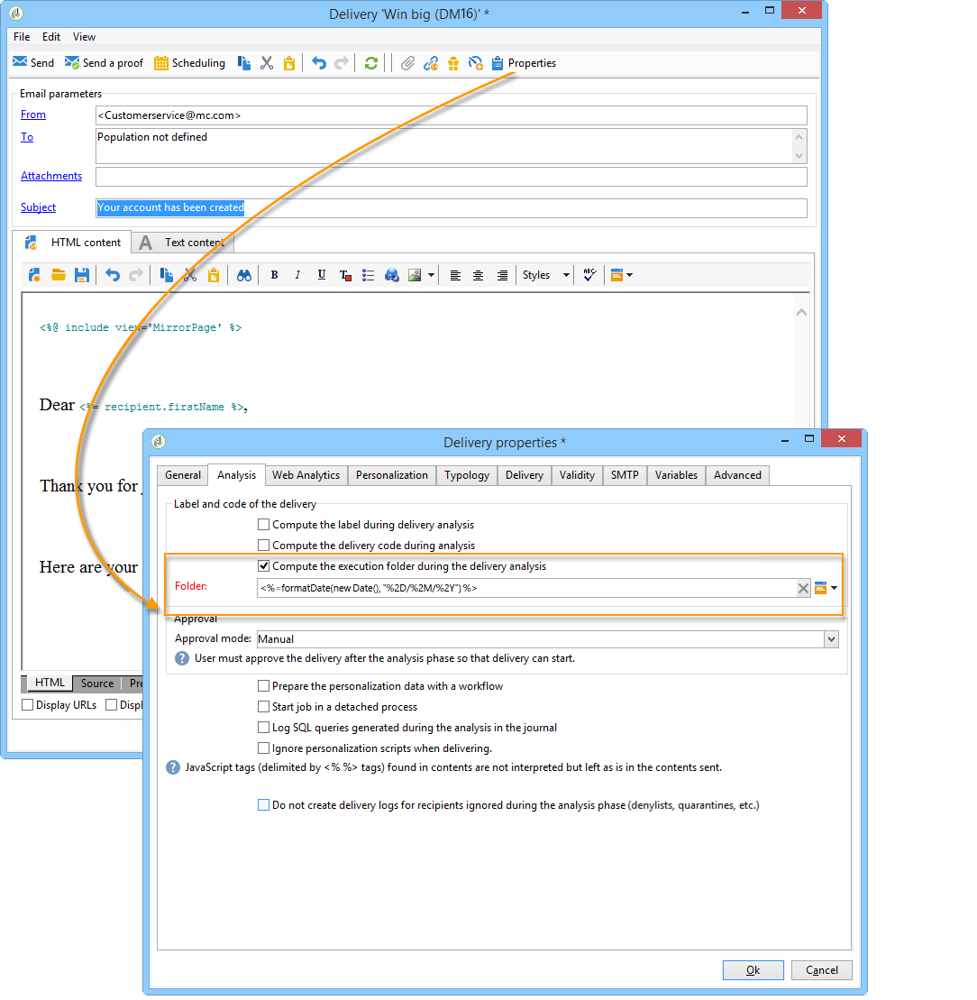

# Esecuzione della consegna{#delivery-execution}

>[!NOTE]
>
>L&#39;MTA dà priorità all&#39;elaborazione dei messaggi transazionali rispetto a qualsiasi altra consegna.

Nell’istanza di esecuzione, una volta completata la fase di arricchimento e collegato un modello di consegna all’evento, la consegna viene inviata. Tutte le consegne sono raggruppate nella **[!UICONTROL Administration > Production > Message Center > Default > Deliveries]** cartella.

Per impostazione predefinita, sono ordinati in sottocartelle per mese di consegna.

Questo ordinamento può essere modificato nelle proprietà del modello di messaggio come mostrato di seguito.

>[!NOTE]
>
>Per le installazioni ospitate o ibride, se avete effettuato l&#39;aggiornamento all&#39;MTA avanzato, tutti i messaggi transazionali possono essere inviati anche con l&#39;MTA avanzata di Adobe Campaign  per migliorare la recapito, il throughput e la gestione dei bounce. Tutti gli impatti sono gli stessi dei messaggi di marketing standard e sono descritti nel documento MTA [avanzato di](https://helpx.adobe.com/it/campaign/kb/acc-campaign-enhanced-mta.html) Adobe Campaign.