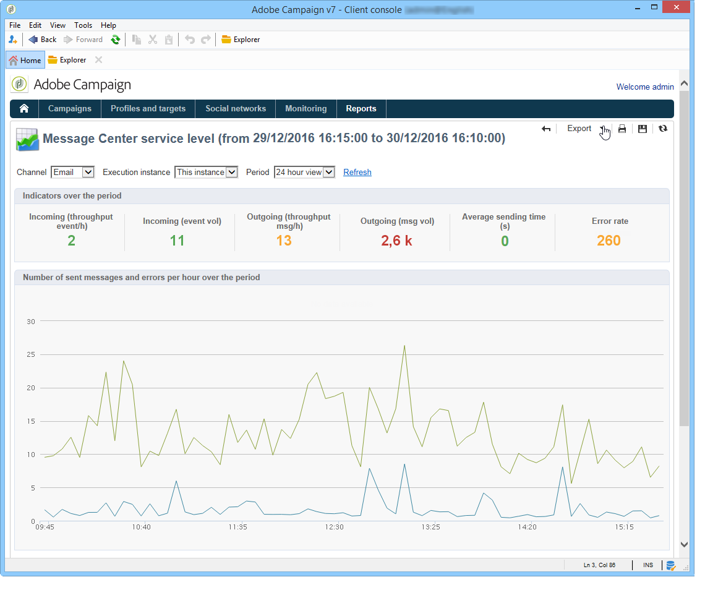

# Livello di servizio del Centro messaggi {#message-center-service-level}

Questo rapporto visualizza le statistiche di consegna relative ai messaggi transazionali e il raggruppamento degli errori. Puoi fare clic su un tipo di errore per visualizzarne i dettagli.

È inoltre possibile accedere a questo report, destinato agli amministratori tecnici, tramite la scheda **[!UICONTROL Monitoring]** nell&#39;istanza di controllo.

In questo rapporto puoi scegliere di visualizzare le statistiche generali o quelle relative a una particolare istanza di esecuzione. Puoi anche filtrare i dati per canale e in un periodo specifico.

Gli indicatori visualizzati nella sezione **[!UICONTROL Indicators over the period]** vengono calcolati per il periodo selezionato:

* **[!UICONTROL Incoming (throughput event/h)]**: numero medio orario di eventi immessi nella coda del Centro messaggi.
* **[!UICONTROL Incoming (event vol)]**: numero di eventi immessi nella coda del Centro messaggi.
* **[!UICONTROL Outgoing (throughput msg/h)]**: numero medio orario di eventi del Centro messaggi in uscita completati (inviati da una consegna).
* **[!UICONTROL Outgoing (msg vol)]**: numero di eventi del Centro messaggi in uscita completati (inviati da una consegna).
* **[!UICONTROL Average sending time (seconds)]**: tempo medio trascorso nel Centro messaggi per gli eventi elaborati correttamente. Il calcolo tiene conto del tempo di elaborazione e del tempo di invio dell’MTA.
* **[!UICONTROL Error rate]** : numero di eventi con errori rispetto al numero di eventi che sono entrati nella coda del Centro messaggi. Vengono presi in considerazione i seguenti errori: errore di routing, evento scaduto (evento che è stato nella coda troppo lungo), errore di consegna, ignorato dalla consegna (quarantena, ecc.).

>[!NOTE]
>
>Le soglie degli indicatori di avviso (arancione) e di avviso (rosso) possono essere configurate nella procedura guidata di distribuzione. Consulta [Monitorare le soglie](../../message-center/using/additional-configurations.md#monitoring-thresholds).
