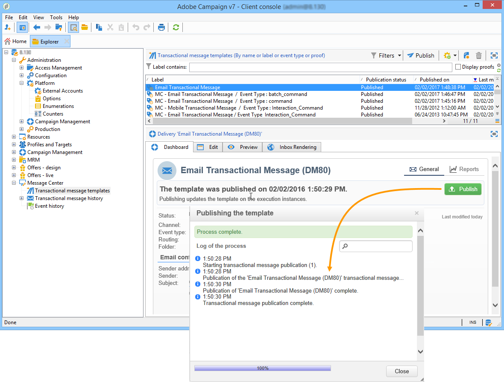
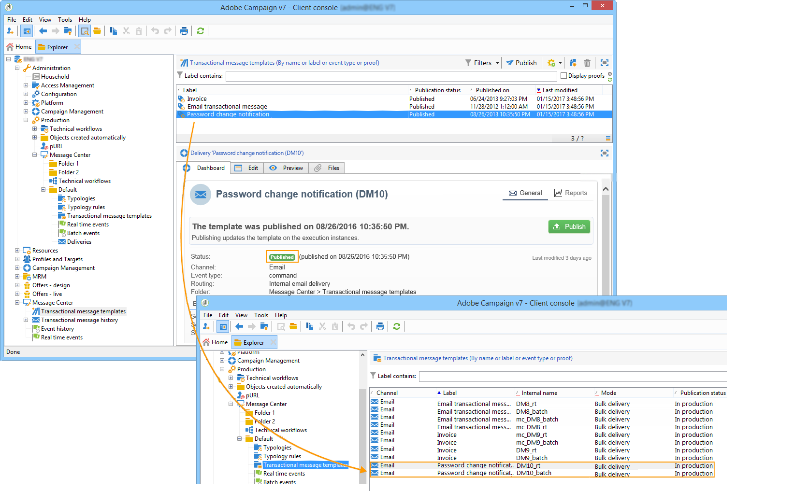
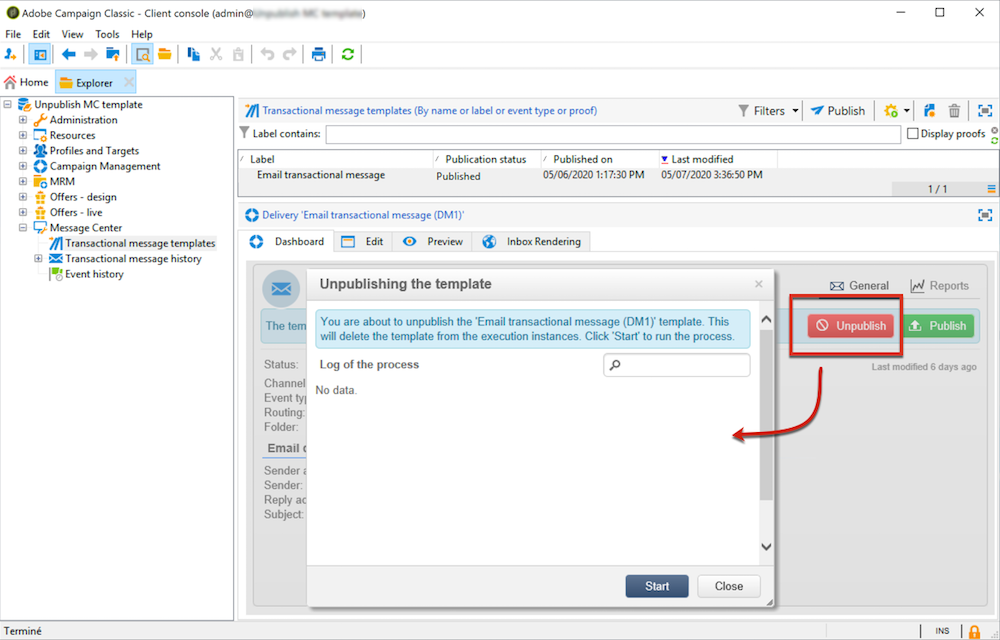

# Pubblicare modelli di messaggio {#publishing-template-messages}

## Pubblicazione di modelli {#template-publication}

Quando il [modello di messaggio](../../message-center/using/creating-the-message-template.md) creato nell&#39;istanza di controllo è completo e dopo averlo [testato](../../message-center/using/testing-message-templates.md), puoi pubblicarlo. Questo processo lo pubblicherà anche su tutte le istanze di esecuzione.

La pubblicazione consente di creare automaticamente **due modelli di messaggio** nelle istanze di esecuzione, che ti consentiranno di inviare messaggi collegati a **eventi in tempo reale** e **eventi batch**.

>[!NOTE]
>
>Quando si pubblicano modelli di messaggi transazionali, le regole di tipologia vengono pubblicate automaticamente anche nelle istanze di esecuzione.

>[!IMPORTANT]
>
>Ogni volta che apporti modifiche a un modello, assicurati di pubblicarle nuovamente affinché risultino efficaci durante la consegna dei messaggi transazionali.

1. Nell&#39;istanza di controllo, passare alla cartella **[!UICONTROL Message Center > Transactional message templates]** della struttura.
1. Seleziona il modello da pubblicare sulle istanze di esecuzione.
1. Fai clic su **[!UICONTROL Publish]**.

   

Una volta completata la pubblicazione, entrambi i modelli di messaggio da applicare agli eventi batch e di tipo in tempo reale vengono creati nella struttura dell&#39;istanza di produzione nella cartella **[!UICONTROL Administration > Production > Message Center Execution> Default > Transactional message templates]**.

Dopo la pubblicazione di un modello, se l’evento corrispondente viene attivato, l’istanza di esecuzione riceverà l’evento, lo collegherà al modello transazionale e invierà il messaggio transazionale corrispondente a ciascun destinatario. Per ulteriori informazioni, consulta [Elaborazione degli eventi](../../message-center/using/about-event-processing.md).

>[!NOTE]
>
>Se sostituisci un campo esistente del modello di messaggio transazionale, ad esempio l’indirizzo del mittente, con un valore vuoto, il campo corrispondente nelle istanze di esecuzione non verrà aggiornato dopo la nuova pubblicazione del messaggio transazionale. Conterrà ancora il valore precedente.
>
>Tuttavia, se aggiungi un valore non vuoto, il campo corrispondente verrà aggiornato come di consueto dopo la pubblicazione successiva.

## Annullamento della pubblicazione di modelli {#template-unpublication}

Una volta pubblicato un modello di messaggio nelle istanze di esecuzione, è possibile annullarne la pubblicazione. Per ulteriori informazioni sul processo di pubblicazione del modello, vedere [questa sezione](#template-publication).

* In effetti, un modello pubblicato può ancora essere chiamato se viene attivato l’evento corrispondente: se non utilizzi più un modello di messaggio, si consiglia di annullarne la pubblicazione. In questo modo si evita di inviare per errore un messaggio transazionale indesiderato.

  Ad esempio, hai pubblicato un modello di messaggio da utilizzare solo per le campagne natalizie. Puoi annullarne la pubblicazione al termine del periodo natalizio e pubblicarla nuovamente l’anno prossimo.

* Inoltre, non è possibile eliminare un modello di messaggio transazionale con stato **[!UICONTROL Published]**. Devi prima annullare la pubblicazione.

>[!NOTE]
>
>Questa funzionalità è disponibile a partire dalla versione 20.2 di Campaign.

Per annullare la pubblicazione di un modello di messaggio sulle transazioni, effettua le seguenti operazioni.

1. Nell&#39;istanza di controllo, passare alla cartella **[!UICONTROL Message Center > Transactional message templates]** della struttura.
1. Seleziona il modello di cui vuoi annullare la pubblicazione.
1. Fai clic su **[!UICONTROL Unpublish]**.

   <!--1. Fill in the **[!UICONTROL Log of the process]** field.-->

1. Fai clic su **[!UICONTROL Start]**.

Lo stato del modello di messaggio transazionale torna da **[!UICONTROL Published]** a **[!UICONTROL Being edited]**.

Una volta completata la pubblicazione:

* Entrambi i modelli di messaggio (applicati a eventi di tipo batch e in tempo reale) vengono eliminati da ogni istanza di esecuzione.

  Non vengono più visualizzati nella cartella **[!UICONTROL Administration > Production > Message Center Execution > Default > Transactional message templates]** (vedere [questa sezione](#template-publication)).

* Dopo aver annullato la pubblicazione di un modello, è possibile eliminarlo dall&#39;istanza di controllo.

  A tale scopo, selezionarlo dall&#39;elenco e fare clic sul pulsante **[!UICONTROL Delete]** in alto a destra dello schermo.
