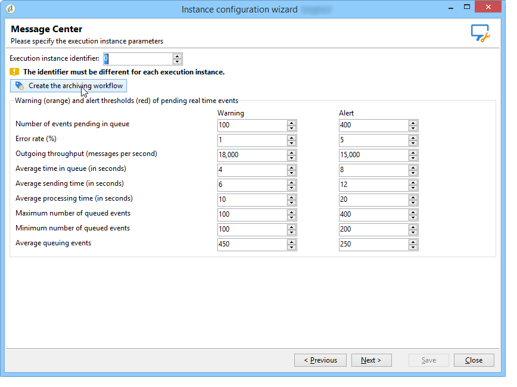

# Flussi di lavoro tecnici{#technical-workflows}

Devi accertarti che i flussi di lavoro tecnici sull&#39;istanza di controllo e sulle diverse istanze di esecuzione siano effettivamente stati creati e avviati prima di distribuire qualsiasi modello di messaggio transazionale.

I vari flussi di lavoro tecnici relativi ai messaggi transazionali (Centro messaggi) sono suddivisi tra l&#39;istanza di controllo e le istanze di esecuzione.

## Flussi di lavoro delle istanze di controllo {#control-instance-workflows}

Nell&#39;istanza di controllo, indipendentemente dalla presenza di una o più istanze di esecuzione registrate, è necessario creare un flusso di lavoro di archiviazione per ciascun account **[!UICONTROL Message Center execution instance]** esterno. Fate clic sul **[!UICONTROL Create the archiving workflow]** pulsante per creare e avviare il flusso di lavoro.

Questi flussi di lavoro sono quindi accessibili dalla cartella **Amministrazione > Produzione > Centro** messaggi. Una volta creati, i flussi di lavoro di archiviazione vengono avviati automaticamente.

<!--**Minimal architecture**

Once the control and execution modules are installed on the same instance, you must create the archiving workflow using the deployment wizard. Click the **[!UICONTROL Create the archiving workflow]** button to create and start the workflow.

-->

## Flussi di lavoro per le istanze di esecuzione {#execution-instance-workflows}

Nelle istanze di esecuzione, è possibile accedere ai flussi di lavoro tecnici per i messaggi transazionali dalla cartella **Amministrazione > Produzione > Centro** messaggi. Dovete solo iniziare a farlo. I flussi di lavoro elencati sono:

* **[!UICONTROL Processing batch events]** (nome interno: **[!UICONTROL batchEventsProcessing]** ): questo flusso di lavoro consente di suddividere gli eventi batch in una coda prima che siano collegati a un modello di messaggio.
* **[!UICONTROL Processing real time events]** (nome interno: **[!UICONTROL rtEventsProcessing]** ): questo flusso di lavoro consente di suddividere gli eventi in tempo reale in una coda prima che siano collegati a un modello di messaggio.
* **[!UICONTROL Update event status]** (nome interno: **[!UICONTROL updateEventStatus]** ): questo flusso di lavoro consente di attribuire uno stato all’evento.

   Sono disponibili i seguenti stati dell&#39;evento:

   * **[!UICONTROL Pending]** : l&#39;evento è nella coda. Non è ancora stato assegnato alcun modello di messaggio.
   * **[!UICONTROL Pending delivery]** : l&#39;evento è nella coda, gli è stato assegnato un modello di messaggio e viene elaborato dal recapito.
   * **[!UICONTROL Sent]** : questo stato viene copiato dai registri di consegna. Significa che la consegna è stata inviata.
   * **[!UICONTROL Ignored by the delivery]** : questo stato viene copiato dai registri di consegna. Significa che la consegna è stata ignorata.
   * **[!UICONTROL Delivery failed]** : questo stato viene copiato dai registri di consegna. Significa che la consegna è non è andata a buon fine.
   * **[!UICONTROL Event not taken into account]** : impossibile collegare l&#39;evento a un modello di messaggio. L’evento non viene elaborato.

