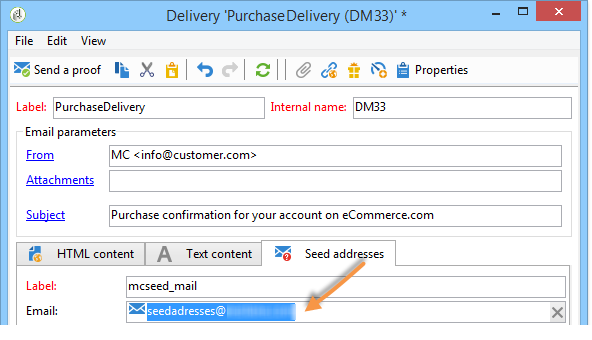
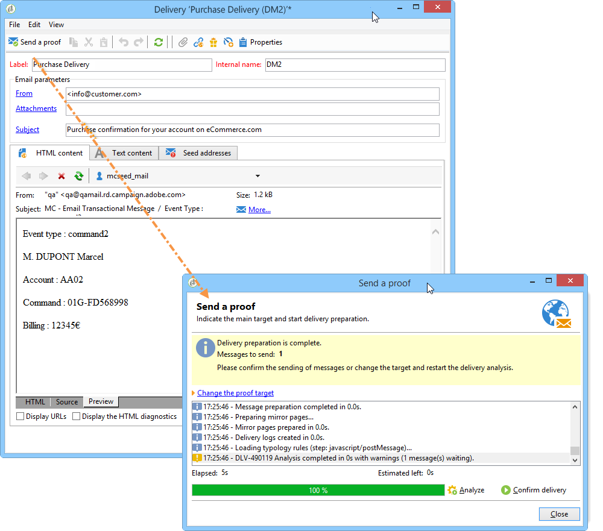

# Testare modelli di messaggi transazionali {#testing-message-templates}

Una volta che il [modello di messaggio](../../message-center/using/creating-the-message-template.md) è pronto, segui i passaggi seguenti per visualizzarlo in anteprima e testarlo.

## Gestire gli indirizzi seed nei messaggi transazionali {#managing-seed-addresses-in-transactional-messages}

Un indirizzo di seed ti consente di visualizzare un’anteprima del messaggio, inviare una bozza e testare la personalizzazione del messaggio prima della consegna e-mail o SMS. Gli indirizzi di seed sono collegati alla consegna e non possono essere utilizzati per altre consegne.

Per creare indirizzi di seed in un messaggio transazionale, segui i passaggi seguenti:

1. Nel modello di messaggio transazionale, fare clic sulla scheda **[!UICONTROL Seed addresses]**.

   

1. Assegna un’etichetta per facilitarne la selezione in un secondo momento.

   

1. Immetti l’indirizzo seed (e-mail o telefono cellulare a seconda del canale di comunicazione).

   

1. Inserisci l’identificatore esterno: questo campo opzionale ti consente di inserire una chiave aziendale (ID univoco, nome + e-mail, ecc.) comune a tutte le applicazioni sul sito web, utilizzata per identificare i profili. Se questo campo è presente anche nel database di marketing di Adobe Campaign, puoi riconciliare un evento con un profilo nel database.

   

1. Inserire i dati di prova (fare riferimento a [dati Personalization](#personalization-data)).

   

   <!--## Creating several seed addresses {#creating-several-seed-addresses}-->
1. Fare clic sul collegamento **[!UICONTROL Add other seed addresses]**, quindi sul pulsante **[!UICONTROL Add]**.

   

   <!--1. Follow the configuration steps for a seed address detailed in the [Creating a seed address](#creating-a-seed-address) section.-->
1. Ripeti il processo per creare tutti gli indirizzi necessari.

   

Una volta creati gli indirizzi, puoi visualizzarne l’anteprima e la personalizzazione. Consulta [Anteprima messaggi transazionali](#transactional-message-preview).

## Dati di personalizzazione {#personalization-data}

È possibile utilizzare i dati nel modello del messaggio per testare la personalizzazione dei messaggi transazionali. Questa funzionalità viene utilizzata per generare un’anteprima o inviare una bozza. Puoi anche visualizzare il rendering del messaggio per vari provider di accesso a Internet. Per ulteriori informazioni, consulta [Rendering in entrata](../../delivery/using/inbox-rendering.md).

Lo scopo di questi dati è quello di testare i messaggi prima della loro consegna finale. Questi messaggi non coincidono con i dati effettivi da elaborare. Tuttavia, la struttura XML deve essere identica a quella dell’evento memorizzato nell’istanza di esecuzione, come illustrato di seguito:

Queste informazioni consentono di personalizzare il contenuto dei messaggi utilizzando tag di personalizzazione (per ulteriori informazioni, vedere [Creare il contenuto del messaggio](../../message-center/using/creating-the-message-template.md#creating-message-content)).

1. Seleziona il modello di messaggio transazionale.

1. Nel modello, fare clic sulla scheda **[!UICONTROL Seed addresses]**.

1. Nel contenuto dell&#39;evento, immettere le informazioni del test in formato XML.

   

1. Fai clic su **[!UICONTROL Save]**.

## Anteprima di un messaggio transazionale {#transactional-message-preview}

Dopo aver creato uno o più indirizzi di seed e il corpo del messaggio, puoi visualizzare l’anteprima del messaggio e controllarne la personalizzazione.

1. Nel modello di messaggio fare clic sulla scheda **[!UICONTROL Preview]**.

   

1. Selezionare **[!UICONTROL A seed address]** nell&#39;elenco a discesa.

   

1. Seleziona l’indirizzo seed creato in precedenza per visualizzare il messaggio personalizzato.

   

Utilizzando gli indirizzi seed, puoi anche visualizzare il rendering del messaggio per vari provider di accesso a Internet. Per ulteriori informazioni, consulta [Rendering in entrata](../../delivery/using/inbox-rendering.md).

## Inviare una bozza {#sending-a-proof}

Puoi verificare la consegna dei messaggi inviando una bozza a un indirizzo seed creato in precedenza.

L’invio di una bozza prevede lo stesso processo di una consegna regolare. Consulta la [documentazione di Campaign v8](https://experienceleague.adobe.com/docs/campaign/campaign-v8/send/validate/preview-and-proof.html?lang=it){target="_blank"}. Tuttavia, con la messaggistica transazionale, devi eseguire in anticipo le seguenti operazioni:

* Crea uno o più [indirizzi seed](#managing-seed-addresses-in-transactional-messages) con [dati di personalizzazione](#personalization-data).
* [Crea il contenuto del messaggio](../../message-center/using/creating-the-message-template.md#creating-message-content).

Per inviare la bozza:

1. Fai clic sul pulsante **[!UICONTROL Send a proof]** nella finestra di consegna.
1. Analizza la consegna.
1. Correggi eventuali errori e conferma la consegna.

   

1. Verifica che il messaggio sia stato recapitato all’indirizzo di seed e che il suo contenuto sia conforme alla configurazione.

   

È possibile accedere alle bozze in ogni modello tramite la scheda **[!UICONTROL Audit]**. Per ulteriori dettagli, consulta la [documentazione di Campaign v8](https://experienceleague.adobe.com/docs/campaign/campaign-v8/send/validate/preview-and-proof.html?lang=it){target="_blank"}.

Il modello di messaggio è pronto per essere [pubblicato](../../message-center/using/publishing-message-templates.md).