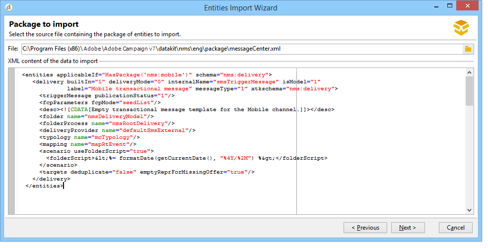
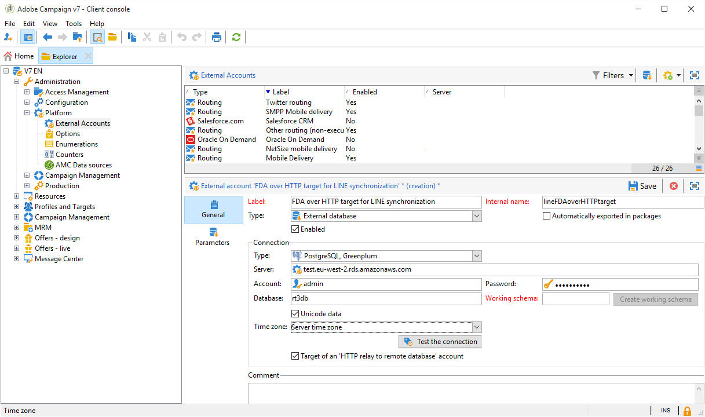

# Architettura della messaggistica transazionale {#transactional-messaging-architecture}


La messaggistica transazionale si basa su un’architettura specifica, costituita da diverse istanze:

* **istanza di controllo**, in cui vengono creati i modelli di messaggio.

* Una o più **istanze di esecuzione**, che ricevono eventi e inviano messaggi.


| Istanza di controllo | Istanza di esecuzione |
|--- |--- |
| Gli utenti di Adobe Campaign accedono all’istanza di controllo per: <ul><li>Creare modelli di messaggi transazionali</li><li>Genera l’anteprima del messaggio utilizzando un elenco di seed</li><li>Visualizzare i rapporti</li><li>Monitorare le istanze di esecuzione</li></ul> | Le istanze di esecuzione consentono di: <ul><li>Ricevi eventi</li><li>Collegali ai modelli di messaggi transazionali</li><li>Inviare un messaggio personalizzato a ciascun destinatario</li></ul> |

## Installare le istanze {#installing-instances}

Sono disponibili diverse precauzioni da prendere durante l’installazione dei pacchetti di messaggi transazionali. L’Adobe consiglia di lavorare in un ambiente di test prima di metterlo in produzione. È inoltre necessario disporre di una licenza Adobe Campaign compatibile. Per ulteriori informazioni, contatta il responsabile del tuo account Adobe.

>[!IMPORTANT]
>
>L&#39;istanza di controllo e le istanze di esecuzione devono essere installate su computer diversi. Non possono condividere la stessa istanza di Campaign.

Se devi utilizzare diversi canali, installa e configura i pacchetti correlati prima di installare i pacchetti di messaggi transazionali. Per ulteriori informazioni, consulta [Aggiungere un canale di consegna](#adding-a-delivery-channel).

## Istanza di controllo {#control-instance}

Per installare l&#39;istanza di controllo nel computer, selezionare il pacchetto **[!UICONTROL Transactional message control]** tramite il menu **[!UICONTROL Tools]** > **[!UICONTROL Advanced]** > **[!UICONTROL Import package]**. Per ulteriori informazioni, consulta [Installazione dei pacchetti standard di Campaign Classic](../../installation/using/installing-campaign-standard-packages.md).


I passaggi dettagliati per configurare l&#39;istanza di controllo sono descritti in [questa sezione](../../message-center/using/configuring-instances.md#control-instance).

### Supporto di più istanze di controllo {#supporting-several-control-instances}

>[!IMPORTANT]
>
>La condivisione di un cluster di esecuzione con più istanze di controllo è supportata solo per gli ambienti locali.

È possibile condividere un cluster di esecuzione tra più istanze di controllo. Ad esempio, se gestisci diversi store specializzati, puoi configurare un’istanza di controllo per brand e collegarli tutti allo stesso cluster di esecuzione.


>[!NOTE]
>
>Per ulteriori informazioni sulla configurazione necessaria, vedere [Utilizzare più istanze di controllo](../../message-center/using/configuring-instances.md#using-several-control-instances).

## Istanza di esecuzione {#execution-instance}

Per installare un&#39;istanza di esecuzione nel computer, selezionare il pacchetto **[!UICONTROL Transactional message execution]** tramite il menu **[!UICONTROL Tools]** > **[!UICONTROL Advanced]** > **[!UICONTROL Import package]**. Per ulteriori informazioni, consulta [Installazione dei pacchetti standard di Campaign Classic](../../installation/using/installing-campaign-standard-packages.md).


I passaggi dettagliati per configurare un&#39;istanza di esecuzione sono descritti in [questa sezione](../../message-center/using/configuring-instances.md#execution-instance).

## Canali di consegna disponibili

Il canale e-mail è disponibile per impostazione predefinita. Per inviare messaggi transazionali su più canali, puoi aggiungere altri canali (canale mobile, canale app mobile, ecc.).

>[!IMPORTANT]
>
>Aggiunta di un canale di consegna (canale mobile, canale app mobile, ecc.) prima di installare il pacchetto dei messaggi transazionali.

### Aggiungere un canale di consegna {#adding-a-delivery-channel}

L&#39;Adobe consiglia di **aggiungere sempre il pacchetto del canale di consegna prima di installare il pacchetto dei messaggi transazionali**.

Tuttavia, se hai avviato un progetto di messaggistica transazionale sul canale e-mail e poi decidi durante il progetto di aggiungere un nuovo canale, puoi seguire i passaggi seguenti.

>[!NOTE]
>
>Questa procedura è valida solo per i clienti che utilizzano un Windows NLServer installato sullo stesso computer su cui stanno lavorando.

1. Installa il canale necessario, ad esempio il **canale mobile**, utilizzando l&#39;Assistente all&#39;importazione del pacchetto (**[!UICONTROL Tools > Advanced > Import package... > Adobe Campaign Package]**).
1. Eseguire un&#39;importazione di file (**[!UICONTROL Tools > Advanced > Import package... > File]**) e selezionare il file **datakitnms **`[Your language]`**packagemessageCenter.xml**.
1. In **[!UICONTROL XML content of the data to import]**, mantieni solo il modello di consegna che corrisponde al canale aggiunto. Ad esempio, se hai aggiunto il **canale mobile**, mantieni solo l&#39;elemento **entità** che corrisponde a **[!UICONTROL Mobile transactional message]** (smsTriggerMessage). Se hai aggiunto il **canale app mobile**, mantieni solo il **messaggio transazionale di iOS** (iosTriggerMessage) e il **messaggio transazionale di Android** (androidTriggerMessage).

   

<!--## Transactional messages and inbound Interaction {#transactional-messages-and-inbound-interaction}

When combined with the Inbound Interaction module, transactional messaging enables you to insert a marketing offer dedicated to the recipient into the message.

>[!NOTE]
>
>The Interaction module is detailed in [Interaction](../../interaction/using/interaction-and-offer-management.md).

To use transactional messaging with Interaction, you need to apply the following configurations:

* Install the **Interaction** package onto the control instance and configure your offer catalog.

  >[!IMPORTANT]
  >
  >Do not replicate the offers onto the execution instances.

* The event must include an identifier linked to the recipients, for personalizing offers. The **@externalId** attribute must contain the value of this identifier. **Interaction** is configured by default to identify the recipient of the primary key:

  ```
  <rtEvent type="order_confirmation" email="john.doe@adobe.com" externalId="1242"> 
  ```

  You can configure **Interaction** so that identification takes place in the field of your choice, for example on the email address:

  ```
  <rtEvent type="order_confirmation" email="john.doe@adobe.com" externalId="john.doe@yahoo.com"> 
  ```

Create your delivery templates the way you would for an email campaign:

* Add the offer to your transactional message template.
* Check the preview, send a proof and publish the template.

You also have to enable the unitary mode on your offer spaces. For more on this, refer to [this section](../../interaction/using/creating-offer-spaces.md).-->

### Notifiche push transazionali {#transactional-messaging-and-push-notifications}

In combinazione con il modulo del canale app mobile, la messaggistica transazionale ti consente di inviare messaggi transazionali tramite notifiche su dispositivi mobili.

>[!NOTE]
>
>Il canale app mobile è descritto in [questa sezione](../../delivery/using/about-mobile-app-channel.md).

Per utilizzare i moduli di messaggi transazionali con il canale app mobile, devi applicare le seguenti configurazioni:

1. Installa il pacchetto **Canale app mobile** nelle istanze di controllo ed esecuzione.
1. Replica il servizio Adobe Campaign di tipo **App mobile** e le applicazioni mobili in esso contenute nelle istanze di esecuzione.

L’evento deve contenere i seguenti elementi:

* ID del dispositivo mobile (**registrationId** per Android e **deviceToken** per iOS). Questo ID rappresenta l’&quot;indirizzo&quot; a cui verrà inviata la notifica.
* Collegamento all&#39;applicazione mobile o alla chiave di integrazione (**uuid**) che consente di recuperare le informazioni di connessione specifiche dell&#39;applicazione.
* Canale a cui verrà inviata la notifica (**wishedChannel**): 41 per iOS e 42 per Android
* Tutti i dati utili per la personalizzazione

Di seguito è riportato un esempio di evento che contiene queste informazioni:

```
<SOAP-ENV:Envelope xmlns:xsd="http://www.w3.org/2001/XMLSchema" xmlns:xsi="http://www.w3.org/2001/XMLSchema-instance" xmlns:SOAP-ENV="http://schemas.xmlsoap.org/soap/envelope/">
   <SOAP-ENV:Body>
     <urn:PushEvent>
         <urn:sessiontoken>mc/</urn:sessiontoken>
         <urn:domEvent>

              <rtEvent wishedChannel="41" type="DELIVERY" registrationToken="2cefnefzef758398493srefzefkzq483974">
                <mobileApp _operation="none" uuid="com.adobe.NeoMiles"/>
                <ctx>
                    <deliveryTime>1:30 PM</deliveryTime>
                    <url>http://www.adobe.com</url>
                </ctx>
              </rtEvent>

         </urn:domEvent>
     </urn:PushEvent>           
   </SOAP-ENV:Body>
</SOAP-ENV:Envelope>
```

>[!NOTE]
>
>La creazione dei modelli di messaggio rimane la stessa.

### Messaggistica transazionale e LINE {#transactional-messaging-and-line}

In combinazione con il canale LINE, i messaggi transazionali ti consentono di inviare messaggi in tempo reale sull’app LINE installata su dispositivi mobili di consumo. Viene utilizzato per inviare il messaggio di benvenuto quando un utente LINE aggiunge la pagina del brand.

Per utilizzare il modulo di messaggi transazionali con LINE, sono necessari i seguenti elementi per la configurazione nell&#39;istanza **marketing** e nell&#39;istanza **execution**:

* Installa il pacchetto **[!UICONTROL LINE Connect]** in entrambe le istanze.
* Installa il pacchetto **[!UICONTROL Transactional message control]** nell&#39;istanza di marketing e il pacchetto **[!UICONTROL Transactional message execution]** nell&#39;istanza di esecuzione.
* Creare un account **esterno** e un servizio **LINE** in entrambe le istanze con lo stesso nome per sincronizzarle. Per ulteriori informazioni su come creare un account e un servizio esterno LINE, consultare [questa sezione](../../delivery/using/line-channel.md#setting-up-line-channel).

Quindi, da **[!UICONTROL Explorer]** , in **[!UICONTROL Platform]** > **[!UICONTROL External account]** , è necessario configurare account esterni diversi in entrambe le istanze:

1. Crea un account esterno **[!UICONTROL External database]** nell&#39;istanza **execution** con la seguente configurazione:

   

   * **[!UICONTROL Label]** e **[!UICONTROL Internal name]**: assegna all&#39;account esterno il nome necessario.
   * **[!UICONTROL Type]** : seleziona **[!UICONTROL External database]** .
   * La casella **[!UICONTROL Enabled]** deve essere selezionata.

   Dalla categoria **[!UICONTROL Connection]**:

   * **[!UICONTROL Type]** : selezionare il server di database, ad esempio PostgresSQL.
   * **[!UICONTROL Server]**: immettere l&#39;URL del server di database.
   * **[!UICONTROL Account]** : immetti l&#39;account del database.

     >[!NOTE]
     >
     >L&#39;utente del database deve disporre dei diritti di lettura per le tabelle seguenti per la connessione FDA: XtkOption, NmsVisitor, NmsVisitorSub, NmsService, NmsBroadLogRtEvent, NmsBroadLogBatchEvent, NmsTrackingLogRtEvent, NmsTrackingLogBatchEvent, NmsRtEvent, NmsBatchEvent, NmsBroadLogMsg, NmsTrackingUrl, NmsDelivery, NmsWebTrackingLogXtk Cartella.

   * **[!UICONTROL Password]**: immettere la password per l&#39;account di database.
   * **[!UICONTROL Database]** : immettere il nome del database dell&#39;istanza di esecuzione.
   * La casella **[!UICONTROL Target of an HTTP relay to remote database's account]** deve essere selezionata.

1. Crea un account **[!UICONTROL External Database]** nell&#39;istanza **marketing** con la seguente configurazione.

   

   * **[!UICONTROL Label]** e **[!UICONTROL Internal name]**: assegna all&#39;account esterno il nome necessario.
   * **[!UICONTROL Type]** : seleziona **[!UICONTROL External database]** .
   * La casella Abilitato deve essere selezionata.

   Dalla categoria **[!UICONTROL Connection]**:

   * **[!UICONTROL Type]** : seleziona **[!UICONTROL HTTP relay to remote Database]** .
   * **[!UICONTROL Server]** : immetti l&#39;URL del server della campagna per l&#39;istanza di esecuzione.
   * **[!UICONTROL Account]** : immetti l&#39;account utilizzato per accedere all&#39;istanza di esecuzione.
   * **[!UICONTROL Password]**: immettere la password per l&#39;account utilizzato per accedere all&#39;istanza di esecuzione.
   * **[!UICONTROL Data Source]**: immettere la seguente sintassi **`nms:extAccount:ID`** dell&#39;account del database esterno nell&#39;istanza di esecuzione.

1. Crea un account esterno **[!UICONTROL Execution instance]** nell&#39;istanza **marketing** utilizzando la seguente configurazione per creare il flusso di lavoro di sincronizzazione dati:

   

   * **[!UICONTROL Label]** e **[!UICONTROL Internal name]**: assegna all&#39;account esterno il nome necessario.
   * **[!UICONTROL Type]** : seleziona **[!UICONTROL Execution instance]** .
   * La casella Abilitato deve essere selezionata.

   Dalla categoria **[!UICONTROL Connection]**:

   * **[!UICONTROL URL]** : immetti l&#39;URL dell&#39;istanza di esecuzione.
   * **[!UICONTROL Account]** : immetti l&#39;account utilizzato per accedere all&#39;istanza di esecuzione.
   * **[!UICONTROL Password]**: immettere la password per l&#39;account utilizzato per accedere all&#39;istanza di esecuzione.

   Dalla categoria **[!UICONTROL Account connection method]**:

   * **[!UICONTROL Method]** : seleziona **[!UICONTROL Federated Data Access (FDA)]** .
   * **[!UICONTROL FDA account]** : seleziona il tuo account FDA dal menu a discesa.
   * Fai clic sul pulsante **[!UICONTROL Create the archiving workflow]**.
   * Fare clic sul pulsante **[!UICONTROL Create data synchronization workflow]** per creare il flusso di lavoro di sincronizzazione dei dati LINE.

1. Ora puoi iniziare a [creare messaggi transazionali](../../message-center/using/creating-the-message-template.md).
