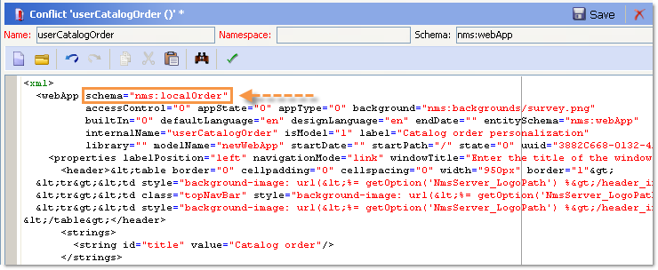

# Configurazioni generali{#general-configurations}


Questa sezione descrive la configurazione da eseguire in Adobe Campaign v7 durante la migrazione da una versione v5.11 o v6.02.

Inoltre:

* Se esegui la migrazione dalla versione v5.11, devi anche completare la configurazione descritta in [questa sezione](../../migration/using/configuring-your-platform.md#specific-configurations-in-v5-11).
* Se si esegue la migrazione dalla versione v6.02, è necessario completare anche la configurazione descritta in [questa sezione](../../migration/using/configuring-your-platform.md#specific-configurations-in-v6-02).

## Fusi orari {#time-zones}

### Modalità multifuso {#multi-time-zone-mode}

Nella versione 6.02, la modalità &quot;fuso orario multiplo&quot; era disponibile solo per i motori di database PostgreSQL. Ora è disponibile indipendentemente dal tipo di motore di database utilizzato. Si consiglia vivamente di trasformare la base in una base con più fusi orari.

Per utilizzare la modalità TIMESTAMP WITH TIMEZONE, è inoltre necessario aggiungere l&#39;opzione **-userTimestamptz:1** alla riga di comando post-aggiornamento.

>[!IMPORTANT]
>
>Se si utilizza il parametro **-usetimestamptz:1** con un motore di database non compatibile, il database sarà danneggiato e sarà necessario ripristinare un backup del database ed eseguire nuovamente il comando precedente.

>[!NOTE]
>
>È possibile modificare il fuso orario dopo la migrazione tramite la console (**[!UICONTROL Administration > Platform > Options > WdbcTimeZone]** nodo).
>
>Per ulteriori informazioni sulla gestione del fuso orario, consulta [questa sezione](../../installation/using/time-zone-management.md).

### Oracle {#oracle}

Se durante il post-aggiornamento viene visualizzato un errore **ORA 01805**, significa che i file di fuso orario di Oracle tra il server applicazioni e il server database non sono sincronizzati. Per risincronizzarli, attieniti alla seguente procedura:

1. Per identificare il file del fuso orario utilizzato, eseguire il comando seguente:

   ```
   select * from v$timezone_file
   ```

   I file del fuso orario si trovano in genere nella cartella **ORACLE_HOME/oracore/zoneinfo/**.

1. Verificare che i file del fuso orario siano identici in entrambi i server.

Per ulteriori informazioni, visitare: [https://docs.oracle.com/cd/E11882_01/server.112/e10729/ch4datetime.htm#NLSPG004](https://docs.oracle.com/cd/E11882_01/server.112/e10729/ch4datetime.htm#NLSPG004).

Un disallineamento del fuso orario tra client e server può anche causare alcuni ritardi. Ecco perché consigliamo di utilizzare la stessa versione della libreria Oracle sul lato client e sul lato server; entrambi i fusi orari devono essere gli stessi.

Per verificare se entrambi i lati si trovano sullo stesso fuso orario:

1. Controllare la versione del file del fuso orario sul lato client eseguendo il comando seguente:

   ```
   genezi -v
   ```

   genezi è un file binario trovato nell&#39;archivio **$ORACLE_HOME/bin**.

1. Controllare la versione del file del fuso orario sul lato server eseguendo il comando seguente:

   ```
   select * from v$timezone_file
   ```

1. Per modificare il file del fuso orario sul lato client, utilizzare la variabile di ambiente **ORA_TZFILE**.

## Sicurezza {#security}

### Aree di protezione {#security-zones}

>[!IMPORTANT]
>
>Per motivi di sicurezza, la piattaforma Adobe Campaign non è più accessibile per impostazione predefinita: è necessario configurare le aree di sicurezza e quindi raccogliere gli indirizzi IP dell’operatore.

Adobe Campaign v7 prevede il concetto di **aree di protezione**. Ogni utente deve essere associato a un&#39;area per accedere a un&#39;istanza e l&#39;indirizzo IP dell&#39;utente deve essere incluso negli indirizzi o negli intervalli di indirizzi definiti nell&#39;area di protezione. La configurazione delle aree di protezione può essere eseguita nel file di configurazione del server Adobe Campaign. L&#39;area di sicurezza a cui è associato un utente deve essere definita nella console (**[!UICONTROL Administration > Access management > Operators]**).

**Prima della migrazione**, chiedere all&#39;amministratore di rete di aiutarti a definire le aree di protezione da attivare dopo la migrazione.

**Dopo il post-aggiornamento** (prima del riavvio del server), è necessario configurare le aree di protezione.

Configurazione dell&#39;area di sicurezza trovata in [questa sezione](../../installation/using/security-zones.md).

### Password utente {#user-passwords}

Nella versione 7, la connessione dell&#39;operatore **internal** e **admin** deve essere protetta da una password. È consigliabile assegnare password a questi account e a tutti gli account operatore, **prima della migrazione**. Se non hai specificato una password per **internal**, non potrai connetterti. Per assegnare una password a **internal**, immettere il comando seguente:

```
nlserver config -internalpassword
```

>[!IMPORTANT]
>
>La password **internal** deve essere identica per tutti i server di tracciamento. Per ulteriori informazioni, consultare [questa sezione](../../installation/using/configuring-campaign-server.md#internal-identifier) e [questa sezione](../../platform/using/access-management.md).

### Nuove funzioni nella versione v7 {#new-features-in-v7}

* Gli utenti non autorizzati non possono più connettersi ad Adobe Campaign. Le relative autorizzazioni devono essere aggiunte manualmente, ad esempio creando un&#39;autorizzazione denominata **connect**.

  Gli utenti interessati da questa modifica vengono identificati ed elencati durante il post-aggiornamento.

* Il tracciamento non funziona più se la password è vuota. In questo caso, viene visualizzato un messaggio di errore che richiede di riconfigurarlo.
* Le password utente non sono più archiviate nello schema **xtk:sessionInfo**.
* Le autorizzazioni di amministrazione sono ora necessarie per utilizzare le funzioni **`xtk:builder:EvaluateJavaScript`** e **`xtk:builder:EvaluateJavaScriptTemplate`**.

Alcuni schemi predefiniti sono stati modificati e, per impostazione predefinita, sono accessibili solo con accesso in scrittura per gli operatori con l&#39;autorizzazione **admin**:

* ncm:pubblicazione
* nl:monitoraggio
* nms:calendario
* xtk:builder
* xtk:connessioni
* xtk:dbInit
* xtk:entityBackupNew
* xtk:entityBackupOriginal
* xtk:entityOriginal
* xtk:form
* xtk:funcList
* xtk:fusion
* xtk:immagine
* xtk:javascript
* xtk:jssp
* xtk:jst
* xtk:navtree
* xtk:operatorGroup
* xtk:package
* xtk:queryDef
* xtk:resourceMenu
* xtk:rights
* xtk:schema
* xtk:scriptContext
* xtk:specFile
* xtk:sql
* xtk:sqlSchema
* xtk:srcSchema
* xtk:stringhe
* xtk:xslt

### Parametro Sessiontoken {#sessiontoken-parameter}

Nella versione v5, il parametro **sessiontoken** funzionava sia sul lato client (elenco di schermate di tipo panoramica, editor di collegamenti, ecc.) e lato server (applicazioni web, report, jsp, jssp, ecc.). Nella versione 7 funziona solo sul lato server. Se desideri tornare alla funzionalità completa come in v5, devi modificare i collegamenti utilizzando questo parametro e passare tramite la pagina di connessione:

Esempio di collegamento:

```
/view/recipientOverview?__sessiontoken=<trusted login>
```

Nuovo collegamento che utilizza la pagina di connessione:

```
/nl/jsp/logon.jsp?login=<trusted login>&action=submit&target=/view/recipientOverview
```

>[!IMPORTANT]
>
>Se utilizzi un operatore collegato a una maschera IP attendibile, verifica che disponga dei diritti minimi e che si trovi in un&#39;area di sicurezza in modalità **sessionTokenOnly**.

### Funzioni SQL {#sql-functions}

Le chiamate di funzione SQL sconosciute non vengono più inviate naturalmente al server. Attualmente, tutte le funzioni SQL devono essere aggiunte allo schema **xtk:funcList** (per ulteriori informazioni, consulta [questa sezione](../../configuration/using/adding-additional-sql-functions.md)). Durante la migrazione, durante il post-aggiornamento viene aggiunta un&#39;opzione che consente di mantenere la compatibilità con le vecchie funzioni SQL non dichiarate. Se si desidera continuare a utilizzare queste funzioni, verificare che l&#39;opzione **XtkPassUnknownSQLFunctionsToRDBMS** sia effettivamente definita a livello di nodo **[!UICONTROL Administration > Platform > Options]**.

>[!IMPORTANT]
>
>Consigliamo vivamente di non utilizzare questa opzione a causa dei rischi per la sicurezza che introduce.

### JSSP {#jssp}

Se desideri autorizzare l&#39;accesso a determinate pagine tramite il protocollo HTTP (non HTTPS), ad esempio nelle app Web, indipendentemente dalla configurazione eseguita nelle aree di sicurezza, devi specificare il parametro **httpAllowed=&quot;true&quot;** nella regola di inoltro corrispondente.

Se si utilizzano JSSP anonimi, è necessario aggiungere il parametro **httpAllowed=&quot;true&quot;** in una regola di inoltro per il proprio JSSP (**[!UICONTROL serverConf.xml]** file):

Ad esempio:

```
<url IPMask="" deny="" hostMask="" httpAllowed="true" relayHost="true" relayPath="true"
           status="blacklist" targetUrl="https://localhost:8080" timeout="" urlPath="*/cus/myPublicPage.jssp"/>
```

## Sintassi {#syntax}

### JavaScript {#javascript}

Adobe Campaign v7 integra un interprete JavaScript più recente. Tuttavia, questo aggiornamento potrebbe causare il malfunzionamento di alcuni script. Poiché il motore precedente era più permissivo, alcune sintassi funzionavano, cosa che non avviene più con la nuova versione del motore.

La sintassi **[!UICONTROL myObject.@attribute]** è ora valida solo per gli oggetti XML. Questa sintassi può essere utilizzata per personalizzare le consegne e la gestione dei contenuti. Se si utilizza questo tipo di sintassi su un oggetto non XML, le funzioni di personalizzazione non funzioneranno più.

Per tutti gli altri tipi di oggetto, la sintassi è ora **[!UICONTROL myObject`[`&quot;attribute&quot;`]`]**. Ad esempio, un oggetto non XML che ha utilizzato la sintassi seguente: **[!UICONTROL employee.@sn]**, ora deve utilizzare la sintassi seguente: **[!UICONTROL employee`[`&quot;sn&quot;`]`]**.

* Sintassi precedente:

  ```
  employee.@sn
  ```

* Nuova sintassi:

  ```
  employee["sn"]
  ```

Per modificare un valore in un oggetto XML, è ora necessario iniziare aggiornando il valore prima di aggiungere il nodo XML:

* Codice JavaScript precedente:

  ```
  var cellStyle = node.style.copy();
  this.styles.appendChild(cellStyle);
  cellStyle.@width = column.@width;
  ```

* Nuovo codice JavaScript:

  ```
  var cellStyle = node.style.copy();
  cellStyle.@width = column.@width;
  this.styles.appendChild(cellStyle);
  ```

Non è più possibile utilizzare un attributo XML come chiave di tabella.

* Sintassi precedente:

  ```
  if(serverForm.activities[ctx.activityHistory.activity[0].@name].type !="end")
  ```

* Nuova sintassi:

  ```
  if(serverForm.activities[String(ctx.activityHistory.activity[0].@name)].type !="end"
  ```

### SQLData {#sqldata}

Per rafforzare la sicurezza dell’istanza, in Adobe Campaign v7 è stata introdotta una nuova sintassi che sostituisce la sintassi basata su SQLData. Se utilizzi questi elementi di codice con questa sintassi, devi modificarli. I principali elementi interessati sono i seguenti:

* Filtro per sottoquery: la nuova sintassi si basa sull&#39;elemento `<subQuery>` per definire una sottoquery
* Aggregati: la nuova sintassi è &quot;aggregate function(collection)&quot;
* Filtro per join: la nuova sintassi è `[schemaName:alias:xPath]`

Lo schema queryDef (xtk:queryDef) è stato modificato:

* è disponibile un nuovo elemento `<subQuery>` per sostituire SELECT incluso in SQLData
* per l’attributo @setOperator vengono introdotti due nuovi valori, &quot;IN&quot; e &quot;NOT IN&quot;
* un nuovo elemento `<where>`, che è un elemento figlio dell&#39;elemento `<node>`: questo consente di effettuare &quot;selezioni secondarie&quot; in SELECT

Quando si utilizza un attributo &quot;@expr&quot;, è possibile che sia presente SQLData. È possibile cercare i termini seguenti: &quot;SQLData&quot;, &quot;aliasSqlTable&quot;, &quot;sql&quot;.

Le istanze di Adobe Campaign v7 sono protette per impostazione predefinita. La sicurezza viene fornita in termini di definizioni delle aree di sicurezza nel file **[!UICONTROL serverConf.xml]**: l&#39;attributo **allowSQLInjection** gestisce la sicurezza della sintassi SQL.

Se si verifica un errore SQLData durante l&#39;esecuzione post-aggiornamento, è necessario modificare questo attributo per consentire temporaneamente l&#39;utilizzo di sintassi basate su SQLData, in modo da poter riscrivere il codice. Per eseguire questa operazione, è necessario modificare la seguente opzione nel file **serverConf.xml**:

```
allowSQLInjection="true"
```

Riavvia quindi il post-aggiornamento con il seguente comando:

```
nlserver config -postupgrade -instance:<instance_name> -force
```

È necessario configurare le aree di protezione (fare riferimento a [Protezione](#security)), quindi riattivare la protezione modificando l&#39;opzione:

```
allowSQLInjection="false"
```

Di seguito sono riportati alcuni esempi di confronto tra la vecchia e la nuova sintassi.

**Filtro per sottoquery**

* Sintassi precedente:

  ```
  <condition expr="@id NOT IN ([SQLDATA[SELECT iOperatorId FROM XtkOperatorGroup WHERE iGroupId = $(../@owner-id)]])" enabledIf="$(/ignored/@ownerType)=1"/>
  ```

* Nuova sintassi:

  ```
  <condition setOperator="NOT IN" expr="@id" enabledIf="$(/ignored/@ownerType)=1">
    <subQuery schema="xtk:operatorGroup">
       <select>
         <node expr="[@operator-id]" />
       </select>
       <where>
         <condition expr="[@group-id]=$long(../@owner-id)"/>
       </where>
     </subQuery>
  </condition>
  ```

* Sintassi precedente:

  ```
  <queryFilter name="dupEmail" label="Emails duplicated in the folder" schema="nms:recipient">
      <where>
        <condition sql="sEmail in (select sEmail from nmsRecipient where iFolderId=$(folderId) group by sEmail having count(sEmail)>1)" internalId="1"/>
      </where>
      <folder _operation="none" name="nmsSegment"/>
    </queryFilter>
  ```

* Nuova sintassi:

  ```
  <queryFilter name="dupEmail" label=" Emails duplicated in the folder " schema="nms:recipient">
      <where>
        <condition expr="@email" setOperator="IN" internalId="1">
          <subQuery schema="nms:recipient">
            <select><node expr="@email"/></select>
            <where><condition expr="[@folder-id]=$(folderId)"/></where>
            <groupBy><node expr="@email"/></groupBy>
            <having><condition expr="count(@email)>1"/></having>
          </subQuery>
        </condition>
      </where>
      <folder _operation="none" name="nmsSegment"/>
    </queryFilter>
  ```

**Valore aggregato**

Aggregate function(collection)

* Sintassi precedente:

  ```
  <node sql="(select count(*) from NmsNewsgroup WHERE O0.iOperationId=iOperationId)" alias="@nbMessages"/>
  ```

* Nuova sintassi:

  ```
  <node expr="count([newsgroup/@id])" alias="../@nbMessages"/>
  ```

  >[!NOTE]
  >
  >I giunti vengono eseguiti automaticamente per le funzioni di aggregazione. Non è più necessario specificare la condizione WHERE O0.iOperationId=iOperationId.
  >
  >Impossibile utilizzare la funzione &quot;count(&#42;)&quot;. Utilizzare &quot;countall()&quot;.

* Sintassi precedente:

  ```
  <node sql="(select Sum(iToDeliver) from NmsDelivery WHERE O0.iOperationId=iOperationId AND iSandboxMode=0 AND iState>=45)" alias="@nbMessages"/>
  ```

* Nuova sintassi:

  ```
  <node expr="Sum([delivery-linkedDelivery/properties/@toDeliver])" alias= "../@sumToDeliver">
                    <where><condition expr="[validation/@sandboxMode]=0 AND @state>=45" /></where></node>
  ```

**Filtri per join**

`[schemaName:alias:xPath]`

L&#39;alias è facoltativo

* Sintassi precedente:

  ```
  <condition expr={"[" + joinPart.destination.nodePath + "] = [SQLDATA[W." + joinPart.source.SQLName + "]]"}
                                           aliasSqlTable={nodeSchemaRoot.SQLTable + " W"}/>
  ```

* Nuova sintassi:

  ```
  <condition expr={"[" + joinPart.destination.nodePath + "] = [" + nodeSchema.id + ":" + joinPart.source.nodePath + "]]"}/>
  ```

**Suggerimenti**

In un elemento `<subQuery>`, per fare riferimento a un campo &quot;field&quot; del `<queryDef>` principale   , utilizzare la sintassi seguente: `[../@field]`

Esempio:

```
<queryDef operation="select" schema="xtk:jobLog" startPath="/" xtkschema="xtk:queryDef">
  <select>
    <node expr="[job/@pid]" alias="@pid"/>
    <node expr="@id" ordered="true"/>
    <node expr="@logType"/>
  </select>
  <where>
    <condition expr="[@job-id]=99"/>
    <condition expr="@logType" setOperator="IN">
      <subQuery schema="xtk:jobLog">
        <select><node expr="@logType"/></select>
        <where><condition expr="[@job-id]=[../job/@id]"/></where>
        <groupBy><node expr="@logType"/></groupBy>
        <having><condition expr="count(@logType)>1"/></having>
      </subQuery>
    </condition>
  </where>
</queryDef>
```

## Conflitti {#conflicts}

La migrazione viene eseguita tramite un post-aggiornamento e i conflitti possono essere visualizzati nei report, nei moduli o nelle applicazioni web. Questi conflitti possono essere risolti dalla console.

Dopo la sincronizzazione delle risorse, il comando **postupgrade** consente di rilevare se la sincronizzazione genera errori o avvisi.

### Visualizza il risultato della sincronizzazione {#view-the-synchronization-result}

Il risultato della sincronizzazione può essere visualizzato in due modi:

* Nell&#39;interfaccia della riga di comando, gli errori vengono materializzati da una tripla freccia **>>>** e la sincronizzazione viene interrotta automaticamente. Gli avvisi vengono materializzati da una doppia freccia **>>** e devono essere risolti al termine della sincronizzazione. Al termine del post-aggiornamento, al prompt dei comandi viene visualizzato un riepilogo. Ad esempio:

  ```
  2013-04-09 07:48:39.749Z        00002E7A          1     info    log     =========Summary of the update==========
  2013-04-09 07:48:39.749Z        00002E7A          1     info    log     test instance, 6 warning(s) and 0 error(s) during the update.
  2013-04-09 07:48:39.749Z        00002E7A          1     warning log     The document with identifier 'mobileAppDeliveryFeedback' and type 'xtk:report' is in conflict with the new version.
  2013-04-09 07:48:39.749Z        00002E7A          1     warning log     The document with identifier 'opensByUserAgent' and type 'xtk:report' is in conflict with the new version.
  2013-04-09 07:48:39.750Z        00002E7A          1     warning log     The document with identifier 'deliveryValidation' and type 'nms:webApp' is in conflict with the new version.
  2013-04-09 07:48:39.750Z        00002E7A          1     warning log     Document of identifier 'nms:includeView' and type 'xtk:srcSchema' updated in the database and found in the file system. You will have to merge the two versions manually.
  ```

  Se l&#39;avviso riguarda un conflitto di risorse, è necessario che l&#39;operatore presti attenzione per risolverlo.

* Il file **postupgrade_`<server version number>`_time del post-aggiornamento`>`.log** contiene il risultato della sincronizzazione. È disponibile per impostazione predefinita nella seguente directory: **directory di installazione/var/`<instance>`post-aggiornamento**. Gli errori e gli avvisi sono indicati dagli attributi **error** e **warning**.

### Risolvere un conflitto {#resolve-a-conflict}

La risoluzione dei conflitti deve essere eseguita solo da operatori avanzati e da coloro a cui sono stati assegnati i diritti di &quot;Amministratore&quot;.

Per risolvere un conflitto, applicare il seguente processo:

1. Nella struttura ad albero di Adobe Campaign, posizionare il cursore su **[!UICONTROL Administration > Configuration > Package management > Edit conflicts]**.
1. Selezionare il conflitto che si desidera risolvere nell&#39;elenco.

Esistono tre modi possibili per risolvere un conflitto:

* **[!UICONTROL Declared as resolved]**: richiede l&#39;intervento anticipato dell&#39;operatore.
* **[!UICONTROL Accept the new version]**: consigliato se le risorse fornite con Adobe Campaign non sono state modificate dall&#39;utente.
* **[!UICONTROL Keep the current version]**: indica che l&#39;aggiornamento è stato rifiutato.

  >[!IMPORTANT]
  >
  Se si seleziona questa modalità di risoluzione, si rischia di perdere le patch nella nuova versione. Si raccomanda pertanto vivamente che questa opzione non sia utilizzata o riservata solo agli operatori esperti.

Se si sceglie di risolvere manualmente il conflitto, procedere come segue:

1. Nella sezione inferiore della finestra, cerca **`_conflict_ string`** per individuare le entità con conflitti. L&#39;entità installata con la nuova versione contiene l&#39;argomento **new**. L&#39;entità che corrisponde alla versione precedente contiene l&#39;argomento **cus**.

   

1. Elimina la versione che non desideri mantenere. Eliminare **`_conflict_argument_ string`** dell&#39;entità che si desidera mantenere.

   

1. Passare al conflitto che si sarebbe risolto. Fare clic sull&#39;icona **[!UICONTROL Actions]** e selezionare **[!UICONTROL Declare as resolved]**.
1. Salva le modifiche: il conflitto è stato risolto.

<!--
## Tomcat {#tomcat}

The integrated Tomcat server in Adobe Campaign v7 has changed version. Its installation folder (tomcat-6) has therefore also changed (tomcat 7). After the postupgrade, make sure to check that the paths do link to the updated folder (in the **[!UICONTROL serverConf.xml]** file):

```
$(XTK_INSTALL_DIR)/tomcat-X/bin/bootstrap.jar 
$(XTK_INSTALL_DIR)/tomcat-X/bin/tomcat-juli.jar
$(XTK_INSTALL_DIR)/tomcat-X/lib/tomcat-util.jar
$(XTK_INSTALL_DIR)/tomcat-X/lib/tomcat-api.jar
$(XTK_INSTALL_DIR)/tomcat-X/lib/servlet-api.jar
$(XTK_INSTALL_DIR)/tomcat-X/lib/jsp-api.jar
$(XTK_INSTALL_DIR)/tomcat-X/lib/el-api.jar
```
-->

## Interazione {#interaction}

### Prerequisiti {#prerequisites}

**Prima del post-aggiornamento**, è necessario eliminare tutti i riferimenti allo schema da 6.02 che non esisteranno più in v7.

* nms:emailOfferView
* nms:webOfferView
* nms:callCenterOfferView
* nms:mobileOfferView
* nms:paperOfferView

### Contenuto offerta {#offer-content}

Nella versione 7, il contenuto dell’offerta è stato spostato. Nella versione 6.02 il contenuto era in ogni schema di rappresentazione (**nms:emailOfferView**). Nella versione 7, il contenuto è ora nello schema dell’offerta. Dopo l’aggiornamento, il contenuto non sarà quindi visibile nell’interfaccia. Dopo l’aggiornamento, devi ricreare il contenuto dell’offerta o sviluppare uno script che sposta automaticamente il contenuto dallo schema di rappresentazione allo schema dell’offerta.

>[!IMPORTANT]
>
Se alcune consegne che utilizzano offerte configurate dovevano essere inviate dopo la migrazione, devi eliminare e ricreare tutte queste consegne in v7. In caso contrario, viene offerta una &quot;modalità di compatibilità&quot;. Questa modalità non è consigliata perché non tutte le nuove funzioni di Interaction v7 sono disponibili. Si tratta di una modalità transitoria che consente di completare le campagne in corso prima della migrazione effettiva alla versione 6.1. Per ulteriori informazioni su questa modalità, contattateci.

Nella cartella **Migration** della cartella Adobe Campaign v7 è disponibile un esempio di script di spostamento (**interfaceTo610_full_XX.js**). Questo file mostra un esempio di script per un client che utilizza una singola rappresentazione e-mail per offerta (i campi **[!UICONTROL htmlSource]** e **[!UICONTROL textSource]**). Il contenuto presente nella tabella **NmsEmailOfferView** è stato spostato nella tabella delle offerte.

>[!NOTE]
>
L’utilizzo di questo script non consente di trarre vantaggio dalle opzioni di &quot;gestione dei contenuti&quot; e &quot;funzioni di rendering&quot;. Per beneficiare di queste funzioni, devi ripensare le offerte del catalogo, in particolare il contenuto dell’offerta e gli spazi di configurazione.

```
loadLibrary("/nl/core/shared/nl.js");

NL.require("/nl/core/shared/xtk.js");

// 1. Restore old emailOfferView schema
logInfo("Restoring old emailOfferView schema");
var oldOfferViewSchemas = <entities schema="xtk:srcSchema"/>;

oldOfferViewSchemas.appendChild(
  <srcSchema img="nms:offerView.png"
             label="Email offer representations"
             labelSingular="Email offer representation"
             name="emailOfferView" namespace="nlmig"
             genAccessors="false" implements="xtk:persist">
    <element name="emailOfferView" template="nms:offerView" sqltable="NmsEmailOfferView">
      <element name="offer" revLabel="Email representation" revIntegrity="owncopy"/>
      <element   name="htmlSource"      type="html" label="HTML content"  xml="true"/>
      <element   name="textSource"      type="CDATA" label="Text content" xml="true"/>
      <element   name="htmlSource_jst"  type="CDATA" label="HTML script"  desc="HTML content calculation script."  xml="true" advanced="true"/>
      <element   name="textSource_jst"  type="CDATA" label="Text script" desc="Text content calculation script." xml="true" advanced="true"/>
    </element>
  </srcSchema>);

var oldOfferViewsPkg = <builder><package buildNumber="*">{oldOfferViewSchemas}</package></builder>;
xtk.builder.InstallPackage(oldOfferViewsPkg);

// 2. Migrate data from old emailOfferView table to nms:offer
logInfo("Moving data from old EmailOfferView table to NmsOffer");
var OFFER_STATUS_VALIDATED = 3;

var queryDef = xtk.queryDef.create(
  <queryDef operation="select" schema="nlmig:emailOfferView">
    <select>
      <node expr="[@offer-id]"/>
      <node expr="[@space-id]"/>
      <node expr="htmlSource_jst"/>
      <node expr="textSource_jst"/>
    </select>
  </queryDef>);
var res = queryDef.ExecuteQuery();

var processedOffers = {};
for each( var emailOfferView in res.emailOfferView )
{
  if( processedOffers[String(emailOfferView.@["offer-id"])] != undefined )
  {
    logWarning("Found 2 or more eff fffffmail representations for offer " + String(emailOfferView.@["offer-id"]) + ". Only keep the first one here.");
    continue;
  }
  xtk.session.Write(
    <offer id={emailOfferView.@["offer-id"]} status={OFFER_STATUS_VALIDATED} xtkschema="nms:offer">
      <view>
        {emailOfferView.mdSource_jst}
        {emailOfferView.textSource_jst}
      </view>
    </offer>
  );
  processedOffers[String(emailOfferView.@["offer-id"])] = 1;
}

// 3. Get rid of emailOfferView schema now that data has been moved.
logInfo("Deleting EmailOfferView schema");
xtk.session.Write(<srcSchema xtkschema="xtk:srcSchema" name="emailOfferView" namespace="nlmig" _operation="delete"/>);

logInfo("Done");
```

### Test e configurazione {#tests-and-configuration}

Di seguito è riportata la procedura da seguire dopo aver spostato il contenuto dell’offerta, se si dispone di un solo ambiente. In questo caso prendiamo &quot;ENV&quot; come esempio.

1. In tutti gli ambienti &quot;ENV&quot; che offrono spazi, aggiorna l’elenco dei campi utilizzati. Ad esempio, per uno spazio delle offerte che utilizza solo **[!UICONTROL htmlSource]**, è necessario aggiungere **[!UICONTROL view/htmlSource]**.

   

1. Nel campo **[!UICONTROL Type of Environment]** della scheda **[!UICONTROL General]**, selezionare **[!UICONTROL Live]**.

   

1. Creare un ambiente di progettazione (&quot;ENV_DESIGN&quot;, ad esempio) e collegarlo all&#39;ambiente in linea ENV.

   

1. Distribuire tutti gli ambienti &quot;ENV&quot; con spazi (fare clic con il pulsante destro del mouse > **[!UICONTROL Actions > Deploy]**) e selezionare l&#39;ambiente &quot;ENV_DESIGN&quot;.

   

1. Fai lo stesso per tutte le offerte di ambiente &quot;ENV&quot;.
1. Attiva tutte le offerte di ambiente &quot;ENV_DESIGN&quot; sui canali pertinenti.
1. Test della pubblicazione di un’offerta. Se non si verificano problemi, eseguire attività in sospeso sull&#39;ultima attività del flusso di lavoro **[!UICONTROL Offer notification]** (offerMgt) per attivare tutte le offerte.

   

1. Eseguire test completi.

   >[!NOTE]
   >
   I nomi delle categorie e delle offerte online vengono modificati dopo la pubblicazione. Sul canale in entrata, aggiorna tutti i riferimenti a offerte e categorie.

## Rapporti {#reports}

### Rapporti standard {#standard-reports}

Tutti i rapporti standard utilizzano attualmente il motore di rendering v6.x. Se hai aggiunto JavaScript a questi rapporti, alcuni elementi potrebbero non funzionare più. In effetti, la vecchia versione di JavaScript non è compatibile con il motore di rendering v6.x. È quindi necessario controllare il codice JavaScript e adattarlo in un secondo momento. È consigliabile verificare ogni rapporto, in particolare la funzione di esportazione.

### Rapporti personalizzati {#personalized-reports}

<!--If you want to have the blue banner from v7 (allowing you access to the tabs), you must republish reports. If you encounter problems, you can force the v6.0 rendering engine. To do this, go to **[!UICONTROL Properties]** within the report, click **[!UICONTROL Rendering]** and choose the **[!UICONTROL Version 6.0 (Flash & OpenOffice)]** rendering engine.


-->
Se desideri beneficiare delle nuove funzionalità per i rapporti, devi ripubblicare i rapporti. In questo caso, controlla tutti gli script e modificali, se necessario. Per quanto riguarda l’esportazione PDF, se hai aggiunto uno script specifico per Open Office, questo non funzionerà più con il nuovo motore di esportazione PDF (PhantomJS).

## Applicazioni web {#web-applications}

Esistono due famiglie di applicazioni web:

* applicazioni web identificate (considerate insieme, moduli di approvazione, sviluppi interni all’extranet),
* applicazioni web anonime (moduli web o questionari).

### Applicazioni web identificate {#identified-web-applications}

Come per i report ([ulteriori informazioni](#reports)), se hai aggiunto JavaScript devi controllare e adattare, se necessario. Se desideri beneficiare del banner blu v7 (contenente le schede blu), devi ripubblicare l’applicazione web.

Metodi di connessione dell&#39;applicazione Web modificati nella versione 7. Se si verificano problemi di connessione nelle applicazioni Web identificate, è necessario attivare temporaneamente le opzioni **allowUserPassword** e **sessionTokenOnly** nel file **serverConf.xml**. Dopo il post-aggiornamento, modificare i seguenti valori di opzione:

```
allowUserPassword="true"
```

```
sessionTokenOnly="true"
```

Riavvia quindi il post-aggiornamento con il seguente comando:

```
nlserver config -postupgrade -instance:<instance_name> -force
```

Prima di pubblicarle, verifica le applicazioni web nel motore di rendering v6.x. Quindi disattiva queste due opzioni.

```
allowUserPassword="false"
```

```
sessionTokenOnly="false"
```

### Applicazioni web anonime {#anonymous-web-applications}

In caso di problemi, ripubblica l’applicazione web.
