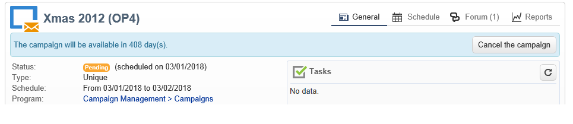

# Forum di discussione{#discussion-forums}

Gli operatori di Adobe Campaign possono utilizzare forum di discussione per condividere informazioni. I seguenti elementi hanno un proprio forum: piani, programmi, campagne, risorse, simulazioni, stock. Ogni operatore ha anche un forum personale. Tutte le discussioni sono pubbliche, anche su forum personali.

Gli operatori possono iscriversi a un forum per ricevere un’e-mail di notifica ogni volta che viene pubblicato un messaggio.

## Accedere a un forum {#accessing-a-forum}

Per visitare il forum di una campagna, un operatore, ecc., accedi al relativo dashboard e fai clic sul collegamento **[!UICONTROL Forum]** nell’angolo in alto a destra. Questo collegamento fornisce anche il numero totale di messaggi presenti nel forum.

## Utilizzare un forum {#using-a-forum}

I messaggi e le relative risposte sono visualizzati in ordine cronologico (dal più recente al più vecchio).

Per visualizzare il contenuto di un messaggio, fai clic sulla relativa intestazione.

**Avvia una nuova discussione**

Per iniziare una nuova discussione, fai clic sul pulsante **[!UICONTROL Add a discussion]** nell&#39;angolo in alto a destra. Viene visualizzata la casella **[!UICONTROL Discussion forum]** (vedere di seguito).

**Invia un messaggio a una discussione esistente**

Per pubblicare un messaggio in una discussione esistente, apri il messaggio a cui vuoi rispondere, quindi fai clic sul collegamento **[!UICONTROL Reply]** nell&#39;angolo in alto a sinistra. Viene visualizzata la casella **[!UICONTROL Discussion forum]** (vedere di seguito).

Quando rispondi a un messaggio, la persona che ha pubblicato il messaggio originale riceverà una notifica.

**Scrivere un messaggio**

Nella casella **[!UICONTROL Discussion forum]**:

1. Inserisci il testo nel campo **[!UICONTROL Message]** e un titolo di discussione nel campo **[!UICONTROL Subject]** .

   

1. Se necessario:

   * Se desideri che qualcuno prenda parte alla discussione che non è iscritto al forum, utilizza il campo **[!UICONTROL Operator to notify]** . L’operatore riceverà un messaggio e-mail di notifica per questo messaggio specifico (non saranno abbonati al forum). Per avvisare diversi operatori, selezionare un gruppo di operatori.
   * Per aggiungere un allegato al messaggio, fai clic su **[!UICONTROL Browse]**. L’allegato verrà incluso anche nell’e-mail di notifica. Gli allegati possono essere inviati solo singolarmente: per inviare diversi file, è necessario comprimerli.

1. Fai clic su **[!UICONTROL Create the message]** per pubblicarlo nel forum.

>[!NOTE]
>
>Una volta pubblicato il messaggio nel forum, non è più possibile modificarlo o eliminarlo.

## Invia al forum personale di un operatore {#posting-to-the-personal-forum-of-an-operator}

Puoi inviare un messaggio al forum di un operatore se, ad esempio, il messaggio non riguarda una campagna specifica ma desideri comunque tenere traccia della conversazione in Adobe Campaign. I forum personali sono pubblici e tutti gli operatori vedranno il tuo messaggio. L’operatore riceve un messaggio ogni volta che qualcuno invia un messaggio al proprio forum personale.

Per accedere al forum di un operatore:

* Se disponi dei diritti necessari per accedere al nodo **[!UICONTROL Administration > Access management > Operators]** dell&#39;esploratore, apri il dashboard dell&#39;operatore desiderato e fai clic sul collegamento **[!UICONTROL Forum]** nell&#39;angolo in alto a destra.
* In caso contrario, trova il nome dell’operatore in Adobe Campaign (tramite un messaggio inviato al forum da questo operatore, un’attività che gli viene assegnata) e fai clic su di esso per accedere al loro dashboard. Puoi anche chiedere all’amministratore di creare una visualizzazione della cartella dell’operatore.

## Iscriviti a un forum {#subscribing-to-a-forum}

La sottoscrizione a un forum consente di seguire le discussioni. Riceverai una notifica e-mail ogni volta che un messaggio viene inviato al forum. Questo messaggio e-mail conterrà il corpo del messaggio ed eventuali allegati. Per rispondere a un messaggio, fai clic su nel corpo dell’e-mail, quindi accedi all’interfaccia web di Adobe Campaign. Con l’abbonamento a un forum, queste informazioni sono visibili a tutti.

* Per abbonarti a un forum, fai clic sul pulsante **[!UICONTROL Follow discussions]** in alto a destra nella sezione sopra l’elenco dei messaggi.

   

   La sezione diventa blu e mostra che sei iscritto al forum.

* Per annullare l’iscrizione a un forum, fai clic sul pulsante **[!UICONTROL Unsubscribe]** .

   

* Il dashboard personale elenca i forum a cui ti sei iscritto. Fai clic sul collegamento **[!UICONTROL Subscription to discussion forums]** per visualizzare l’elenco, quindi fai clic sull’elemento che ti interessa per accedere al relativo forum.

   

   Per ulteriori informazioni sulle dashboard personali, consulta [questa sezione](../../platform/using/access-management-operators.md).

* Per vedere chi è iscritto a un forum, fai clic sul collegamento **[!UICONTROL List of subscribers to this discussion forum]** sopra l’elenco dei messaggi.

   

## Verifica consegna notifiche {#checking-notification-delivery}

Se gli operatori abbonati a un forum non ricevono le notifiche come previsto:

* Verifica che gli indirizzi e-mail siano inseriti nei profili dell’operatore.
* Vai al nodo **[!UICONTROL Administration > Production > Technical workflows > Campaign processes]** e controlla che il flusso di lavoro **[!UICONTROL Jobs in discussion forums]** sia avviato e privo di errori.
* Visualizza i registri di consegna:

   * Nella home page di Adobe Campaign, vai a **[!UICONTROL Campaigns > Navigation > Deliveries]**, quindi apri la consegna **[!UICONTROL Discussion forum notification]**.
   * Nell&#39;elenco delle cartelle, vai su **[!UICONTROL Administration > Production > Objects created automatically > Technical deliveries > Workflow notifications]**, quindi fai clic su **[!UICONTROL Discussion forum notifications]**.
   Nella casella **[!UICONTROL Discussion forum notifications]**, i registri di consegna si trovano nella scheda **[!UICONTROL Edit > Delivery]** . È inoltre possibile visualizzare le schede **[!UICONTROL Tracking > Log]** e **[!UICONTROL Exclusion causes]** .
