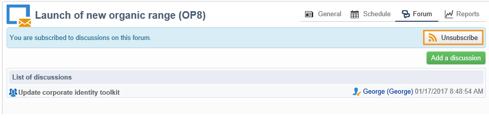

# Forum di discussione{#discussion-forums}

Gli operatori Adobe Campaign possono utilizzare i forum di discussione per condividere informazioni. Ognuno dei seguenti elementi ha un proprio forum: piani, programmi, campagne, risorse, simulazioni, stock. Ogni operatore ha anche un forum personale. Tutte le discussioni sono pubbliche, anche sui forum personali.

Gli operatori possono iscriversi a un forum per ricevere un’e-mail di notifica ogni volta che viene pubblicato un messaggio.

## Accedere a un forum {#accessing-a-forum}

Per visitare il forum di una campagna, un operatore e così via, vai alla dashboard e fai clic sul collegamento **[!UICONTROL Forum]** nell&#39;angolo in alto a destra. Questo collegamento ti fornisce anche il numero totale di messaggi nel forum.

## Usa un forum {#using-a-forum}

I messaggi e le relative risposte vengono visualizzati in ordine cronologico (dal più recente al più recente).

Per visualizzare il contenuto di un messaggio, fai clic sulla relativa intestazione.

**Avvia una nuova discussione**

Per avviare una nuova discussione, fare clic sul pulsante **[!UICONTROL Add a discussion]** nell&#39;angolo superiore destro. Viene visualizzata la casella **[!UICONTROL Discussion forum]** (vedere di seguito).

**Pubblica un messaggio in una discussione esistente**

Per inviare un messaggio a una discussione esistente, apri il messaggio a cui desideri rispondere, quindi fai clic sul collegamento **[!UICONTROL Reply]** nell&#39;angolo in alto a sinistra. Viene visualizzata la casella **[!UICONTROL Discussion forum]** (vedere di seguito).

Quando rispondi a un messaggio, la persona che ha pubblicato il messaggio originale riceverà una notifica.

**Scrivi un messaggio**

Nella casella **[!UICONTROL Discussion forum]**:

1. Immettere il testo nel campo **[!UICONTROL Message]** e un titolo di discussione nel campo **[!UICONTROL Subject]**.

   

1. Se necessario:

   * Se si desidera che qualcuno partecipi alla discussione che non è iscritto al forum, utilizzare il campo **[!UICONTROL Operator to notify]**. L’operatore riceverà un’e-mail di notifica per questo messaggio specifico (non si iscriverà al forum). Per notificare più operatori, seleziona un gruppo di operatori.
   * Per aggiungere un allegato al messaggio, scegliere **[!UICONTROL Browse]**. L’allegato verrà incluso anche nell’e-mail di notifica. Gli allegati possono essere inviati solo singolarmente: per inviare diversi file, devi comprimerli.

1. Fai clic su **[!UICONTROL Create the message]** per pubblicarlo nel forum.

>[!NOTE]
>
>Una volta inserito nel forum, il messaggio non può più essere modificato o eliminato.

## Pubblica nel forum personale di un operatore {#posting-to-the-personal-forum-of-an-operator}

Puoi pubblicare un messaggio nel forum di un operatore se, ad esempio, il messaggio non riguarda una campagna specifica ma desideri comunque tenere traccia della conversazione in Adobe Campaign. I forum personali sono pubblici e tutti gli operatori visualizzeranno il tuo messaggio. L&#39;operatore riceve un messaggio ogni volta che qualcuno pubblica sul proprio forum personale.

Per accedere al forum di un operatore:

* Se disponi dei diritti necessari per accedere al nodo **[!UICONTROL Administration > Access management > Operators]** dell&#39;Explorer, apri il dashboard dell&#39;operatore desiderato e fai clic sul collegamento **[!UICONTROL Forum]** nell&#39;angolo in alto a destra.
* In caso contrario, individua il nome dell’operatore in Adobe Campaign (tramite un messaggio inviato al forum da questo operatore, a cui viene assegnata un’attività) e fai clic su di esso per accedere al dashboard. È inoltre possibile richiedere all&#39;amministratore di creare una visualizzazione della cartella dell&#39;operatore.

## Iscriviti a un forum {#subscribing-to-a-forum}

La sottoscrizione a un forum consente di seguire le discussioni. Riceverai una notifica e-mail ogni volta che un messaggio viene pubblicato sul forum. Questo messaggio e-mail conterrà il corpo del messaggio ed eventuali allegati. Per rispondere a un messaggio, fai clic sul corpo dell’e-mail, quindi accedi all’interfaccia web di Adobe Campaign. Quando ti iscrivi a un forum, queste informazioni sono visibili a tutti.

* Per iscriversi a un forum, fare clic sul pulsante **[!UICONTROL Follow discussions]** nella sezione superiore destra sopra l&#39;elenco dei messaggi.

  

  La sezione diventa blu e mostra che hai effettuato l’iscrizione al forum.

* Per annullare l&#39;iscrizione a un forum, fare clic sul pulsante **[!UICONTROL Unsubscribe]**.

  

* Nel dashboard personale sono elencati i forum a cui sei abbonato. Fai clic sul collegamento **[!UICONTROL Subscription to discussion forums]** per visualizzare l&#39;elenco, quindi fai clic sull&#39;elemento che ti interessa per accedere al relativo forum.

  

  Per ulteriori informazioni sui dashboard personali, consulta [questa sezione](../../platform/using/access-management-operators.md).

* Per visualizzare gli utenti iscritti a un forum, fare clic sul collegamento **[!UICONTROL List of subscribers to this discussion forum]** sopra l&#39;elenco dei messaggi.

  

## Verifica consegna notifiche {#checking-notification-delivery}

Se gli operatori abbonati a un forum non ricevono le notifiche previste:

* Verifica che gli indirizzi e-mail vengano immessi nei profili dell’operatore.
* Andare al nodo **[!UICONTROL Administration > Production > Technical workflows > Campaign processes]** e verificare che il flusso di lavoro **[!UICONTROL Jobs in discussion forums]** sia avviato e privo di errori.
* Visualizza i registri di consegna:

   * Nella home page di Adobe Campaign, vai a **[!UICONTROL Campaigns > Navigation > Deliveries]**, quindi apri la consegna **[!UICONTROL Discussion forum notification]**.
   * In Esplora, vai a **[!UICONTROL Administration > Production > Objects created automatically > Technical deliveries > Workflow notifications]**, quindi fai clic su **[!UICONTROL Discussion forum notifications]**.

  Nella casella **[!UICONTROL Discussion forum notifications]**, i registri di consegna si trovano nella scheda **[!UICONTROL Edit > Delivery]**. È inoltre possibile visualizzare le schede **[!UICONTROL Tracking > Log]** e **[!UICONTROL Exclusion causes]**.
