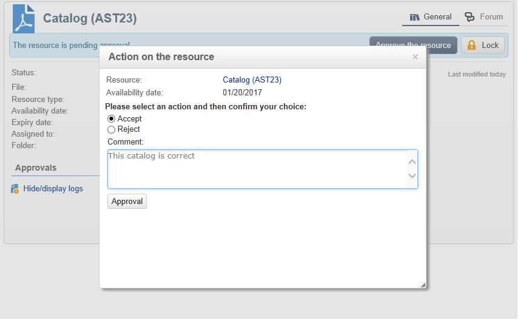
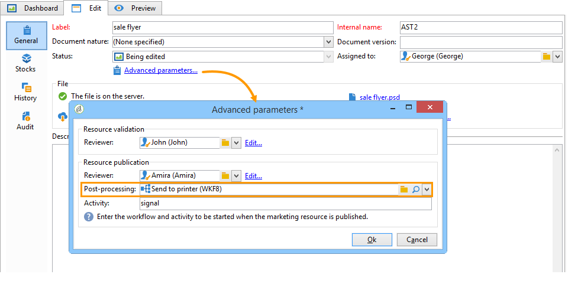
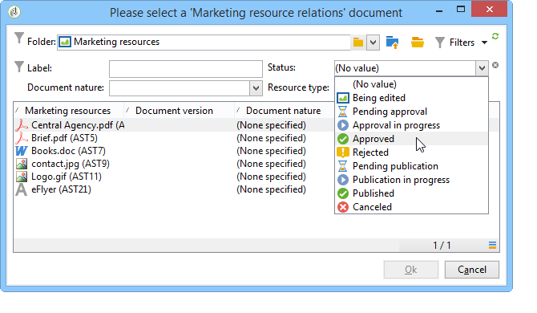

# Gestire le risorse di marketing{#managing-marketing-resources}

Adobe Campaign consente di gestire e tenere traccia delle risorse di marketing coinvolte nel ciclo di vita della campagna. Queste risorse di marketing possono essere costituite da un opuscolo, un aiuto visivo o qualsiasi altro mezzo di comunicazione che coinvolga più operatori.

Per ogni risorsa marketing gestita tramite Adobe Campaign, puoi tracciarne lo stato e la cronologia in qualsiasi momento e visualizzare la versione corrente.

## Aggiunta di una risorsa marketing {#adding-a-marketing-resource}

L&#39;accesso alle risorse di marketing avviene tramite la scheda **[!UICONTROL Campaigns]**.

Per aggiungere una risorsa, fare clic sul pulsante **[!UICONTROL Create]**.

Per rendere disponibile una risorsa sul server Adobe Campaign, devi aggiungere la risorsa desiderata trascinandola e rilasciandola nell’area centrale dell’editor. È inoltre possibile fare clic sul collegamento **[!UICONTROL Upload file to server...]**.

Un messaggio di conferma ti consente di avviare il caricamento.

Al termine del caricamento, la risorsa viene aggiunta all’elenco delle risorse disponibili. È accessibile agli operatori di Adobe Campaign. Possono visualizzarlo (tramite la scheda **[!UICONTROL Preview]**), crearne una copia per modificarlo o aggiornare il file sul server (utilizzando la scheda **[!UICONTROL Edit]**).

Fare clic sulla scheda **[!UICONTROL General]** per selezionare gli operatori o i gruppi di operatori responsabili del monitoraggio, del tracciamento e dell&#39;approvazione di questa risorsa. La selezione del revisore viene eseguita tramite il collegamento **[!UICONTROL Advanced parameters]**.

* L’operatore a cui è assegnata la risorsa è responsabile del tracciamento.
* L’operatore di approvazione è responsabile dell’approvazione della risorsa di marketing. Verranno avvisati all’avvio del processo di convalida delle risorse.

  Se non è selezionato alcun revisore, la risorsa **[!UICONTROL cannot be]** è soggetta ad approvazione.

* Se necessario, è anche possibile specificare un correttore di bozze.

Puoi specificare una data di disponibilità (indicativa) per la risorsa. Oltre questa data, verrà visualizzato con lo stato **[!UICONTROL Late]**.

## Lavoro collaborativo sulle risorse {#collaborative-work-on-resources}

Puoi modificare e aggiornare una risorsa di marketing e, se necessario, informarne altri operatori Adobe Campaign. Puoi eseguire le seguenti azioni:

* Scarica la risorsa localmente per modificarla.
* Aggiornare il file sul server e renderlo accessibile ad altri operatori.
* Blocca una risorsa per impedirne la modifica da parte di altri operatori.

>[!NOTE]
>
>La scheda **[!UICONTROL History]** contiene il registro di download e aggiornamento per la risorsa. Il pulsante **[!UICONTROL Details]** consente di visualizzare la versione selezionata.

### Blocco/sblocco di una risorsa {#locking-unlocking-a-resource}

Una volta create, le risorse sono disponibili nel dashboard delle risorse di marketing e gli operatori possono modificarle.

Quando un operatore desidera lavorare su una risorsa, è preferibile bloccarla prima di iniziare il lavoro, per evitare che altri operatori la modifichino contemporaneamente. La risorsa viene quindi riservata e rimane accessibile, ma non può essere pubblicata o aggiornata sul server da un altro operatore.

Un messaggio speciale avvisa gli operatori che tentano di accedervi:

La scheda **[!UICONTROL Tracking]** indica il nome dell&#39;operatore che ha bloccato la risorsa e la data di aggiornamento pianificata.

Per bloccare una risorsa, è necessario fare clic sulla risorsa seguita dal pulsante **[!UICONTROL Lock]** nel dashboard delle risorse.

È possibile indicare la data di ritorno pianificata nella scheda **[!UICONTROL Tracking]** della risorsa.

Queste informazioni ti consentono di informare altri operatori Adobe Campaign della data in cui la risorsa verrà sbloccata.

Una volta aggiornata, la risorsa viene automaticamente sbloccata e resa nuovamente disponibile a tutti gli operatori.

Se necessario, è anche possibile sbloccarla manualmente dal dashboard.

>[!NOTE]
>
>Solo l&#39;operatore che ha bloccato la risorsa e gli operatori con diritti di amministratore sono autorizzati a sbloccare una risorsa.

### Forum di discussione {#discussion-forums}

Per ogni risorsa, la scheda **[!UICONTROL Forum]** consente ai partecipanti di scambiarsi informazioni.

[Forum di discussione](../../mrm/using/discussion-forums.md) spiega come funzionano i forum di discussione in Adobe Campaign.

## Ciclo di vita di una risorsa di marketing {#life-cycle-of-a-marketing-resource}

Al momento della creazione della risorsa, gli operatori Adobe Campaign sono incaricati di progettarla, correggerla, approvarla e pubblicarla. È possibile determinare una durata per queste campagne.

La scheda **[!UICONTROL Tracking]** consente di monitorare tutte le azioni eseguite sulla risorsa: approvazioni, rifiuti di approvazione, commenti correlati o pubblicazioni.

Nella scheda **[!UICONTROL History]** vengono visualizzati i trasferimenti di file eseguiti per questa risorsa.

### Processo di approvazione {#approval-process}

La data di disponibilità prevista viene visualizzata nei dettagli della risorsa, se specificata nella scheda **[!UICONTROL Tracking]**. Una volta raggiunta questa data, è possibile eseguire il processo di approvazione utilizzando il pulsante **[!UICONTROL Submit for approval]** nel dashboard delle risorse. Lo stato della risorsa cambia quindi in **[!UICONTROL Approval in progress]**.

Una risorsa può essere approvata tramite il pulsante **[!UICONTROL Approve resource]** nel dashboard.

Gli operatori autorizzati possono quindi accettare o rifiutare l’approvazione. Questa azione è possibile tramite il messaggio e-mail inviato (facendo clic sul collegamento nel messaggio di notifica) o tramite la console (facendo clic sul pulsante **[!UICONTROL Approve]** ).

La finestra di approvazione consente di inserire un commento.

La scheda **[!UICONTROL Tracking]** consente a tutti gli operatori di tenere traccia delle varie fasi del processo di approvazione.

>[!NOTE]
>
>Oltre al revisore specificato per ogni risorsa di marketing, gli operatori con diritti di amministratore e il responsabile risorse sono autorizzati ad approvare una risorsa di marketing.

### Pubblicazione di una risorsa {#publishing-a-resource}

Una volta approvata, la risorsa marketing deve essere pubblicata. Il processo di pubblicazione deve essere soggetto a un&#39;implementazione specifica in base ai requisiti aziendali. Ciò significa che le risorse possono essere pubblicate su una extranet o su qualsiasi altro server, che è possibile inviare informazioni specifiche a un fornitore di servizi esterno e così via.

Per pubblicare una risorsa, fai clic sul pulsante **[!UICONTROL Publish]** nell&#39;area di modifica del dashboard delle risorse di marketing.

Puoi anche automatizzare la pubblicazione di una risorsa tramite un flusso di lavoro.

Pubblicare una risorsa significa renderla disponibile per l’uso (ad esempio, da un’altra attività). La pubblicazione varia a seconda della natura della risorsa: per un volantino, la pubblicazione può significare l&#39;invio del file a una stampante, per un&#39;agenzia web, può significare la pubblicazione su un sito web, ecc.

Per pubblicare Adobe Campaign, devi creare un flusso di lavoro adeguato e collegarlo alla risorsa. A questo scopo, apri la casella **[!UICONTROL Advanced settings]** della risorsa, quindi seleziona il flusso di lavoro desiderato nel campo **[!UICONTROL Post-processing]**.

Il flusso di lavoro verrà eseguito:

* Quando il revisore fa clic sul collegamento **[!UICONTROL Publish resource]** o, se non è stato definito alcun revisore, la persona responsabile della risorsa.
* Se la risorsa è gestita tramite un&#39;attività di creazione di risorse di marketing, verrà eseguita quando l&#39;attività è impostata su **[!UICONTROL Finished]**, purché la casella **[!UICONTROL Publish the marketing resource]** sia selezionata nell&#39;attività (fare riferimento a [Attività di creazione di risorse di marketing](../../mrm/using/creating-and-managing-tasks.md#marketing-resource-creation-task))

Se un flusso di lavoro non viene avviato immediatamente (ad esempio se viene interrotto), lo stato della risorsa cambia in **[!UICONTROL Pending publication]**. Una volta avviato il flusso di lavoro, lo stato della risorsa cambia in **[!UICONTROL Published]**. Questo stato non tiene conto di possibili errori nel processo di pubblicazione. Controlla lo stato del flusso di lavoro per assicurarti che sia eseguito correttamente.

## Collegamento di una risorsa a una campagna {#linking-a-resource-to-a-campaign}

### Riferimento a una risorsa marketing {#referencing-a-marketing-resource}

Le risorse di marketing possono essere associate alle campagne, purché questa funzione sia stata selezionata nel modello della campagna.

>[!NOTE]
>
>Per informazioni dettagliate su come creare e configurare modelli di campagna, consulta [Modelli di campagna](../../campaign/using/marketing-campaign-templates.md#campaign-templates).

Fai clic sulla scheda **[!UICONTROL Documents > Resources]** nel dashboard della campagna, quindi fai clic su **[!UICONTROL Add]** per selezionare la risorsa interessata.

Puoi filtrare le risorse per stato, natura o tipo, oppure applicare un filtro personalizzato.

Fare clic su **[!UICONTROL OK]** per aggiungere la risorsa all&#39;elenco delle risorse di marketing a cui si fa riferimento per questa campagna.

Il pulsante **[!UICONTROL Details]** consente di modificarlo e visualizzarlo.

Le risorse aggiunte vengono visualizzate nel dashboard. Possono anche essere modificati qui.

### Aggiunta di una risorsa marketing a una struttura di consegna {#adding-a-marketing-resource-to-a-delivery-outline}

Le risorse di marketing possono essere associate alle consegne tramite i profili di consegna.

>[!NOTE]
>
>Per ulteriori informazioni sui profili di consegna, fare riferimento a [Associazione e strutturazione delle risorse collegate tramite un profilo di consegna](../../campaign/using/marketing-campaign-deliveries.md#associating-and-structuring-resources-linked-via-a-delivery-outline).

## Gestione delle scorte {#stock-management}

È possibile associare una risorsa marketing a uno o più titoli per gestire le forniture e visualizzare un avviso nel dashboard in caso di scorte insufficienti.

>[!NOTE]
>
>Per ulteriori informazioni sulla gestione azionaria in Adobe Campaign, consulta [Gestione azionaria](../../campaign/using/providers-stocks-and-budgets.md#stock-management).

Per associare una risorsa marketing a un magazzino, modificare la mappa del magazzino e modificare o creare un magazzino. Aggiungere una linea magazzino e selezionare la risorsa marketing corrispondente.

Se necessario, è possibile modificare la risorsa selezionata tramite l&#39;icona **[!UICONTROL Edit the link]** (lente di ingrandimento) situata a destra della risorsa dopo averla selezionata.

Specificare il materiale iniziale e il materiale di allerta, quindi salvare.

Le scorte sono indicate nei dettagli della risorsa.

Quando le scorte sono insufficienti, viene inviato un avviso agli operatori interessati.

## Funzioni avanzate {#advanced-functions}

La dashboard delle risorse di marketing consente di eseguire i tipi di operazioni abituali: aggiungi, modifica, blocca/sblocca, approva, pubblica. Puoi creare altri tipi di risorse di marketing e accedere a funzionalità avanzate tramite la struttura Adobe Campaign. A tale scopo, fare clic su **[!UICONTROL Explorer]** nella home page di Adobe Campaign.

Per impostazione predefinita, le risorse di marketing sono archiviate nel nodo **[!UICONTROL MRM > Marketing resources]** della struttura.

Da questa vista puoi aggiungere le seguenti risorse:

* File
* HTML
* Testo
* URL
