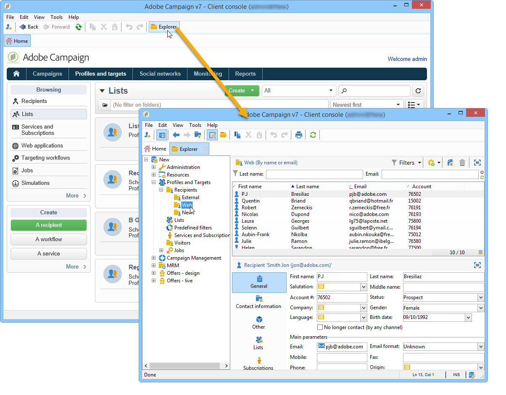

# Guida introduttiva ai profili{#about-profiles}

I profili sono centralizzati nel database di Adobe Campaign. Esistono molti possibili meccanismi per l’acquisizione di profili e la creazione di questo database: raccolta on-line tramite moduli web, importazione manuale o automatica di file di testo, replica con database aziendali o altri sistemi di informazioni. Con Adobe Campaign, puoi incorporare la cronologia di marketing, le informazioni di acquisto, le preferenze, i dati CRM ed eventuali dati PI rilevanti in una vista consolidata per analizzare e intraprendere azioni.

&quot;**Profilo**&quot; significa un record di informazioni (ad esempio: un record nella tabella nmsRecipient o una tabella esterna contenente un ID cookie, un ID cliente, un identificatore mobile o altre informazioni rilevanti per un particolare canale) che rappresenta un cliente finale, potenziale o lead.

In Adobe Campaign, i destinatari sono i profili predefiniti oggetto di targeting per l’invio di consegne (e-mail, SMS, ecc.). I dati dei destinatari memorizzati nel database ti consentono di filtrare il target che riceverà una determinata consegna e di aggiungere dati di personalizzazione nel contenuto della consegna. Nel database sono presenti altri tipi di profili. Essi sono progettati per diversi utilizzi. Ad esempio, i profili di seed vengono creati per testare le consegne prima che vengano inviate al target finale.

 [Comprendere il concetto di profili nel video](#create-profiles-video)

## Tipi di profilo {#profile-types}

Adobe Campaign consente di gestire i profili durante l’intero ciclo di vita: creazione, importazione, targeting, tracciamento delle azioni, aggiornamenti, ecc.

Ogni profilo corrisponde a una voce del database. Contengono tutte le informazioni necessarie per il targeting, la qualifica e il tracciamento dei singoli utenti.

I profili possono essere identificati in base allo spazio di archiviazione. Ciò significa che un profilo può corrispondere a: un destinatario, un visitatore, un operatore, un abbonato, un potenziale, ecc.

## Profili destinatario {#recipient-profiles}

I destinatari della consegna vengono memorizzati nel database come profili contenenti le informazioni ad essi collegate: cognome, nome, indirizzo, abbonamenti, consegne, ecc. Quando crei campagne, puoi definire il target delle consegne per una selezione di profili nella base in base a criteri semplici o avanzati.

Puoi anche creare campagne rivolte ai destinatari i cui profili sono memorizzati non nel database, ma in file. Queste sono note come consegne &quot;esterne&quot;. Per ulteriori informazioni su questo tipo di consegna, consulta [questa pagina](../../delivery/using/steps-defining-the-target-population.md#selecting-external-recipients).

I metodi principali per creare i profili dei destinatari sono i seguenti:

* ingresso diretto nelle schermate dell&#39;interfaccia grafica,
* importazione di elenchi di destinatari,
* raccolta on-line tramite moduli web.

>[!NOTE]
>
>Per informazioni sulle modalità di importazione di file e moduli web, consulta [Importazioni ed esportazioni generiche](../../platform/using/get-started-data-import-export.md).

## Profili e destinazioni {#profiles-and-targets}

Il collegamento **[!UICONTROL Profiles and targets]** ti consente di visualizzare i destinatari memorizzati nel database Adobe Campaign. Puoi creare un nuovo destinatario, modificare un destinatario esistente e accedere al suo profilo. Per ulteriori informazioni, consulta [questa pagina](../../platform/using/editing-a-profile.md).

Consente inoltre di accedere a:

* elenchi - [Ulteriori informazioni](../../platform/using/creating-and-managing-lists.md)
* servizi di abbonamento - [Ulteriori informazioni](../../delivery/using/managing-subscriptions.md)
* applicazioni web - [Ulteriori informazioni](../../web/using/about-web-applications.md)
* importazioni ed esportazioni (lavori) - [Ulteriori informazioni](../../platform/using/about-generic-imports-exports.md)
* flussi di lavoro di targeting - [Ulteriori informazioni](../../workflow/using/building-a-workflow.md#implementation-steps-)

La pagina dei destinatari ti consente di eseguire operazioni frequenti sui profili: modifiche, aggiornamenti, aggiunte, eliminazioni, ordinamenti.

Per manipolazioni più avanzate dei profili, devi modificare la struttura ad albero di Adobe Campaign. A questo scopo, fai clic sul collegamento **[!UICONTROL Explorer]** nella home page di Adobe Campaign.

Per impostazione predefinita, i destinatari vengono memorizzati nel nodo **[!UICONTROL Profiles and Targets > Recipients]** della struttura. Puoi creare i destinatari da questa visualizzazione, nonché:

* ordina e filtra i profili del database - [Ulteriori informazioni](../../platform/using/filtering-options.md)
* sposta, copia o elimina profili dal database - [Ulteriori informazioni](../../platform/using/managing-profiles.md),
* aggiorna profili - [Ulteriori informazioni](../../platform/using/updating-data.md)
* esporta i destinatari - [Ulteriori informazioni](../../platform/using/exporting-and-importing-profiles.md)
* crea gruppi di destinatari - [Ulteriori informazioni](../../platform/using/creating-and-managing-lists.md)

Per accedere a funzionalità e configurazioni avanzate, fai clic sull’icona **[!UICONTROL Explorer]** .

Il layout generale di Adobe Campaign Explorer è presentato in [questa pagina](../../platform/using/adobe-campaign-explorer.md).

>[!NOTE]
>
>Puoi anche visualizzare una visualizzazione avanzata di questo elenco dalla struttura di Adobe Campaign facendo clic sul collegamento **[!UICONTROL Profiles and targets > Recipients]** . La visualizzazione dell&#39;elenco può essere configurata in base alle tue esigenze. Puoi aggiungere o eliminare colonne, definire l’ordine delle colonne, ordinare dati e così via. La configurazione della visualizzazione dell&#39;elenco è descritta in [questa pagina](../../platform/using/adobe-campaign-ui-lists.md).
>
>Puoi anche definire le visualizzazioni dei destinatari. Per ulteriori informazioni su questa funzionalità, consulta [questa sezione](../../platform/using/access-management-folders.md).

## Profili attivi {#active-profiles}

I profili attivi sono i profili conteggiati a scopo di fatturazione.

Il conteggio dei profili attivi è disponibile solo per **istanze di marketing**. Non è disponibile per le istanze di esecuzione, ovvero le istanze MID (mid sourcing) e RT (Message Center / Real-time messaging [Centro messaggi/Messaggistica in tempo reale]).

Se sei in hosting su AWS, puoi anche monitorare il numero di profili attivi utilizzati sulle istanze direttamente dal Pannello di controllo Campaign. Per ulteriori informazioni, consulta la [documentazione del Pannello di controllo Campaign](https://docs.adobe.com/content/help/en/control-panel/using/performance-monitoring/active-profiles-monitoring.html).

>[!NOTE]
>
>Il Pannello di controllo Campaign è accessibile a tutti gli utenti amministratori. I passaggi per concedere all’amministratore l’accesso a un utente sono descritti in [questa sezione](https://experienceleague.adobe.com/docs/control-panel/using/discover-control-panel/managing-permissions.html?lang=it#discover-control-panel).
>
>Tieni presente che l’istanza deve essere ospitata su AWS e aggiornata con la build [Gold Standard](../../rn/using/gs-overview.md) più recente o con la build [GA più recente (21.1)](../../rn/using/latest-release.md). Scopri come controllare la versione in [questa sezione](../../platform/using/launching-adobe-campaign.md#getting-your-campaign-version). Per verificare se l&#39;istanza è ospitata su AWS, segui i passaggi descritti in [questa pagina](https://experienceleague.adobe.com/docs/control-panel/using/faq.html).

La fatturazione riguarda solo i profili che sono **attivi**. Un profilo è considerato attivo se è stato eseguito il targeting del profilo o se è stato comunicato con esso negli ultimi 12 mesi tramite qualsiasi canale.

I profili esclusi durante la preparazione della consegna (regole di tipologia, quarantena) non vengono presi in considerazione. Un profilo per il quale sono state eseguite le destinazioni da più consegne verrà conteggiato una sola volta.

>[!NOTE]
>
>I canali Facebook e Twitter non vengono presi in considerazione.

Puoi avere una panoramica del menu **[!UICONTROL Number of active profiles]** di Campaign Standard **[!UICONTROL Administration > Campaign Management > Customer metrics]**. Il conteggio effettivo viene eseguito dal **[!UICONTROL Number of active billing profiles]** (**[!UICONTROL billingActiveContactCount]**) [flusso di lavoro tecnico](../../workflow/using/about-technical-workflows.md), che viene eseguito ogni giorno e aggiunge i nuovi dati al rapporto esistente per il periodo corrente nel menu **[!UICONTROL Customer metrics]**. Ogni periodo dura 12 mesi.

## Video tutorial {#create-profiles-video}

Scopri come accedere ai dati di profilo, ordinare e filtrare i profili e come crearli e gestirli manualmente.

Questo video spiega anche la conformità di Adobe Campaign Classic alle normative generali sulla protezione dei dati.

>[!VIDEO](https://video.tv.adobe.com/v/35611?quality=12)

Sono disponibili ulteriori video dimostrativi su Campaign Classic [qui](https://experienceleague.adobe.com/docs/campaign-classic-learn/tutorials/overview.html?lang=it).

**Vedi anche**

* [Gestione della privacy in Campaign](https://helpx.adobe.com/it/campaign/kb/acc-privacy.html)

* [Definire la popolazione target](../../delivery/using/define-the-right-audience.md)

* [Creazione di query e segmenti di dati nei flussi di lavoro](../../workflow/using/targeting-data.md)

* [Seleziona mappatura destinazione](../../delivery/using/selecting-a-target-mapping.md)

* [Definire il pubblico - best practice](../../delivery/using/define-the-right-audience.md)
