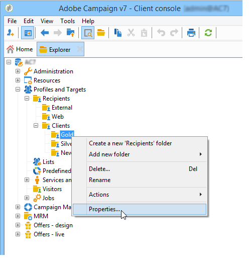

# Gestire l’accesso alle cartelle{#folder-access-management}

A ogni cartella della struttura di esplorazione sono associati diritti di accesso di lettura, scrittura ed eliminazione. Per accedere a un file, un operatore o un gruppo di operatori deve disporre almeno dell&#39;accesso in lettura.

>[!NOTE]
>
>Per ulteriori informazioni sulle autorizzazioni per le cartelle, consulta la [documentazione di Campaign v8](https://experienceleague.adobe.com/it/docs/campaign/campaign-v8/admin/permissions/folder-permissions){target=_blank}.

## Cartelle e visualizzazioni {#folders-and-views}

### Che cos’è una cartella {#about-folders}

Le cartelle sono nodi nella struttura Adobe Campaign. Questi nodi vengono creati facendo clic con il pulsante destro del mouse sulla struttura tramite il menu **[!UICONTROL Add new folder]**. Per impostazione predefinita, il primo menu consente di aggiungere la cartella corrispondente al contesto corrente.

È possibile personalizzare la struttura di navigazione di Esplora risorse. Scopri i passaggi di configurazione e le best practice [in questa sezione](adobe-campaign-workspace.md).

### Che cos’è una visualizzazione {#about-views}

Inoltre, puoi creare viste per limitare l’accesso ai dati e organizzare il contenuto della struttura in base alle tue esigenze. È quindi possibile assegnare i diritti alle visualizzazioni.

Una visualizzazione è una cartella in cui vengono visualizzati i record fisicamente archiviati in una o più cartelle dello stesso tipo. Ad esempio, se crei una cartella Campaign che è una visualizzazione, per impostazione predefinita vengono visualizzate tutte le campagne presenti nel database, a prescindere dalla loro origine. Questi dati possono quindi essere filtrati.

Quando si converte una cartella in una visualizzazione, tutti i dati corrispondenti al tipo di cartella presente nel database vengono visualizzati nella visualizzazione, indipendentemente dalla cartella in cui viene salvata. Puoi quindi filtrarlo per limitare l’elenco dei dati visualizzati.

>[!IMPORTANT]
>
>Le visualizzazioni contengono dati e vi consentono di accedervi, ma i dati non vengono fisicamente memorizzati nella cartella delle visualizzazioni. L’operatore deve disporre dei diritti appropriati per l’azione desiderata nelle cartelle delle origini dati (almeno accesso in lettura).
>
>Per concedere l’accesso a una visualizzazione senza dare accesso alla relativa cartella di origine, è sufficiente non concedere l’accesso in lettura sul nodo principale della cartella di origine.

Per distinguere le viste dalle cartelle, il nome di ogni vista viene visualizzato in un colore diverso (ciano scuro).

### Aggiungere cartelle e creare visualizzazioni {#adding-folders-and-creating-views}

>[!IMPORTANT]
>
>Le cartelle pronte all’uso non devono essere contrassegnate come viste.

Nell’esempio seguente, creeremo nuove cartelle per visualizzare dati specifici:

1. Creare una nuova cartella di tipo **[!UICONTROL Deliveries]** e denominarla **Consegne Francia**.
1. Fare clic con il pulsante destro del mouse su questa cartella e selezionare **[!UICONTROL Properties...]**.

   

1. Nella scheda **[!UICONTROL Restriction]**, selezionare **[!UICONTROL This folder is a view]**. Verranno quindi visualizzate tutte le consegne nel database.

   

1. Definisci i criteri del filtro di consegna dall’editor delle query nella sezione centrale della finestra: vengono quindi visualizzate le campagne corrispondenti al filtro definito.

   >[!NOTE]
   >
   >L&#39;editor delle query è presentato in [questa sezione](../../platform/using/about-queries-in-campaign.md).

   Con le seguenti condizioni di filtro:

Nella vista vengono visualizzate le seguenti consegne:

>[!NOTE]
>
>Durante la gestione di [eventi di messaggistica transazionale](../../message-center/using/about-transactional-messaging.md), le cartelle **[!UICONTROL Real time events]** o **[!UICONTROL Batch events]** non devono essere impostate come viste nelle istanze di esecuzione, in quanto ciò potrebbe causare problemi di diritti di accesso. Per ulteriori informazioni sulla raccolta eventi, vedere [questa sezione](../../message-center/using/about-event-processing.md#event-collection).

<!--
## Permissions on a folder

### Edit permissions on a folder {#edit-permissions-on-a-folder}

To edit permissions on a specific folder of the tree, follow the steps below:

1. Right-click on the folder and select **[!UICONTROL Properties...]**.

   

1. Click the **[!UICONTROL Security]** tab to view authorizations on this folder.

   

### Modify permissions {#modify-permissions}

To modify permissions, you can:

* **Replace a group or an operator**. To do this, click one of the groups (or operators) with rights to the folder, and select a new group (or a new operator) from the drop-down list:

  

* **Authorize a group or an operator**. To do this, click the **[!UICONTROL Add]** button and select the group or operator to which you want to assign authorizations for this folder.
* **Forbid a group or an operator**. To do this, click **[!UICONTROL Delete]** and select the group or operator from which you want to remove authorization for this folder.
* **Select the rights assigned to a group or an operator**. To do this, click the group or operator concerned, then select the access rights you want to grant and deselect the others.

  

### Propagate permissions {#propagate-permissions}

You can propagate authorizations and access rights. To do this, select the **[!UICONTROL Propagate]** option in the folder properties.

The authorizations defined in this window will then be applied to all the sub-folders of the current node. You can then overload these authorizations for each of the sub-folders.

>[!NOTE]
>
>Clearing this option for a folder does not automatically clear it for the sub-folders. You must clear it explicitly for each of the sub-folders.

### Grant access to all operators {#grant-access-to-all-operators}

In the **[!UICONTROL Security]** tab, if the **[!UICONTROL System folder]** option is selected, all operators will have access to this data, regardless of their rights. If this option is cleared, you must explicitly add the operator (or their group) to the list of authorizations in order for them to have access.

-->