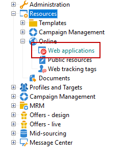

# Gestire l’accesso alle cartelle{#folder-access-management}

A ogni cartella della struttura di navigazione di Esplora risorse sono associati diritti di accesso di lettura, scrittura ed eliminazione. Per accedere a un file, un operatore o un gruppo di operatori deve avere almeno accesso in lettura ad esso.

## Cartelle e viste {#folders-and-views}

### Cartella {#about-folders}

Le cartelle sono nodi nella struttura di Adobe Campaign. Questi nodi vengono creati facendo clic con il pulsante destro del mouse sulla struttura tramite il **[!UICONTROL Add new folder]** menu. Per impostazione predefinita, il primo menu consente di aggiungere la cartella corrispondente al contesto corrente.

È possibile personalizzare la struttura di navigazione di Esplora risorse. Informazioni sui passaggi di configurazione e sulle best practice [in questa sezione](adobe-campaign-workspace.md).

### Visualizzazione {#about-views}

Inoltre, puoi creare visualizzazioni per limitare l’accesso ai dati e organizzare il contenuto della struttura in base alle tue esigenze. Puoi quindi assegnare i diritti alle visualizzazioni.

Una visualizzazione è una cartella che visualizza i record fisicamente memorizzati in una o più cartelle dello stesso tipo. Ad esempio, se crei una cartella Campaign che è una visualizzazione, per impostazione predefinita vengono visualizzate tutte le campagne presenti nel database, indipendentemente dalla loro origine. Questi dati possono quindi essere filtrati.

Quando si converte una cartella in una visualizzazione, vengono visualizzati tutti i dati corrispondenti al tipo di cartella presente nel database, indipendentemente dalla cartella in cui viene salvata. Puoi quindi filtrarlo per limitare l’elenco dei dati visualizzati.

>[!IMPORTANT]
>
>Le visualizzazioni contengono dati e vi consentono di accedervi, ma i dati non vengono memorizzati fisicamente nella cartella di visualizzazione. L’operatore deve disporre dei diritti appropriati per l’azione desiderata nelle cartelle dell’origine dati (almeno accesso in lettura).
>
>Per consentire l&#39;accesso a una visualizzazione senza consentire l&#39;accesso alla relativa cartella di origine, è sufficiente non consentire l&#39;accesso in lettura sul nodo padre della cartella di origine.

Per distinguere le visualizzazioni dalle cartelle, il nome di ciascuna visualizzazione viene visualizzato in un colore diverso (ciano scuro).

### Aggiungi cartelle e crea visualizzazioni {#adding-folders-and-creating-views}

Nell’esempio seguente, creeremo nuove cartelle per visualizzare dati specifici:

1. Crea un nuovo **[!UICONTROL Deliveries]** digitare la cartella e denominarla **Consegne Francia**.
1. Fai clic con il pulsante destro del mouse su questa cartella e seleziona **[!UICONTROL Properties...]**.

   

1. Nella scheda **[!UICONTROL Restriction]**, seleziona **[!UICONTROL This folder is a view]**. Verranno quindi visualizzate tutte le consegne nel database.

   

1. Definisci i criteri del filtro di consegna dall’editor delle query nella sezione centrale della finestra: vengono quindi visualizzate le campagne corrispondenti al filtro definito.

   >[!NOTE]
   >
   >L’editor delle query è presentato in [questa sezione](../../platform/using/about-queries-in-campaign.md).

   Con le seguenti condizioni di filtro:

Nella visualizzazione verranno visualizzate le seguenti consegne:

>[!NOTE]
>
>Durante la gestione [messaggistica transazionale](../../message-center/using/about-transactional-messaging.md) eventi, **[!UICONTROL Real time events]** o **[!UICONTROL Batch events]** le cartelle non devono essere impostate come visualizzazioni sulle istanze di esecuzione, in quanto ciò potrebbe causare problemi di accesso ai diritti. Per ulteriori informazioni sulla raccolta di eventi, consulta [questa sezione](../../message-center/using/about-event-processing.md#event-collection).

## Autorizzazioni in una cartella

### Modificare le autorizzazioni in una cartella {#edit-permissions-on-a-folder}

Per modificare le autorizzazioni su una cartella specifica della struttura, segui i passaggi seguenti:

1. Fai clic con il pulsante destro del mouse sulla cartella e seleziona **[!UICONTROL Properties...]**.

   

1. Fai clic sul pulsante **[!UICONTROL Security]** per visualizzare le autorizzazioni in questa cartella.

   

### Modificare le autorizzazioni {#modify-permissions}

Per modificare le autorizzazioni, puoi:

* **Sostituire un gruppo o un operatore**. A questo scopo, fai clic su uno dei gruppi (o operatori) con diritti per la cartella e seleziona un nuovo gruppo (o un nuovo operatore) dall’elenco a discesa:

   

* **Autorizzare un gruppo o un operatore**. A questo scopo, fai clic sul pulsante **[!UICONTROL Add]** e selezionare il gruppo o l&#39;operatore a cui si desidera assegnare le autorizzazioni per questa cartella.
* **Vietare un gruppo o un operatore**. A questo scopo, fai clic su **[!UICONTROL Delete]** e selezionare il gruppo o l&#39;operatore da cui si desidera rimuovere l&#39;autorizzazione per questa cartella.
* **Selezionare i diritti assegnati a un gruppo o a un operatore**. A questo scopo, fai clic sul gruppo o sull’operatore interessato, quindi seleziona i diritti di accesso che desideri concedere e deseleziona gli altri.

   

### Propagare le autorizzazioni {#propagate-permissions}

Puoi propagare le autorizzazioni e i diritti di accesso. A questo scopo, seleziona la **[!UICONTROL Propagate]** nelle proprietà della cartella.

Le autorizzazioni definite in questa finestra verranno quindi applicate a tutte le sottocartelle del nodo corrente. Puoi quindi sovraccaricare queste autorizzazioni per ciascuna sottocartella.

>[!NOTE]
>
>Se si deseleziona questa opzione per una cartella, questa non viene cancellata automaticamente per le sottocartelle. È necessario cancellarlo esplicitamente per ciascuna sottocartella.

### Concedere l’accesso a tutti gli operatori {#grant-access-to-all-operators}

In **[!UICONTROL Security]** se **[!UICONTROL System folder]** è selezionata l’opzione , tutti gli operatori avranno accesso a questi dati, indipendentemente dai loro diritti. Se questa opzione è deselezionata, devi aggiungere esplicitamente l’operatore (o il loro gruppo) all’elenco delle autorizzazioni per consentire loro l’accesso.

