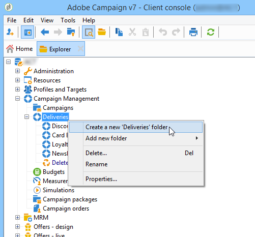

# Gestire l’accesso alle cartelle{#folder-access-management}

A ogni cartella della struttura di esplorazione sono associati diritti di accesso di lettura, scrittura ed eliminazione. Per accedere a un file, un operatore o un gruppo di operatori deve disporre almeno dell&#39;accesso in lettura.

## Cartelle e visualizzazioni {#folders-and-views}

### Che cos’è una cartella {#about-folders}

Le cartelle sono nodi nella struttura Adobe Campaign. Questi nodi vengono creati facendo clic con il pulsante destro del mouse sulla struttura, tramite **[!UICONTROL Add new folder]** menu. Per impostazione predefinita, il primo menu consente di aggiungere la cartella corrispondente al contesto corrente.

È possibile personalizzare la struttura di navigazione di Esplora risorse. Scopri i passaggi di configurazione e le best practice [in questa sezione](adobe-campaign-workspace.md).

### Che cos’è una visualizzazione {#about-views}

Inoltre, puoi creare viste per limitare l’accesso ai dati e organizzare il contenuto della struttura in base alle tue esigenze. È quindi possibile assegnare i diritti alle visualizzazioni.

Una visualizzazione è una cartella in cui vengono visualizzati i record fisicamente archiviati in una o più cartelle dello stesso tipo. Ad esempio, se crei una cartella Campaign che è una visualizzazione, per impostazione predefinita vengono visualizzate tutte le campagne presenti nel database, a prescindere dalla loro origine. Questi dati possono quindi essere filtrati.

Quando si converte una cartella in una visualizzazione, tutti i dati corrispondenti al tipo di cartella presente nel database vengono visualizzati nella visualizzazione, indipendentemente dalla cartella in cui viene salvata. Puoi quindi filtrarlo per limitare l’elenco dei dati visualizzati.

>[!IMPORTANT]
>
>Le visualizzazioni contengono dati e vi consentono di accedervi, ma i dati non vengono fisicamente memorizzati nella cartella delle visualizzazioni. L’operatore deve disporre dei diritti appropriati per l’azione desiderata nelle cartelle delle origini dati (almeno accesso in lettura).
>
>Per concedere l’accesso a una visualizzazione senza dare accesso alla relativa cartella di origine, è sufficiente non concedere l’accesso in lettura sul nodo principale della cartella di origine.

Per distinguere le viste dalle cartelle, il nome di ogni vista viene visualizzato in un colore diverso (ciano scuro).

### Aggiungere cartelle e creare visualizzazioni {#adding-folders-and-creating-views}

Nell’esempio seguente, creeremo nuove cartelle per visualizzare dati specifici:

1. Crea un nuovo **[!UICONTROL Deliveries]** digita la cartella e denominala **Consegne Francia**.
1. Fare clic con il pulsante destro del mouse su questa cartella e selezionare **[!UICONTROL Properties...]**.

   

1. In **[!UICONTROL Restriction]** , seleziona **[!UICONTROL This folder is a view]**. Verranno quindi visualizzate tutte le consegne nel database.

   

1. Definisci i criteri del filtro di consegna dall’editor delle query nella sezione centrale della finestra: vengono quindi visualizzate le campagne corrispondenti al filtro definito.

   >[!NOTE]
   >
   >L’editor delle query viene presentato in [questa sezione](../../platform/using/about-queries-in-campaign.md).

   Con le seguenti condizioni di filtro:

Nella vista vengono visualizzate le seguenti consegne:

>[!NOTE]
>
>Durante la gestione [messaggistica transazionale](../../message-center/using/about-transactional-messaging.md) eventi, il **[!UICONTROL Real time events]** o **[!UICONTROL Batch events]** le cartelle non devono essere impostate come viste sulle istanze di esecuzione, in quanto ciò potrebbe causare problemi di diritti di accesso. Per ulteriori informazioni sulla raccolta di eventi, consulta [questa sezione](../../message-center/using/about-event-processing.md#event-collection).

## Autorizzazioni per una cartella

### Modificare le autorizzazioni per una cartella {#edit-permissions-on-a-folder}

Per modificare le autorizzazioni per una cartella specifica della struttura, attieniti alla seguente procedura:

1. Fai clic con il pulsante destro del mouse sulla cartella e seleziona **[!UICONTROL Properties...]**.

   

1. Fai clic su **[!UICONTROL Security]** per visualizzare le autorizzazioni per questa cartella.

   

### Modifica autorizzazioni {#modify-permissions}

Per modificare le autorizzazioni, è possibile:

* **Sostituire un gruppo o un operatore**. A questo scopo, fai clic su uno dei gruppi (o degli operatori) con diritti per la cartella e seleziona un nuovo gruppo (o un nuovo operatore) dall’elenco a discesa:

  

* **Autorizzare un gruppo o un operatore**. A questo scopo, fai clic su **[!UICONTROL Add]** e selezionare il gruppo o l&#39;operatore a cui si desidera assegnare le autorizzazioni per questa cartella.
* **Non consentire a un gruppo o a un operatore**. A questo scopo, fai clic su **[!UICONTROL Delete]** e selezionare il gruppo o l&#39;operatore da cui si desidera rimuovere l&#39;autorizzazione per questa cartella.
* **Selezionare i diritti assegnati a un gruppo o a un operatore**. A questo scopo, fai clic sul gruppo o sull’operatore interessato, quindi seleziona i diritti di accesso che desideri concedere e deseleziona gli altri.

  

### Propagare le autorizzazioni {#propagate-permissions}

Puoi propagare autorizzazioni e diritti di accesso. A questo scopo, seleziona la **[!UICONTROL Propagate]** nelle proprietà della cartella.

Le autorizzazioni definite in questa finestra verranno quindi applicate a tutte le sottocartelle del nodo corrente. Puoi quindi sovraccaricare queste autorizzazioni per ciascuna sottocartella.

>[!NOTE]
>
>Se si cancella questa opzione per una cartella, questa non viene cancellata automaticamente per le sottocartelle. È necessario cancellarlo esplicitamente per ciascuna sottocartella.

### Concedi l’accesso a tutti gli operatori {#grant-access-to-all-operators}

In **[!UICONTROL Security]** , se **[!UICONTROL System folder]** è selezionata, tutti gli operatori avranno accesso a questi dati, indipendentemente dai loro diritti. Se questa opzione è deselezionata, è necessario aggiungere esplicitamente l’operatore (o il relativo gruppo) all’elenco di autorizzazioni affinché possano accedervi.

