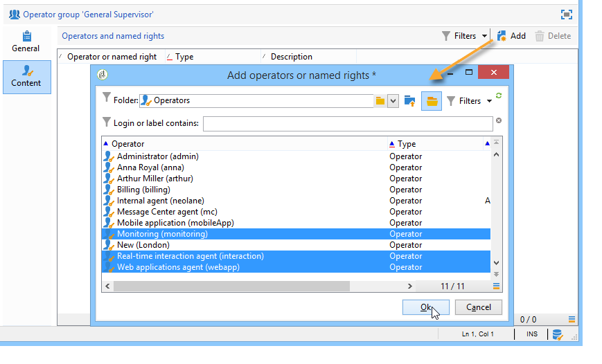

# Creare e gestire gruppi di operatori {#operator-groups}

>[!NOTE]
>
>Queste procedure si applicano solo agli operatori che si connettono a Campaign con autenticazione nativa. Per l’autenticazione Adobe IMS, consulta [questa documentazione](https://helpx.adobe.com/it/enterprise/using/user-groups.html).

I gruppi di operatori vengono creati tramite **[!UICONTROL Administration > Access management > Operator groups]** nella struttura.

## Crea un nuovo gruppo di operatori {#creating-a-new-operator-group}

Per creare un nuovo gruppo di operatori, attieniti alla seguente procedura:

1. Fai clic su **[!UICONTROL New]** a destra dell&#39;elenco di gruppi o fare clic con il pulsante destro del mouse sull&#39;elenco e scegliere **[!UICONTROL New]**.
1. Nella finestra inferiore della sezione, dal menu **[!UICONTROL General]** , immettere il nome e la descrizione del gruppo nei campi corrispondenti.

   

1. Fai clic su **[!UICONTROL Content]** per definire le autorizzazioni per questo gruppo.
1. Fai clic su **[!UICONTROL Add]** per selezionare un diritto designato o un operatore da associare al gruppo.
1. Fai clic sull’elenco a discesa o sulla cartella a destra della **[!UICONTROL Folder]** per individuare i diritti o gli operatori designati da associare al gruppo.
1. Seleziona i diritti o gli operatori da aggiungere e fai clic su **[!UICONTROL OK]** da convalidare.

   

   Ripeti questa operazione per aggiungere altri diritti o operatori.

1. Fai clic su **[!UICONTROL Save]** per aggiungere il gruppo all&#39;elenco.

## Gruppi predefiniti {#default-groups}

I gruppi di operatori predefiniti sono:

1. **[!UICONTROL Administrator]**

   Gli operatori di questo gruppo hanno accesso completo all’istanza. Gli amministratori sono utenti che possono accedere alle parti più tecniche dell’interfaccia. Loro tengono il **[!UICONTROL Administration]** e assicurati che la piattaforma sia configurata.

   Questo gruppo contiene i seguenti diritti denominati:

   * **[!UICONTROL ADMINISTRATION]**: diritto di eseguire/creare/modificare/eliminare qualsiasi oggetto, ad esempio flusso di lavoro, consegna, script e così via.

1. **[!UICONTROL Delivery operators]**

   Gli operatori di questo gruppo sono responsabili della gestione delle consegne: consentono l’accesso alle risorse principali necessarie per la creazione e la preparazione delle consegne (tipologie di campagne, mappature di consegna, modelli predefiniti, blocchi di personalizzazione, ecc.).

   Questo gruppo contiene i seguenti diritti denominati:

   * **[!UICONTROL PREPARE DELIVERIES]**: diritto di creare, modificare e avviare l’analisi della consegna,
   * **[!UICONTROL START DELIVERIES]**: diritto di approvare le consegne analizzate in precedenza.

1. **[!UICONTROL Campaign managers]**

   Gli operatori di questo gruppo possono gestire le campagne di marketing: ti consente di accedere agli oggetti collegati alle campagne (piani, programmi, flussi di lavoro, budget, ecc.) nell&#39;ambito del **[!UICONTROL Campaign]** (modulo Adobe Campaign opzionale).

   Questo gruppo contiene i seguenti diritti denominati:

   * **[!UICONTROL INSERT FOLDERS]**: diritto di inserire cartelle nella struttura Adobe Campaign (purché si disponga dei diritti di modifica per i rami interessati),
   * **[!UICONTROL WORKFLOW]**: diritto di utilizzare i flussi di lavoro.

   >[!NOTE]
   >
   >Questo gruppo non consente agli operatori di avviare le consegne.

1. **[!UICONTROL Content contributors]**

   Gli operatori di questo gruppo possono accedere alle cartelle dei contenuti nel framework di **[!UICONTROL Content management]** (modulo Adobe Campaign opzionale). Questo gruppo non concede alcun diritto aggiuntivo.

1. **[!UICONTROL Access to reports]**

   Questo gruppo è riservato agli operatori esterni, per abilitare le icone Report, Schedule e Forum nel Dashboard di Campaign per un operatore specifico.

1. **[!UICONTROL Workflow execution]**

   Questo gruppo ti consente di assegnare agli operatori il diritto di gestire flussi di lavoro non correlati alle campagne.

1. **[!UICONTROL Workflow supervisors]**

   Gli operatori di questo gruppo ricevono una notifica e-mail in caso di avvisi relativi ai flussi di lavoro delle campagne.

1. Gestione locale/centrale

   Questi gruppi consentono di utilizzare **[!UICONTROL Distributed marketing]** (modulo Adobe Campaign opzionale).

1. **[!UICONTROL Offer managers]**

   Gli operatori di questo gruppo possono creare e gestire le offerte. Per ulteriori informazioni, consulta questa [pagina](../../interaction/using/operator-profiles.md).
Questo gruppo contiene i seguenti diritti denominati:

   * **[!UICONTROL INSERT FOLDERS]**: diritto di inserire cartelle nella struttura Adobe Campaign (purché si disponga dei diritti di modifica per i rami interessati),
   * **[!UICONTROL EDIT FOLDERS]**: diritto di modificare le proprietà della cartella come nome interno, etichetta, immagine associata, ordine delle sottocartelle e così via.
