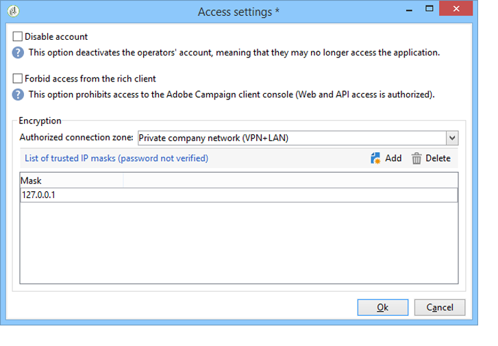

# Creare e gestire gli operatori {#operators}

## Introduzione agli operatori di Campaign  {#about-operators}

Un operatore è un utente di Adobe Campaign che dispone delle autorizzazioni per accedere ed eseguire azioni.

Per impostazione predefinita, gli operatori vengono memorizzati nella **[!UICONTROL Administration > Access management > Operators]** nodo.

Gli operatori possono essere creati manualmente o mappati su una directory LDAP esistente.

La procedura completa per la creazione di un operatore è descritta in [questa pagina](#creating-an-operator).

Per ulteriori informazioni sull’integrazione di Adobe Campaign e LDAP, consulta [questa pagina](../../installation/using/connecting-through-ldap.md).

>[!IMPORTANT]
>
>Gli operatori devono essere collegati a un’area di sicurezza per accedere a un’istanza. Per ulteriori informazioni sulle aree di protezione in Adobe Campaign, consulta [questa pagina](../../installation/using/security-zones.md).

Gli utenti possono anche connettersi direttamente ad Adobe Campaign utilizzando il proprio Adobe ID. Per ulteriori informazioni, consulta questa [pagina](../../integrations/using/about-adobe-id.md).

## Creare un operatore {#creating-an-operator}

Per creare un nuovo operatore e concedere le autorizzazioni, effettua le seguenti operazioni:

1. Fai clic su **[!UICONTROL New]** sopra l&#39;elenco degli operatori e immettere i dettagli del nuovo operatore.

   

1. Specifica la **[!UICONTROL Identification parameters]** dell’utente: login, password e nome. L’operatore utilizzerà le credenziali di accesso e la password per accedere ad Adobe Campaign. Una volta effettuato l&#39;accesso, l&#39;utente può modificare la password tramite **[!UICONTROL Tools > Change password]** menu. L’e-mail dell’operatore è essenziale in quanto consente all’operatore di ricevere notifiche, ad esempio durante l’elaborazione delle approvazioni.

   Questa sezione ti consente anche di collegare un operatore a un’entità organizzativa. Per ulteriori informazioni, consulta [questa pagina](../../distributed/using/about-distributed-marketing.md).

1. Seleziona le autorizzazioni concesse all’operatore in **[!UICONTROL Operator access rights]** sezione.

   Per assegnare i diritti all&#39;operatore, fare clic su **[!UICONTROL Add]** posizionato sopra l&#39;elenco dei diritti, quindi selezionare un gruppo di operatori dall&#39;elenco dei gruppi disponibili:

   

   Puoi anche selezionare uno o più diritti denominati (fai riferimento a [Diritti denominati](#named-rights)). A tale scopo, fare clic sulla freccia a destra della **[!UICONTROL Folder]** e seleziona **[!UICONTROL Named rights]**:

   

   Seleziona i gruppi e/o i diritti denominati da assegnare e fai clic su **[!UICONTROL OK]** da convalidare.

1. Clic **[!UICONTROL Ok]** per creare l’operatore: il profilo viene aggiunto all’elenco degli operatori esistenti.

   

>[!NOTE]
>
>Puoi organizzare gli operatori in base alle tue esigenze creando nuove cartelle di operatori. A questo scopo, fai clic con il pulsante destro del mouse sulla cartella dell’operatore e seleziona **[!UICONTROL Add an 'Operators' folder]**.

Una volta creato il profilo dell’operatore, puoi aggiungerne o aggiornarne le informazioni. A questo scopo, fai clic su **[!UICONTROL Edit]** scheda.

>[!NOTE]
>
>Il **[!UICONTROL Session timeout]** consente di regolare il ritardo prima del timeout della sessione FDA. Per ulteriori informazioni, consulta [Informazioni su Federated Data Access](../../installation/using/about-fda.md).

## Definire il fuso orario dell’operatore {#time-zone-of-the-operator}

In **[!UICONTROL General]** , è possibile selezionare il fuso orario dell’operatore. Per impostazione predefinita, gli operatori funzionano nel fuso orario del server. Tuttavia, è possibile selezionare un altro fuso orario utilizzando l’elenco a discesa.

La configurazione dei fusi orari è descritta in [questa pagina](../../installation/using/time-zone-management.md).

>[!NOTE]
>
>Le collaborazioni all’interno di vari fusi orari richiedono la memorizzazione delle date in UTC. Le date vengono convertite nel fuso orario appropriato nei seguenti contesti: quando una data viene visualizzata nel fuso orario dell’utente, quando i file vengono importati ed esportati, quando viene pianificata la consegna di e-mail, quando le attività vengono pianificate in un flusso di lavoro (pianificazione, attesa, vincolo di tempo, ecc.)
>
>I vincoli e i consigli collegati a questi contesti sono descritti nelle sezioni correlate della documentazione di Adobe Campaign.

Inoltre, la **[!UICONTROL Regional settings]** L&#39;elenco a discesa consente di selezionare il formato di visualizzazione delle date e dei numeri.

## Aggiungere autorizzazioni {#access-rights-options}

Utilizza il **[!UICONTROL Access rights]** per aggiornare i gruppi e i diritti denominati collegati all’operatore.

Il **[!UICONTROL Edit the access parameters...]** Il collegamento ti consente di accedere alle seguenti opzioni:

* Il **[!UICONTROL Disable account]** consente di disabilitare l’account dell’operatore: questo utente non accederà più ad Adobe Campaign.

  >[!NOTE]
  >
  >Anche se il loro account è disabilitato, l’operatore può comunque ricevere avvisi o notifiche da Campaign. Per interrompere l’invio delle notifiche di Campaign a questo operatore, l’Adobe consiglia di rimuovere l’indirizzo e-mail dal proprio profilo.

* Il **[!UICONTROL Forbid access from the rich client]** consente di limitare l’utilizzo di Adobe Campaign a [Accesso web](../../platform/using/adobe-campaign-workspace.md#console-and-web-access) o tramite API: l’accesso alla console client di Adobe Campaign non è più disponibile.
* È possibile collegare una zona di sicurezza all&#39;operatore. Per ulteriori informazioni, consulta [questa pagina](../../installation/using/security-zones.md).
* Puoi anche definire una maschera IP attendibile utilizzando il collegamento appropriato.

  L’operatore può connettersi ad Adobe Campaign senza inserire la password se il suo indirizzo IP si trova in questo elenco.

  È inoltre possibile specificare un insieme di indirizzi IP che verranno autorizzati a connettersi senza una password, ad esempio nell&#39;esempio seguente:

  

  >[!NOTE]
  >
  >Per proteggere l’accesso alla piattaforma, utilizza questa opzione con cautela.

* Il **[!UICONTROL Restrict to information found in sub-folders of:]** consente di limitare i diritti attribuiti all’operatore di una cartella. Solo le sottocartelle del nodo specificato in questa opzione saranno visibili all’utente:

  

  >[!IMPORTANT]
  >
  >Questa è una restrizione molto rigida, e deve essere utilizzata con cautela. Un operatore connesso con questo tipo di diritti può visualizzare SOLO il contenuto della cartella specificata e non ha accesso a nessun altro nodo della struttura tramite l&#39;Explorer. Tuttavia, a seconda delle funzionalità a cui questo operatore ha accesso (ad esempio: flussi di lavoro), l’utente può visualizzare dati che sono solitamente memorizzati in nodi che non sono accessibili.

### Verifica impostazioni {#check-settings}

Il **[!UICONTROL Audit]** Questa scheda ti consente di visualizzare le informazioni relative all’operatore. Le varie schede vengono aggiunte a automaticamente in base alle impostazioni definite nell’area di intervento dell’operatore.

Puoi accedere a:

* Elenco dei diritti sulle cartelle collegate all’operatore.

  

  >[!NOTE]
  >
  >Per ulteriori informazioni, consulta [Gestione dell’accesso alle cartelle](#folder-access-management).

* Registro delle approvazioni dell&#39;operatore.

  

* L’elenco dei forum di discussione a cui sono iscritti.
* Eventi nel loro calendario.
* L&#39;elenco delle attività assegnate.

## Operatori predefiniti {#default-operators}

Adobe Campaign utilizza operatori tecnici con profili configurati per impostazione predefinita: amministratore (&quot;admin&quot;), fatturazione (&quot;billing&quot;), monitoraggio, agente applicazione web (&quot;webapp&quot;), ecc. Alcune dipendono dalle applicazioni e dalle opzioni installate sulla piattaforma: gli operatori &quot;centrali&quot; e &quot;locali&quot;, ad esempio, sono visibili solo se è installata l’opzione Marketing distribuito.

>[!IMPORTANT]
>
>Per impostazione predefinita, questi operatori tecnici ricevono una notifica quando la piattaforma restituisce dei messaggi informativi. Consigliamo vivamente di fornire loro un’e-mail di contatto.
>
>Per garantire il corretto funzionamento delle applicazioni web, si consiglia inoltre di non definire impostazioni internazionali specifiche per l’operatore &quot;webapp&quot;.

Per impostazione predefinita, l’operatore tecnico &quot;webapp&quot; dispone del diritto DENOMINATO ADMINISTRATION (AMMINISTRAZIONE), che può comportare rischi per la sicurezza. Per risolvere il problema, è consigliabile rimuovere questo diritto. Per eseguire questa operazione:

1. Dalla sezione **[!UICONTROL Administration > Access management > Named rights]** , fare clic su **[!UICONTROL New]** per creare un diritto e denominarlo WEBAPP.

   

   I diritti denominati sono descritti in [Diritti denominati](#named-rights) sezione.

1. Dalla sezione **[!UICONTROL Administration > Access management > Operators]** , selezionare l&#39;operatore dell&#39;agente delle applicazioni Web (&#39;webapp&#39;).

   Seleziona la **[!UICONTROL Edit]** , quindi la scheda **[!UICONTROL Access rights]** ed eliminare dall&#39;elenco il componente ADMINISTRATION denominato right.

   

   Clic **[!UICONTROL Add]** e seleziona l’autorizzazione WEBAPP appena creata, quindi salva le modifiche.

   

1. Assegna all’operatore &quot;webapp&quot; i diritti di accesso in lettura e scrittura ai dati alle cartelle che riguardano questo operatore, ovvero le cartelle &quot;Destinatario&quot;.

   

   La modifica dei diritti sulle cartelle della struttura è descritta in [Gestione dell’accesso alle cartelle](#folder-access-management) sezione.

>[!NOTE]
>
>Per ulteriori informazioni sulle linee guida sulla sicurezza, fare riferimento a [Elenco di controllo per la configurazione della sicurezza di Adobe Campaign](https://helpx.adobe.com/it/campaign/kb/acc-security.html).
