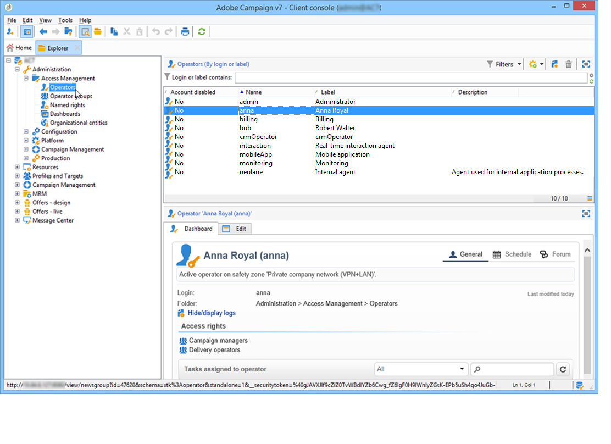
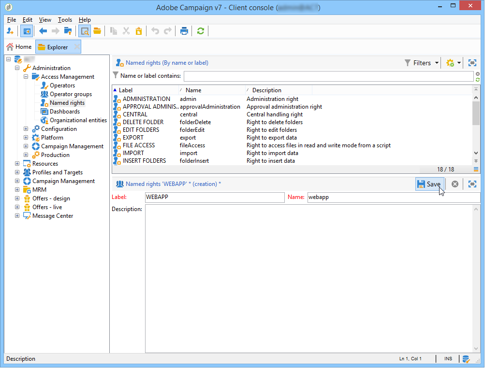

# Creare e gestire gli operatori {#operators}

## Guida introduttiva agli operatori Campaign {#about-operators}

Un operatore è un utente Adobe Campaign che dispone delle autorizzazioni per accedere ed eseguire azioni.

Per impostazione predefinita, gli operatori sono memorizzati nel nodo **[!UICONTROL Administration > Access management > Operators]** .

Gli operatori possono essere creati manualmente o mappati su una directory LDAP esistente.

La procedura completa per creare un operatore è descritta in [questa pagina](#creating-an-operator).

Per ulteriori informazioni sull&#39;integrazione di Adobe Campaign e LDAP, consulta [questa pagina](../../installation/using/connecting-through-ldap.md).

>[!IMPORTANT]
>
>Gli operatori devono essere collegati a un&#39;area di sicurezza per accedere a un&#39;istanza. Per ulteriori informazioni sulle aree di sicurezza in Adobe Campaign, consulta [questa pagina](../../installation/using/security-zones.md).

Gli utenti possono anche connettersi direttamente ad Adobe Campaign utilizzando il proprio Adobe ID. Per ulteriori informazioni, consulta questa [pagina](../../integrations/using/about-adobe-id.md).

## Crea un operatore {#creating-an-operator}

Per creare un nuovo operatore e concedere autorizzazioni, segui i passaggi seguenti:

1. Fai clic sul pulsante **[!UICONTROL New]** situato sopra l’elenco degli operatori e immetti i dettagli del nuovo operatore.

   

1. Specifica la **[!UICONTROL Identification parameters]** dell’utente: accesso, password e nome. L’operatore utilizzerà l’accesso e la password per accedere ad Adobe Campaign. Una volta effettuato l’accesso, l’utente può modificare la password tramite il menu **[!UICONTROL Tools > Change password]** . L’e-mail dell’operatore è essenziale in quanto consente all’operatore di ricevere notifiche, ad esempio durante l’elaborazione delle approvazioni.

   Questa sezione consente anche di collegare un operatore a un’entità organizzativa. Per ulteriori informazioni, consulta [questa pagina](../../campaign/using/about-distributed-marketing.md).

1. Seleziona le autorizzazioni concesse all’operatore nella sezione **[!UICONTROL Operator access rights]** .

   Per assegnare diritti all’operatore, fai clic sul pulsante **[!UICONTROL Add]** situato sopra l’elenco dei diritti, quindi seleziona un gruppo di operatori dall’elenco dei gruppi disponibili:

   

   Puoi anche selezionare uno o più diritti denominati (fai riferimento a [Diritti denominati](#named-rights)). A questo scopo, fai clic sulla freccia a destra del campo **[!UICONTROL Folder]** e seleziona **[!UICONTROL Named rights]**:

   

   Seleziona i gruppi e/o i diritti denominati da assegnare e fai clic su **[!UICONTROL OK]** per eseguire la convalida.

1. Fai clic su **[!UICONTROL Ok]** per creare l’operatore: il profilo viene aggiunto all’elenco degli operatori esistenti.

   

>[!NOTE]
>
>Puoi organizzare gli operatori in base alle tue esigenze creando nuove cartelle di operatori. A questo scopo, fai clic con il pulsante destro del mouse sulla cartella dell’operatore e seleziona **[!UICONTROL Add an 'Operators' folder]**.

Una volta creato il profilo dell’operatore, puoi aggiungere o aggiornare le relative informazioni. A questo scopo, fai clic sulla scheda **[!UICONTROL Edit]** .

>[!NOTE]
>
>Il campo **[!UICONTROL Session timeout]** ti consente di regolare il ritardo prima del timeout della sessione FDA. Per ulteriori informazioni, consulta [Informazioni su Federated Data Access](../../installation/using/about-fda.md).

## Definire il fuso orario dell’operatore {#time-zone-of-the-operator}

Nella scheda **[!UICONTROL General]** , puoi selezionare il fuso orario dell’operatore. Per impostazione predefinita, gli operatori funzionano nel fuso orario del server. Tuttavia, è possibile selezionare un altro fuso orario utilizzando l’elenco a discesa.

La configurazione dei fusi orari è descritta in [questa pagina](../../installation/using/time-zone-management.md).

>[!NOTE]
>
>Le collaborazioni all’interno di diversi fusi orari richiedono l’archiviazione delle date in UTC. Le date vengono convertite nel fuso orario appropriato nei seguenti contesti: quando una data viene visualizzata nel fuso orario utente, quando i file vengono importati ed esportati, quando viene pianificata una consegna e-mail, quando le attività sono pianificate in un flusso di lavoro (pianificazione, attesa, vincolo di tempo, ecc.)
>
>I vincoli e le raccomandazioni collegati a questi contesti sono presentati nelle sezioni correlate della documentazione di Adobe Campaign.

Inoltre, l’elenco a discesa **[!UICONTROL Regional settings]** consente di selezionare il formato per visualizzare date e numeri.

## Aggiungi autorizzazioni {#access-rights-options}

Utilizza la scheda **[!UICONTROL Access rights]** per aggiornare i gruppi e i diritti denominati collegati all’operatore .

Il collegamento **[!UICONTROL Edit the access parameters...]** ti consente di accedere alle seguenti opzioni:

* L’opzione **[!UICONTROL Disable account]** consente di disabilitare l’account dell’operatore: non accederà più ad Adobe Campaign.

   >[!NOTE]
   >
   >Anche se il suo account è disabilitato, l’operatore può comunque ricevere avvisi o notifiche da Campaign. Per interrompere l’invio di notifiche Campaign a questo operatore, l’Adobe consiglia di rimuovere l’indirizzo e-mail dal suo profilo.

* L&#39;opzione **[!UICONTROL Forbid access from the rich client]** ti consente di limitare l&#39;utilizzo di Adobe Campaign a [Accesso web](../../platform/using/adobe-campaign-workspace.md#console-and-web-access) o tramite API: l’accesso alla console client di Adobe Campaign non è più disponibile.
* È possibile collegare una zona di sicurezza all&#39;operatore. Per ulteriori informazioni, consulta [questa pagina](../../installation/using/security-zones.md).
* Puoi anche definire una maschera IP affidabile utilizzando il collegamento appropriato.

   L’operatore sarà in grado di connettersi ad Adobe Campaign senza immettere la password se l’indirizzo IP è presente in questo elenco.

   Puoi inoltre specificare un set di indirizzi IP che saranno autorizzati a connettersi senza password, come nell’esempio seguente:

   

   >[!NOTE]
   >
   >Per proteggere l’accesso alla piattaforma, devi utilizzare questa opzione con cautela.

* L’opzione **[!UICONTROL Restrict to information found in sub-folders of:]** ti consente di limitare i diritti attribuiti all’operatore di una cartella. Solo le sottocartelle del nodo specificato in questa opzione saranno visibili all’utente:

   

   >[!IMPORTANT]
   >
   >Si tratta di una restrizione molto stretta e va usata con cautela. Un operatore connesso con questo tipo di diritti può visualizzare SOLO il contenuto della cartella specificata e non ha accesso a nessun altro nodo della struttura tramite l&#39;explorer. Tuttavia, a seconda delle funzionalità a cui ha accesso (ad esempio: workflow), può visualizzare i dati solitamente memorizzati in nodi che non può vedere.

### Controlla le impostazioni {#check-settings}

La scheda **[!UICONTROL Audit]** ti consente di visualizzare le informazioni relative all’operatore . Le varie schede vengono aggiunte automaticamente in base alle impostazioni definite nell’area di intervento dell’operatore.

Puoi accedere a:

* Elenco di diritti sulle cartelle collegate all’operatore.

   

   >[!NOTE]
   >
   >Per ulteriori informazioni, consulta [Gestione degli accessi alle cartelle](#folder-access-management).

* Registro approvazioni operatore.

   

* L&#39;elenco dei forum di discussione ai quali sono abbonati.
* Eventi nel loro calendario.
* Elenco delle attività assegnate.

## Operatori predefiniti {#default-operators}

Adobe Campaign utilizza operatori tecnici con profili configurati per impostazione predefinita: Amministratore (&#39;admin&#39;), fatturazione (&#39;billing&#39;), monitoraggio, agente dell&#39;applicazione Web (&#39;webapp&#39;), ecc. Alcune di queste dipendono dalle applicazioni e dalle opzioni installate sulla piattaforma: Gli operatori &#39;central&#39; e &#39;local&#39;, ad esempio, sono visibili solo se è installata l&#39;opzione Distributed Marketing.

>[!IMPORTANT]
>
>Questi operatori tecnici vengono avvisati per impostazione predefinita quando la piattaforma restituisce messaggi di informazioni. Consigliamo vivamente di fornire un&#39;e-mail di contatto per loro.
>
>Per garantire il corretto funzionamento delle applicazioni web, si consiglia inoltre di non definire impostazioni regionali specifiche per l’operatore &quot;webapp&quot;.

Per impostazione predefinita, l’operatore tecnico &quot;webapp&quot; ha il diritto di amministrazione denominato , che può comportare rischi per la sicurezza. Per risolvere questo problema, si consiglia di rimuovere questo diritto. Per eseguire questa operazione:

1. Dal nodo **[!UICONTROL Administration > Access management > Named rights]**, fai clic su **[!UICONTROL New]** per creare un diritto e denominarlo WEBAPP.

   

   I diritti denominati sono descritti in dettaglio nella sezione [Diritti denominati](#named-rights) .

1. Dal nodo **[!UICONTROL Administration > Access management > Operators]**, seleziona l’operatore dell’agente delle applicazioni web (&quot;webapp&quot;).

   Seleziona la scheda **[!UICONTROL Edit]** , quindi la scheda **[!UICONTROL Access rights]** ed elimina l’AMMINISTRAZIONE denominata a destra dall’elenco.

   

   Fai clic su **[!UICONTROL Add]** e seleziona il diritto WEBAPP appena creato, quindi salva le modifiche.

   

1. Assegna l’operatore &quot;webapp&quot; diritti di accesso in lettura e scrittura dei dati sulle cartelle che riguardano questo operatore, che sono principalmente le cartelle &quot;Recipient&quot;.

   

   La modifica dei diritti sulle cartelle ad albero è descritta nella sezione [Gestione degli accessi alle cartelle](#folder-access-management) .

>[!NOTE]
>
>Per ulteriori informazioni sulle linee guida relative alla sicurezza, consulta [Lista di controllo per la configurazione della sicurezza Adobe Campaign](https://helpx.adobe.com/it/campaign/kb/acc-security.html).
