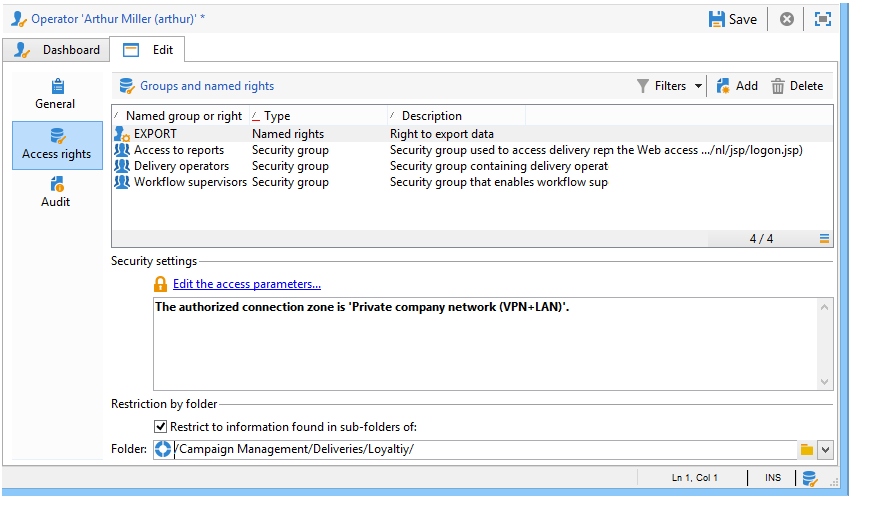
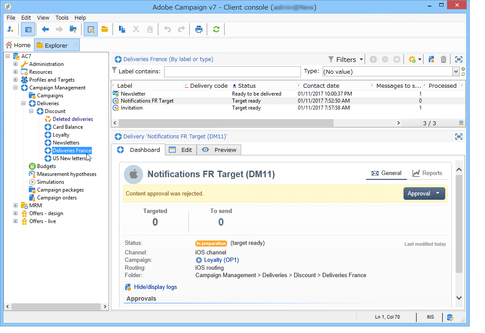

# Gestione degli accessi{#access-management}

## About permissions {#about-permissions}

 Adobe Campaign consente di definire e gestire i diritti assegnati ai vari operatori. Si tratta di una serie di diritti e restrizioni che autorizzano o negano:

* accesso a determinate funzionalità (tramite i diritti denominati),
* l&#39;accesso a taluni documenti,
* Creazione, modifica e/o eliminazione di record (azioni, contatti, campagne, gruppi, ecc.).

Le autorizzazioni si applicano ai profili dell&#39;operatore o ai gruppi di operatori.

Sono completati da parametri di sicurezza collegati alla modalità di connessione dell&#39;operatore al Adobe Campaign . For more on this, refer to [this page](../../installation/using/configuring-campaign-server.md#defining-security-zones).

Esistono due tipi di autorizzazioni che potete concedere a un utente:

* Potete definire i gruppi di operatori a cui attribuire i diritti, quindi associarli a uno o più gruppi. Questo consente di riutilizzare i diritti e rendere più coerenti i profili degli operatori. Inoltre, facilita la gestione e la manutenzione dei profili. La creazione e la gestione dei gruppi sono presentati nei gruppi di operatori.
* Potete attribuire diritti denominati direttamente agli utenti, in alcuni casi per sovraccaricare i diritti assegnati tramite i gruppi. Questi diritti sono presentati in [Named rights](#named-rights).

>[!NOTE]
>
>Prima di iniziare a definire le autorizzazioni,  Adobe consiglia di leggere l&#39;elenco [di controllo della configurazione di](https://docs.campaign.adobe.com/doc/AC/getting_started/EN/security.html)protezione.

## Operatori {#operators}

### Informazioni sugli operatori {#about-operators}

Un operatore è un utente  Adobe Campaign che dispone delle autorizzazioni necessarie per accedere ed eseguire azioni.

Per impostazione predefinita, gli operatori sono memorizzati nel **[!UICONTROL Administration > Access management > Operators]** nodo.

Gli operatori possono essere creati manualmente o mappati su una directory LDAP esistente.

La procedura completa per creare un operatore è descritta in [questa pagina](#creating-an-operator).

Per ulteriori informazioni sull’integrazione  Adobe Campaign e LDAP, consultate [questa pagina](../../installation/using/connecting-through-ldap.md).

>[!IMPORTANT]
>
>Gli operatori devono essere collegati a un&#39;area di protezione per accedere a un&#39;istanza. Per ulteriori informazioni sulle aree di protezione in  Adobe Campaign, fare riferimento a [questa pagina](../../installation/using/configuring-campaign-server.md#defining-security-zones).

Gli utenti possono inoltre connettersi direttamente al  Adobe Campaign utilizzando il proprio Adobe ID . For more on this, refer to this [page](../../integrations/using/about-adobe-id.md).

### Creazione di un operatore {#creating-an-operator}

Per creare un nuovo operatore e concedere le autorizzazioni, effettuate le seguenti operazioni:

1. Fare clic sul **[!UICONTROL New]** pulsante situato sopra l&#39;elenco degli operatori e immettere i dettagli del nuovo operatore.

   

1. Specificate il nome **[!UICONTROL Identification parameters]** dell’utente: login, password e nome. Il login e la password verranno utilizzati dall&#39;operatore per accedere al  Adobe Campaign. Una volta effettuato l&#39;accesso, l&#39;utente può cambiare la password tramite il **[!UICONTROL Tools > Change password]** menu. L&#39;e-mail dell&#39;operatore è essenziale in quanto consente all&#39;operatore di ricevere notifiche, ad esempio durante l&#39;elaborazione delle approvazioni.

   Questa sezione consente inoltre di collegare un operatore a un&#39;entità organizzativa. For more on this, refer to the [this page](../../campaign/using/about-distributed-marketing.md).

1. Selezionare le autorizzazioni concesse all&#39;operatore nella **[!UICONTROL Operator access rights]** sezione.

   Per assegnare le autorizzazioni all&#39;operatore, fate clic sul **[!UICONTROL Add]** pulsante situato sopra l&#39;elenco dei diritti, quindi selezionate un gruppo di operatori dall&#39;elenco dei gruppi disponibili:

   

   Potete anche selezionare uno o più diritti denominati (consultate [Diritti](#named-rights)denominati). A tal fine, fare clic sulla freccia a destra del **[!UICONTROL Folder]** campo, quindi selezionare **[!UICONTROL Named rights]**:

   

   Selezionate i gruppi e/o i diritti denominati da assegnare e fate clic **[!UICONTROL OK]** per eseguire la convalida.

1. Fare clic **[!UICONTROL Ok]** per creare l&#39;operatore: il profilo viene aggiunto all&#39;elenco degli operatori esistenti.

   

>[!NOTE]
>
>È possibile organizzare gli operatori in base alle proprie esigenze creando nuove cartelle di operatori. A tale scopo, fare clic con il pulsante destro del mouse sulla cartella dell&#39;operatore e selezionare **[!UICONTROL Add an 'Operators' folder]**.

Una volta creato il profilo dell&#39;operatore, è possibile aggiungerne o aggiornarne le informazioni. A tale scopo, fare clic sulla **[!UICONTROL Edit]** scheda.

>[!NOTE]
>
>Il **[!UICONTROL Session timeout]** campo consente di regolare il ritardo prima del timeout della sessione FDA. Per ulteriori informazioni, vedere [Informazioni su Federated Data Access](../../platform/using/about-fda.md).

### Fuso orario dell&#39;operatore {#time-zone-of-the-operator}

Nella **[!UICONTROL General]** scheda, è possibile selezionare il fuso orario dell&#39;operatore. Per impostazione predefinita, gli operatori lavorano nel fuso orario del server. Tuttavia, è possibile selezionare un altro fuso orario utilizzando l&#39;elenco a discesa.

La configurazione dei fusi orari è descritta in [questa pagina](../../installation/using/time-zone-management.md).

>[!NOTE]
>
>Le collaborazioni all’interno di diversi fusi orari richiedono l’archiviazione delle date in UTC. Le date vengono convertite nel fuso orario appropriato nei seguenti contesti: quando una data viene visualizzata nel fuso orario dell’utente, quando i file vengono importati ed esportati, quando viene pianificata una consegna e-mail, quando le attività vengono pianificate in un flusso di lavoro (pianificazione, attesa, limite di tempo, ecc.)
>
>Vincoli e raccomandazioni collegati a tali contesti sono presentati nelle sezioni correlate della documentazione del Adobe Campaign .

Inoltre, l&#39;elenco a **[!UICONTROL Regional settings]** discesa consente di selezionare il formato per visualizzare date e numeri.

### Opzioni dei diritti di accesso {#access-rights-options}

Utilizzate la **[!UICONTROL Access rights]** scheda per aggiornare i gruppi e i diritti denominati collegati all&#39;operatore.

Il **[!UICONTROL Edit the access parameters...]** collegamento consente di accedere alle seguenti opzioni:

* L&#39; **[!UICONTROL Disable account]** opzione consente di disabilitare l&#39;account dell&#39;operatore: non accederà più  Adobe Campaign.
* L&#39; **[!UICONTROL Forbid access from the rich client]** opzione consente di limitare l&#39;uso di  Adobe Campaign all&#39;accesso  Web o tramite API: l&#39;accesso alla console client del Adobe Campaign  non è più disponibile.
* È possibile collegare una zona di sicurezza all&#39;operatore. For more on this, refer to [this page](../../installation/using/configuring-campaign-server.md#defining-security-zones).
* Potete anche definire una maschera IP affidabile utilizzando il collegamento appropriato.

   L&#39;operatore sarà in grado di connettersi a  Adobe Campaign senza immettere la password, se l&#39;indirizzo IP è incluso in questo elenco.

   Potete anche specificare un set di indirizzi IP che saranno autorizzati a connettersi senza una password, come nell&#39;esempio seguente:

   

   >[!NOTE]
   >
   >Per proteggere l&#39;accesso alla piattaforma, questa opzione deve essere utilizzata con attenzione.

* L’ **[!UICONTROL Restrict to information found in sub-folders of:]** opzione consente di limitare i diritti attribuiti all’operatore di una cartella. Solo le sottocartelle del nodo specificato in questa opzione saranno visibili all&#39;utente:

   

   >[!IMPORTANT]
   >
   >Si tratta di una restrizione molto severa, e deve essere usata con cautela. Un operatore che ha eseguito l&#39;accesso con questo tipo di diritti può visualizzare SOLO il contenuto della cartella specificata e non ha accesso ad alcun altro nodo della struttura tramite l&#39;utilità di esplorazione. Tuttavia, a seconda delle funzionalità a cui ha accesso (ad esempio: workflow), può visualizzare i dati solitamente memorizzati in nodi che non riesce a vedere.

### Cartelle, approvazione e compiti di un operatore {#folders--approval-and-tasks-of-an-operator}

La **[!UICONTROL Audit]** scheda consente di visualizzare le informazioni relative all&#39;operatore. Le varie schede vengono aggiunte automaticamente in base alle impostazioni definite nell&#39;area di intervento dell&#39;operatore.

È possibile accedere a:

* Elenco dei diritti sulle cartelle collegate all&#39;operatore.

   

   >[!NOTE]
   >
   >Per ulteriori informazioni, consulta Gestione dell’accesso alle [cartelle](#folder-access-management).

* Registro di approvazione dell&#39;operatore.

   

* L&#39;elenco dei forum di discussione a cui sono iscritti.
* Eventi nel loro calendario.
* Elenco delle attività assegnate.

### Operatori predefiniti {#default-operators}

 Adobe Campaign utilizza operatori tecnici con profili configurati per impostazione predefinita: Amministratore (&#39;admin&#39;), Fatturazione (&#39;fatturazione&#39;), Monitoraggio, Agente applicazione Web (&#39;webapp&#39;), ecc. Alcune di queste dipendono dalle applicazioni e dalle opzioni installate sulla piattaforma: Gli operatori &#39;central&#39; e &#39;local&#39;, ad esempio, sono visibili solo se è installata l&#39;opzione Distributed Marketing.

>[!IMPORTANT]
>
>Questi operatori tecnici ricevono una notifica predefinita quando i messaggi di informazione vengono restituiti dalla piattaforma. Consigliamo vivamente di fornire loro un&#39;e-mail di contatto.
>
>Per garantire il corretto funzionamento delle applicazioni Web, si consiglia inoltre di non definire impostazioni internazionali specifiche per l&#39;operatore &#39;webapp&#39;.

Per impostazione predefinita, l&#39;operatore tecnico &#39;webapp&#39; ha il diritto di amministrazione denominato, che può comportare rischi per la sicurezza. Per risolvere il problema, si consiglia di rimuovere questo diritto. Per eseguire questa operazione:

1. Dal **[!UICONTROL Administration > Access management > Named rights]** nodo, fate clic **[!UICONTROL New]** per creare un diritto e denominarlo WEBAPP.

   

   I diritti denominati sono descritti in dettaglio nella sezione [Diritti](#named-rights) denominati.

1. Dal **[!UICONTROL Administration > Access management > Operators]** nodo, selezionare l&#39;operatore agente applicazioni Web (&#39;webapp&#39;).

   Selezionate la **[!UICONTROL Edit]** scheda, quindi la **[!UICONTROL Access rights]** scheda ed eliminate l&#39;AMMINISTRAZIONE denominata a destra dall&#39;elenco.

   

   Fai clic su **[!UICONTROL Add]** e seleziona il diritto WEBAPP appena creato, quindi salva le modifiche.

   

1. Assegnate all&#39;operatore &#39;webapp&#39; i diritti di accesso ai dati in lettura e scrittura sulle cartelle che interessano questo operatore, che sono principalmente le cartelle &#39;Recipiente&#39;.

   

   La modifica dei diritti nelle cartelle ad albero è descritta in dettaglio nella sezione Gestione [accesso alle](#folder-access-management) cartelle.

>[!NOTE]
>
>Per ulteriori informazioni sulle linee guida relative alla sicurezza, fare riferimento a [elenco](https://docs.campaign.adobe.com/doc/AC/getting_started/EN/security.html)di controllo della configurazione della sicurezza di Adobe Campaign.

## Gruppi di operatori {#operator-groups}

I gruppi di operatori vengono creati tramite il **[!UICONTROL Administration > Access management > Operator groups]** nodo nella struttura ad albero.

### Creazione di un nuovo gruppo di operatori {#creating-a-new-operator-group}

Per creare un nuovo gruppo di operatori, attenersi alla procedura seguente:

1. Fate clic sul **[!UICONTROL New]** pulsante a destra dell’elenco dei gruppi oppure fate clic con il pulsante destro del mouse sull’elenco e scegliete **[!UICONTROL New]**.
1. Nella finestra inferiore della sezione, dalla **[!UICONTROL General]** scheda, immettete il nome e una descrizione per il gruppo nei campi corrispondenti.

   

1. Fate clic sulla **[!UICONTROL Content]** scheda per definire le autorizzazioni per questo gruppo.
1. Fate clic sul **[!UICONTROL Add]** pulsante per selezionare un diritto designato o un operatore da associare al gruppo.
1. Fare clic sull&#39;elenco a discesa o sulla cartella a destra del **[!UICONTROL Folder]** campo per individuare i diritti o gli operatori da associare a questo gruppo.
1. Selezionare i diritti o gli operatori da aggiungere e fare clic **[!UICONTROL OK]** per eseguire la convalida.

   

   Ripetete questa operazione per aggiungere altri diritti o operatori.

1. Fate clic sul **[!UICONTROL Save]** pulsante per aggiungere il gruppo all’elenco.

### Gruppi predefiniti {#default-groups}

I gruppi di operatori predefiniti sono:

1. **[!UICONTROL Administrator]**

   Gli operatori di questo gruppo hanno accesso completo all&#39;istanza. Gli amministratori sono utenti che possono accedere alle parti più tecniche dell&#39;interfaccia. Essi ricoprono il **[!UICONTROL Administration]** ruolo e si accertano che la piattaforma sia completamente impostata.

   Questo gruppo contiene il seguente diritto denominato:

   * **[!UICONTROL ADMINISTRATION]**: diritto di eseguire, creare, modificare, eliminare qualsiasi oggetto, ad esempio workflow, distribuzione, script ecc.

1. **[!UICONTROL Delivery operators]**

   Gli operatori di questo gruppo sono responsabili della gestione delle consegne: consentono di accedere alle risorse principali necessarie per creare e preparare le consegne (tipologie di campagne, mappature delle consegne, modelli predefiniti, blocchi di personalizzazione, ecc.).

   Questo gruppo contiene i seguenti diritti denominati:

   * **[!UICONTROL PREPARE DELIVERIES]**: diritto di creare, modificare e avviare l&#39;analisi della consegna,
   * **[!UICONTROL START DELIVERIES]**: diritto di approvare le consegne analizzate in precedenza.

1. **[!UICONTROL Campaign managers]**

   Gli operatori di questo gruppo possono gestire le campagne di marketing: consente di accedere agli oggetti collegati alle campagne (piani, programmi, flussi di lavoro, budget, ecc.) nel quadro di **[!UICONTROL Campaign]** (modulo di Adobe Campaign  facoltativo).

   Questo gruppo contiene i seguenti diritti denominati:

   * **[!UICONTROL INSERT FOLDERS]**: diritto di inserire cartelle nella struttura  Adobe Campaign (a condizione che si disponga dei diritti di modifica per i rami interessati),
   * **[!UICONTROL WORKFLOW]**: diritto di utilizzare i flussi di lavoro.

   >[!NOTE]
   >
   >Questo gruppo non consente agli operatori di avviare le consegne.

1. **[!UICONTROL Content contributors]**

   Gli operatori di questo gruppo possono accedere alle cartelle Contenuto, all’interno del framework di **[!UICONTROL Content management]** (modulo di Adobe Campaign  facoltativo). Questo gruppo non concede diritti aggiuntivi.

1. **[!UICONTROL Access to reports]**

   Questo gruppo è riservato agli operatori esterni per accedere ai rapporti di consegna tramite un accesso Web.

1. **[!UICONTROL Workflow execution]**

   Questo gruppo consente di assegnare agli operatori il diritto di gestire flussi di lavoro non correlati alle campagne.

1. **[!UICONTROL Workflow supervisors]**

   Gli operatori di questo gruppo ricevono una notifica e-mail in caso di avvisi relativi ai flussi di lavoro delle campagne.

1. Gestione locale/centrale

   Questi gruppi consentono di utilizzare **[!UICONTROL Distributed marketing]** (modulo di Adobe Campaign  facoltativo).

1. **[!UICONTROL Offer managers]**

   Gli operatori di questo gruppo possono creare e gestire le offerte. Per ulteriori informazioni, consultare questa [pagina](../../interaction/using/operator-profiles.md).
Questo gruppo contiene i seguenti diritti denominati:

   * **[!UICONTROL INSERT FOLDERS]**: Diritto di inserire cartelle nella struttura  Adobe Campaign (a condizione che si disponga dei diritti di modifica per i rami interessati),
   * **[!UICONTROL EDIT FOLDERS]**: Diritto di modificare le proprietà della cartella come nome interno, etichetta, immagine associata, ordine delle sottocartelle, ecc.

## Diritti denominati {#named-rights}

Per impostazione predefinita,  Adobe Campaign propone un insieme di diritti denominati che consente di definire le autorizzazioni assegnate agli operatori e ai gruppi di operatori. Questi diritti possono essere modificati dal **[!UICONTROL Administration > Access management > Named rights]** nodo della struttura.

Tali diritti sono i seguenti:

* **[!UICONTROL ADMINISTRATION]**: Gli operatori con **[!UICONTROL ADMINISTRATION]** diritto di accesso all&#39;istanza. Gli utenti amministratori possono eseguire, creare, modificare o eliminare qualsiasi oggetto, ad esempio flusso di lavoro, distribuzione, script e così via.

* **[!UICONTROL APPROVAL ADMINISTRATION]**: Puoi impostare più passaggi di approvazione all&#39;interno di flussi di lavoro e consegne per garantire che lo stato corrente sia stato approvato da un operatore o gruppo assegnato. Gli utenti con **[!UICONTROL APPROVAL ADMINISTRATION]** diritto possono impostare le fasi di approvazione e assegnare anche un operatore o un gruppo di operatori che deve approvare tali passaggi.

* **[!UICONTROL CENTRAL]**: Right for central management (Distributed Marketing).

* **[!UICONTROL DELETE FOLDER]**: Destra per eliminare le cartelle. Con questo diritto, gli utenti possono eliminare le cartelle dalla visualizzazione Esploratore.

* **[!UICONTROL EDIT FOLDERS]**: Diritto di modificare le proprietà della cartella come nome interno, etichetta, immagine associata, ordine delle sottocartelle, ecc.

* **[!UICONTROL EXPORT]**: Gli utenti possono esportare i dati dalle istanze del Adobe Campaign  in un file su un server o su un computer locale tramite l&#39;attività del **[!UICONTROL EXPORT]** flusso di lavoro.

* **[!UICONTROL FILES ACCESS]**: Diritto di accesso in lettura e scrittura per i file tramite uno script che può essere scritto nell&#39;attività del **[!UICONTROL JavaScript]** flusso di lavoro per leggere e scrivere i file su un server.

* **[!UICONTROL IMPORT]**: Esatto per l&#39;importazione di dati generici. **[!UICONTROL IMPORT]** consente di importare dati in qualsiasi altra tabella, mentre il **[!UICONTROL RECIPIENT IMPORT]** diritto consente l&#39;importazione solo nella tabella ricevente.

* **[!UICONTROL INSERT FOLDERS]**: Diritto di inserire le cartelle. Gli utenti con la **[!UICONTROL INSERT FOLDERS]** destra possono creare nuove cartelle nella struttura delle cartelle nella visualizzazione Esploratore.

* **[!UICONTROL LOCAL]**: Adatta alla gestione locale (Distributed Marketing).

* **[!UICONTROL MERGE]**: Diritto di unire i record selezionati in un unico. Se i destinatari esistono come duplicati, la **[!UICONTROL MERGE]** destra consente all&#39;utente di selezionare i duplicati e di unirli in un destinatario principale.

* **[!UICONTROL PREPARE DELIVERIES]**: Diritto di creare, modificare e salvare una consegna. Gli utenti con **[!UICONTROL PREPARE DELIVERIES]** destra possono anche avviare il processo di analisi della consegna.

* **[!UICONTROL PRIVACY DATA RIGHT]**: Diritto di raccogliere ed eliminare i dati sulla privacy. For more on this, refer to this [page](https://helpx.adobe.com/campaign/kb/acc-privacy.html).

* **[!UICONTROL PROGRAM EXECUTION]**: Diritto di eseguire comandi in vari linguaggi di programmazione.

* **[!UICONTROL RECIPIENT IMPORT]**: Diritto di importare i destinatari. Gli utenti con **[!UICONTROL RECIPIENT IMPORT]** destra possono importare un file locale nella tabella dei destinatari.

* **[!UICONTROL SQL SCRIPT EXECUTION]** Diritto di eseguire qualsiasi comando SQL direttamente sul database.

* **[!UICONTROL START DELIVERIES]**: Diritto di approvare le consegne analizzate in precedenza. Dopo l&#39;analisi della consegna, la consegna verrà messa in pausa a vari passi di approvazione e dovrà essere approvata per riprendere. Gli utenti **[!UICONTROL START DELIVERIES]** autorizzati possono approvare le consegne.

* **[!UICONTROL USE SQL DATA MANAGEMENT ACTIVITY]**: Diritto di scrivere script SQL personalizzati utilizzando l&#39;attività Gestione dati SQL, per creare e compilare tabelle di lavoro (vedere [questa sezione](../../workflow/using/sql-data-management.md)).

* **[!UICONTROL WORKFLOW]**: Diritto di eseguire flussi di lavoro. Senza questo diritto, gli utenti non possono avviare, arrestare o riavviare i flussi di lavoro.

* **[!UICONTROL WEBAPP]**: Diritto di utilizzare applicazioni Web.

>[!NOTE]
>
>Questo elenco può variare a seconda dei componenti aggiuntivi installati sulla piattaforma.

## Matrice diritti di accesso {#access-rights-matrix}

I gruppi predefiniti e i diritti denominati consentono agli operatori di accedere a determinate cartelle nella gerarchia di navigazione e concedono autorizzazioni di lettura, scrittura ed eliminazione.

 matrice dei diritti di accesso Adobe Campaign è disponibile [qui](/help/platform/using/assets/access-rights-matrix.pdf).

## Gestione dell&#39;accesso alle cartelle {#folder-access-management}

A ciascuna cartella della struttura sono associati diritti di accesso di lettura, scrittura ed eliminazione. Per accedere a un file, un operatore o un gruppo di operatori deve avere accesso almeno in lettura.

### Modificare le autorizzazioni in una cartella {#edit-permissions-on-a-folder}

Per modificare le autorizzazioni per una cartella specifica della struttura, effettuate le seguenti operazioni:

1. Fare clic con il pulsante destro del mouse sulla cartella e selezionare **[!UICONTROL Properties...]**.

   

1. Fate clic sulla **[!UICONTROL Security]** scheda per visualizzare le autorizzazioni in questa cartella.

   

### Modifica autorizzazioni {#modify-permissions}

Per modificare le autorizzazioni, potete:

* **Sostituire un gruppo o un operatore**. A questo scopo, fate clic su uno dei gruppi (o operatori) con diritti per la cartella e selezionate un nuovo gruppo (o un nuovo operatore) dall’elenco a discesa:

   

* **Autorizzate un gruppo o un operatore**. A questo scopo, fate clic sul **[!UICONTROL Add]** pulsante e selezionate il gruppo o l’operatore a cui desiderate assegnare le autorizzazioni per questa cartella.
* **Impedire un gruppo o un operatore**. A questo scopo, fate clic su **[!UICONTROL Delete]** e selezionate il gruppo o l&#39;operatore da cui desiderate rimuovere l&#39;autorizzazione per questa cartella.
* **Selezionare i diritti assegnati a un gruppo o a un operatore**. A tal fine, fate clic sul gruppo o sull’operatore interessato, quindi selezionate i diritti di accesso che desiderate concedere e deselezionate gli altri.

   

### Propagare le autorizzazioni {#propagate-permissions}

Potete estendere le autorizzazioni e i diritti di accesso. A questo scopo, selezionate l’ **[!UICONTROL Propagate]** opzione nelle proprietà della cartella.

Le autorizzazioni definite in questa finestra verranno quindi applicate a tutte le sottocartelle del nodo corrente. Potete quindi sovraccaricare queste autorizzazioni per ciascuna sottocartella.

>[!NOTE]
>
>Se si deseleziona questa opzione per una cartella, non viene automaticamente cancellata per le sottocartelle. È necessario cancellarlo esplicitamente per ciascuna sottocartella.

### Concedere l&#39;accesso a tutti gli operatori {#grant-access-to-all-operators}

Nella **[!UICONTROL Security]** scheda, se l&#39; **[!UICONTROL System folder]** opzione è selezionata, tutti gli operatori avranno accesso a questi dati, indipendentemente dai loro diritti. Se questa opzione è deselezionata, è necessario aggiungere esplicitamente l&#39;operatore (o il relativo gruppo) all&#39;elenco delle autorizzazioni per consentire loro l&#39;accesso.

## Cartelle e viste {#folders-and-views}

### Informazioni sulle cartelle {#about-folders}

Le cartelle sono nodi nella struttura  Adobe Campaign. Questi nodi vengono creati facendo clic con il pulsante destro del mouse sulla struttura, tramite il **[!UICONTROL Add new folder]** menu. Per impostazione predefinita, il primo menu consente di aggiungere la cartella corrispondente al contesto corrente.

Potete concedere le autorizzazioni a queste cartelle come in tutte le altre cartelle della struttura. Consultate Gestione dell’accesso alle [cartelle](#folder-access-management).

### Informazioni sulle viste {#about-views}

Inoltre, potete creare delle viste per limitare l’accesso ai dati e organizzare il contenuto della struttura in base alle vostre esigenze. Potete quindi assegnare le autorizzazioni alle viste.

Una vista è una cartella che visualizza i record fisicamente memorizzati in una o più cartelle dello stesso tipo. Ad esempio, se create una cartella Campaign che è una visualizzazione, per impostazione predefinita vengono visualizzate tutte le campagne presenti nel database, indipendentemente dalla loro origine. Questi dati possono quindi essere filtrati.

Quando convertite una cartella in una vista, tutti i dati corrispondenti al tipo di cartella presente nel database vengono visualizzati nella visualizzazione, indipendentemente dalla cartella in cui è stata salvata. È quindi possibile filtrarlo per limitare l&#39;elenco dei dati visualizzati.

>[!IMPORTANT]
>
>Le viste contengono i dati e forniscono l&#39;accesso, ma i dati non vengono memorizzati fisicamente nella cartella di visualizzazione. L&#39;operatore deve disporre dei diritti appropriati per l&#39;azione desiderata nelle cartelle dell&#39;origine dati (accesso in lettura almeno).
>
>Per consentire l’accesso a una visualizzazione senza concedere l’accesso alla propria cartella di origine, è sufficiente non consentire l’accesso in lettura sul nodo padre della cartella di origine.

Per distinguere le viste dalle cartelle, il nome di ciascuna vista viene visualizzato in un colore diverso (ciano scuro).

### Aggiunta di cartelle e creazione di viste {#adding-folders-and-creating-views}

Nell&#39;esempio seguente, verranno create nuove cartelle per visualizzare dati specifici:

1. Create una nuova cartella di **[!UICONTROL Deliveries]** tipo e denominatela **Consegne Francia**.
1. Fate clic con il pulsante destro del mouse su questa cartella e selezionate **[!UICONTROL Properties...]**.

   

1. Nella **[!UICONTROL Restriction]** scheda, selezionare **[!UICONTROL This folder is a view]**. Vengono quindi visualizzate tutte le consegne del database.

   

1. Definite i criteri del filtro di consegna dall&#39;editor di query nella sezione centrale della finestra: verranno visualizzate le campagne corrispondenti al filtro definito.

   >[!NOTE]
   >
   >L&#39;editor di query viene presentato in [questa sezione](../../platform/using/about-queries-in-campaign.md).

   Con le seguenti condizioni del filtro:

Vengono visualizzate le seguenti consegne:

