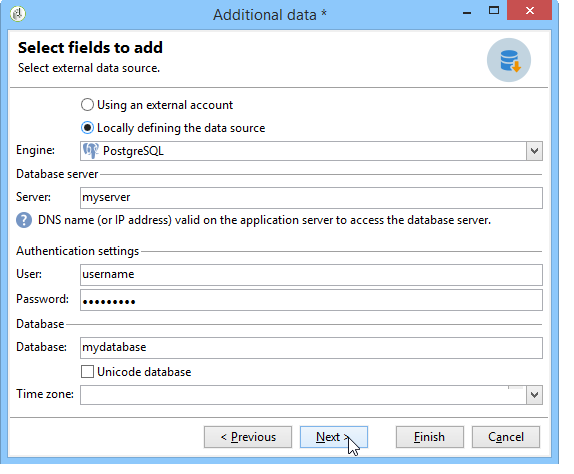

# Accesso a un database esterno{#accessing-an-external-database}

## Informazioni su Federated Data Access {#about-federated-data-access}

Adobe Campaign fornisce l&#39;opzione **Federated Data Access** (FDA) per elaborare le informazioni memorizzate in uno o più database esterni: puoi accedere ai dati esterni senza modificare la struttura dei dati di Adobe Campaign.

>[!CAUTION]
>
>Il modulo **Federated Data Access** (FDA) è facoltativo. Controlla il contratto di licenza di Adobe Campaign.
>  
>Inoltre, l&#39;accesso a un database esterno tramite FDA è possibile solo per installazioni locali o ibride.

### Principio di funzionamento {#operating-principle}

L&#39;opzione FDA consente di raccogliere i dati dalle origini SQL e di rilevare automaticamente la struttura delle tabelle di destinazione.

Per utilizzare questa funzionalità, è necessario:

1. Disporre di un database esterno compatibile con il modulo FDA di Adobe Campaign. L&#39;elenco dei sistemi di database e delle versioni compatibili è dettagliato nella matrice [di](https://helpx.adobe.com/campaign/kb/compatibility-matrix.html)compatibilità. Gli utenti devono anche disporre delle autorizzazioni [](#remote-database-access-rights) necessarie in Adobe Campaign e nel database esterno.
1. [Installate i driver](#specific-configurations-by-database-type) corrispondenti al database sul server Adobe Campaign.
1. [Crea e configura un account](#connecting-to-the-database) esterno che consente di stabilire la connessione tra Adobe Campaign e il database esterno. Per ulteriori informazioni sugli account esterni disponibili, fare riferimento a questa [pagina](../../platform/using/external-accounts.md).
1. [Crea lo schema](#creating-the-data-schema) di lettura del database esterno in Adobe Campaign. Questo consente di riconoscere la struttura dati del database esterno.
1. Alla fine, [create una nuova mappatura](#defining-data-mapping) di destinazione dallo schema creato in precedenza, nel caso in cui i destinatari delle consegne provengano dal database esterno. Ciò presenta alcune limitazioni, in particolare per quanto riguarda la personalizzazione delle consegne.

Una volta creato lo schema di lettura dei dati, i dati possono essere elaborati nei flussi di lavoro Adobe Campaign. For more on this, refer to [this section](../../workflow/using/executing-a-workflow.md#architecture).

### Best practice e raccomandazioni {#best-practices-and-recommendations}

L&#39;opzione FDA è stata creata per manipolare i dati nei database esterni in modalità batch nei flussi di lavoro. L&#39;utilizzo della FDA in un altro contesto, ad esempio per le operazioni unitarie, deve essere effettuato con cautela (Personalizzazione, Interazione, consegne in tempo reale, ecc.).

Prima di iniziare a sfruttare il database esterno, eseguite test di prestazioni per rilevare eventuali problemi e ottimizzare l&#39;utilizzo di questa opzione.

Evitate le operazioni che richiedono l&#39;utilizzo del più possibile di Adobe Campaign e del database esterno. A questo scopo, potete:

* Esporta il database Adobe Campaign nel database esterno ed esegui le operazioni solo dal database esterno prima di reimportare i risultati in Adobe Campaign.
* Raccogli i dati dal database Adobe Campaign esterno ed esegui le operazioni localmente.

Se desiderate eseguire la personalizzazione nelle consegne utilizzando i dati del database esterno, raccogliete i dati da utilizzare in un flusso di lavoro per renderlo disponibile in una tabella temporanea. Quindi utilizzate i dati della tabella temporanea per personalizzare la consegna.

### Limitazioni {#limitations}

L&#39;opzione FDA è soggetta alla limitazione soft del sistema di database esterno utilizzato.

Per motivi di prestazioni, non consigliamo di utilizzare questa funzionalità per eseguire operazioni unitarie (personalizzazione della consegna, modulo Interazione, tempo reale).

## Configurazioni specifiche per tipo di database {#specific-configurations-by-database-type}

A seconda dei database esterni a cui desiderate accedere da Adobe Campaign, dovrete eseguire determinate configurazioni specifiche. Tali configurazioni prevedono essenzialmente l&#39;installazione di driver e la dichiarazione di variabili di ambiente appartenenti a ciascun RDBMS sul server Adobe Campaign.

Come regola generale, devi installare il livello client corrispondente nel database esterno sul server Adobe Campaign.

>[!NOTE]
>
>Le versioni compatibili sono elencate in Matrice [compatibilità](https://helpx.adobe.com/campaign/kb/compatibility-matrix.html#FederatedDataAccessFDA) campagna.

### Configurare l&#39;accesso a Hadoop {#configure-access-to-hadoop}

La connessione a un database esterno Hadoop in FDA richiede le seguenti configurazioni sul server Adobe Campaign.

#### Per Windows {#for-windows}

1. Installare i driver ODBC e [Azure HD Insight](https://www.microsoft.com/en-us/download/details.aspx?id=40886) per Windows.
1. Creare il DSN (Nome origine dati) eseguendo lo strumento Amministratore origine dati ODBC. È disponibile un esempio DSN di sistema per Hive da modificare.

   ```
   Description: vorac (or any name you like)
   Host: vorac.azurehdinsight.net
   Port: 443
   Database: sm_tst611 (or your database name)
   Mechanism: Azure HDInsight Service
   User/Password: admin/<your password here>
   ```

1. Create l&#39;account esterno Hadoop, come illustrato nella sezione [Creazione di una connessione](#creating-a-shared-connection) condivisa.

#### Per Linux {#for-linux}

1. Installate unixodbc per Linux.

   ```
   apt-get install unixodbc
   ```

1. Scaricare e installare driver ODBC per Apache Hive da HortonWorks: [https://www.hortonworks.com/downloads/](https://www.hortonworks.com/downloads/).

   ```
   dpkg -i hive-odbc-native_2.1.10.1014-2_amd64.deb
   ```

1. Controllare il percorso dei file ODBC.

   ```
   root@campadpac71:/tmp# odbcinst -j
   unixODBC 2.3.1
   DRIVERS............: /etc/odbcinst.ini
   SYSTEM DATA SOURCES: /etc/odbc.ini
   FILE DATA SOURCES..: /etc/ODBCDataSources
   USER DATA SOURCES..: /root/.odbc.ini
   SQLULEN Size.......: 8
   SQLLEN Size........: 8
   SQLSETPOSIROW Size.: 8
   ```

1. Create il DSN (Nome origine dati) e modificate il file odbc.ini. Quindi, create un DSN per la connessione Hive.

   Di seguito è riportato un esempio per HDInsight per impostare una connessione denominata &quot;viral&quot;:

   ```
   [ODBC Data Sources]
   vorac 
   
   [vorac]
   Driver=/usr/lib/hive/lib/native/Linux-amd64-64/libhortonworkshiveodbc64.so
   HOST=vorac.azurehdinsight.net
   PORT=443
   Schema=sm_tst611
   HiveServerType=2
   AuthMech=6
   UID=admin
   PWD=<your password here>
   HTTPPath=
   UseNativeQuery=1
   ```

   >[!NOTE]
   >
   >Il parametro **UseNativeQuery** è molto importante. Campaign è consapevole dell&#39;Hive e non funzionerà correttamente se non viene impostato UseNativeQuery. In genere, il driver o il connettore Hive SQL riscrive le query e altera l&#39;ordine delle colonne.

   La configurazione dell&#39;autenticazione dipende dalla configurazione Hive/Hadoop. Ad esempio, per HD Insight, utilizzate AuthMech=6 per l’autenticazione utente/password, come descritto [qui](http://www.simba.com/products/Spark/doc/ODBC_InstallGuide/unix/content/odbc/hi/configuring/authenticating/azuresvc.htm).

1. Esportare le variabili.

   ```
   export ODBCINI=/etc/myodbc.ini
   export ODBCSYSINI=/etc/myodbcinst.ini
   ```

1. Impostare i driver Hortonworks tramite /usr/lib/hive/lib/native/Linux-amd64-64/hortonworks.hiveodbc.ini.

   Devi usare UTF-16 per poter connettersi con Campaign e unix-odbc (libodbcinst).

   ```
   [Driver]
   
   DriverManagerEncoding=UTF-16
   ErrorMessagesPath=/usr/lib/hive/lib/native/hiveodbc/ErrorMessages/
   LogLevel=0
   LogPath=/tmp/hive
   SwapFilePath=/tmp
   
   ODBCInstLib=libodbcinst.so
   ```

1. È ora possibile verificare la connessione utilizzando isql.

   ```
   isql vorac
   isql vorac -v
   ```

1. Create l&#39;account esterno Hadoop, come illustrato nella sezione [Creazione di una connessione](#creating-a-shared-connection) condivisa.

### Configurare l&#39;accesso a MySQL {#configure-access-to-mysql}

Per ulteriori informazioni su come configurare il database MySQL, fare riferimento a questo [articolo](https://helpx.adobe.com/campaign/kb/campaign_fda_mysql.html).

### Configurare l&#39;accesso a Netezza {#configure-access-to-netezza}

La connessione a un database esterno di Netezza in FDA richiede configurazioni aggiuntive nel server di Adobe Campaign:

1. Installare i driver ODBC per Netezza, in base al sistema operativo utilizzato:

   * **nz-linuxclient-v7.2.0.0.tar.gz** per Linux. Selezionate la cartella che corrisponde al sistema operativo in uso (linux o linux64) e avviate il comando di dispack. È possibile lasciare l&#39;installazione da eseguire nella directory archivio suggerita per impostazione predefinita: &quot;/usr/local/nz&quot;.
   * **nz-winclient-v7.2.0.0.zip** per Windows. Decomprimete il file e avviate lo script eseguibile corrispondente al sistema operativo in uso: nzodbcsetup.exe o nzodbcsetup64.exe. Seguire le istruzioni della procedura guidata per completare l&#39;installazione dei driver.

1. Configurare il driver ODBC. La configurazione può essere eseguita nei file standard: **/etc/odbc.ini** per i parametri generali e **/etc/odbcinst.ini** per la dichiarazione dei driver.

   * **/etc/odbc.ini**

      ```
      [ODBC]
      InstallDir=/etc/
      ```

      &quot;InstallDir&quot; corrisponde alla posizione del file odbcinst.ini.

   * **/etc/odbcinst.ini**

      ```
      [ODBC Drivers]
      NetezzaSQL = Installed
      
      [NetezzaSQL]
      Driver           = /usr/local/nz/lib/libnzsqlodbc3.so
      Setup            = /usr/local/nz/lib/libnzsqlodbc3.so
      APILevel         = 1
      ConnectFunctions = YYN
      Description      = Netezza ODBC driver
      DriverODBCVer    = 03.51
      DebugLogging     = false
      LogPath          = /tmp
      UnicodeTranslationOption = utf8
      CharacterTranslationOption = all
      PreFetch         = 256
      Socket           = 16384
      ```

1. Specifica le variabili di ambiente del server Adobe Campaign:

   * **LD_LIBRARY_PATH**: /usr/local/nz/lib e /usr/local/nz/lib64. &quot;/usr/local/nz&quot; corrisponde al repository di installazione offerto per impostazione predefinita durante l&#39;installazione dei driver. Qui è necessario specificare il repository selezionato per l&#39;installazione.
   * **ODBCINI**: posizione del file odbc.ini (ad esempio /etc/odbc.ini).
   * **NZ_ODBC_INI_PATH**: posizione del file odbc.ini. Netezza richiede anche questa seconda variabile per utilizzare il file odbc.ini.

1. Create l&#39;account esterno di Netezza, come illustrato nella sezione [Creazione di una connessione](#creating-a-shared-connection) condivisa.

>[!NOTE]
>
>Non vengono prese in considerazione le operazioni sugli schemi contenenti chiavi primarie generate automaticamente.
>
>Nella tabella verrà utilizzata la clausola **Organizza su** sul primo indice definito nello schema. Poiché questa clausola è limitata a 1-4 colonne con Netezza, l&#39;indice non può contenere più di 4 colonne.

### Configurare l&#39;accesso a Oracle {#configure-access-to-oracle}

La connessione a un database Oracle esterno in FDA richiede configurazioni aggiuntive nel server Adobe Campaign.

#### Per Linux {#for-linux-1}

1. Installare il client completo Oracle corrispondente alla versione di Oracle in uso.
1. Aggiungete le definizioni TNS all&#39;installazione. A tale scopo, specificateli in un file **tnsnames.ora** nell&#39;archivio /etc/oracle. Se il repository non esiste, crearlo.

   Quindi create una nuova variabile di ambiente TNS_ADMIN: esportare TNS_ADMIN=/etc/oracle e riavviare il computer.

1. Integrare Oracle nel server Adobe Campaign (nlserver). A tal fine, verificate che il file **customer.sh** sia presente nella cartella &quot;nl6&quot; della struttura ad albero del server Adobe Campaign e che includa i collegamenti alle librerie Oracle.

   Ad esempio, per un client nella versione 11.2:

   ```
   export ORACLE_HOME=/usr/lib/oracle/11.2
   export TNS_ADMIN=/etc/oracle
   export LD_LIBRARY_PATH=$ORACLE_HOME/client64/lib:$LD_LIBRARY_PATH
   ```

   >[!NOTE]
   >
   >Questi valori (in particolare ORACLE_HOME) dipendono dai repository di installazione. Prima di fare riferimento a tali valori, verificate la struttura ad albero.

1. Installare le librerie necessarie per Oracle:

   * **libclntsh.so**

      ```
      cd /usr/lib/oracle/<version>/client<architecture>/lib
      ln -s libclntsh.so.<version> libclntsh.so
      ```

   * **libaio1**

      ```
      aptitude install libaio1
      or
      yum install libaio1
      ```

#### Per Windows {#for-windows-1}

1. Installare il client Oracle.
1. Nella cartella C:Oracle, create un file **tnsnames.ora** contenente la definizione TNS.

   Aggiungere una variabile di ambiente TNS_ADMIN con C:Oracle come valore e riavviare il computer.

### Configurare l&#39;accesso a Sybase IQ {#configure-access-to-sybase-iq}

La connessione a un database esterno Sybase IQ in FDA richiede configurazioni aggiuntive nel server Adobe Campaign:

1. Verificate che il pacchetto unixodbc sia sul server.
1. Installate **iq_odbc**. Un errore può verificarsi alla fine dell&#39;installazione. Questo errore può essere ignorato.
1. Installate **iq_client_common**. Alla fine dell&#39;installazione può verificarsi un errore Java. Questo errore può essere ignorato.
1. Configurare il driver ODBC. La configurazione può essere eseguita nei file standard: /etc/odbc.ini per i parametri generali e /etc/odbcinst.ini per la dichiarazione dei driver:

   * **/etc/odbc.ini** (sostituite valori come `<server_alias>` caratteri personalizzati):

      ```
      [ODBC Data Sources]
      <server_alias>=libdbodbc.so
      
      [<server_alias>]
      Driver=/opt/sybase/IQ-16_0/lib64/libdbodbc16.so
      Description=<description>
      Username=<username>
      Password=<password>
      ServerName=<server_name>
      CommLinks=tcpip(host=<host>)
      ```

   * **/etc/odbcinst.ini**

      ```
      [ODBC DRIVERS]
      SAP SybaseIQ=Installed
      
      [SAP SybaseIQ]
      Driver=/opt/sybase/IQ-16_0/lib64/libdbodbc16.so
      ```

1. Aggiungete il percorso della nuova libreria libodbc16.so nella variabile LD_LIBRARY_PATH. A tale scopo:

   * Se utilizzi un file customer.sh per dichiarare il percorso: aggiungete il percorso /opt/sybase/IQ-16_0/lib64 per la variabile LD_LIBRARY_PATH.
   * In caso contrario, utilizzare un comando Unix.

1. Create un nuovo account esterno FDA, come descritto nella sezione [Creazione di una connessione](#creating-a-shared-connection) condivisa. Per Sybase IQ, il nome del server corrisponde alla connessione ODBC (`<server_alias>`) definita al punto 5. Non è necessariamente il nome del server stesso.

>[!NOTE]
>
>Per Windows, devi installare il client IQ Sybase sul server Adobe Campaign e creare una connessione ODBC. Assicurati di creare un&#39;origine dati di sistema quando il server Adobe Campaign (nlserver) è in esecuzione come servizio in Windows.

### Configurare l&#39;accesso a Teradata {#configure-access-to-teradata}

La connessione a un database esterno Teradata in FDA richiede alcune configurazioni aggiuntive sul server Adobe Campaign. Per ulteriori informazioni su come configurare il database Teradata, consulta questo [articolo](https://helpx.adobe.com/campaign/kb/campaign_fda_teradata.html).

1. Installare il driver [ODBC per Teradata](http://downloads.teradata.com/download/connectivity/odbc-driver/linux).

   È composto da tre pacchetti che possono essere installati su Red Hat (o CentOS)/Suse nell&#39;ordine seguente:

   * TeraGSS
   * tdicu1510 (installarlo utilizzando setup_wrapper.sh)
   * tdodbc1510 (installarlo utilizzando setup_wrapper.sh)

1. Configurare il driver ODBC. La configurazione può essere eseguita nei file standard: **/etc/odbc.ini** per i parametri generali e /etc/odbcinst.ini per la dichiarazione dei driver:

   * **/etc/odbc.ini**

      ```
      [ODBC]
      InstallDir=/etc/
      ```

      &quot;InstallDir&quot; corrisponde alla posizione del file **odbcinst.ini** .

   * **/etc/odbcinst.ini**

      ```
      [ODBC DRIVERS]
      teradata=Installed
      
      [teradata]
      Driver=/opt/teradata/client/15.10/lib64/tdata.so
      APILevel=CORE
      ConnectFunctions=YYY
      DriverODBCVer=3.51
      SQLLevel=1
      ```

1. Specifica le variabili di ambiente del server Adobe Campaign:

   * **LD_LIBRARY_PATH**: /opt/teradata/client/15.10/lib64 e /opt/teradata/client/15.10/odbc_64/lib.
   * **ODBCINI**: posizione del file odbc.ini (ad esempio /etc/odbc.ini).
   * **NLSPATH**: posizione del file opermsgs.cat (/opt/teradata/client/15.10/msg/opermsgs.cat)

### Configurare l&#39;accesso a SAP HANA {#configure-access-to-sap-hana}

La connessione a un database esterno SAP HANA in FDA richiede alcune configurazioni aggiuntive sul server Adobe Campaign:

1. Installare i driver ODBC per SAP HANA, in base al sistema operativo utilizzato:

   * **hdb_client_linux.tgz** per Linux. Una volta decompresso, avviate il comando hdbinst e seguite le istruzioni per completare l&#39;installazione dei driver.
   * **hdb_client_windows.zip** per Windows. Decomprimete il file e avviate il file eseguibile: **hdbinst.exe**. Seguire le istruzioni della procedura guidata per completare l&#39;installazione dei driver.

1. Configurare il driver ODBC. La configurazione può essere eseguita nei file standard: /etc/odbc.ini per i parametri generali e /etc/odbcinst.ini per la dichiarazione dei driver.

   * **/etc/odbc.ini**

      ```
      [ODBC]
      InstallDir=/etc/
      
      [HDB]
      Driver=HDBODBC
      servernode=localhost:39013 (this value depend of your server)
      User:SYSTEM
      ```

      &quot;InstallDir&quot; corrisponde alla posizione del file **odbcinst.ini** .

   * **/etc/odbcinst.ini**

      ```
      [HDBODBC]
      Description = "SmartCloudPT HANA"
      Driver = /usr/sap/hdbclient/libodbcHDB.so
      ```

1. Specifica le variabili di ambiente del server Adobe Campaign:

   * **LD_LIBRARY_PATH**: Deve includere il collegamento al client SAP Hana (/usr/sap/hdbclient/ [libodbcHDB.so](http://libodbchdb.so/) per impostazione predefinita).
   * **ODBCINI**: posizione del file odbc.ini (ad esempio /etc/odbc.ini).

1. Create l&#39;account esterno SAP Hana, come illustrato nella sezione [Creazione di una connessione](#creating-a-shared-connection) condivisa.

## Diritti di accesso al database remoto {#remote-database-access-rights}

Innanzitutto, affinché l&#39;utente possa eseguire operazioni su un database esterno tramite FDA, quest&#39;ultimo deve avere uno specifico diritto denominato in Adobe Campaign.

1. Seleziona il **[!UICONTROL Administration > Access Management > Named Rights]** nodo in Adobe Campaign Explorer.
1. Crea un nuovo diritto specificando l&#39;etichetta scelta.
1. Il **[!UICONTROL Name]** campo deve avere il seguente formato: **utente:base@server**, dove:

   * **l&#39;utente** corrisponde al nome dell&#39;utente nel database esterno.
   * **base** corrisponde al nome del database esterno.
   * **server** corrisponde al nome del server del database esterno.

      >[!NOTE]
      >
      >La parte **:base** è facoltativa in Oracle.

1. Salva il nome a destra e collegalo all&#39;utente scelto dal **[!UICONTROL Administration > Access Management > Operators]** nodo di Adobe Campaign Explorer.

Quindi, per elaborare i dati contenuti in un database esterno, l&#39;utente Adobe Campaign deve avere almeno i diritti di scrittura sul database per poter creare tabelle di lavoro. Questi vengono eliminati automaticamente da Adobe Campaign.

In generale, sono necessari i seguenti diritti:

* **CONNECT**: connessione al database remoto,
* **LEGGI dati**: accesso in sola lettura alle tabelle contenenti dati dei clienti,
* **LEGGI &#39;MetaData&#39;**: accesso ai cataloghi di dati del server per ottenere la struttura della tabella,
* **CARICA**: carico di massa nelle tabelle di lavoro (richiesto quando si lavora su raccolte e join),
* **CREA/RILASCIA** PER **TABELLA/INDICE/PROCEDURA/FUNZIONE**,
* **EXPLAIN** (consigliato): per monitorare le prestazioni in caso di problemi,
* **SCRIVI dati** (a seconda dello scenario di integrazione).

>[!NOTE]
>
>L&#39;amministratore del database deve far corrispondere questi diritti ai diritti specifici di ciascun motore di database. Per ulteriori informazioni, fare riferimento a diritti [specifici](https://docs.campaign.adobe.com/doc/AC6.1/en/technicalResources/technicalResources.html)RDBMS.

## Connessione al database {#connecting-to-the-database}

Per abilitare una connessione al database esterno, è necessario indicare i parametri di connessione, ovvero l&#39;origine dati di destinazione e il nome della tabella con i dati che richiedono il caricamento.

>[!CAUTION]
>
>L&#39;utente Adobe Campaign necessita di diritti specifici per il database esterno e il server delle applicazioni Adobe Campaign per elaborare i dati da un database esterno. Per ulteriori informazioni, consulta la sezione Diritti [di accesso al database](#remote-database-access-rights) remoto.
>
>Per evitare qualsiasi malfunzionamento, gli operatori che accedono ai dati condivisi remoti devono utilizzare spazi separati.

### Creazione di una connessione condivisa {#creating-a-shared-connection}

Per abilitare una connessione a un database esterno condiviso, finché la connessione è attiva, è possibile accedere al database tramite Adobe Campaign.

1. La configurazione deve essere definita in anticipo tramite il **[!UICONTROL Administration > Platform > External accounts]** nodo.
1. Fare clic sul **[!UICONTROL New]** pulsante e selezionare il **[!UICONTROL External database]** tipo.
1. Definire i **[!UICONTROL Connection]** parametri del database esterno.

   Per le connessioni a un database di tipo **ODBC** , il **[!UICONTROL Server]** campo deve contenere il nome dell&#39;origine dati ODBC e non il nome del server. Inoltre, alcune configurazioni aggiuntive possono essere necessarie a seconda dei database utilizzati. Fare riferimento alla sezione Configurazioni [specifiche per tipo](#specific-configurations-by-database-type) di database.

1. Una volta inseriti i parametri, fate clic sul **[!UICONTROL Test the connection]** pulsante per approvarli.

   

1. Se necessario, deselezionate l&#39; **[!UICONTROL Enabled]** opzione per disabilitare l&#39;accesso a questo database senza eliminarne la configurazione.
1. Per consentire ad Adobe Campaign di accedere a questo database, è necessario distribuire le funzioni SQL. Fare clic sulla **[!UICONTROL Parameters]** scheda e quindi sul **[!UICONTROL Deploy functions]** pulsante.

   

È possibile definire tablespace di lavoro specifiche per le tabelle e per l&#39;indice nella **[!UICONTROL Parameters]** scheda.

### Creazione di una connessione con l&#39;autenticazione di Windows {#creating-a-connection-with-windows-authentication}

È inoltre possibile connettersi tramite FDA utilizzando l&#39;autenticazione di Windows. Per eseguire questa operazione:

* Accertatevi che il servizio Adobe Campaign sia eseguito da un account Windows diverso dall&#39;account del sistema locale.
* Accertati che l&#39;operatore Adobe Campaign disponga di diritti sufficienti per il server delle applicazioni Adobe Campaign e per il database esterno.
* Create l&#39;account esterno corrispondente senza specificare il **[!UICONTROL Account]** e il **[!UICONTROL Password]**. Specificate solo il nome del database.

### Creazione di una connessione temporanea {#creating-a-temporary-connection}

È possibile definire direttamente una connessione a un database esterno dalle attività del flusso di lavoro. In questo caso, si trova in un database esterno locale, riservato all&#39;utilizzo in un flusso di lavoro corrente: non verrà salvata nei conti esterni. Questo tipo di connessione puntuale può essere creato su diverse attività del flusso di lavoro, in particolare **[!UICONTROL Query]**, il **[!UICONTROL Data loading (RDBMS)]**, l&#39; **[!UICONTROL Enrichment]** attività o l&#39; **[!UICONTROL Split]** attività.

>[!CAUTION]
>
>Questo tipo di configurazione non è consigliato ma può essere utilizzato periodicamente per raccogliere i dati. Tuttavia, è necessario creare un account esterno, come illustrato nella sezione [Creazione di una connessione](#creating-a-shared-connection) condivisa.

Ad esempio, nell&#39;attività di query, i passaggi per la creazione di una connessione periodica a un database esterno sono i seguenti:

1. Fare clic sul pulsante **[!UICONTROL Add data...]** e selezionare le **[!UICONTROL External data]** opzioni.
1. Selezionate l’ **[!UICONTROL Locally defining the data source]** opzione.

   

1. Selezionare il motore del database di destinazione nell&#39;elenco a discesa. Immettete il nome del server e fornite i parametri di autenticazione.

   Specificate anche il nome del database esterno.

   

   Fate clic sul **[!UICONTROL Next]** pulsante.

1. Selezionare la tabella in cui sono memorizzati i dati.

   È possibile immettere il nome della tabella direttamente nel campo corrispondente oppure fare clic sull&#39;icona di modifica per accedere all&#39;elenco delle tabelle del database.

   

1. Fai clic sul **[!UICONTROL Add]** pulsante per definire uno o più campi di riconciliazione tra i dati del database esterno e i dati del database Adobe Campaign. Le **[!UICONTROL Edit expression]** icone della tabella **[!UICONTROL Remote field]** e **[!UICONTROL Local field]** consente di accedere all’elenco dei campi di ciascuna tabella.

   

1. Se necessario, specificare una condizione di filtro e la modalità di ordinamento dei dati.
1. Selezionare i dati aggiuntivi da raccogliere nel database esterno. A questo scopo, fate doppio clic sui campi che desiderate aggiungere per visualizzarli nel **[!UICONTROL Output columns]**.

   

   Fate clic **[!UICONTROL Finish]** per confermare la configurazione.

### Connessione sicura {#secure-connection}

È possibile proteggere l&#39;accesso a un database esterno durante la configurazione di un account FDA esterno.

A questo scopo, aggiungete &quot;**:ssl**&quot; dopo l&#39;indirizzo e l&#39;indirizzo del server della porta utilizzata. Ad esempio: **192.168.0.52:4501:ssl**.

I dati verranno quindi inviati tramite il protocollo SSL sicuro.

### Configurazioni aggiuntive {#additional-configurations}

Se necessario, è possibile creare lo schema per l&#39;elaborazione dei dati in un database esterno. Allo stesso modo, Adobe Campaign consente di definire la mappatura dei dati in una tabella esterna. Queste configurazioni sono generali e non si applicano esclusivamente ai flussi di lavoro.

>[!NOTE]
>
>Per ulteriori informazioni sulla creazione di schemi in Adobe Campaign e sulla definizione di una nuova mappatura dati, consulta [questa pagina](../../configuration/using/about-schema-edition.md).

## Creazione dello schema dati {#creating-the-data-schema}

Per creare uno schema su un database esterno, fare clic sul **[!UICONTROL New]** pulsante sopra l&#39;elenco degli schemi di dati e scegliere **[!UICONTROL Access external data]**.


Immettete un nome e una descrizione per lo schema e selezionate l&#39;account esterno che consentirà la connessione al database. Questo consente di accedere all&#39;elenco delle tabelle disponibili nella base esterna. Scegliere la tabella che contiene i dati da raccogliere.


Fate clic **[!UICONTROL OK]** per confermare. Adobe Campaign rileva automaticamente la struttura della tabella selezionata e genera lo schema logico.

>[!NOTE]
>
>Adobe Campaign non genera collegamenti.

Fate clic **[!UICONTROL Save]** per confermare la creazione.


Gli indici vengono creati automaticamente durante la mappatura di una tabella (mappatura standard o FDA).

## Definizione del mapping dei dati {#defining-data-mapping}

Adobe Campaign consente di definire la mappatura dei dati in una tabella esterna.

A tal fine, una volta creato lo schema della tabella esterna, è necessario creare una nuova mappatura di consegna per utilizzare i dati in questa tabella come destinazione di consegna.

A questo scopo, eseguire i seguenti passaggi:

1. Create una nuova mappatura di consegna e scegliete la dimensione di targeting, lo schema appena creato, ad esempio.

   

1. Indicate i campi in cui sono memorizzate le informazioni di consegna (cognome, nome, e-mail, indirizzo, ecc.).

   

1. Specificate i parametri per l’archiviazione delle informazioni, compreso il suffisso degli schemi di estensione per facilitarne l’identificazione.

   

   Puoi scegliere se memorizzare le esclusioni (**escluso**), con i messaggi (**broadcast**) o in una tabella separata.

   Puoi anche scegliere se gestire il tracciamento per questa mappatura di consegna (**trackinglog**).

1. Selezionare quindi le estensioni da prendere in considerazione. Il tipo di estensione dipende dai parametri e dalle opzioni della piattaforma (visualizzate il contratto di licenza).

   

   Fate clic sul **[!UICONTROL Save]** pulsante per avviare la creazione della mappatura della consegna: tutte le tabelle collegate vengono create automaticamente in base ai parametri selezionati.

## Opzioni aggiuntive {#additional-options}

### Invio HTTP a un&#39;istanza remota {#http-relay-to-a-remote-instance}

È possibile accedere ai database esterni configurati in istanze remote utilizzando il protocollo HTTP.

>[!NOTE]
>
>Questa funzione non supporta tutti i tipi di dati SQL. I tipi di dati BLOB non sono supportati. È possibile che altri tipi di dati non funzionino a seconda del database di destinazione (ad esempio, Timestamp in Microsoft SQL Server). Per ulteriori informazioni, contattate il supporto Adobe.

Questo semplifica il trasferimento e la sincronizzazione dei dati tra due istanze. Consente inoltre di evitare il tunneling tra un&#39;istanza e un database remoto, nonché l&#39;installazione dei livelli client per accedere al database. L&#39;istanza di destinazione può essere un&#39;istanza ospitata.

>[!CAUTION]
>
>Questa opzione è solo per facilitare i flussi di replica dei dati (ETL).
>
>Ad esempio, consente a un&#39;istanza ospitata nel cloud di avere accesso diretto ai dati in un database ospitato &quot;in sede&quot;. Tuttavia, non è inteso a consentire il targeting su un database ospitato &quot;in sede&quot; direttamente dal cloud.

A tal fine, è necessario configurare gli account esterni delle due istanze in modo che l&#39;istanza locale possa comunicare con l&#39;istanza remota utilizzando il protocollo HTTP:

* Istanza locale: selezionare il nuovo tipo di **[!UICONTROL HTTP relay to a remote database]** connessione.

   In caso di trasferimento di dati di carico in massa, specificare anche la dimensione del buffer. Selezionare l&#39;opzione di compressione se si desidera ridurre la dimensione dei dati trasferiti.

   È **[!UICONTROL Data source]** necessario definire il campo con la sintassi seguente: &quot;nms:extAccount: `<internal_name_of_the_external_account>`&quot;

   

   >[!NOTE]
   >
   >È consigliabile utilizzare una connessione HTTPS.

* Istanza remota: nell&#39;account FDA esterno del database a cui si accede tramite il relè HTTP, verificare la destinazione di un **[!UICONTROL 'HTTP relay to a remote database' account option]**.

   

L&#39;esempio seguente mostra la nuova modalità operativa possibile:


>[!CAUTION]
>
>È necessario accedere al database predefinito dell&#39;istanza remota tramite un account esterno.

Questo metodo operativo evita che il flusso di lavoro di pulizia di ogni istanza elimini le tabelle di lavoro dei database che utilizzano l&#39;istanza come relay.

Pertanto, nell&#39;esempio precedente, il flusso di lavoro di pulizia dell&#39;istanza remota non eseguirà alcuna azione sul database FDA rosso, in quanto viene utilizzato dall&#39;istanza locale.

### Creazione diretta di schemi temporanei {#directly-creating-temporary-schemas}

Se si desidera gestire diversi accessi a un database esterno FDA, una nuova opzione consente di creare uno schema di lavoro direttamente durante la configurazione di un account esterno.

>[!NOTE]
>
>Questa opzione funziona solo con PostgreSQL.


### Ottimizzazione della personalizzazione delle e-mail con dati esterni {#optimizing-email-personalization-with-external-data}

Dalla build 8740, l&#39;opzione **[!UICONTROL Prepare the personalization data with a workflow]** è ora disponibile nella **[!UICONTROL Analysis]** scheda delle proprietà di consegna.

Durante l&#39;analisi della consegna, questa opzione crea ed esegue automaticamente un flusso di lavoro che memorizza tutti i dati collegati alla destinazione in una tabella temporanea, compresi i dati provenienti da tabelle collegate in FDA.

Selezionando questa opzione, puoi ottenere un aumento significativo delle prestazioni per l&#39;esecuzione della personalizzazione.

### Messaggi cloud - Sincronizzazione FDA {#cloud-messaging---fda-synchronization}

Se il server Cloud Messaging e il server Marketing Cloud Messaging non sono stati sincronizzati per un lungo periodo, il volume dei log di trasmissione mancanti sul server Marketing può essere significativo. Per ottimizzare la sincronizzazione del broadcast tramite FDA, è stata aggiunta l’opzione **NmsMidSourcing_LogsPeriodHour** . Questo consente di specificare un periodo massimo (espresso in ore) per limitare il numero di log recuperati ogni volta che viene eseguito il flusso di lavoro di sincronizzazione.

L&#39;opzione deve essere aggiunta nella console, nel **[!UICONTROL Administration > Options]** nodo.

>[!CAUTION]
>
>Questa opzione deve essere utilizzata **solo** per sincronizzare un volume significativo di trasmissioni via FDA.

>[!NOTE]
>
>L&#39;opzione viene presa in considerazione solo se esiste un&#39;ultima data di ripristino (opzione **NmsMidSourcing_LastBroadLog_*** ).

### Centro messaggi - Accesso in lettura nella tabella XtkFolder {#message-center---read-access-on-the-xtkfolder-table}

Dalla build 8141 e versioni successive, è necessaria un&#39;azione manuale se Message Center utilizza l&#39;FDA come modalità di archiviazione.

È necessario concedere l&#39;accesso in lettura alla tabella XtKFolder all&#39;utente collegato all&#39;account FDA esterno.

Per un database PostgreSQL, ad esempio, il comando è il seguente:

```
GRANT SELECT ON XtkFolder TO DBUSER;
```

Questo utente deve avere accesso in lettura alle tabelle seguenti:

* NmsBroadLogRtEvent
* NmsBroadLogBatchEvent
* NmsTrackingLogRtEvent
* NmsTrackingLogBatchEvent
* NmsRtEvent
* NmsBatchEvent
* NmsBroadLogMsg
* NmsTrackingUrl
* NmsDelivery
* NmsWebTrackingLog

>[!NOTE]
Questa modifica elimina il messaggio di errore &quot;Autorizzazione negata per relation xtkfolder&quot;.

Se lo schema di lavoro selezionato nell&#39;account FDA esterno non è l&#39;account Neolane out-of-the-box, questa modifica ai diritti di accesso non è necessaria.

## Utilizzo dei dati di un database esterno in un flusso di lavoro {#using-data-from-an-external-database-in-a-workflow}

In diverse attività del flusso di lavoro di Adobe Campaign, puoi utilizzare i dati memorizzati in un database esterno.

### Applicazione di filtri a dati esterni {#filtering-on-external-data}

L&#39;attività di query consente di aggiungere dati esterni e di utilizzarli nelle configurazioni di filtro definite.

Per ulteriori informazioni, consultare la sezione [Query](../../workflow/using/targeting-data.md#selecting-data) .

### Creazione di sottoinsiemi {#creating-sub-sets}

L&#39;attività divisa consente di creare sottoinsiemi. È possibile utilizzare dati esterni per definire i criteri di filtro da utilizzare.

Per ulteriori informazioni, consultare la sezione [Dividi](../../workflow/using/split.md) .

### Caricamento del database esterno {#loading-external-database}

È possibile utilizzare i dati esterni nel caricamento dei dati (RDBMS). Questa attività viene presentata nella sezione [Caricamento](../../workflow/using/data-loading--rdbms-.md) dati.

### Aggiunta di informazioni e collegamenti {#adding-information-and-links}

L’attività di arricchimento consente di aggiungere dati aggiuntivi alla tabella di lavoro del flusso di lavoro e collegamenti a una tabella esterna. Per questo motivo, può sfruttare i dati provenienti da un database esterno. Questa attività è presentata nella sezione [Arricchimento](../../workflow/using/enrichment.md) .
