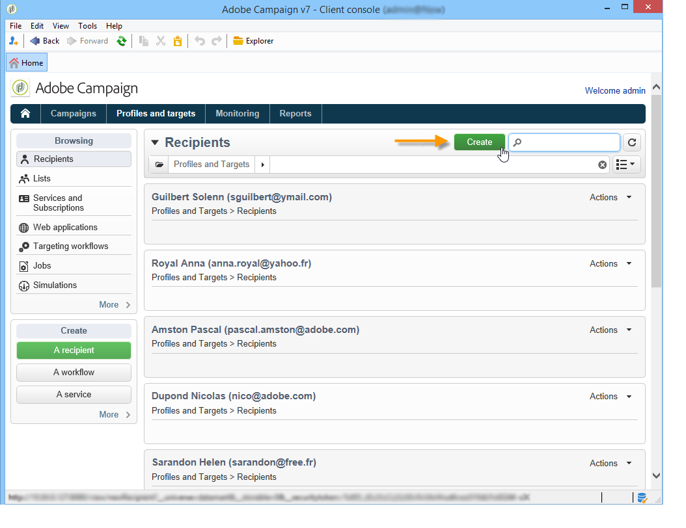

# Aggiungere profili{#adding-profiles}

Nella maggior parte dei casi, i profili sono [importati in Campaign tramite un flusso di lavoro](../../platform/using/import-export-workflows.md). È tuttavia possibile aggiungere uno o più profili direttamente dall&#39;interfaccia facendo clic sul pulsante **[!UICONTROL Create]**. Questi verranno poi aggiunti al database.

>[!NOTE]
>
>Per ulteriori informazioni su come creare profili nella console Adobe Campaign, consulta la [documentazione di Campaign v8.](https://experienceleague.adobe.com/it/docs/campaign-classic/using/getting-started/profile-management/adding-profiles){target=_blank}

<!--
Enter the information for this profile. The tabs and fields to be completed are described in [Editing a profile](../../platform/using/editing-a-profile.md).

Click **[!UICONTROL Save]** to validate profile creation. The profile is then added in Adobe Campaign database.
-->