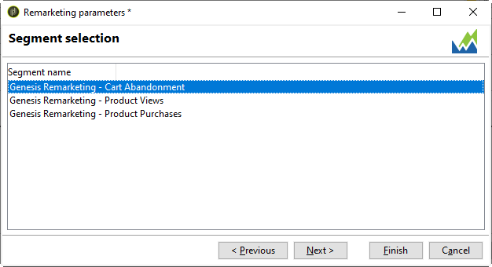

# Connettore Adobe Analytics{#adobe-analytics-connector}

## Informazioni sull’integrazione del connettore Adobe Analytics {#about-analytics-connector-integration}

Il connettore Adobe Analytics consente ad Adobe Campaign e Adobe Analytics di interagire attraverso il pacchetto **[!UICONTROL Web Analytics connectors]**. Invia dati ad Adobe Campaign sotto forma di segmenti relativi al comportamento degli utenti dopo una campagna. Al contrario, invia ad Adobe Analytics indicatori e attributi delle campagne distribuite da Adobe Campaign.

>[!CAUTION]
>
>* Il connettore Adobe Analytics non è compatibile con la messaggistica transazionale (Centro messaggi).
>
>* Prima di iniziare, assicurati che in Campaign sia implementato Adobe Identity Management System (IMS). [Per ulteriori informazioni, consulta questa pagina](../../integrations/using/about-adobe-id.md).

Utilizzando il connettore Adobe Analytics, Adobe Campaign ha un modo di misurare il pubblico Internet (analisi web). Grazie a queste integrazioni, Adobe Campaign può recuperare i dati sul comportamento dei visitatori per uno o più siti dopo una campagna di marketing e (dopo l’analisi) può eseguire campagne di remarketing per convertirli in acquirenti. Al contrario, gli strumenti di analisi web consentono ad Adobe Campaign di inoltrare indicatori e attributi della campagna alle proprie piattaforme.

I campi di azione per ogni strumento sono i seguenti:

* Ruolo di analisi web:

   1. contrassegna le campagne avviate con Adobe Campaign,
   1. salva sotto forma di segmenti il comportamento del destinatario sul sito visualizzato dopo aver fatto clic sulla campagna. I segmenti riguardano prodotti abbandonati (visualizzati ma non aggiunti al carrello o acquistati), acquisti o abbandoni del carrello.

* Ruolo di Adobe Campaign:

   1. invia gli indicatori e gli attributi della campagna al connettore, che a sua volta li inoltra allo strumento di analisi web,
   1. recupera e analizza i segmenti,
   1. attiva una campagna di remarketing.

## Configurare l’integrazione {#setting-up-the-integration}

>[!IMPORTANT]
>
> Per le implementazioni ibride e on-premise, assicurati di seguire i passaggi di provisioning descritti in questa [pagina](../../platform/using/adobe-analytics-provisioning.md).

Per impostare il connettore dati, è necessario connettersi all’istanza di Adobe Campaign ed eseguire le operazioni seguenti:

1. [Configurare le variabili di conversione e gli eventi di successo](#configure-conversion-success)
1. [Configurare l’account esterno in Adobe Campaign Classic](#external-account-classic)

<!--
### Create your Report suite in Adobe Analytics {#report-suite-analytics}

To set up the Adobe Analytics/Adobe Campaign Classic integration, you must connect to your [!DNL Adobe Analytics] instance and perform the following operations:

1. From [!DNL Adobe Analytics], select the **[!UICONTROL Admin tab]** then click **[!UICONTROL All admin]**.

   

1. Click **[!UICONTROL Report suites]**.

   

1. From the **[!UICONTROL Report suite manager]** page, click **[!UICONTROL Create new]** then **[!UICONTROL Report suite]**.

   For the detailed procedure on **[!UICONTROL Report suite]** creation, refer to this [section](https://experienceleague.adobe.com/docs/analytics/admin/manage-report-suites/new-report-suite/t-create-a-report-suite.html#prerequisites).

   

1. Select a template. 

1. Configure your new report suite with the following information:

   * **[!UICONTROL Report Suite ID]**
   * **[!UICONTROL Site Title]**
   * **[!UICONTROL Time Zone]**
   * **[!UICONTROL Go Live Date]**
   * **[!UICONTROL Estimated Page Views Per Day]**

   

1. When configured, click **[!UICONTROL Create report suite]**.
-->

### Configurare le variabili di conversione e gli eventi di successo {#configure-conversion-success}

Devi configurare **[!UICONTROL Conversion variables]** e **[!UICONTROL Success events]** come segue:

1. Seleziona la **[!UICONTROL Report suite]** che desideri collegare ad Adobe Campaign.

1. Dal pulsante **[!UICONTROL Edit settings]**, seleziona **[!UICONTROL Conversion]** > **[!UICONTROL Conversion variables]**.

   

1. Clic **[!UICONTROL Add new]** per creare gli identificatori necessari per misurare l’impatto della campagna, ovvero il nome della campagna interna (cid) e l’ID della tabella iNmsBroadlog (bid).

   Per informazioni su come modificare le **[!UICONTROL Conversion variables]**, consulta questa [sezione](https://experienceleague.adobe.com/docs/analytics/admin/admin-tools/conversion-variables/t-conversion-variables-admin.html#admin-tools).

   

1. Al termine della configurazione, fai clic su **[!UICONTROL Save]**.

1. Quindi, per creare **[!UICONTROL Success events]**, seleziona **[!UICONTROL Conversion]** > **[!UICONTROL Success events]** dal pulsante **[!UICONTROL Edit settings]**.

   

1. Fai clic su **[!UICONTROL Add new]** per configurare i seguenti **[!UICONTROL Success events]**:

   * **[!UICONTROL Clicked]**
   * **[!UICONTROL Opened]**
   * **[!UICONTROL Person clicks]**
   * **[!UICONTROL Processed]**
   * **[!UICONTROL Scheduled]**
   * **[!UICONTROL Sent]**
   * **[!UICONTROL Total bounces]**
   * **[!UICONTROL Unique Clicks]**
   * **[!UICONTROL Unique Opens]**
   * **[!UICONTROL Unsubscribed]**

   Per scoprire come configurare **[!UICONTROL Success events]**, fai riferimento a questo [sezione](https://experienceleague.adobe.com/docs/analytics/admin/admin-tools/success-events/t-success-events.html#admin-tools).

   >[!NOTE]
   >
   > Sono supportati solo **[!UICONTROL Success events]** di tipo numerico.

   

1. Al termine della configurazione, fai clic su **[!UICONTROL Save]**.

Dopo aver configurato **[!UICONTROL Conversion variables]** e **[!UICONTROL Success events]**, assicurati che le variabili siano incluse nel **[!UICONTROL Product Profile]** creato per il connettore Analytics. Per ulteriori informazioni, consulta [Creare un profilo di prodotto Adobe Analytics](../../platform/using/adobe-analytics-provisioning.md#analytics-product-profile).

Sarà quindi necessario configurare **[!UICONTROL External accounts]** in Adobe Campaign Classic.

### Configurare l’account esterno in Adobe Campaign Classic {#external-account-classic}

>[!IMPORTANT]
>
> Affinché questa integrazione funzioni, devi installare il pacchetto **[!UICONTROL Web Analytics connectors]** in Adobe Campaign.
>
>Per ulteriori informazioni sull’installazione del pacchetto, consulta questa [pagina](../../installation/using/installing-campaign-standard-packages.md).

Ora devi configurare l’account esterno **[!UICONTROL Web Analytics]** in Adobe Campaign per abilitare la sincronizzazione tra le due soluzioni.

Nota che se uno dei **[!UICONTROL Report suite]**, **[!UICONTROL Conversion variables]** o **[!UICONTROL Success events]** non è visibile durante la configurazione dell’account esterno, significa che manca un’autorizzazione per questo componente appena creato nel **[!UICONTROL Product profile]** associato all’utente.

Per ulteriori informazioni, consulta la pagina [Profili di prodotto per Adobe Analytics](https://experienceleague.adobe.com/docs/analytics/admin/admin-console/permissions/product-profile.html#product-profile-admins).

1. Vai alla cartella **[!UICONTROL Administration]** > **[!UICONTROL Platform]** > **[!UICONTROL External accounts]** della struttura Adobe Campaign e fai clic su **[!UICONTROL New]**.

   

1. Utilizza l’elenco a discesa per selezionare il tipo **[!UICONTROL Web Analytics]** e **[!UICONTROL Adobe Analytics]** dal menu a discesa **[!UICONTROL Integration]**.

   

1. Fai clic su **[!UICONTROL Configure]** accanto al menu a discesa **[!UICONTROL Integration]**.

1. Dalla finestra **[!UICONTROL Configure Analytics integration]**, mappa il tuo account esterno con la suite di rapporti fornendo le seguenti informazioni:

   * **[!UICONTROL E-Mail]**
   * **[!UICONTROL IMS Org]**
   * **[!UICONTROL Analytics Company]**
   * **[!UICONTROL Report Suite]**

1. Dalla categoria **[!UICONTROL eVars]**, mappa le due **[!UICONTROL Conversion variables]** configurate in [!DNL Adobe Analytics].

   

1. Dalla categoria **[!UICONTROL Events]**, mappa i dieci **[!UICONTROL Success events]** configurati in [!DNL Adobe Analytics].

1. Al termine della configurazione, fai clic su **[!UICONTROL Submit]**. Adobe Campaign creerà una **[!UICONTROL Data source]**, **[!UICONTROL Calculated metrics]**, **[!UICONTROL Remarketing segments]** e **[!UICONTROL Classifications]** nella **[!UICONTROL Report Suite]** mappata di Analytics.

   Al termine della sincronizzazione tra [!DNL Adobe Analytics] e Adobe Campaign, puoi chiudere la finestra.

1. Le impostazioni possono essere visualizzate dalla scheda **[!UICONTROL Data Settings]** della finestra **[!UICONTROL Configure Analytics integration]**.

   Utilizzando il pulsante **[!UICONTROL Sync]**, [!DNL Adobe Campaign] sincronizzerà le modifiche al nome effettuate in [!DNL Adobe Analytics]. Se il componente viene eliminato in [!DNL Adobe Analytics], il componente verrà barrato in [!DNL Adobe Campaign] o visualizzato con un messaggio **non trovato**.

   

1. Se necessario, puoi aggiungere o rimuovere segmenti dalla scheda **[!UICONTROL Update Segments]**.

1. Dall’**[!UICONTROL External account]**, fai clic sul collegamento **[!UICONTROL Enrich the formula...]** per modificare la formula di calcolo dell’URL per specificare le informazioni sull’integrazione dello strumento di analisi web (ID campagna) e i domini dei siti di cui è necessario tenere traccia dell’attività.

   

1. Specifica i nomi di dominio dei siti.

   

1. Fai clic su **[!UICONTROL Next]** e assicurati che i nomi di dominio siano stati salvati.

   

1. Se necessario, è possibile sovraccaricare la formula di calcolo. A questo scopo, seleziona la casella e modifica la formula direttamente nella finestra.

   >[!IMPORTANT]
   >
   >Questa modalità di configurazione è riservata agli utenti esperti: eventuali errori in questa formula potrebbero causare consegne interrotte.

1. La scheda **[!UICONTROL Advanced]** ti consente di configurare o modificare le impostazioni tecniche.

   * **[!UICONTROL Lifespan]**: consente di specificare il ritardo (in giorni) dopo il quale gli eventi web vengono recuperati in Adobe Campaign dai flussi di lavoro tecnici. Predefinito: 180 giorni.
   * **[!UICONTROL Persistence]**: consente di definire il periodo durante il quale tutti gli eventi web (ad esempio, un acquisto) possono essere attribuiti a una campagna di remarketing, predefinito: 7 giorni.

>[!NOTE]
>
>Se utilizzi diversi strumenti di misurazione del pubblico, puoi selezionare **[!UICONTROL Other]** nell’elenco a discesa **[!UICONTROL Partners]** durante la creazione dell’account esterno. Puoi fare riferimento a un solo account esterno nelle proprietà di consegna: sarà quindi necessario adattare la formula degli URL tracciati aggiungendo i parametri previsti dallo strumento di misurazione Adobe e da tutti gli altri strumenti di misurazione utilizzati.

### Flussi di lavoro tecnici dei processi di analisi web {#technical-workflows-of-web-analytics-processes}

Lo scambio di dati tra Adobe Campaign e Adobe Analytics è gestito da quattro flussi di lavoro tecnici che vengono eseguiti come attività in background.

Sono disponibili nella struttura Adobe Campaign, nella cartella **[!UICONTROL Administration]** > **[!UICONTROL Production]** > **[!UICONTROL Technical workflows]** > **[!UICONTROL Web analytics process]**.

* **[!UICONTROL Recovering of web events]**: una volta all’ora, questo flusso di lavoro scarica segmenti sul comportamento degli utenti su un dato sito, li include nel database di Adobe Campaign e avvia il flusso di lavoro di remarketing.
* **[!UICONTROL Event purge]**: questo flusso di lavoro ti consente di eliminare tutti gli eventi dal database a seconda del periodo configurato nel campo **[!UICONTROL Lifespan]**. Per ulteriori informazioni, consulta [Configurare l’account esterno in Adobe Campaign Classic](#external-account-classic).
* **[!UICONTROL Identification of converted contacts]**: directory dei visitatori che hanno effettuato un acquisto in seguito a una campagna di remarketing. I dati raccolti da questo flusso di lavoro sono accessibili nel rapporto **[!UICONTROL Re-marketing efficiency]**, fai riferimento a questa [pagina](#creating-a-re-marketing-campaign).
* **[!UICONTROL Sending of indicators and campaign attributes]**: consente di inviare gli indicatori della campagna tramite Adobe Campaign a Adobe Experience Cloud utilizzando il connettore Adobe Analytics. Questo flusso di lavoro viene attivato alle 4 del mattino ogni giorno e possono essere necessarie 24 ore per l’invio dei dati ad Analytics.

  Tieni presente che questo flusso di lavoro non deve essere riavviato altrimenti invierà nuovamente tutti i dati precedenti che possono distorcere i risultati di Analytics.

  Gli indicatori interessati sono i seguenti:

   * **[!UICONTROL Messages to deliver]** (@toDeliver)
   * **[!UICONTROL Processed]** (@processed)
   * **[!UICONTROL Success]** (@success)
   * **[!UICONTROL Total count of opens]** (@totalRecipientOpen)
   * **[!UICONTROL Recipients who have opened]** (@recipientOpen)
   * **[!UICONTROL Total number of recipients who clicked]** (@totalRecipientClick)
   * **[!UICONTROL People who clicked]** (@personClick)
   * **[!UICONTROL Number of distinct clicks]** (@recipientClick)
   * **[!UICONTROL Opt-Out]** (@optOut)
   * **[!UICONTROL Errors]** (@error)

  >[!NOTE]
  >
  >I dati inviati sono il delta basato sull’ultima istantanea che può portare a un valore negativo nei dati della metrica.

  Gli attributi inviati sono i seguenti:

   * **[!UICONTROL Internal name]** (@internalName)
   * **[!UICONTROL Label]** (@label)
   * **[!UICONTROL Label]** (operation/@label): solo se il pacchetto **Campaign** è installato
   * **[!UICONTROL Nature]** (operation/@nature): solo se il pacchetto **Campaign** è installato
   * **[!UICONTROL Tag 1]** (webAnalytics/@tag1)
   * **[!UICONTROL Tag 2]** (webAnalytics/@tag2)
   * **[!UICONTROL Tag 3]** (webAnalytics/@tag3)
   * **[!UICONTROL Contact date]** (scheduling/@contactDate)

## Tracciamento delle consegne in Adobe Campaign {#tracking-deliveries-in-adobe-campaign}

Affinché Adobe Experience Cloud sia in grado di monitorare l’attività sui siti una volta inviata la consegna da Adobe Campaign, è necessario fare riferimento al connettore corrispondente nelle proprietà di consegna. A questo scopo, esegui i seguenti passaggi:

1. Apri la consegna della campagna da tracciare.

   

1. Apri le proprietà di consegna.
1. Vai alla scheda **[!UICONTROL Web Analytics]** e seleziona l’account esterno creato in precedenza. Consulta [Configurare l’account esterno in Adobe Campaign Classic](#external-account-classic).

   

1. Ora puoi inviare la consegna e accedere al relativo rapporto in Adobe Analytics.

## Creazione di una campagna di remarketing {#creating-a-re-marketing-campaign}

Per preparare la campagna di remarketing, è sufficiente creare modelli di consegna da utilizzare per campagne di tipo remarketing. Quindi configura la tua campagna di remarketing e collegala a un segmento. Ogni segmento deve avere una campagna di remarketing diversa.

Le campagne di remarketing vengono avviate automaticamente una volta che Adobe Campaign ha completato il recupero dei segmenti analizzando il comportamento delle persone target della campagna iniziale. In caso di abbandono del carrello o di visualizzazione del prodotto senza acquisto, viene inviata una consegna ai destinatari interessati affinché la loro navigazione sul sito finisca con un acquisto.

Adobe Campaign fornisce modelli di consegna personalizzati su cui puoi utilizzare o creare un database per preparare le campagne.

1. Dalla cartella **[!UICONTROL Explorer]**, vai alla cartella **[!UICONTROL Resources]** > **[!UICONTROL Templates]** > **[!UICONTROL Delivery templates]** della struttura Adobe Campaign.

1. Duplica il modello **[!UICONTROL Email delivery (re-marketing)]** o gli esempi di modelli di remarketing offerti da Adobe Campaign.

   

1. Personalizza il modello in base alle tue esigenze e salvalo.

1. Crea una nuova campagna e seleziona il modello **[!UICONTROL Re-marketing campaign]** dall’elenco a discesa.

   

1. Fai clic sul collegamento **[!UICONTROL Configure...]** per specificare il segmento e il modello di consegna collegati alla campagna.

1. Seleziona l’account esterno configurato in precedenza.

   

1. Seleziona il segmento interessato.

   

1. Seleziona il modello di consegna da utilizzare per la campagna di remarketing, quindi fai clic su **[!UICONTROL Finish]** per chiudere la finestra.

   

1. Fai clic su **[!UICONTROL OK]** per chiudere la finestra della campagna.

Il rapporto **[!UICONTROL Re-marketing efficiency]** è accessibile tramite la pagina dei report globali. Ti consente di visualizzare il numero di contatti convertiti (ovvero che hanno acquistato qualcosa) in relazione al numero di abbandoni del carrello a seguito della campagna di remarketing Adobe Campaign. Il tasso di conversione viene calcolato per settimana, mese o dall’inizio della sincronizzazione tra gli strumenti di Adobe Campaign e analisi web.

