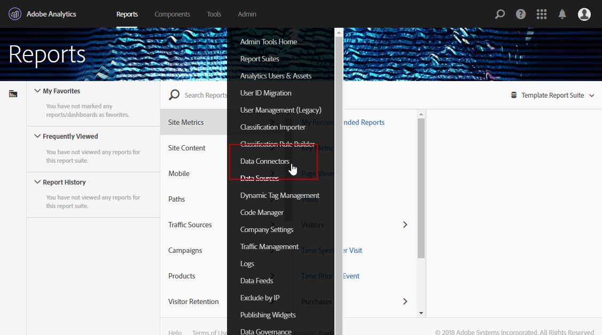

# Adobe  Analytics Data Connector{#adobe-analytics-data-connector}

## Informazioni sull&#39;integrazione del connettore dati {#about-data-connector-integration}

>[!IMPORTANT]
>
>Adobe  Analytics Data Connector non è compatibile con i messaggi transazionali (Centro messaggi).

Il Connettore dati (in precedenza denominato Adobe Genesis) consente  Adobe Campaign e Adobe  Analytics di interagire attraverso il pacchetto di connettori **Analytics** Web . Invia i dati a  Adobe Campaign sotto forma di segmenti relativi al comportamento degli utenti in seguito a una campagna e-mail. Al contrario, invia indicatori e attributi delle campagne e-mail distribuite da  Adobe Campaign ad Adobe  Analytics - Connettore dati.

Utilizzando il connettore dati,  Adobe Campaign ha un modo di misurare il pubblico Internet (Web  Analytics). Grazie a queste integrazioni,  Adobe Campaign può recuperare i dati sul comportamento dei visitatori per uno o più siti a seguito di una campagna di marketing e (dopo l&#39;analisi) eseguire campagne di remarketing per convertirli in acquirenti. Al contrario, gli strumenti di analisi Web consentono  Adobe Campaign di inoltrare indicatori e attributi della campagna alle proprie piattaforme.

Per ulteriori informazioni sull&#39;implementazione dell&#39;integrazione Adobe  Analytics con  Adobe Campaign, consultate questa [documentazione](https://helpx.adobe.com/marketing-cloud/how-to/analytics-ac.html).

I campi di azione per ciascuno strumento sono i seguenti:

* Ruolo dell&#39;analisi Web:

   1. contrassegna le campagne e-mail avviate con  Adobe Campaign,
   1. salva il comportamento del destinatario, sul sito visualizzato dopo aver fatto clic sul messaggio e-mail della campagna, sotto forma di segmenti. I segmenti riguardano prodotti abbandonati (visualizzati ma non aggiunti al carrello o acquistati), acquisti o abbandono del carrello.

*  ruolo  Adobe Campaign:

   1. invia gli indicatori e gli attributi della campagna al connettore, che a sua volta li inoltra allo strumento di analisi Web,
   1. recupera e analizza i segmenti,
   1. attiva una campagna di ricommercializzazione.

## Impostazione dell&#39;integrazione {#setting-up-the-integration}

Per configurare il connettore dati, è necessario connettersi all&#39;istanza del Adobe Campaign  ed eseguire le operazioni seguenti:

* [Passaggio 1: Configurare l&#39;integrazione in  Analytics](#step-1--configure-integration-in-analytics)
* [Passaggio 2: Creazione di un account esterno in Campaign](#step-2--create-the-external-account-in-campaign)
* [Passaggio 3: Sincronizzazione  Adobe Campaign e Adobe  Analytics](#step-3--synchronize-adobe-campaign-and-adobe-analytics)

### Passaggio 1: Configurare l&#39;integrazione in  Analytics {#step-1--configure-integration-in-analytics}

I passaggi seguenti descrivono la configurazione del connettore dati utilizzando una procedura guidata.

1. Accedi ad Adobe Experience Cloud utilizzando un Adobe ID  o una Enterprise ID .

   

1. Dall&#39;elenco  soluzioni Experience Cloud, selezionare **[!UICONTROL Analytics]**.

   

1. Dalla **[!UICONTROL Admin]** scheda, selezionare **[!UICONTROL Data Connectors]**.

   Per accedere al **[!UICONTROL Data Connectors]** menu è necessario disporre delle seguenti autorizzazioni  strumenti Analytics. For more on this, refer to this [page](https://docs.adobe.com/content/help/en/analytics/admin/admin-console/permissions/analytics-tools.html)
   * Integrazioni (Crea)
   * Integrazioni (aggiornamento)
   * Integrazioni (Elimina)
   

1. Dall&#39;elenco dei partner, selezionare **[!UICONTROL Adobe Campaign Classic]**.

   

1. Nella **[!UICONTROL Add integration]** finestra di dialogo, fate clic su **[!UICONTROL Activate]**.
1. Selezionare **[!UICONTROL I accept these terms and conditions]** e **[!UICONTROL Report suite]** collegare l&#39;integrazione e immettere l&#39;etichetta del connettore.

   Al termine, fate clic **[!UICONTROL Create and configure this integration]**.

   

1. Immettere l&#39;indirizzo e-mail che riceverà le notifiche per conto del connettore, quindi copiare l&#39; **[!UICONTROL Account ID]** aspetto visualizzato nell&#39;account del Adobe Campaign  esterno (per ulteriori informazioni, fare riferimento al [Passaggio 2: Create l&#39;account esterno in Campaign](#step-2--create-the-external-account-in-campaign).

   

1. Specificate gli identificatori necessari per misurare l’impatto della campagna e-mail, ad esempio il nome della campagna interna (cid) e l’ID tabella iNmsBroadlog (bid). È inoltre necessario specificare gli indicatori per gli eventi da raccogliere.
Accertatevi di **[!UICONTROL Events]** avere il tipo Numerico, altrimenti non verranno visualizzati nel menu a discesa.

   

1. Se necessario, specificate i segmenti personalizzati.

   

1. In **[!UICONTROL Data collection]**, selezionare un metodo per il recupero dei dati, in questo caso gli **[!UICONTROL cid]** identificatori e **[!UICONTROL bid]** gli identificatori specificati al punto 6.

   

1. Selezionate le informazioni da visualizzare nel dashboard.

   

1. Controllare la configurazione nella pagina che riassume i passaggi precedenti.

   

1. Fare clic **[!UICONTROL Activate Now]** per approvare la configurazione e attivare il connettore.

   

   Il connettore dati è ora configurato.

### Passaggio 2: Creazione di un account esterno in Campaign {#step-2--create-the-external-account-in-campaign}

L&#39;integrazione di  Adobe Campaign nelle piattaforme Analytics  viene eseguita utilizzando un connettore. Per sincronizzare le applicazioni, eseguite il seguente processo:

1. Installate il pacchetto **Web  connettori** Analytics in  Adobe Campaign.
1. Passate alla **[!UICONTROL Administration > Platform > External accounts]** cartella della struttura  Adobi Campaign.
1. Fare clic con il pulsante destro del mouse sull&#39;elenco degli account esterni e selezionarlo **[!UICONTROL New]** nel menu a discesa (oppure fare clic sul **[!UICONTROL New]** pulsante sopra l&#39;elenco degli account esterni).
1. Utilizzare l&#39;elenco a discesa per selezionare il **[!UICONTROL Web Analytics]** tipo.
1. Selezionare il fornitore del connettore, in questo **[!UICONTROL Adobe Analytics - Data Connector]** caso.

   

1. Fate clic sul **[!UICONTROL Enrich the formula...]** collegamento per modificare la formula di calcolo dell&#39;URL per specificare le informazioni sull&#39;integrazione dello strumento di analisi Web (ID campagna) e i domini dei siti la cui attività deve essere tracciata.
1. Specificate i nomi di dominio dei siti.

   

1. Fare clic su **[!UICONTROL Next]** e assicurarsi che i nomi di dominio siano stati salvati.

   

1. Se necessario, è necessario sovraccaricare la formula di calcolo. A questo scopo, selezionare la casella e modificare la formula direttamente nella finestra.

   

   >[!IMPORTANT]
   >
   >Questa modalità di configurazione è riservata agli utenti esperti: eventuali errori nella formula potrebbero causare l&#39;interruzione delle consegne tramite e-mail.

1. La **[!UICONTROL Advanced]** scheda consente di configurare o modificare altre impostazioni tecniche.

   * **[!UICONTROL Lifespan]**: consente di specificare il ritardo (in giorni_ dopo il quale gli eventi Web recuperati in  Adobe Campaign da flussi di lavoro tecnici. Predefinito: 180 giorni.
   * **[!UICONTROL Persistence]**: consente di specificare il periodo durante il quale tutti gli eventi Web (ad esempio un acquisto) possono essere attribuiti a una campagna di ricommercializzazione, Default: 7 giorni.

>[!NOTE]
>
>Se utilizzate diversi strumenti di misurazione del pubblico, potete selezionarli **[!UICONTROL Other]** nell&#39;elenco a **[!UICONTROL Partners]** discesa al momento della creazione dell&#39;account esterno. È possibile fare riferimento a un solo account esterno nelle proprietà di consegna: sarà quindi necessario adattare la formula degli URL tracciati aggiungendo i parametri previsti da Adobe e da tutti gli altri strumenti di misurazione utilizzati.

### Passaggio 3: Sincronizzazione  Adobe Campaign e Adobe  Analytics {#step-3--synchronize-adobe-campaign-and-adobe-analytics}

Dopo aver creato l&#39;account esterno, è necessario sincronizzare entrambe le applicazioni.

1. Passate all&#39;account esterno creato in precedenza.
1. Modificate l&#39;account **[!UICONTROL Label]** in base alle vostre esigenze.
1. Modificare l&#39; **[!UICONTROL Internal name]** in modo che corrisponda al valore **[!UICONTROL Name]** scelto durante la configurazione del connettore dati.

   

1. Fate clic sul **[!UICONTROL Approve connection]** collegamento.

   

   Assicurarsi che le **[!UICONTROL Internal name]** corrispondenze **[!UICONTROL Name]** specificate nella procedura guidata di configurazione del connettore dati.

1. Immettere **[!UICONTROL Account ID]** nella procedura guidata di configurazione Connettore dati.

   

1. Seguire i passaggi descritti nella guida alla procedura guidata Connettore dati, quindi tornare all&#39;account esterno in  Adobe Campaign.
1. Fare clic **[!UICONTROL Next]** per lo scambio di dati tra  Adobe Campaign e Adobe  Analytics - Connettore dati.

   L&#39;elenco dei segmenti viene visualizzato al termine della sincronizzazione.

   

Quando la sincronizzazione dei dati tra  Adobe Campaign e Adobe  Analytics - Connettore dati è effettiva, i tre segmenti predefiniti definiti nella procedura guidata Connettore dati vengono recuperati   e diventano accessibili nella **[!UICONTROL Segments]** scheda dell&#39;account esterno  Adobe Campaign.

Se sono stati configurati altri segmenti nella procedura guidata Connettore dati, puoi aggiungerli al Adobe Campaign . A questo scopo, fate clic sul **[!UICONTROL Update segment list]** collegamento e seguite i passaggi descritti nella procedura guidata dell&#39;account esterno. Una volta eseguita l&#39;operazione, i nuovi segmenti saranno visualizzati nell&#39;elenco.

### Flussi di lavoro tecnici dei processi di analisi Web {#technical-workflows-of-web-analytics-processes}

Scambio di dati tra  Adobe Campaign e Adobe  Analytics - Il connettore dati è gestito da quattro flussi di lavoro tecnici che vengono eseguiti come attività in background.

Sono disponibili nella struttura  Adobi Campaign, sotto la **[!UICONTROL Administration > Production > Technical workflows > Web analytics process]** cartella.

* **[!UICONTROL Recovering of web events]**: una volta all’ora, questo flusso di lavoro scarica i segmenti sul comportamento degli utenti in un dato sito, li include nel database del Adobe Campaign  e avvia il flusso di lavoro di remarketing.
* **[!UICONTROL Event purge]**: questo flusso di lavoro consente di eliminare tutti gli eventi dal database a seconda del periodo configurato nel **[!UICONTROL Lifespan]** campo. Per maggiori informazioni, consulta il [Passaggio 2: Create l&#39;account esterno in Campaign](#step-2--create-the-external-account-in-campaign).
* **[!UICONTROL Identification of converted contacts]**: directory dei visitatori che hanno effettuato un acquisto in seguito a una campagna di remarketing. I dati raccolti da questo flusso di lavoro sono accessibili nel **[!UICONTROL Re-marketing efficiency]** rapporto, fare riferimento a questa [pagina](#creating-a-re-marketing-campaign).
* **[!UICONTROL Sending of indicators and campaign attributes]**: consente di inviare gli indicatori delle campagne e-mail tramite  Adobe Campaign ad Adobe Experience Cloud utilizzando Adobe  Analytics - Connettore dati. Questo flusso di lavoro viene attivato ogni giorno alle 4 del mattino e potrebbe essere necessario attendere 24 ore prima che i dati vengano inviati a  Analytics.

   Il flusso di lavoro non deve essere riavviato oppure tutti i dati precedenti che possono distorcere  risultati di Analytics verranno inviati di nuovo.

   Gli indicatori interessati sono:

   * **[!UICONTROL Messages to deliver]** (@toDeliver)
   * **[!UICONTROL Processed]** (@processed)
   * **[!UICONTROL Success]** (@success)
   * **[!UICONTROL Total count of opens]** (@totalRecipientOpen)
   * **[!UICONTROL Recipients who have opened]** (@destinatarioOpen)
   * **[!UICONTROL Total number of recipients who clicked]** (@totalRecipientClick)
   * **[!UICONTROL People who clicked]** (@personaClic)
   * **[!UICONTROL Number of distinct clicks]** (@destinatarioClick)
   * **[!UICONTROL Opt-Out]** (@optOut)
   * **[!UICONTROL Errors]** (@error)
   >[!NOTE]
   >
   >I dati inviati sono il delta basato sull&#39;ultima istantanea che potrebbe portare a un valore negativo nei dati delle metriche.

   Gli attributi inviati sono i seguenti:

   * **[!UICONTROL Internal name]** (@internalName)
   * **[!UICONTROL Label]** (@label)
   * **[!UICONTROL Label]** (operation/@label): solo se il pacchetto **Campaign** è installato
   * **[!UICONTROL Nature]** (operation/@nature): solo se il pacchetto **Campaign** è installato
   * **[!UICONTROL Tag 1]** (webAnalytics/@tag1)
   * **[!UICONTROL Tag 2]** (webAnalytics/@tag2)
   * **[!UICONTROL Tag 3]** (webAnalytics/@tag3)
   * **[!UICONTROL Contact date]** (Pianificazione/@contactDate)

## Tracciamento delle consegne nel  Adobe Campaign {#tracking-deliveries-in-adobe-campaign}

Affinché Adobe Experience Cloud possa tenere traccia dell&#39;attività sui siti una volta che la consegna viene inviata dal  Adobe Campaign, è necessario fare riferimento al connettore corrispondente nelle proprietà di consegna. A questo scopo, eseguire i seguenti passaggi:

1. Aprite la distribuzione della campagna da monitorare.

   

1. Aprite le proprietà di consegna.
1. Vai alla **[!UICONTROL Web Analytics]** scheda e seleziona l&#39;account esterno creato in precedenza. Fare riferimento al [passaggio 2: Create l&#39;account esterno in Campaign](#step-2--create-the-external-account-in-campaign).

   

1. Ora puoi inviare la consegna e accedere al report in Adobe  Analytics.

## Creazione di una campagna di ricommercializzazione {#creating-a-re-marketing-campaign}

Per preparare la campagna di ricommercializzazione, è sufficiente creare dei modelli di consegna da utilizzare per campagne di tipo remarketing. Quindi configura la tua campagna di ricommercializzazione e collegala a un segmento. Ogni segmento deve avere una campagna di ricommercializzazione diversa.

Le campagne di ricommercializzazione vengono avviate automaticamente una volta che  Adobe Campaign ha terminato di recuperare i segmenti che analizzano il comportamento delle persone a cui viene assegnato il targeting per la campagna iniziale. In caso di abbandono del carrello o di visualizzazione del prodotto senza acquisto, viene inviata una consegna ai destinatari interessati affinché la loro navigazione sul sito finisca in un acquisto.

 Adobe Campaign offre modelli personalizzati per la distribuzione, che potete utilizzare come database per preparare le campagne.

1. Dalla struttura **[!UICONTROL Explorer]**, passate alla **[!UICONTROL Resources > Templates > Delivery templates]** cartella della struttura  Adobi Campaign.
1. Duplica il **[!UICONTROL Email delivery (re-marketing)]** modello o gli esempi di modello di remarketing offerti dal Adobe Campaign .
1. Personalizzate il modello in base alle vostre esigenze e salvatelo.

   

1. Create una nuova campagna e selezionate il **[!UICONTROL Re-marketing campaign]** modello dall&#39;elenco a discesa.

   

1. Fate clic sul **[!UICONTROL Configure...]** collegamento per specificare il segmento e il modello di consegna collegati alla campagna.
1. Selezionate l&#39;account esterno configurato in precedenza.

   

1. Selezionare il segmento interessato.

   

1. Selezionate il modello di consegna da utilizzare per la campagna di remarketing, quindi fate clic **[!UICONTROL Finish]** per chiudere la finestra.

   

1. Fate clic **[!UICONTROL OK]** per chiudere la finestra della campagna.

Il **[!UICONTROL Re-marketing efficiency]** rapporto è accessibile dalla pagina dei report globali. Consente di visualizzare il numero di contatti convertiti (ovvero che hanno acquistato qualcosa) in relazione al numero di abbandoni del carrello a seguito della campagna di ricommercializzazione  Adobe Campaign. Il tasso di conversione è calcolato ogni settimana, mese o dall&#39;inizio della sincronizzazione tra gli strumenti di analisi Adobe Campaign e Web .

