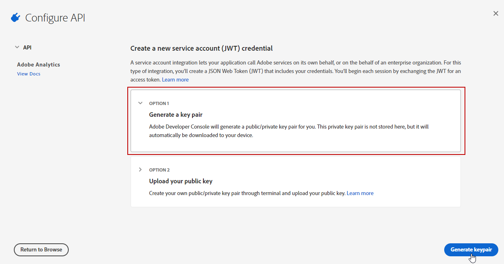

# Provisioning del connettore Adobe Analytics {#adobe-analytics-connector-provisioning}

>[!CAUTION]
>
> Questi passaggi devono essere eseguiti solo da implementazioni ibride e on-premise.
>
>Per le implementazioni in hosting e Campaign Managed Services, contatta [Assistenza clienti Adobe](https://helpx.adobe.com/it/enterprise/admin-guide.html/enterprise/using/support-for-experience-cloud.ug.html) team.

L’integrazione tra l’autenticazione di Adobe Campaign Classic e Adobe Analytics supporta Adobe Identity Management Service (IMS):

* Se gestisci un account esterno migrato, devi implementare Adobe IMS e connetterti ad Adobe Campaign tramite un Adobe ID.

  L’utente connesso tramite Adobe ID IMS deve essere il proprietario del **Connettore dati** in Adobe Analytics e di disporre delle autorizzazioni necessarie per **Profilo di prodotto** ha menzionato [sotto](#analytics-product-profile).

Il problema era che il proprietario del connettore dati era un utente diverso da quello che aveva effettuato l’accesso a Campaign e che stava tentando l’integrazione con Analytics.

* Se implementi un nuovo connettore, l’implementazione di Adobe IMS è facoltativa. Senza un utente Adobe ID, Adobe Campaign utilizzerà un utente tecnico per la sincronizzazione con Adobe Analytics.

Affinché questa integrazione funzioni, devi creare un profilo di prodotto Adobe Analytics che verrà utilizzato esclusivamente per il connettore Analytics. Quindi, dovrai creare un progetto di Adobe I/O.

>[!AVAILABILITY]
>
> Il codice JWT (JSON Web Tokens) è attualmente in fase di ammortamento e viene sostituito con OAuth. La transizione viene eseguita progressivamente nelle prossime versioni di Campaign e la documentazione verrà aggiornata per riflettere tali aggiornamenti.

## Creare un profilo di prodotto Adobe Analytics {#analytics-product-profile}

Il profilo prodotto determina il livello di accesso di un utente ai diversi componenti di Analytics.

Se disponi già di un profilo di prodotto Analytics, devi comunque creare un nuovo profilo di prodotto Adobe Analytics utilizzato esclusivamente per il connettore Analytics. In questo modo il tuo profilo di prodotto sarà impostato con le autorizzazioni corrette per questa integrazione.

Per ulteriori informazioni sui profili di prodotto, consulta [Documentazione di Admin Console](https://helpx.adobe.com/mt/enterprise/admin-guide.html).

1. Dalla sezione [Admin Console](https://adminconsole.adobe.com/), seleziona il tuo Adobe Analytics **[!UICONTROL Product]**.

   

1. Fai clic su **[!UICONTROL New Profile]**.

   

1. Aggiungi un **[!UICONTROL Product profile name]**, si consiglia di utilizzare la sintassi seguente: `reserved_campaign_classic_<Company Name>`. Quindi, fai clic su **[!UICONTROL Next]**.

   Questo **[!UICONTROL Product profile]** deve essere utilizzato esclusivamente per il connettore Analytics per evitare errori di configurazione.

1. Apri il nuovo **[!UICONTROL Product profile]** e seleziona la **[!UICONTROL Permissions]** scheda.

   

1. Configurare le diverse funzionalità facendo clic su **[!UICONTROL Edit]** e seleziona le autorizzazioni da assegnare al tuo **[!UICONTROL Product profile]** facendo clic sull&#39;icona più (+).

   Per ulteriori informazioni su come gestire le autorizzazioni, consulta [Documentazione di Admin Console](https://helpx.adobe.com/mt/enterprise/using/manage-permissions-and-roles.html).

1. Per **[!UICONTROL Report Suites]** , aggiungi **[!UICONTROL Report Suites]** in seguito sarà necessario utilizzare.

   Se non disponi di suite di rapporti, puoi crearle come segue [questi passaggi](../../platform/using/gs-aa.md).

   

1. Per **[!UICONTROL Metrics]** , aggiungi **[!UICONTROL Metrics]** dovrai configurare in seguito.

   Se necessario, puoi attivare l’opzione di inclusione automatica, che consente di aggiungere tutti gli elementi di autorizzazione all’elenco incluso e automaticamente quelli nuovi.

   

1. Per **[!UICONTROL Dimensions]** , aggiungi **[!UICONTROL Dimensions]** necessario per la configurazione futura.

   Assicurati che i Dimension scelti corrispondano a quelli da configurare nell’account esterno e allinearli al numero eVar corrispondente di Adobe Analytics.

1. Per **[!UICONTROL Report Suite Tools]** , aggiungi le seguenti autorizzazioni:

   * **[!UICONTROL Report suite Mgmt]**
   * **[!UICONTROL Conversion variables]**
   * **[!UICONTROL Success events]**
   * **[!UICONTROL Custom data Warehouse report]**
   * **[!UICONTROL Data sources manager]**
   * **[!UICONTROL Classifications]**

1. Per **[!UICONTROL Analytics Tools]** , aggiungi le seguenti autorizzazioni:

   * **[!UICONTROL Code Manager - Web services]**
   * **[!UICONTROL Logs - Web services]**
   * **[!UICONTROL Web services]**
   * **[!UICONTROL Web service access]**
   * **[!UICONTROL Calculated metric creation]**
   * **[!UICONTROL Segment creation]**

Il tuo profilo di prodotto è ora configurato. Quindi devi creare il progetto Adobe I/O.

## Crea progetto di Adobe I/O {#create-adobe-io}

1. Accedi all’Adobe I/O e accedi come **Amministratore di sistema** della tua organizzazione.

   Per ulteriori informazioni sui ruoli di amministratore, consulta questa [pagina](https://helpx.adobe.com/enterprise/using/admin-roles.html).

1. Fai clic su **[!UICONTROL Create a new project]**.

   

1. Clic **[!UICONTROL Add to Project]** e seleziona **[!UICONTROL API]**.

   

1. Seleziona [!DNL Adobe Analytics] e fai clic su **[!UICONTROL Next]**.

   

1. Scegli **[!UICONTROL Service Account (JWT)]** come tipo di autenticazione e fai clic su **[!UICONTROL Next]**.

   

1. Seleziona la **[!UICONTROL Option 1: Generate a Key-Pair]** e fai clic su **[!UICONTROL Generate a Key-Pair]**.

   Il file config.zip verrà quindi scaricato automaticamente.

   

1. Fai clic su **[!UICONTROL Next]**.

   

1. Seleziona la **[!UICONTROL Product profile]** create nei passaggi precedenti descritti in questo [sezione](#analytics-product-profile).

1. Quindi, fai clic su **[!UICONTROL Save Configured API]**.

   

1. Dal progetto, seleziona [!DNL Adobe Analytics] e copia le seguenti informazioni in **[!UICONTROL Service Account (JWT)]**:

   * **[!UICONTROL Client ID]**
   * **[!UICONTROL Client Secret]**
   * **[!UICONTROL Technical account ID]**
   * **[!UICONTROL Organization ID]**

   

1. Utilizza la chiave privata generata nel passaggio 6.

   Se hai già configurato Triggers utilizzando queste credenziali, la chiave privata deve essere la stessa per questa configurazione del connettore.

1. Codifica la chiave privata utilizzando il comando seguente: `base64 ./private.key > private.key.base64`. Il contenuto base64 verrà salvato in un nuovo file `private.key.base64`.

   >[!NOTE]
   >
   >Talvolta è possibile aggiungere automaticamente righe supplementari quando si copia/incolla la chiave privata. Ricordati di rimuoverlo prima di codificare la chiave privata.

1. Copia il contenuto dal file `private.key.base64`.

1. Accedi tramite SSH a ogni contenitore in cui è installata l’istanza di Adobe Campaign e aggiungi le credenziali del progetto in Adobe Campaign eseguendo il seguente comando come `neolane` utente. Verrà inserito il **[!UICONTROL Technical Account]** credenziali nel file di configurazione dell’istanza.

   ```
   nlserver config -instance:<instance name> -setimsjwtauth:Organization_Id/Client_Id/Technical_Account_ID/<Client_Secret>/<Base64_encoded_Private_Key>
   ```

Ora puoi iniziare a utilizzare il connettore Analytics e tenere traccia dei comportamenti dei clienti.
