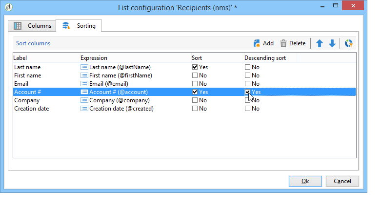

# Gestire e personalizzare gli elenchi{#manage-and-customize-lists}

Puoi accedere agli elenchi dei record nel database di Campaign utilizzando Explorer. Puoi filtrare questi elenchi, eseguire ricerche, aggiungere informazioni, filtrare e ordinare i dati.

## Conteggio dei record {#counting-records}

Per impostazione predefinita, Adobe Campaign carica i primi 200 record di un elenco. Ciò significa che la visualizzazione non mostra necessariamente tutti i record della tabella visualizzata. È possibile eseguire un conteggio del numero di record nell&#39;elenco e caricare altri record.

Nella parte in basso a destra della schermata dell&#39;elenco, un **[!UICONTROL counter]** mostra il numero di record caricati e il numero totale di record nel database (dopo l&#39;applicazione di filtri):

Se un &quot;**?Viene visualizzato**&quot; invece del numero a destra, fare clic sul contatore per avviare il calcolo.

### Carica altri record {#loading-more-records}

Per caricare (e quindi visualizzare) record aggiuntivi (200 righe per impostazione predefinita) fare clic su **[!UICONTROL Continue loading]**.

Per caricare tutti i record, fare clic con il pulsante destro del mouse sull&#39;elenco e selezionare **[!UICONTROL Load all]**.

>[!CAUTION]
>
>A seconda del numero di record, il tempo per il caricamento dell&#39;elenco completo può essere lungo.

### Modifica il numero predefinito di record {#change-default-number-of-records}

Per modificare il numero predefinito di record caricati, fare clic su **[!UICONTROL Configure list]** nell&#39;angolo inferiore destro dell&#39;elenco.

Nella finestra di configurazione dell&#39;elenco, fare clic su **[!UICONTROL Advanced parameters]** (in basso a sinistra) e modificare il numero di righe da recuperare.

## Configurare gli elenchi {#configuring-lists}

### Aggiungi colonne {#add-columns}

Esistono due modi per aggiungere una colonna in un elenco.

È possibile aggiungere rapidamente una colonna a un elenco dai dettagli di un record. Per eseguire questa operazione:

1. In una schermata di dettaglio, fare clic con il pulsante destro del mouse sul campo che si desidera visualizzare in una colonna.
1. Seleziona **[!UICONTROL Add in the list]**.

   La colonna viene aggiunta a destra delle colonne esistenti.

Un altro modo per aggiungere colonne, ad esempio per visualizzare dati non visualizzati nella schermata di dettaglio, consiste nell&#39;utilizzare la finestra di configurazione dell&#39;elenco. Per eseguire questa operazione:

1. Fai clic su **[!UICONTROL Configure list]** qui sotto e a destra dell&#39;elenco.

   

1. Nella finestra di configurazione dell&#39;elenco, fare doppio clic sul campo da aggiungere all&#39;elenco **[!UICONTROL Available fields]** per aggiungerlo a **[!UICONTROL Output columns]**.

   

   >[!NOTE]
   >
   >Per impostazione predefinita, i campi avanzati non vengono visualizzati. Per visualizzarli, fare clic su **Visualizza campi avanzati** di seguito e a destra dell&#39;elenco dei campi disponibili.
   >
   >Le etichette vengono visualizzate in ordine alfabetico per tabella.
   >
   >Utilizza il campo **Ricerca** per eseguire una ricerca nei campi disponibili. Per ulteriori informazioni, consultare [questa sezione](#sorting-a-list).
   >
   >I campi sono identificati da icone specifiche: campi SQL, tabelle collegate, campi calcolati e così via. Per ogni campo selezionato, la descrizione viene visualizzata nell’elenco dei campi disponibili. [Ulteriori informazioni](#configuring-lists).
   >
   >Puoi anche ordinare e filtrare i dati. Consulta [questa sezione](../../platform/using/filtering-options.md).

1. Ripetere l&#39;operazione per ogni colonna da visualizzare.
1. Utilizza le frecce per modificare l&#39;**ordine di visualizzazione**. La colonna più alta si troverà a sinistra nell&#39;elenco dei record.

   

1. Se necessario, è possibile fare clic su **[!UICONTROL Distribution of values]** per visualizzare la partizione dei valori per il campo selezionato nella cartella corrente.

   

1. Fare clic su **[!UICONTROL OK]** per confermare la configurazione e visualizzare il risultato.

### Crea una nuova colonna {#create-a-new-column}

È possibile creare nuove colonne per visualizzare ulteriori campi nell&#39;elenco. Per eseguire questa operazione:

1. Fai clic su **[!UICONTROL Configure the list]** in basso a destra dell&#39;elenco.
1. Fare clic su **[!UICONTROL Add]** per visualizzare un nuovo campo nell&#39;elenco.

### Rimuovere una colonna {#remove-a-column}

È possibile mascherare una o più colonne di un elenco di record utilizzando **[!UICONTROL Configure list]** situato sotto e a destra dell&#39;elenco.

Nella finestra di configurazione dell&#39;elenco selezionare la colonna da mascherare dalla zona **[!UICONTROL Output columns]** e fare clic sul pulsante Elimina.

Ripetere l&#39;operazione per ogni colonna da mascherare. Fare clic su **[!UICONTROL OK]** per confermare la configurazione e visualizzare il risultato.

### Regola larghezza colonna {#adjust-column-width}

Quando un elenco è attivo, ovvero è selezionata almeno una riga, è possibile utilizzare F9 per regolare la larghezza delle colonne in modo da visualizzare tutte le colonne sullo schermo.

### Visualizza dati in sottocartelle {#display-sub-folders-records}

Gli elenchi possono essere visualizzati:

* i record contenuti solo nella cartella selezionata;
* Oppure i record della cartella selezionata E delle relative sottocartelle.

Per passare da una modalità di visualizzazione all&#39;altra, fare clic su **[!UICONTROL Display sub-levels]** nella barra degli strumenti.

## Salvare una configurazione elenco {#saving-a-list-configuration}

Le configurazioni degli elenchi sono definite localmente a livello di workstation. Quando la cache locale viene cancellata, le configurazioni locali vengono disabilitate.

Per impostazione predefinita, i parametri di visualizzazione definiti si applicano a tutti gli elenchi con il tipo di cartella corrispondente. Pertanto, quando modifichi la modalità di visualizzazione dell’elenco dei destinatari da una cartella, questa configurazione verrà applicata a tutte le altre cartelle dei destinatari.

È tuttavia possibile salvare più configurazioni da applicare a cartelle diverse dello stesso tipo. La configurazione viene salvata con le proprietà della cartella contenente i dati e può essere riapplicata.

Ad esempio, per una cartella di consegna, è possibile configurare la visualizzazione seguente:

Per salvare la configurazione dell’elenco in modo che possa essere riutilizzata, effettua le seguenti operazioni:

1. Fare clic con il pulsante destro del mouse sulla cartella contenente i dati visualizzati.
1. Seleziona **[!UICONTROL Properties]**.
1. Fare clic su **[!UICONTROL Advanced settings]** e quindi specificare un nome nel campo **[!UICONTROL Configuration]**.

   

1. Fare clic su **[!UICONTROL OK]** e quindi su **[!UICONTROL Save]**.

Puoi quindi applicare questa configurazione a un&#39;altra cartella **Delivery**:

Fare clic su **[!UICONTROL Save]** nella finestra proprietà cartella. La visualizzazione dell’elenco viene modificata in modo che corrisponda alla configurazione specificata:

## Esportare un elenco {#exporting-a-list}

Per esportare dati da un elenco, è necessario utilizzare un assistente per l&#39;esportazione. Per accedervi, selezionare gli elementi da esportare dall&#39;elenco, fare clic con il pulsante destro del mouse e selezionare **[!UICONTROL Export...]**.

L&#39;utilizzo delle funzioni di importazione ed esportazione è illustrato in [Importazioni ed esportazioni generiche](../../platform/using/about-generic-imports-exports.md).

>[!CAUTION]
>
>Gli elementi di un elenco non devono essere esportati utilizzando la funzione Copia/Incolla.

## Ordinare un elenco {#sorting-a-list}

Gli elenchi possono contenere una grande quantità di dati. Puoi ordinare questi dati o applicare filtri semplici o avanzati. L’ordinamento consente di visualizzare i dati in ordine crescente o decrescente. I filtri ti consentono di definire e combinare criteri per visualizzare solo i dati selezionati.

Fai clic sull’intestazione della colonna per applicare un ordinamento crescente o decrescente oppure per annullare l’ordinamento dei dati. Lo stato e l’ordinamento attivi sono indicati da una freccia blu prima dell’etichetta della colonna. Un trattino rosso prima dell’etichetta della colonna indica che l’ordinamento viene applicato ai dati indicizzati dal database. Questo metodo di ordinamento viene utilizzato per ottimizzare i processi di ordinamento.

È inoltre possibile configurare criteri di ordinamento o combinare criteri di ordinamento. A questo scopo, segui la procedura indicata di seguito:

1. **[!UICONTROL Configure list]** di seguito e a destra dell&#39;elenco.

   

1. Nella finestra di configurazione dell&#39;elenco fare clic sulla scheda **[!UICONTROL Sorting]**.
1. Selezionare i campi da ordinare e la direzione di ordinamento (crescente o decrescente).

   

1. La priorità di ordinamento è definita dall&#39;ordine delle colonne di ordinamento. Per modificare la priorità, utilizzare le icone appropriate per modificare l&#39;ordine delle colonne.

   

   La priorità di ordinamento non influisce sulla visualizzazione delle colonne nell’elenco.

1. Fare clic su **[!UICONTROL Ok]** per confermare questa configurazione e visualizzare il risultato nell&#39;elenco.

### Ricerca di elementi {#running-a-search}

È possibile eseguire una ricerca dei campi disponibili in un editor utilizzando il campo **[!UICONTROL Search]** situato sopra l&#39;elenco dei campi. Premi **Invio** sulla tastiera o sfoglia l&#39;elenco. I campi corrispondenti alla ricerca avranno etichette in grassetto.

>[!NOTE]
>
>È possibile creare filtri per visualizzare solo alcuni dei dati di un elenco. [Ulteriori informazioni](../../platform/using/creating-filters.md).
