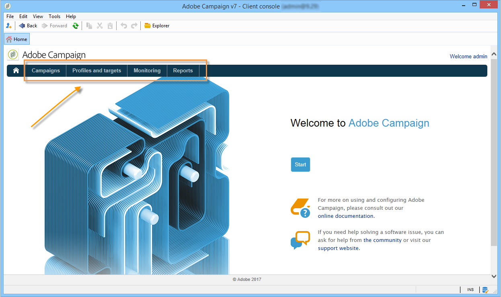

# Area di lavoro di Adobe Campaign{#adobe-campaign-workspace}

## Esplora l’interfaccia di Adobe Campaign {#about-adobe-campaign-interface}

Una volta connesso al database, accedi alla home page di Adobe Campaign, che è una dashboard: è costituita da collegamenti e scelte rapide che ti consentono di accedere alle funzionalità, a seconda dell’installazione e delle configurazioni generali della piattaforma.

Dalla sezione centrale della home page, puoi utilizzare i collegamenti per accedere al portale della documentazione online di Campaign, al forum e al sito web di supporto.

 Scopri l&#39;area di lavoro di Campaign in [video](#video)

>[!NOTE]
>
>Le funzionalità di Adobe Campaign disponibili nell’istanza dipendono dai moduli e dai componenti aggiuntivi installati. Alcuni di essi potrebbero anche non essere disponibili, a seconda delle autorizzazioni e delle configurazioni specifiche.
>
>Prima di installare qualsiasi modulo o componente aggiuntivo, è necessario verificare il contratto di licenza o contattare il responsabile commerciale di Adobe.

### Console e accesso web {#console-and-web-access}

La piattaforma Adobe Campaign è accessibile tramite una console o un browser Internet. Vedere i browser compatibili nella [matrice di compatibilità](../../rn/using/compatibility-matrix.md#Browsers).

L’interfaccia di accesso web è simile all’interfaccia della console. Da un browser, puoi utilizzare le stesse funzioni di navigazione e visualizzazione della console, ma puoi eseguire solo un set ridotto di azioni sulle campagne. Ad esempio, puoi visualizzare e annullare le campagne, ma non puoi modificarle. Per un determinato operatore, viene visualizzata una campagna con le seguenti opzioni nella console:

Mentre con l’accesso web, le opzioni consentono principalmente la visualizzazione di:

Ulteriori informazioni su [tramite l&#39;interfaccia Web](../../campaign/using/accessing-marketing-campaigns.md#using-the-web-interface-).

### Lingue {#languages}

La lingua viene selezionata al momento dell’installazione dell’istanza di Adobe Campaign Classic.

Puoi scegliere tra cinque lingue diverse:

* Inglese (Regno Unito)
* Inglese (Stati Uniti)
* Francese
* Tedesco
* Giapponese

La lingua scelta per l’istanza di Adobe Campaign Classic potrebbe influire sui formati di data e ora. Per ulteriori informazioni, consulta la [documentazione di Campaign v8 (console)](https://experienceleague.adobe.com/en/docs/campaign/campaign-v8/new/campaign-ui){target=_blank}.

Per ulteriori informazioni su come creare un&#39;istanza, consulta questa [pagina](../../installation/using/creating-an-instance-and-logging-on.md).

>[!CAUTION]
>
>Una volta creata l’istanza, non è possibile cambiare la lingua.

## Nozioni di base sulla navigazione {#navigation-basics}

### Sfoglia pagine {#browsing-pages}

Le varie funzionalità della piattaforma sono suddivise in funzionalità principali: utilizza i collegamenti riportati nella sezione superiore dell’interfaccia per accedervi.

L’elenco delle funzionalità di base a cui puoi accedere dipende dai pacchetti e dai componenti aggiuntivi installati e dai tuoi diritti di accesso.

Ogni funzionalità include una serie di funzionalità basate su esigenze correlate alle attività e sul contesto di utilizzo. Ad esempio, il collegamento **[!UICONTROL Profiles and targets]** ti consente di accedere agli elenchi dei destinatari, ai servizi di abbonamento, ai flussi di lavoro di targeting esistenti e alle scelte rapide per la creazione di questi elementi.

Gli elenchi sono disponibili tramite il collegamento **[!UICONTROL Lists]** nella sezione a sinistra dell&#39;interfaccia **[!UICONTROL Profiles and Targets]**.

### Utilizzare le schede {#using-tabs}

* Quando fai clic su una funzionalità di base o su un collegamento, la pagina pertinente sostituisce la pagina corrente. Per tornare alla pagina precedente, fare clic sul pulsante **[!UICONTROL Back]** sulla barra degli strumenti. Per tornare alla home page, fare clic sul pulsante **[!UICONTROL Home]**.

  

* Nel caso di un menu o di un collegamento a una schermata di visualizzazione (ad esempio un’applicazione web, un programma, una consegna, un rapporto, ecc.), la pagina corrispondente viene visualizzata in un’altra scheda. Questo consente di navigare da una pagina all’altra utilizzando le schede.

  

### Creare un elemento {#creating-an-element}

Ogni sezione sulle funzionalità di base ti consente di sfogliare tra gli elementi disponibili. A tale scopo, utilizzare le scelte rapide della sezione **[!UICONTROL Browsing]**. Il collegamento **[!UICONTROL Other choices]** consente di accedere a tutte le altre pagine, indipendentemente dall&#39;ambiente.

È possibile creare un nuovo elemento (consegna, applicazione Web, flusso di lavoro, ecc.) utilizzando i tasti di scelta rapida nella sezione **[!UICONTROL Create]** a sinistra dello schermo. Utilizza il pulsante **[!UICONTROL Create]** sopra l&#39;elenco per aggiungere nuovi elementi all&#39;elenco.

Ad esempio, nella pagina della consegna, utilizza il pulsante **[!UICONTROL Create]** per creare una nuova consegna.

## Utilizzare Adobe Campaign Explorer {#using-adobe-campaign-explorer}

Adobe Campaign Explorer è accessibile tramite l’icona della barra degli strumenti. Consente di accedere ad Adobe Campaign per tutte le funzionalità di Adobe Campaign, le schermate di configurazione e una visualizzazione più dettagliata di alcuni elementi della piattaforma.

Per ulteriori informazioni su Adobe Campaign Explorer, consulta queste pagine nella documentazione di Campaign v8 (console):

* [Panoramica dell&#39;interfaccia utente di Campaign](https://experienceleague.adobe.com/en/docs/campaign/campaign-v8/new/campaign-ui#ac-explorer-ui){target=_blank}

* [Impostazioni interfaccia utente di Campaign](https://experienceleague.adobe.com/en/docs/campaign/campaign-v8/config/configuration/ui-settings){target=_blank}

* [Gestione di cartelle e visualizzazioni in Esplora risorse](https://experienceleague.adobe.com/it/docs/campaign/campaign-v8/config/configuration/folders-and-views){target=_blank}.

## Utilizzare gli elenchi {#manage-and-customize-lists}

Nella console client di Campaign, i dati vengono visualizzati in elenchi. È possibile adattare questi elenchi alle proprie esigenze. Ad esempio, puoi aggiungere colonne, filtrare dati, contare record, salvare e condividere le impostazioni.

>[!NOTE]
>
>Per informazioni su come gestire e personalizzare gli elenchi in Adobe Campaign, consulta la [documentazione di Campaign v8 (console)](https://experienceleague.adobe.com/en/docs/campaign/campaign-v8/config/configuration/ui-settings#customize-lists){target=_blank}.

## Gestire le enumerazioni{#managing-enumerations}

Un’enumerazione (detta anche elenco dettagliato) è un elenco predefinito di valori che è possibile utilizzare per compilare determinati campi. Le enumerazioni consentono di standardizzare i valori dei campi, rendendo più coerente l&#39;immissione dei dati e semplificando le query.

Una volta definiti, i valori vengono visualizzati in un elenco a discesa. Un valore può essere selezionato direttamente o immesso utilizzando l’input predittivo, che suggerisce e completa le voci corrispondenti. Alcuni campi includono enumerazioni predefinite; se necessario, è possibile creare enumerazioni aggiuntive.

Scopri come **utilizzare le enumerazioni** nella [documentazione di Adobe Campaign v8 (console)](https://experienceleague.adobe.com/en/docs/campaign/campaign-v8/config/settings/enumerations){target=_blank}.

## Video tutorial {#video}

Questo video presenta l’area di lavoro di Campaign Classic.

>[!VIDEO](https://video.tv.adobe.com/v/35130?quality=12)
