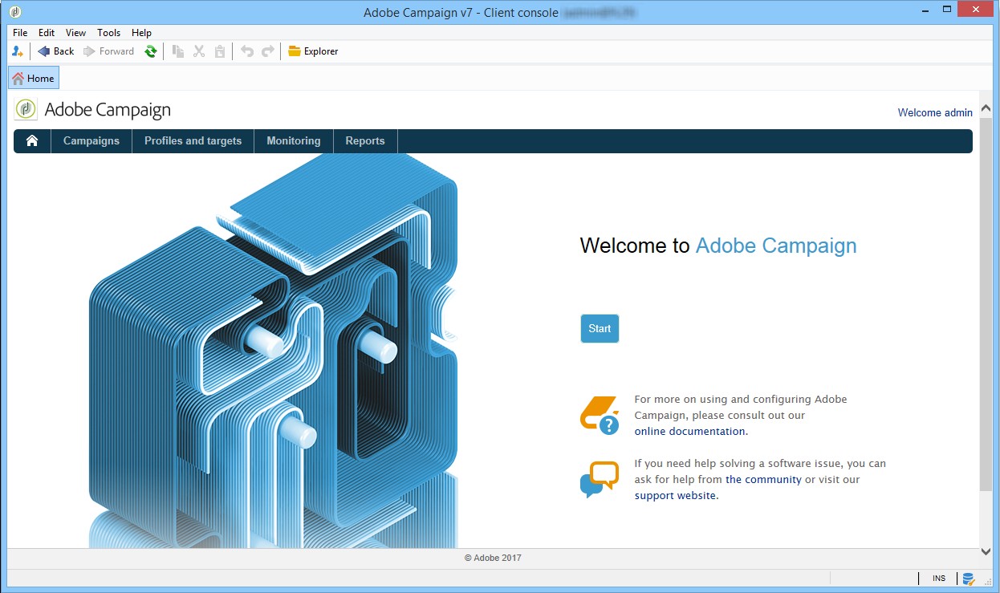
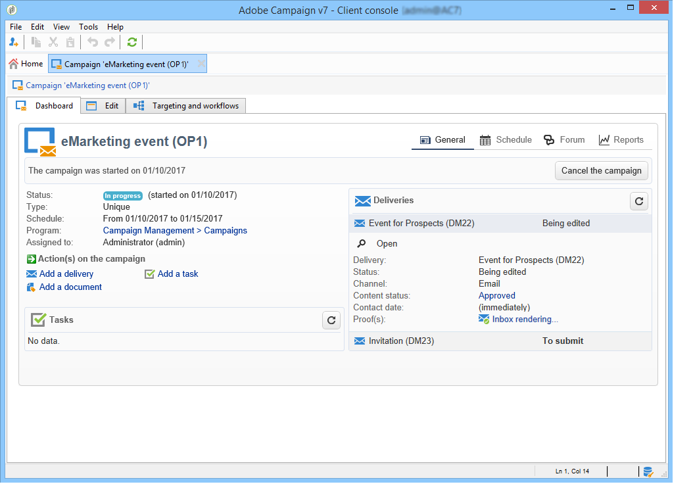
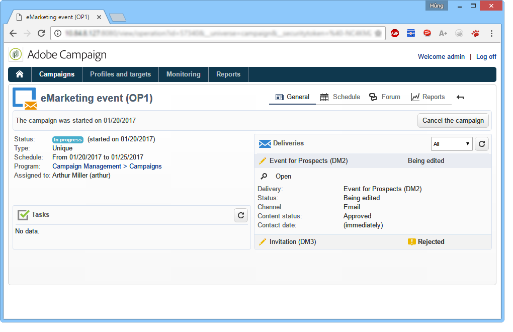
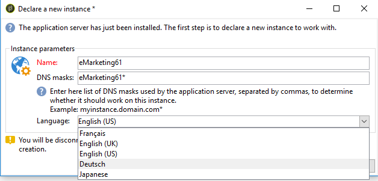
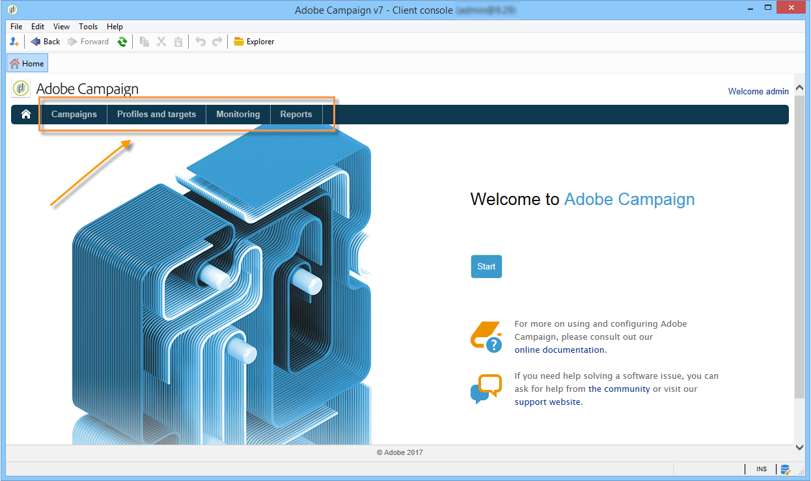
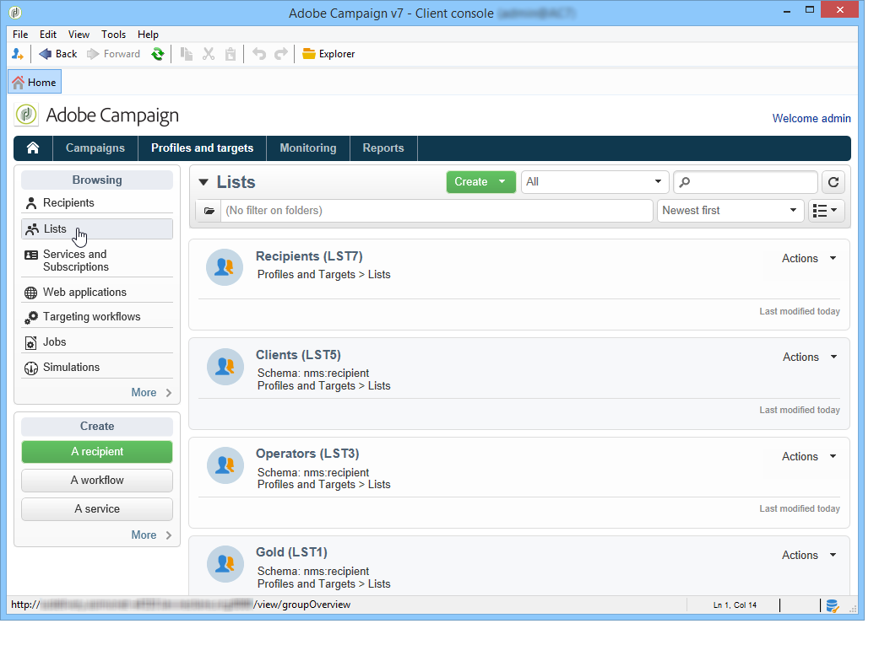
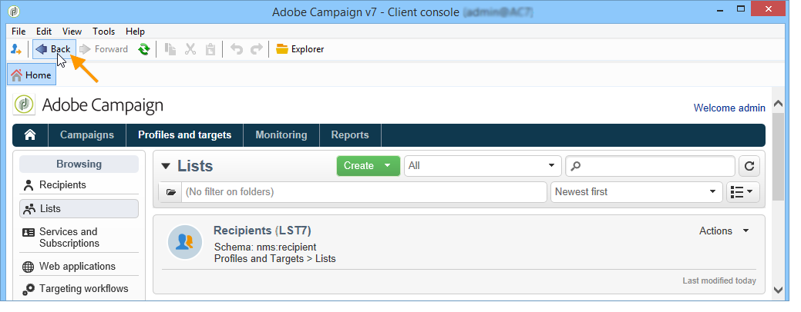
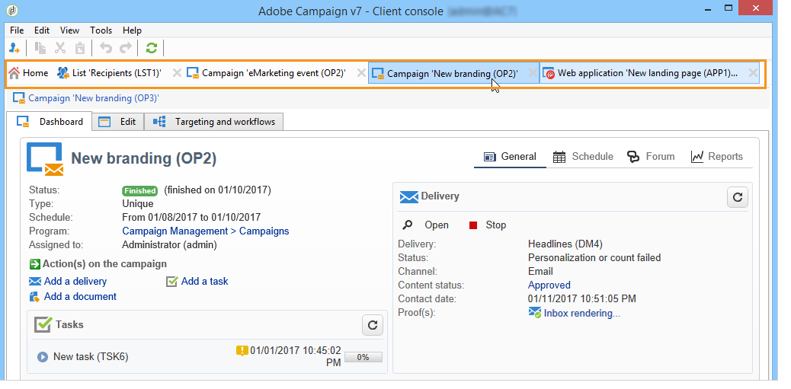
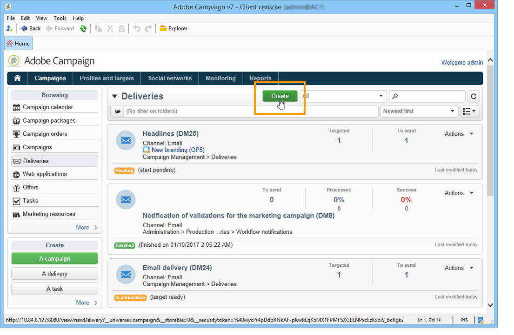

# Area di lavoro di Adobe Campaign {#adobe-campaign-workspace}

## Esplora l’interfaccia di Adobe Campaign {#about-adobe-campaign-interface}

Una volta connessi al database, si accede alla home page di Adobe Campaign. Questa pagina è il tuo dashboard: è composta da collegamenti e scelte rapide che ti consentono di accedere alle funzionalità, a seconda dell’installazione e delle configurazioni generali della piattaforma.

Dalla sezione centrale della home page, puoi utilizzare i collegamenti per accedere al portale della documentazione di Campaign, alla community e al sito web dell’Assistenza clienti di Adobe.

 Scopri l&#39;area di lavoro di Campaign in [video](#video)

>[!NOTE]
>
>Le funzionalità di Adobe Campaign disponibili nell’istanza dipendono dai moduli e dai componenti aggiuntivi installati. Alcuni di essi potrebbero anche non essere disponibili, a seconda delle autorizzazioni e delle configurazioni specifiche.
>
>Prima di installare qualsiasi modulo o componente aggiuntivo, è necessario verificare il contratto di licenza o contattare il responsabile commerciale di Adobe.

### Console e accesso web {#console-and-web-access}

La piattaforma Adobe Campaign è accessibile tramite una console o un browser Internet. Vedere i browser compatibili nella [matrice di compatibilità](../../rn/using/compatibility-matrix.md#Browsers).

L’interfaccia di accesso web è simile all’interfaccia della console. Da un browser, puoi utilizzare le stesse funzioni di navigazione e visualizzazione della console, ma puoi eseguire solo un set ridotto di azioni sulle campagne. Ad esempio, puoi visualizzare e annullare le campagne, ma non puoi modificarle. Per un determinato operatore, viene visualizzata una campagna con le seguenti opzioni nella console:

Mentre con l’accesso web, le opzioni consentono principalmente la visualizzazione di:

Ulteriori informazioni sull&#39;utilizzo dell&#39;interfaccia Web sono disponibili nella [documentazione di Campaign v8](https://experienceleague.adobe.com/docs/campaign/automation/campaign-orchestration/marketing-campaign-create.html?lang=it#use-the-web-interface-){target=_blank}.

### Lingue {#languages}

La lingua viene selezionata al momento dell’installazione dell’istanza di Adobe Campaign Classic.

Puoi scegliere tra le seguenti lingue:

* Inglese (Regno Unito)
* Inglese (Stati Uniti)
* Francese
* Tedesco
* Giapponese

La lingua scelta per l’istanza di Adobe Campaign Classic potrebbe influire sui formati di data e ora. Per ulteriori informazioni, consulta la [documentazione di Campaign v8 (console)](https://experienceleague.adobe.com/en/docs/campaign/campaign-v8/new/campaign-ui){target=_blank}.

Per ulteriori informazioni su come creare un&#39;istanza, consulta questa [pagina](../../installation/using/creating-an-instance-and-logging-on.md).

>[!CAUTION]
>
>Una volta creata l’istanza, non è possibile cambiare la lingua.

## Nozioni di base sulla navigazione {#navigation-basics}

Le varie funzionalità della piattaforma sono suddivise in funzionalità principali: utilizza i collegamenti riportati nella sezione superiore dell’interfaccia per accedervi.

L’elenco delle funzionalità di base a cui puoi accedere dipende dai pacchetti e dai componenti aggiuntivi installati e dai tuoi diritti di accesso.

### Sfoglia pagine {#browsing-pages}

Ogni funzionalità include una serie di funzionalità basate su esigenze correlate alle attività e sul contesto di utilizzo. Ad esempio, il collegamento **[!UICONTROL Profiles and targets]** ti consente di accedere agli elenchi dei destinatari, ai servizi di abbonamento, ai flussi di lavoro di targeting esistenti e alle scelte rapide per la creazione di questi elementi.

Gli elenchi sono disponibili tramite il collegamento **[!UICONTROL Lists]** nella sezione a sinistra dell&#39;interfaccia **[!UICONTROL Profiles and Targets]**.

### Utilizzare le schede {#using-tabs}

* Quando fai clic su una funzionalità di base o su un collegamento, la pagina pertinente sostituisce la pagina corrente. Per tornare alla pagina precedente, fare clic sul pulsante **[!UICONTROL Back]** sulla barra degli strumenti. Per tornare alla home page, fare clic sul pulsante **[!UICONTROL Home]**.

  

* Nel caso di un menu o di un collegamento a una schermata di visualizzazione (ad esempio un’applicazione web, un programma, una consegna, un rapporto, ecc.), la pagina corrispondente viene visualizzata in un’altra scheda. Questo consente di navigare da una pagina all’altra utilizzando le schede.

  

### Creare un elemento {#creating-an-element}

Ogni sezione sulle funzionalità di base ti consente di sfogliare tra gli elementi disponibili. A tale scopo, utilizzare le scelte rapide della sezione **[!UICONTROL Browsing]**. Il collegamento **[!UICONTROL Other choices]** consente di accedere a tutte le altre pagine, indipendentemente dall&#39;ambiente.

Puoi creare un nuovo elemento (consegna, applicazione web, flusso di lavoro, ecc.) utilizzo delle scelte rapide nella sezione **[!UICONTROL Create]** a sinistra dello schermo. Utilizza il pulsante **[!UICONTROL Create]** sopra l&#39;elenco per aggiungere nuovi elementi all&#39;elenco.

Ad esempio, nella pagina della consegna, utilizza il pulsante **[!UICONTROL Create]** per creare una nuova consegna.

## Utilizzare Adobe Campaign Explorer {#using-adobe-campaign-explorer}

Adobe Campaign Explorer è accessibile tramite l’icona della barra degli strumenti. Consente di accedere a tutte le funzionalità di Adobe Campaign, alle schermate di configurazione e a una visualizzazione più dettagliata di alcuni elementi della piattaforma.

Per ulteriori informazioni su Adobe Campaign Explorer, consulta queste pagine nella **documentazione di Campaign v8 (console)**:

* [Panoramica dell’interfaccia utente di Campaign](https://experienceleague.adobe.com/en/docs/campaign/campaign-v8/new/campaign-ui){target=_blank}

* [Impostazioni interfaccia utente di Campaign](https://experienceleague.adobe.com/en/docs/campaign/campaign-v8/config/configuration/ui-settings){target=_blank}

* [Gestire cartelle e visualizzazioni in Esplora risorse](https://experienceleague.adobe.com/it/docs/campaign/campaign-v8/config/configuration/folders-and-views){target=_blank}

## Utilizzare i dati {#work-with-data}

### Filtrare i dati {#filters}

Il filtro dei dati consiste nel restringere un set di dati solo ai record che corrispondono a criteri specifici. Questo sottoinsieme può quindi essere utilizzato per azioni mirate (come aggiornamenti o creazione di tipi di pubblico) o per l’analisi.

Durante la navigazione in Campaign, i dati vengono visualizzati negli elenchi. Puoi applicare filtri incorporati per accedere rapidamente a un sottoinsieme definito, ad esempio indirizzi messi in quarantena, destinatari non mirati o record all’interno di un intervallo di età o di una data di creazione specifici. Inoltre, puoi creare filtri personalizzati, salvarli per utilizzi futuri e condividerli con altri utenti di Campaign.

Scopri come **accedere, progettare e condividere filtri** nella [documentazione di Campaign v8 (console)](https://experienceleague.adobe.com/en/docs/campaign/campaign-v8/audience/create-filters){target=_blank}.

### Eseguire query sul database{#about-queries-in-campaign}

Lo strumento di query è disponibile a vari livelli dell’applicazione e può essere utilizzato per definire popolazioni target, segmentare i clienti, estrarre e filtrare i registri di tracciamento, creare filtri e altro ancora.

+++Informazioni sull’editor di query generico

Fornisce un assistente dedicato, l&#39;editor di query generico, accessibile dal menu **[!UICONTROL Tools > Generic query editor...]**. Questo editor consente alle query di database di estrarre, organizzare, raggruppare e ordinare le informazioni. Ad esempio, può recuperare i destinatari che hanno fatto clic più di n volte su un collegamento a una newsletter durante un determinato periodo di tempo.

L’editor di query generico centralizza tutte le funzionalità di query. Consente la creazione e l’archiviazione di filtri di restrizione, che possono quindi essere riutilizzati in altri contesti, ad esempio la casella Query di un flusso di lavoro di targeting.

+++

>[!BEGINTABS]

>[!TAB Eseguire una query sul database]

I passaggi per creare una query sono descritti in dettaglio nella **[documentazione di Campaign v8 (console)](https://experienceleague.adobe.com/en/docs/campaign/campaign-v8/data/query/query-editor){target=_blank}**

{target=_blank}

>[!TAB Aggiungere una query in un flusso di lavoro]

Scopri i passaggi chiave relativi alla creazione di query nel contesto di un flusso di lavoro nella **[documentazione di Campaign v8](https://experienceleague.adobe.com/en/docs/campaign/automation/workflows/wf-activities/targeting-activities/query){target=_blank}**

{target=_blank}

>[!TAB Condizioni filtro]

Per progettare la query, è necessario selezionare le condizioni di filtro nell’editor delle query. Le funzionalità disponibili e i casi di utilizzo sono descritti in dettaglio nella **[documentazione di Campaign v8](https://experienceleague.adobe.com/en/docs/campaign/campaign-v8/data/query/filter-conditions){target=_blank}**

{target=_blank}

>[!ENDTABS]

### Gestisci elenchi {#manage-and-customize-lists}

Nella console client di Campaign, i dati vengono visualizzati in elenchi. È possibile adattare questi elenchi alle proprie esigenze. Ad esempio, puoi aggiungere colonne, filtrare dati, contare record, salvare e condividere le impostazioni.

Scopri come **gestire e personalizzare gli elenchi** nella [documentazione di Campaign v8 (console)](https://experienceleague.adobe.com/en/docs/campaign/campaign-v8/config/configuration/ui-settings#customize-lists){target=_blank}.

### Gestire le enumerazioni{#managing-enumerations}

Un’enumerazione (detta anche elenco dettagliato) è un elenco predefinito di valori che è possibile utilizzare per compilare determinati campi. Le enumerazioni consentono di standardizzare i valori dei campi, rendendo più coerente l&#39;immissione dei dati e semplificando le query.

Una volta definiti, i valori vengono visualizzati in un elenco a discesa. Un valore può essere selezionato direttamente o immesso utilizzando l’input predittivo, che suggerisce e completa le voci corrispondenti. Alcuni campi includono enumerazioni predefinite; se necessario, è possibile creare enumerazioni aggiuntive.

Scopri come **utilizzare le enumerazioni** nella [documentazione di Adobe Campaign v8 (console)](https://experienceleague.adobe.com/en/docs/campaign/campaign-v8/config/settings/enumerations){target=_blank}.

## Video tutorial {#video}

Questo video presenta l’area di lavoro di Campaign Classic.

>[!VIDEO](https://video.tv.adobe.com/v/35130?quality=12)
