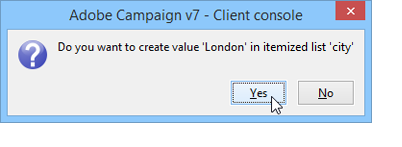

# Area di lavoro di Adobe Campaign{#adobe-campaign-workspace}

## Esplorazione  interfaccia Adobe Campaign {#about-adobe-campaign-interface}

Una volta che siete connessi al database, potrete accedere alla home page  Adobe Campaign, che è una dashboard: è costituito da collegamenti e collegamenti che consentono di accedere alle funzionalità, a seconda dell&#39;installazione e delle configurazioni generali della piattaforma.

Dalla sezione centrale della home page, potete utilizzare i collegamenti per accedere al portale della documentazione online di Campaign, al forum e al sito Web del supporto.

[ Scopri l’area di lavoro di Campaign nel video](#video)

>[!NOTE]
>
> capacità Adobe Campaign disponibili nell’istanza in uso dipendono dai moduli e dai componenti aggiuntivi installati. Alcuni di essi potrebbero anche non essere disponibili, a seconda delle autorizzazioni e delle configurazioni specifiche.
>
>Prima di installare qualsiasi modulo o componente aggiuntivo, è necessario verificare il contratto di licenza o contattare il responsabile commerciale  account di Adobe.

### Console e accesso Web {#console-and-web-access}

La piattaforma Adobe Campaign  è accessibile tramite una console o un browser Internet.

L&#39;accesso Web fornisce un&#39;interfaccia simile alla console ma con un set ridotto di funzionalità.

Ad esempio, per un determinato operatore, nella console viene visualizzata una campagna con le seguenti opzioni:

Con l&#39;accesso Web, invece, le opzioni consentiranno principalmente la visualizzazione:

### Lingue {#languages}

La lingua viene selezionata al momento dell&#39;installazione dell&#39;istanza Adobe Campaign Classic.

Potete scegliere tra cinque lingue diverse:

* Inglese (Regno Unito)
* Inglese (USA)
* Francese
* Tedesco
* Giapponese

La lingua scelta per l’istanza di Adobe Campaign Classic potrebbe influenzare i formati di data e ora. Per ulteriori informazioni, consulta questa [sezione](../../platform/using/adobe-campaign-workspace.md#date-and-time).

Per ulteriori informazioni su come creare un&#39;istanza, fare riferimento a questa [pagina](../../installation/using/creating-an-instance-and-logging-on.md).

>[!CAUTION]
>
>La lingua non può essere modificata dopo la creazione dell&#39;istanza.

## Nozioni di base sulla navigazione {#navigation-basics}

### Esplorazione delle pagine {#browsing-pages}

Le varie funzionalità della piattaforma sono suddivise in funzionalità principali: utilizzate i collegamenti visualizzati nella sezione superiore dell&#39;interfaccia per accedervi.

L&#39;elenco delle funzionalità di base a cui potete accedere dipende dai pacchetti e dai componenti aggiuntivi installati e dai diritti di accesso.

Ciascuna funzionalità include una serie di funzionalità basate sulle esigenze e sul contesto di utilizzo correlati alle attività. Ad esempio, il collegamento **[!UICONTROL Profiles and targets]** ti porta agli elenchi destinatari, ai servizi di iscrizione, ai flussi di lavoro di targeting esistenti e alle scelte rapide per la creazione di questi elementi.

Gli elenchi sono disponibili tramite il collegamento **[!UICONTROL Lists]** nella sezione sinistra dell&#39;interfaccia **[!UICONTROL Profiles and Targets]**.

### Uso delle schede {#using-tabs}

* Quando fate clic su una funzionalità di base o su un collegamento, la pagina corrispondente sostituisce la pagina corrente. Per tornare alla pagina precedente, fare clic sul pulsante **[!UICONTROL Back]** sulla barra degli strumenti. Per tornare alla home page, fare clic sul pulsante **[!UICONTROL Home]**.

   

* Nel caso di un menu o di un collegamento a una schermata di visualizzazione (ad esempio un&#39;applicazione Web, un programma, una consegna, un rapporto ecc.), la pagina corrispondente viene visualizzata in un&#39;altra scheda. Questo consente di spostarsi da una pagina all&#39;altra utilizzando le schede.

   

### Creazione di un elemento {#creating-an-element}

Ogni sezione delle funzionalità di base consente di spostarsi tra gli elementi disponibili. A tal fine, utilizzate i collegamenti nella sezione **[!UICONTROL Browsing]**. Il collegamento **[!UICONTROL Other choices]** consente di accedere a tutte le altre pagine, indipendentemente dall&#39;ambiente.

Potete creare un nuovo elemento (consegna, applicazione Web, flusso di lavoro, ecc.) utilizzando i tasti di scelta rapida nella sezione **[!UICONTROL Create]** a sinistra dello schermo. Utilizzate il pulsante **[!UICONTROL Create]** sopra l&#39;elenco per aggiungere nuovi elementi all&#39;elenco.

Ad esempio, nella pagina di consegna, utilizzate il pulsante **[!UICONTROL Create]** per creare una nuova consegna.

## Utilizzo  Adobe Campaign Explorer {#using-adobe-campaign-explorer}

### Informazioni  Adobe Campaign Explorer {#about-adobe-campaign-explorer}

 Adobe Campaign Explorer è accessibile tramite l&#39;icona della barra degli strumenti. Consente di accedere al  Adobe Campaign a tutte le  funzionalità di Adobe Campaign, alle schermate di configurazione e a una visualizzazione più dettagliata di alcuni degli elementi della piattaforma.

L&#39;area di lavoro **[!UICONTROL Explorer]** è divisa in tre aree:

**1 - Albero**: potete personalizzare il contenuto della struttura ad albero (aggiungere, spostare o eliminare nodi). Questa procedura è destinata esclusivamente agli utenti esperti. Per ulteriori informazioni, consulta [questa pagina](../../configuration/using/about-navigation-hierarchy.md).

**2 - Elenco**: potete filtrare questo elenco, eseguire ricerche, aggiungere informazioni o ordinare i dati.

**3 - Dettagli**: potete visualizzare i dettagli dell&#39;elemento selezionato. L’icona in alto a destra permette di visualizzare queste informazioni a schermo intero.

### Risoluzione schermo {#screen-resolution}

Per una navigazione e un&#39;usabilità ottimali,  Adobe consiglia di utilizzare una risoluzione minima dello schermo di 1600x900 pixel.

>[!CAUTION]
>
>Le risoluzioni inferiori a 1600x900 pixel potrebbero non essere supportate da  Adobe Campaign.

Nell&#39;area di lavoro **[!UICONTROL Explorer]**, se alcune parti della zona **[!UICONTROL Details]** sembrano troncate, espandetela utilizzando la freccia posta sopra la zona oppure fate clic sul pulsante **[!UICONTROL Enlarge]**.

### Elenchi di ricerca {#browsing-lists}

Per sfogliare un elenco, è possibile utilizzare **le barre di scorrimento** (orizzontale e verticale) per scorrere l&#39;elenco senza modificare la selezione del record, **la rotellina del mouse** o **i tasti freccia**.

>[!NOTE]
>
>La configurazione e la personalizzazione del contenuto dell&#39;elenco sono presentate in [Configurazione degli elenchi](#configuring-lists).
>
>Potete anche ordinare e filtrare i dati. Vedere [Opzioni di filtro](../../platform/using/filtering-options.md).

### Conteggio dei record {#counting-records}

Per impostazione predefinita,  Adobe Campaign carica i primi 200 record di un elenco. Ciò significa che la visualizzazione non mostra necessariamente tutti i record della tabella visualizzata. È possibile eseguire un conteggio del numero di record nell&#39;elenco e caricare altri record.

Nella parte in basso a destra della schermata dell&#39;elenco, un **[!UICONTROL counter]** mostra quanti record sono stati caricati e il numero totale di record nel database (dopo l&#39;applicazione di eventuali filtri):

Se è presente &quot;**?**&quot; viene visualizzato invece del numero a destra, fare clic sul contatore per avviare il calcolo.

### Caricamento di più record {#loading-more-records}

Per caricare (e quindi visualizzare) record aggiuntivi (per impostazione predefinita, 200 righe), fare clic su **[!UICONTROL Continue loading]**.

Per caricare tutti i record, fare clic con il pulsante destro del mouse sull&#39;elenco e selezionare **[!UICONTROL Load all]**.

>[!CAUTION]
>
>A seconda del numero di record, il tempo di caricamento dell&#39;elenco completo può essere lungo.

### Modifica il numero predefinito di record {#change-default-number-of-records}

Per modificare il numero predefinito di record caricati, fare clic su **[!UICONTROL Configure list]** nell&#39;angolo inferiore destro dell&#39;elenco.

Nella finestra di configurazione elenco, fare clic su &quot;Parametri avanzati&quot; (in basso a sinistra) e modificare il numero di righe da recuperare.

## Configurazione degli elenchi {#configuring-lists}

### Aggiungi colonne {#add-columns}

Esistono due modi per aggiungere una colonna a un elenco.

È possibile aggiungere rapidamente una colonna a un elenco dai dettagli di un record. Per eseguire questa operazione:

1. Da una schermata di dettaglio, fare clic con il pulsante destro del mouse sul campo che si desidera visualizzare in una colonna.
1. Seleziona **[!UICONTROL Add in the list]**.

   La colonna viene aggiunta a destra delle colonne esistenti.

Un altro modo per aggiungere colonne, ad esempio se si desidera visualizzare i dati che non vengono visualizzati nella schermata di dettaglio, è utilizzare la finestra di configurazione dell&#39;elenco. Per eseguire questa operazione:

1. Fare clic su **[!UICONTROL Configure list]** sotto e a destra dell&#39;elenco.

   

1. Nella finestra di configurazione dell&#39;elenco, fare doppio clic sul campo da aggiungere nell&#39;elenco **[!UICONTROL Available fields]** per aggiungerlo al **[!UICONTROL Output columns]**.

   

   >[!NOTE]
   >
   >Per impostazione predefinita, i campi avanzati non vengono visualizzati. Per visualizzarli, fare clic su **Visualizza campi avanzati** sotto e a destra dell&#39;elenco dei campi disponibili.
   >
   >Le etichette vengono visualizzate per tabella e quindi in ordine alfabetico.
   >
   >Utilizzare il campo **Cerca** per eseguire una ricerca nei campi disponibili. Per ulteriori informazioni, vedere [Ordinamento di un elenco](#sorting-a-list).
   >
   >I campi sono identificati da icone specifiche: Campi SQL, tabelle collegate, campi calcolati, ecc. Per ciascun campo selezionato, la descrizione viene visualizzata sotto l&#39;elenco dei campi disponibili. [Configurazione degli elenchi](#configuring-lists).
   >
   >Potete anche ordinare e filtrare i dati. Vedere [Opzioni di filtro](../../platform/using/filtering-options.md).

1. Ripetere la procedura per visualizzare ogni colonna.
1. Utilizzare le frecce per modificare l&#39; **ordine di visualizzazione**. La colonna più alta si trova a sinistra nell’elenco dei record.

   

1. Se necessario, è possibile fare clic su **[!UICONTROL Distribution of values]** per visualizzare la partizione dei valori per il campo selezionato nella cartella corrente.

   

1. Fare clic su **[!UICONTROL OK]** per confermare la configurazione e visualizzare il risultato.

### Creare una nuova colonna {#create-a-new-column}

È possibile creare nuove colonne per visualizzare campi aggiuntivi nell&#39;elenco. Per eseguire questa operazione:

1. Fare clic su **[!UICONTROL Configure the list]** sotto e a destra dell&#39;elenco.
1. Fare clic su **[!UICONTROL Add]** per visualizzare un nuovo campo nell&#39;elenco.

### Rimuovere una colonna {#remove-a-column}

È possibile mascherare una o più colonne in un elenco di record utilizzando **[!UICONTROL Configure list]** situato sotto e a destra dell&#39;elenco.

Nella finestra di configurazione dell&#39;elenco, selezionate la colonna da mascherare dall&#39;area **[!UICONTROL Output columns]** e fate clic sul pulsante Elimina.

Ripetere la procedura per ogni colonna da mascherare. Fare clic su **[!UICONTROL OK]** per confermare la configurazione e visualizzare il risultato.

### Regola larghezza colonna {#adjust-column-width}

Quando un elenco è attivo, ossia se è selezionata almeno una riga, è possibile utilizzare F9 per regolare la larghezza delle colonne in modo che tutte le colonne possano essere visualizzate sullo schermo.

### Visualizzare i record delle sottocartelle {#display-sub-folders-records}

Gli elenchi possono essere visualizzati:

* Solo i record contenuti nella cartella selezionata,
* Oppure i record nella cartella selezionata E nelle relative sottocartelle.

Per passare da una modalità di visualizzazione all&#39;altra, fare clic su **[!UICONTROL Display sub-levels]** nella barra degli strumenti.

### Salvataggio di una configurazione di elenco {#saving-a-list-configuration}

Le configurazioni elenco sono definite localmente a livello di workstation. Quando la cache locale viene cancellata, le configurazioni locali vengono disattivate.

Per impostazione predefinita, i parametri di visualizzazione definiti si applicano a tutti gli elenchi con il tipo di cartella corrispondente. Pertanto, quando modificate la modalità di visualizzazione dell’elenco dei destinatari da una cartella, questa configurazione verrà applicata a tutte le altre cartelle dei destinatari.

È tuttavia possibile salvare più di una configurazione da applicare a cartelle diverse dello stesso tipo. La configurazione viene salvata con le proprietà della cartella contenente i dati e può essere riapplicata.

Ad esempio, per una cartella di consegna, è possibile configurare la visualizzazione seguente:

Per salvare la configurazione dell&#39;elenco in modo che possa essere riutilizzata, procedere come segue:

1. Fare clic con il pulsante destro del mouse sulla cartella contenente i dati visualizzati.
1. Seleziona **[!UICONTROL Properties]**.
1. Fare clic su **[!UICONTROL Advanced settings]**, quindi specificare un nome nel campo **[!UICONTROL Configuration]**.

   

1. Fare clic su **[!UICONTROL OK]**, quindi su **[!UICONTROL Save]**.

Potete quindi applicare questa configurazione a un&#39;altra cartella **Delivery**:

Fate clic su **[!UICONTROL Save]** nella finestra delle proprietà della cartella. La visualizzazione dell&#39;elenco viene modificata per corrispondere alla configurazione specificata:

## Esportazione di un elenco {#exporting-a-list}

Per esportare i dati da un elenco, è necessario utilizzare una procedura guidata di esportazione. Per accedervi, selezionate gli elementi da esportare dall&#39;elenco, fate clic con il pulsante destro del mouse e selezionate **[!UICONTROL Export...]**.

L&#39;utilizzo delle funzioni di importazione ed esportazione è spiegato in [Importazioni ed esportazioni generiche](../../platform/using/about-generic-imports-exports.md).

>[!CAUTION]
>
>Gli elementi di un elenco non devono essere esportati mediante la funzione Copia/Incolla.

## Ordinamento di un elenco {#sorting-a-list}

Gli elenchi possono contenere una grande quantità di dati. Potete ordinare questi dati o applicare filtri semplici o avanzati. L&#39;ordinamento consente di visualizzare i dati in ordine crescente o decrescente. I filtri consentono di definire e combinare i criteri per visualizzare solo i dati selezionati.

Fare clic sull&#39;intestazione della colonna per applicare un ordinamento crescente o decrescente o per annullare l&#39;ordinamento dei dati. Lo stato di ordinamento e l&#39;ordine di ordinamento attivi sono indicati da una freccia blu prima dell&#39;etichetta della colonna. Un trattino rosso prima dell&#39;etichetta della colonna indica che l&#39;ordinamento viene applicato ai dati indicizzati dal database. Questo metodo di ordinamento viene utilizzato per ottimizzare i processi di ordinamento.

Potete anche configurare l’ordinamento o combinare criteri di ordinamento. Per farlo, segui la procedura indicata di seguito:

1. **[!UICONTROL Configure list]** sotto e a destra dell&#39;elenco.

   

1. Nella finestra di configurazione dell&#39;elenco, fare clic sulla scheda **[!UICONTROL Sorting]**.
1. Selezionate i campi da ordinare e la direzione di ordinamento (crescente o decrescente).

   

1. La priorità di ordinamento è definita dall&#39;ordine delle colonne di ordinamento. Per modificare la priorità, usate le icone appropriate per modificare l’ordine delle colonne.

   

   La priorità di ordinamento non influisce sulla visualizzazione delle colonne nell&#39;elenco.

1. Fare clic su **[!UICONTROL Ok]** per confermare questa configurazione e visualizzare il risultato nell&#39;elenco.

### Elementi di ricerca {#running-a-search}

È possibile eseguire una ricerca dei campi disponibili in un editor utilizzando il campo **[!UICONTROL Search]** situato sopra l&#39;elenco dei campi. Premere **Invio** sulla tastiera o scorrere l&#39;elenco. I campi che corrispondono alla ricerca avranno etichette in grassetto.

>[!NOTE]
>
>Potete creare dei filtri per visualizzare solo alcuni dati in un elenco. Vedere [Creazione di filtri](../../platform/using/creating-filters.md).

## Formati e unità {#formats-and-units}

### Data e ora {#date-and-time}

La lingua dell’istanza Adobe Campaign Classic influisce sui formati di data e ora.

La lingua viene selezionata durante l&#39;installazione di Campaign e non può essere modificata in seguito. Potete selezionare: Inglese (USA), inglese (EN), francese, tedesco o giapponese. Per ulteriori informazioni, consulta [questa pagina](../../installation/using/creating-an-instance-and-logging-on.md).

Le principali differenze tra inglese americano e inglese britannico sono:

<table> 
 <thead> 
  <tr> 
   <th> Formati  </th> 
   <th> Inglese (USA)  </th> 
   <th> Inglese (EN)  </th> 
  </tr> 
 </thead> 
 <tbody> 
  <tr> 
   <td> Data  </td> 
   <td> La settimana inizia domenica  </td> 
   <td> La settimana inizia il lunedì  </td> 
  </tr> 
  <tr> 
   <td> Data breve  </td> 
   <td> 
%2M/%2D/%4Y

<strong>ex: 25/09/2018</strong>
 </td> 
   <td> 
%2D/%2M/%4Y

<strong>ex: 09/02/2018</strong>
 </td> 
  </tr> 
  <tr> 
   <td> Data breve con tempo  </td> 
   <td> 
%2M/%2D/%4Y %I:%2N:%2S %P

<strong>ex: 25/09/2018 10:47:25 PM</strong>
 </td> 
   <td> 
%2D/%2M/%4Y %2H:%2N:%2S

<strong>ex: 25/09/2018 22:47:25</strong>
 </td> 
  </tr> 
 </tbody> 
</table>

### Aggiungere valori in un&#39;enumerazione {#add-values-in-an-enumeration}

Utilizzando i campi di input con un elenco a discesa, è possibile immettere un valore di enumerazione, che può essere memorizzato e poi offerto come opzione nell&#39;elenco a discesa. Ad esempio, nel campo **[!UICONTROL City]** della scheda **[!UICONTROL General]** di un profilo del destinatario, è possibile immettere London. Quando si preme Invio per confermare questo valore, viene visualizzato un messaggio in cui viene richiesto se si desidera salvare il valore per l&#39;enumerazione associata al campo.

Se si fa clic su **[!UICONTROL Yes]**, questo valore sarà disponibile nella casella combinata del campo pertinente (in questo caso: **[!UICONTROL London]**).

>[!NOTE]
>
>Le enumerazioni (dette anche &#39;elenchi dettagliati&#39;) vengono gestite dall&#39;amministratore tramite la sezione **[!UICONTROL Administration > Platform > Enumerations]**. Per ulteriori informazioni, consultare [Gestione delle enumerazioni](../../platform/using/managing-enumerations.md).

### Unità predefinite {#default-units}

Nei campi che esprimono una durata (ad es. periodo di validità delle risorse di una consegna, termine di approvazione per un&#39;attività, ecc.), il valore può essere espresso nelle seguenti **unità**:

* **[!UICONTROL s]** in secondi,
* **[!UICONTROL mn]** per minuti,
* **[!UICONTROL h]** per ore,
* **[!UICONTROL d]** per giorni.

## Video di esercitazione {#video}

In questo video viene illustrato lo spazio di lavoro Campaign Classic.

>[!VIDEO](https://video.tv.adobe.com/v/35130?quality=12)

Ulteriori video dimostrativi sui Campaign Classic sono disponibili [qui](https://experienceleague.adobe.com/docs/campaign-classic-learn/tutorials/overview.html?lang=it).
