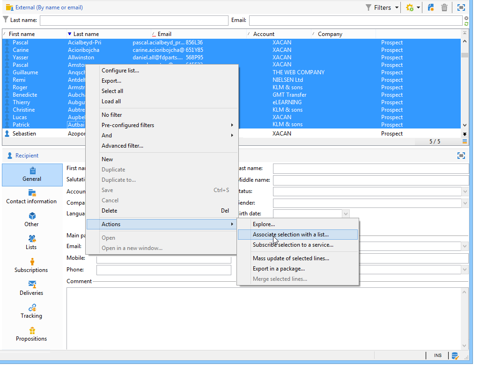
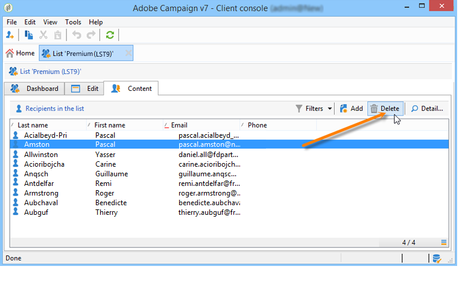

# Creare e gestire gli elenchi{#creating-and-managing-lists}

## Che cos&#39;è un elenco? {#about-lists-in-adobe-campaign}

Un elenco è un set statico di profili che possono essere targetizzati nelle azioni di consegna o aggiornati durante le operazioni di importazione o l’esecuzione di un flusso di lavoro. Ad esempio, una popolazione estratta dal database tramite una query può fornire un elenco.

Gli elenchi vengono creati e gestiti tramite il collegamento **[!UICONTROL Lists]** nella scheda **[!UICONTROL Profiles and targets]**.

In Adobe Campaign sono disponibili due tipi di elenchi:

* Tipo **[!UICONTROL Group]**: gli elenchi dei tipi **[!UICONTROL Group]** appartengono a un elenco **static** di persone selezionate in base a criteri specifici. L’elenco è simile a un’istantanea di un set di profili. Tieni presente che non viene aggiornato automaticamente nel caso in cui i profili vengano aggiunti al database.

  Per ulteriori informazioni su come creare un elenco di tipi **[!UICONTROL Group]**, fare riferimento a questa [pagina](#creating-a-profile-list-from-a-group).

* Tipo **[!UICONTROL List]**: gli elenchi dei tipi **[!UICONTROL List]** consentono di utilizzare i flussi di lavoro per creare e gestire gli elenchi. Si tratta di elenchi specifici risultanti dalle importazioni di dati, che possono essere aggiornati tramite l&#39;attività del flusso di lavoro **[!UICONTROL List update]** dedicata.

  A differenza dell&#39;elenco dei tipi **[!UICONTROL Group]**, questo elenco può essere aggiornato automaticamente con un&#39;attività **[!UICONTROL Scheduler]**. Per un esempio su come creare elenchi di tipi **[!UICONTROL List]**, fare riferimento a [questa pagina](../../workflow/using/list-update.md).

 [Guarda il video su questa funzione](#create-list-video)

## Creare un elenco di profili da un gruppo {#creating-a-profile-list-from-a-group}

Gli elenchi dei tipi **[!UICONTROL Group]** creati tramite il collegamento **[!UICONTROL Profiles and targets]** devono essere basati sulla tabella del profilo di Adobe Campaign predefinita (nms:recipient).

>[!NOTE]
>
>Per creare elenchi contenenti altri tipi di dati, è necessario eseguire un flusso di lavoro. Ad esempio, utilizzando una query nella tabella dei visitatori e aggiornando l’elenco, puoi creare un elenco di visitatori. Per ulteriori informazioni sui flussi di lavoro, consulta [questa sezione](../../workflow/using/about-workflows.md).

Per creare un nuovo elenco di tipi **[!UICONTROL Group]**, attenersi alla procedura seguente:

1. Fare clic sul pulsante **[!UICONTROL Create]** e selezionare **[!UICONTROL New list]**.

   

1. Immettere le informazioni nella scheda **[!UICONTROL Edit]** della finestra di creazione dell&#39;elenco.

   * Immettere il nome elenco nel campo **[!UICONTROL Label]** e, se necessario, modificare il nome interno.
   * Aggiungere una descrizione per l&#39;elenco.
   * Puoi specificare una data di scadenza: una volta raggiunta tale data, l’elenco viene eliminato e rimosso automaticamente.

     

1. Nella scheda **[!UICONTROL Content]**, fare clic su **[!UICONTROL Add]** per selezionare i profili appartenenti all&#39;elenco.

   

1. Fare clic su **[!UICONTROL Save]** per salvare l&#39;elenco. Viene quindi aggiunto alla panoramica degli elenchi.

È possibile creare nuovi profili direttamente dalla finestra &#39;aggiungi profili&#39; facendo clic su **[!UICONTROL Create]**. Il profilo verrà aggiunto al database.

L’elenco dei profili può essere configurato come gli altri elenchi. Consulta [questa sezione](../../platform/using/adobe-campaign-workspace.md#configuring-lists).

## Collegare dati a un elenco {#linking-data-to-a-list}

>[!NOTE]
>
>Il collegamento dei dati a un elenco può essere eseguito solo con un elenco di tipi **[!UICONTROL Group]**.

I profili di un set di profili possono essere filtrati e collegati a un elenco. Le azioni di consegna possono quindi essere inviate a questo elenco, per eseguire il targeting dei profili. Per raggruppare i profili:

1. Seleziona i profili e fai clic con il pulsante destro del mouse.
1. Seleziona **[!UICONTROL Actions > Associate selection with a list...]**.

   

1. Selezionare l&#39;elenco desiderato o crearne uno nuovo utilizzando il pulsante **[!UICONTROL Create]**, quindi fare clic su **[!UICONTROL Next]**.

   

1. Fai clic sul pulsante **[!UICONTROL Start]**.

   

L&#39;opzione **[!UICONTROL Recreate the list]** elimina il contenuto precedente dall&#39;elenco. Questa modalità è ottimizzata perché non è necessaria alcuna query per verificare se i profili sono già collegati all’elenco.

Se si deseleziona l&#39;opzione **[!UICONTROL No trace of this job is saved in the database]**, è possibile selezionare o creare la cartella di esecuzione in cui verranno memorizzate le informazioni collegate al processo.

La sezione superiore della finestra consente di monitorare l’esecuzione. Il pulsante **[!UICONTROL Stop]** consente di arrestare il processo. I contatti già elaborati verranno collegati all&#39;elenco.

È possibile monitorare il processo tramite la scheda **[!UICONTROL Lists]** nei profili interessati da questa operazione:

È inoltre possibile modificare l&#39;elenco tramite la home page di Adobe Campaign: fare clic sul menu **[!UICONTROL Profiles and Targets > Lists]** e selezionare l&#39;elenco interessato. La scheda **[!UICONTROL Content]** mostra i profili collegati a questo elenco.

## Rimuovere un profilo da un elenco {#removing-a-profile-from-a-list}

Per rimuovere un profilo da un elenco, puoi:

* Modificare l&#39;elenco, selezionare il profilo nella scheda **[!UICONTROL Content]**, quindi fare clic sull&#39;icona **[!UICONTROL Delete]**.

  

* Modificare il profilo, fare clic sulla scheda **[!UICONTROL List]**, quindi sull&#39;icona **[!UICONTROL Delete]**.

  

## Eliminare un elenco di profili {#deleting-a-list-of-profiles}

È possibile eliminare uno o più elenchi dall&#39;elenco dei gruppi nella struttura Adobe Campaign. Per eseguire questa operazione, modificare la struttura tramite il collegamento **[!UICONTROL Advanced > Explorer]** nella home page di Adobe Campaign. Selezionare i gruppi interessati e fare clic con il pulsante destro del mouse. Seleziona **[!UICONTROL Delete]**. Viene visualizzato un messaggio di avviso che richiede di confermare l&#39;eliminazione.

>[!NOTE]
>
>Quando elimini un elenco, i profili presenti nell’elenco non vengono interessati, ma i dati contenuti nel profilo vengono aggiornati.

## Video tutorial {#create-list-video}

### Come creare un elenco di destinatari

Un elenco è un set statico di destinatari che possono essere targetizzati nelle azioni di consegna o aggiornati durante le operazioni di importazione o l’esecuzione di un flusso di lavoro. Un elenco di destinatari è anche detto audience.

Scopri come creare un pubblico configurando un elenco di destinatari da Explorer.

>[!VIDEO](https://video.tv.adobe.com/v/25602/quality=12)

### Come utilizzare un flusso di lavoro per creare un elenco di destinatari {#create-list-in-a-wf-video}

Scopri come creare un flusso di lavoro per eseguire il targeting dei destinatari e come renderlo ricorrente prima di utilizzare l’elenco in un target e-mail.

>[!VIDEO](https://video.tv.adobe.com/v/25603?quality=12)

Ulteriori video dimostrativi di Campaign Classic sono disponibili [qui](https://experienceleague.adobe.com/docs/campaign-classic-learn/tutorials/overview.html?lang=it).
