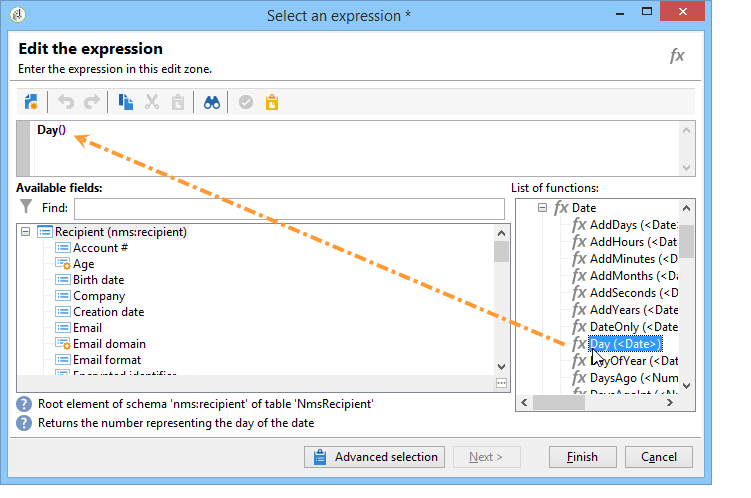

# Creazione di filtri{#creating-filters}

## Introduzione {#introduction}

Quando vi spostate nella struttura  Adobe Campaign (dal menu **[!UICONTROL Explorer]** nella home page), i dati contenuti nel database vengono visualizzati negli elenchi. Questi elenchi possono essere configurati per visualizzare solo i dati richiesti dall&#39;operatore. È quindi possibile avviare azioni sui dati filtrati. La configurazione del filtro consente di selezionare i dati da un elenco **[!UICONTROL dynamically]**. Se i dati vengono modificati, i dati filtrati vengono aggiornati.

>[!NOTE]
>
>La configurazione dello schermo è definita localmente a livello di workstation. È memorizzato in file nascosti e talvolta può essere necessario pulire questi dati, in particolare se si verificano problemi durante l&#39;aggiornamento dei dati. A questo scopo, utilizzare il menu **[!UICONTROL File > Clear the local cache]**.

## Tipologia dei filtri disponibili {#typology-of-available-filters}

 Adobe Campaign consente di applicare filtri agli elenchi di dati.

Questi filtri possono essere utilizzati una sola volta, oppure potete salvarli per un utilizzo futuro. Potete applicare più filtri contemporaneamente.

In  Adobe Campaign sono disponibili i seguenti tipi di filtro:

* Filtri predefiniti

   Il **filtro predefinito** è accessibile tramite i campi situati sopra gli elenchi. Consente di filtrare i campi predefiniti (per i profili dei destinatari, questi sono per impostazione predefinita il nome e l’indirizzo e-mail). È possibile utilizzare i campi per immettere i caratteri per filtrare o selezionare le condizioni del filtro da un elenco a discesa.

   
<!--
  >[!NOTE]
  >
  >The **%** character replaces any character string. For example, the string `%@yahoo.com` lets you display all the profiles with an e-mail address in the domain "yahoo.com".
-->
È possibile modificare il filtro predefinito di un elenco. Per ulteriori informazioni, vedere [Modifica del filtro predefinito](#altering-the-default-filter).

* Filtri semplici

   **I** filtri semplici sono filtri una tantum sulle colonne. Vengono definiti con uno o più criteri di ricerca semplici nelle colonne visualizzate.

   È possibile combinare diversi filtri semplici sullo stesso elenco di dati per perfezionare la ricerca. I campi filtro vengono visualizzati uno sotto l&#39;altro. Possono essere eliminati indipendentemente l&#39;uno dall&#39;altro.

   

   I filtri semplici sono descritti in [Creazione di un filtro semplice](#creating-a-simple-filter).

* Filtri avanzati

   **I** filtri avanzati vengono creati utilizzando una query o una combinazione di query sui dati.

   Per ulteriori informazioni sulla creazione di un filtro avanzato, vedere [Creazione di un filtro avanzato](#creating-an-advanced-filter).

   È possibile utilizzare le funzioni per definire il contenuto del filtro. Per ulteriori informazioni, vedere [Creazione di un filtro avanzato con funzioni](#creating-an-advanced-filter-with-functions).

   >[!NOTE]
   >
   >Per ulteriori informazioni sulla creazione di query in  Adobe Campaign, consultare [questa sezione](../../platform/using/about-queries-in-campaign.md).

* Filtri utente

   Un **filtro applicazione** è un filtro avanzato che è stato salvato, per utilizzare e condividere la propria configurazione con gli altri operatori.

   Il pulsante **[!UICONTROL Filters]** sopra gli elenchi offre un set di filtri applicativi che possono essere combinati per perfezionare il filtro. Il metodo per la creazione di questi filtri è presentato in [Salvataggio di un filtro](#saving-a-filter).

## Modifica del filtro predefinito {#altering-the-default-filter}

Per modificare il filtro predefinito per un elenco di destinatari, fare clic sul nodo **[!UICONTROL Profiles and Targets > Pre-defined filters]** della struttura.

Per tutti gli altri tipi di dati, configura il filtro predefinito tramite il nodo **[!UICONTROL Administration > Configuration > Predefined filters]**.

Effettuate le seguenti operazioni:

1. Selezionate il filtro da usare per impostazione predefinita.
1. Fare clic sulla scheda **[!UICONTROL Parameters]** e selezionare **[!UICONTROL Default filter for the associated document type]**.

   

   >[!CAUTION]
   >
   >Se all’elenco è già applicato un filtro predefinito, è necessario disattivarlo prima di applicare un nuovo filtro. A tale scopo, fare clic sulla croce rossa a destra dei campi di filtraggio.

1. Fare clic su **[!UICONTROL Save]** per applicare il filtro.

   >[!NOTE]
   >
   >La finestra di definizione del filtro è dettagliata in [Creazione di un filtro avanzato](#creating-an-advanced-filter) e [Salvataggio di un filtro](#saving-a-filter).

## Creazione di un filtro semplice {#creating-a-simple-filter}

Per creare un **filtro semplice**, procedere come segue:

1. Fare clic con il pulsante destro del mouse sul campo da filtrare e selezionare **[!UICONTROL Filter on this field]**.

   

   I campi filtro predefiniti sono visualizzati sopra l’elenco.

1. Selezionate l’opzione filtro dall’elenco a discesa oppure immettete i criteri di filtro da applicare (il metodo per selezionare o immettere i criteri dipende dal tipo di campo: testo, enumerato, ecc.).

   

1. Per attivare il filtro, premere Invio sulla tastiera oppure fare clic sulla freccia verde a destra dei campi del filtro.

Se il campo sul quale si desidera filtrare i dati non viene visualizzato nel modulo del profilo, è possibile aggiungerlo nelle colonne visualizzate e quindi filtrare su tale colonna. Per eseguire questa operazione,

1. Fate clic sull&#39;icona **[!UICONTROL Configure the list]**.

   

1. Selezionare la colonna da visualizzare, ad esempio l&#39;età dei destinatari.

   

1. Fare clic con il pulsante destro del mouse sulla colonna **Age** nell&#39;elenco dei destinatari, quindi selezionare **[!UICONTROL Filter on this column]**.

   

   Potete quindi selezionare le opzioni di filtro pagina.

   

## Creazione di un filtro avanzato {#creating-an-advanced-filter}

Per creare un **filtro avanzato**, procedere come segue:

1. Fare clic sul pulsante **[!UICONTROL Filters]** e selezionare **[!UICONTROL Advanced filter...]**.

   

   È inoltre possibile fare clic con il pulsante destro del mouse sull&#39;elenco di dati da filtrare e selezionare **[!UICONTROL Advanced filter...]**.

   Viene visualizzata la finestra di definizione della condizione di filtro.

1. Fare clic sulla colonna **[!UICONTROL Expression]** per definire il valore di input.
1. Fare clic su **[!UICONTROL Edit expression]** per selezionare il campo a cui applicare il filtro.

   

1. Dall&#39;elenco, selezionare il campo in cui verranno filtrati i dati. Fare clic su **[!UICONTROL Finish]** per confermare.
1. Fare clic sulla colonna **[!UICONTROL Operator]** e selezionare l&#39;operatore da applicare dall&#39;elenco a discesa.
1. Selezionare un valore previsto dalla colonna **[!UICONTROL Value]**. Potete combinare diversi filtri per perfezionare la query. Per aggiungere una condizione filtro, fare clic su **[!UICONTROL Add]**.

   

1. È possibile assegnare una gerarchia alle espressioni o modificare l&#39;ordine delle espressioni di query utilizzando le frecce della barra degli strumenti.
1. L&#39;operatore predefinito tra le espressioni è **And**, ma è possibile modificarlo facendo clic sul campo. È possibile selezionare un operatore **OR**.

   

1. Fate clic su **[!UICONTROL OK]** per confermare la creazione del filtro e applicarlo all&#39;elenco.

Il filtro applicato viene visualizzato sopra l’elenco.

Per modificare o modificare questo filtro, fate clic sulla relativa etichetta.

Per annullare questo filtro, fate clic sull&#39;icona **[!UICONTROL Remove this filter]** a destra del filtro.

Potete salvare un filtro avanzato per mantenerlo utilizzabile in futuro. Per ulteriori informazioni su questo tipo di filtro, vedere [Salvataggio di un filtro](#saving-a-filter).

### Creazione di un filtro avanzato con funzioni {#creating-an-advanced-filter-with-functions}

I filtri avanzati possono utilizzare funzioni; **i filtri con funzioni** vengono creati tramite un editor di espressioni che consente di creare formule utilizzando i dati del database e le funzioni avanzate. Per creare un filtro con funzioni, ripetete i passaggi 1, 2 e 3 per la creazione avanzata del filtro, quindi procedete come segue:

1. Nella finestra di selezione del campo, fare clic su **[!UICONTROL Advanced selection]**.
1. Selezionare il tipo di formula da utilizzare: aggregazione, filtro utente esistente o espressione.

   

   Sono disponibili le seguenti opzioni:

   * **[!UICONTROL Field only]** per selezionare un campo. Questa è la modalità predefinita.
   * **[!UICONTROL Aggregate]** per selezionare la formula di aggregazione da utilizzare (conteggio, somma, media, massima, minima).
   * **[!UICONTROL User filter]** per selezionare uno dei filtri utente esistenti. I filtri utente sono descritti in [Salvataggio di un filtro](#saving-a-filter).
   * **[!UICONTROL Expression]** per accedere all&#39;editor delle espressioni.

      L&#39;editor di espressioni consente di definire un filtro avanzato. Si presenta così:

      

      Consente di selezionare i campi nelle tabelle del database e di associare funzioni avanzate: Selezionare la funzione da utilizzare in **[!UICONTROL List of functions]**. Le funzioni disponibili sono descritte in [Elenco di funzioni](../../platform/using/defining-filter-conditions.md#list-of-functions). Quindi, selezionare il campo o i campi interessati dalle funzioni e fare clic su **[!UICONTROL OK]** per approvare l&#39;espressione.

      >[!NOTE]
      >
      >Per un esempio di creazione di filtri in base a un&#39;espressione, fare riferimento a [Identificazione dei destinatari il cui compleanno è](../../workflow/using/sending-a-birthday-email.md#identifying-recipients-whose-birthday-it-is).

## Salvataggio di un filtro {#saving-a-filter}

I filtri sono specifici di ciascun operatore e vengono reinizializzati ogni volta che l&#39;operatore cancella la cache della propria console client.

È possibile creare un **filtro applicazione** salvando un filtro avanzato: può essere riutilizzato facendo clic con il pulsante destro del mouse in un qualsiasi elenco o mediante il pulsante **[!UICONTROL Filters]** situato sopra gli elenchi.

Questi filtri sono accessibili anche direttamente tramite la procedura guidata di consegna, nella fase di selezione della destinazione (fare riferimento a [questa sezione](../../delivery/using/creating-an-email-delivery.md) per ulteriori informazioni sulla creazione delle consegne). Per creare il filtro dell’applicazione, potete:

* Convertite un filtro avanzato in un filtro applicazione. A questo scopo, fate clic su **[!UICONTROL Save]** prima di chiudere l&#39;editor di filtri avanzato.

   

* Create questo filtro applicazione tramite il nodo **[!UICONTROL Administration > Configuration > Predefined filters]** (o **[!UICONTROL Profiles and targets > Predefined filters]** per i destinatari) della struttura. A questo scopo, fare clic con il pulsante destro del mouse sull&#39;elenco dei filtri e selezionare **[!UICONTROL New...]**. La procedura è la stessa utilizzata per creare filtri avanzati.

   Il campo **[!UICONTROL Label]** consente di denominare questo filtro. Questo nome verrà visualizzato nella casella combinata del pulsante **[!UICONTROL Filters...]**.

   

Per eliminare tutti i filtri dall&#39;elenco corrente, fare clic con il pulsante destro del mouse e selezionare **[!UICONTROL No filter]** oppure utilizzare l&#39;icona **[!UICONTROL Filters]** posta sopra l&#39;elenco.

Per combinare i filtri, fare clic sul pulsante **[!UICONTROL Filters]** e utilizzare il menu **[!UICONTROL And...]**.

## Filtro dei destinatari {#filtering-recipients}

I filtri predefiniti (vedere [Salvataggio di un filtro](#saving-a-filter)) consentono di filtrare i profili dei destinatari contenuti nel database. È possibile modificare i filtri dal nodo **[!UICONTROL Profiles and Targets > Predefined filters]** della struttura. I filtri sono elencati nella sezione superiore dell&#39;area di lavoro, tramite il pulsante **[!UICONTROL Filters]**.

Selezionare un filtro per visualizzarne la definizione e accedere a un&#39;anteprima dei dati filtrati.

>[!NOTE]
>
>Per un esempio dettagliato di creazione di filtri predefiniti, fare riferimento a [Caso di utilizzo](../../platform/using/use-case.md).

I filtri predefiniti sono:

<table> 
 <tbody> 
  <tr> 
   <td> <strong>Etichetta</strong>  </td> 
   <td> <strong>Query</strong>  </td> 
  </tr> 
  <tr> 
   <td> Opened  </td> 
   <td> Seleziona i destinatari che hanno aperto una consegna.  </td> 
  </tr> 
  <tr> 
   <td> Aperto ma non selezionato  </td> 
   <td> Seleziona i destinatari che hanno aperto una consegna ma che non hanno fatto clic su un collegamento.  </td> 
  </tr> 
  <tr> 
   <td> Destinatari inattivi  </td> 
   <td> Seleziona i destinatari che non hanno aperto una consegna in X mesi.  </td> 
  </tr> 
  <tr> 
   <td> Ultima attività per tipo di dispositivo  </td> 
   <td> Seleziona i destinatari che hanno fatto clic o aperto la consegna Y utilizzando il dispositivo X negli ultimi giorni Z.  </td> 
  </tr> 
  <tr> 
   <td> Ultima attività per tipo di dispositivo (Tracking)  </td> 
   <td> Seleziona i destinatari che hanno fatto clic o aperto la consegna Y utilizzando il dispositivo X negli ultimi giorni Z.  </td> 
  </tr> 
  <tr> 
   <td> Destinatari senza targeting  </td> 
   <td> Seleziona i destinatari per i quali non è mai stato eseguito il targeting tramite il canale Y in X mesi.  </td> 
  </tr> 
  <tr> 
   <td> Destinatari molto attivi  </td> 
   <td> Seleziona i destinatari che hanno fatto clic su una consegna almeno X volte negli ultimi Y mesi.  </td> 
  </tr> 
  <tr> 
 <td> Indirizzo e-mail Inserita nell'elenco Bloccati  </td> 
    <td> Seleziona i destinatari il cui indirizzo e-mail è sul elenco Bloccati.  </td>
  </tr> 
  <tr> 
   <td> Indirizzo e-mail in quarantena  </td> 
   <td> Seleziona i destinatari il cui indirizzo e-mail è in quarantena.  </td> 
  </tr> 
  <tr> 
   <td> Indirizzi e-mail duplicati nella cartella  </td> 
   <td> Seleziona i destinatari il cui indirizzo e-mail è duplicato nella cartella.  </td> 
  </tr> 
  <tr> 
   <td> Non è stato aperto né fatto clic su  </td> 
   <td> Seleziona i destinatari che non hanno aperto una consegna o che hanno fatto clic su di essa.  </td> 
  </tr> 
  <tr> 
   <td> Nuovi destinatari (giorni)  </td> 
   <td> Seleziona i destinatari creati negli ultimi X giorni.  </td> 
  </tr> 
  <tr> 
   <td> Nuovi destinatari (minuti)  </td> 
   <td> Seleziona i destinatari creati negli ultimi X minuti.  </td> 
  </tr> 
  <tr> 
   <td> Nuovi destinatari (mesi)  </td> 
   <td> Seleziona i destinatari creati negli ultimi X mesi.  </td> 
  </tr> 
  <tr> 
   <td> Per iscrizione  </td> 
   <td> Seleziona i destinatari per iscrizione.  </td> 
  </tr> 
  <tr> 
   <td> Facendo clic su un collegamento specifico  </td> 
   <td> Seleziona i destinatari che hanno fatto clic su un particolare URL in una consegna.  </td> 
  </tr> 
  <tr> 
   <td> Per comportamento di post-consegna  </td> 
   <td> Seleziona i destinatari in base al loro comportamento dopo la ricezione della consegna.  </td> 
  </tr> 
  <tr> 
   <td> Data creazione  </td> 
   <td> Seleziona i destinatari per data di creazione, in un periodo compreso tra X mesi (data corrente meno n mesi) e Y mesi (data corrente meno n mesi).  </td> 
  </tr> 
  <tr> 
   <td> Per elenco  </td> 
   <td> Seleziona i destinatari per elenco.  </td> 
  </tr> 
  <tr> 
   <td> Per numero di clic  </td> 
   <td> Seleziona i destinatari che hanno fatto clic su una consegna negli ultimi X mesi.  </td> 
  </tr> 
  <tr> 
   <td> Per numero di messaggi ricevuti  </td> 
   <td> Seleziona i destinatari in base al numero di messaggi ricevuti.  </td> 
  </tr> 
  <tr> 
   <td> Per numero di aperture  </td> 
   <td> Seleziona i destinatari che hanno aperto tra le consegne X e Y per un periodo di tempo Z.  </td> 
  </tr> 
  <tr> 
   <td> Per nome o per e-mail  </td> 
   <td> Seleziona i destinatari in base al nome o all'e-mail.  </td> 
  </tr> 
  <tr> 
   <td> Per fascia di età  </td> 
   <td> Seleziona i destinatari in base alla loro età.  </td> 
  </tr> 
 </tbody> 
</table>

>[!NOTE]
>
>Tutti i confronti relativi al conteggio e ai periodi devono essere intesi nel senso più ampio (i destinatari che corrispondono ai limiti di query sono inclusi nel confronto).

Esempi di come vengono calcolati i dati:

* Seleziona i destinatari con meno di 30 anni di età:

   

* Seleziona i destinatari che hanno almeno 18 anni di età:

   

* Seleziona i destinatari di età compresa tra 18 e 30 anni:

   

## Impostazioni avanzate per i filtri dati {#advanced-settings-for-data-filters}

Fare clic sulla scheda **[!UICONTROL Settings]** per accedere alle seguenti opzioni:

* **[!UICONTROL Default filter for the associated document type]**: questa opzione consente di suggerire questo filtro per impostazione predefinita nell’editor degli elenchi interessati dall’ordinamento.

   Ad esempio, il filtro **[!UICONTROL By name or login]** viene applicato agli operatori. Questa opzione è selezionata e il filtro è sempre disponibile in tutti gli elenchi degli operatori.

* **[!UICONTROL Filter shared with other operators]**: questa opzione consente di rendere disponibile il filtro a tutti gli altri operatori del database corrente.
* **[!UICONTROL Use parameter entry form]**: questa opzione consente di definire i campi filtro da visualizzare sopra l&#39;elenco quando il filtro è selezionato. Questi campi consentono di definire le impostazioni del filtro. Il modulo deve essere immesso in formato XML tramite il pulsante **[!UICONTROL Form]**. Ad esempio, il filtro preconfigurato **[!UICONTROL Recipients who have opened]**, disponibile nell&#39;elenco dei destinatari, visualizza un campo filtro che consente di selezionare la consegna a cui è destinato il filtro.

   Il pulsante **[!UICONTROL Preview]** visualizza il risultato del filtro selezionato.

* Il collegamento **[!UICONTROL Advanced parameters]** consente di definire impostazioni aggiuntive. In particolare, è possibile associare una tabella SQL al filtro per renderla comune a tutti gli editor che condividono la tabella.

   Selezionate l&#39;opzione **[!UICONTROL Do not restrict the filter]** per impedire all&#39;utente di ignorare il filtro.

   Questa opzione è abilitata per i filtri &quot;Destinatari di una consegna&quot; e &quot;Destinatari di consegne appartenenti a una cartella&quot; offerti nella procedura guidata di consegna che non possono essere sovraccaricati.

   

