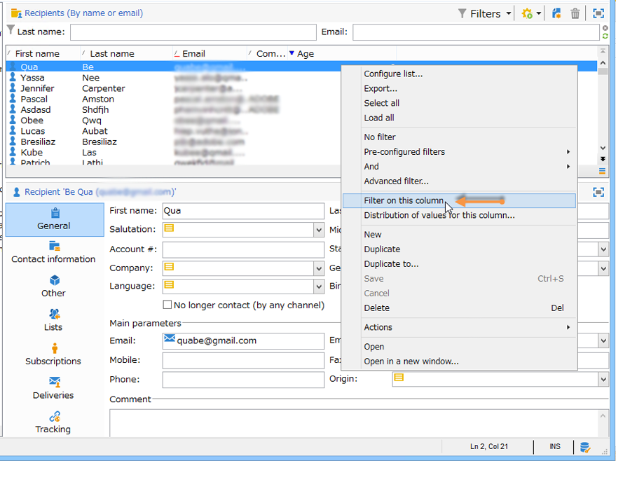
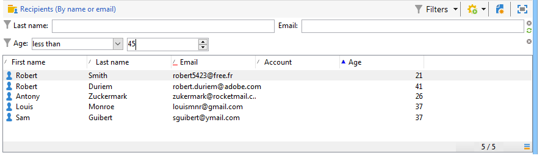
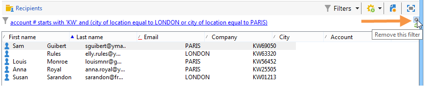
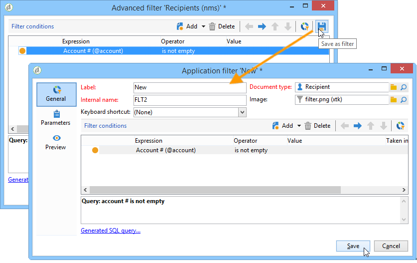

# Creare i filtri{#creating-filters}

Quando ci si sposta nella struttura Adobe Campaign (dal menu **[!UICONTROL Explorer]** nella home page), i dati contenuti nel database vengono visualizzati in elenchi. Questi elenchi possono essere configurati per visualizzare solo i dati richiesti dall’operatore. È quindi possibile avviare azioni sui dati filtrati. La configurazione del filtro consente di selezionare dati da un elenco **[!UICONTROL dynamically]**. Se i dati vengono modificati, i dati filtrati vengono aggiornati.

>[!NOTE]
>
>Le impostazioni di configurazione dell’interfaccia utente sono definite localmente a livello di dispositivo. A volte può essere necessario pulire questi dati, in particolare se si verificano problemi durante l’aggiornamento dei dati. A tale scopo, utilizzare il menu **[!UICONTROL File > Clear the local cache]**.

## Tipologia dei filtri disponibili {#typology-of-available-filters}

Adobe Campaign consente di applicare filtri agli elenchi di dati.

Questi filtri possono essere utilizzati una sola volta oppure possono essere salvati per utilizzi futuri. Puoi applicare più filtri contemporaneamente.

In Adobe Campaign sono disponibili i seguenti tipi di filtro:

* **Filtri predefiniti**

  Il **filtro predefinito** è accessibile tramite i campi sopra gli elenchi. Ti consente di filtrare in base a campi predefiniti (per i profili dei destinatari, questi sono il nome e l’indirizzo e-mail per impostazione predefinita). Puoi utilizzare i campi per immettere i caratteri in base ai quali filtrare o per selezionare le condizioni di filtro da un elenco a discesa.

  
<!--
  >[!NOTE]
  >
  >The **%** character replaces any character string. For example, the string `%@yahoo.com` lets you display all the profiles with an email address in the domain "yahoo.com".
-->
È possibile modificare il filtro predefinito di un elenco. Per ulteriori informazioni, consulta [Modificare il filtro predefinito](#altering-the-default-filter).

* **Filtri semplici**

  **I filtri semplici** sono filtri unici nelle colonne. Vengono definiti con uno o più criteri di ricerca semplici nelle colonne visualizzate.

  Puoi combinare diversi filtri semplici sullo stesso elenco di dati per perfezionare la ricerca. I campi del filtro vengono visualizzati uno sotto l’altro. Possono essere cancellati indipendentemente l&#39;uno dall&#39;altro.

  

  I filtri semplici sono descritti in dettaglio in [Creare un filtro semplice](#creating-a-simple-filter).

* **Filtri avanzati**

  **I filtri avanzati** vengono creati utilizzando una query o una combinazione di query sui dati.

  Per ulteriori informazioni sulla creazione di un filtro avanzato, vedere [Creare un filtro avanzato](#creating-an-advanced-filter).

  Puoi utilizzare le funzioni per definire il contenuto del filtro. Per ulteriori informazioni, consulta [Creare un filtro avanzato con funzioni](#creating-an-advanced-filter-with-functions).

  >[!NOTE]
  >
  >Per ulteriori informazioni sulla creazione di query in Adobe Campaign, consulta [questa sezione](../../platform/using/about-queries-in-campaign.md).

* **Filtri utente**

  Un **filtro applicazioni** è un filtro avanzato salvato per utilizzare e condividere la configurazione con gli altri operatori.

  Il pulsante **[!UICONTROL Filters]** situato sopra gli elenchi offre un set di filtri dell&#39;applicazione che possono essere combinati per perfezionare il filtro. Il metodo per creare questi filtri è presentato in [Salva un filtro](#saving-a-filter).

## Modificare il filtro predefinito {#altering-the-default-filter}

Per modificare il filtro predefinito per un elenco di destinatari, fare clic sul nodo **[!UICONTROL Profiles and Targets > Pre-defined filters]** della struttura.

Per tutti gli altri tipi di dati, configurare il filtro predefinito tramite il nodo **[!UICONTROL Administration > Configuration > Predefined filters]**.

Applica i seguenti passaggi:

1. Seleziona il filtro da utilizzare per impostazione predefinita.
1. Fare clic sulla scheda **[!UICONTROL Parameters]** e selezionare **[!UICONTROL Default filter for the associated document type]**.

   

   >[!CAUTION]
   >
   >Se all&#39;elenco è già applicato un filtro predefinito, è necessario disattivarlo prima di applicare un nuovo filtro. A questo scopo, fai clic sulla croce rossa a destra dei campi di filtro.

1. Fare clic su **[!UICONTROL Save]** per applicare il filtro.

   >[!NOTE]
   >
   >La finestra di definizione del filtro è descritta in [Creare un filtro avanzato](#creating-an-advanced-filter) e [Salvare un filtro](#saving-a-filter).

## Creare un filtro semplice {#creating-a-simple-filter}

Per creare un **filtro semplice**, attieniti alla seguente procedura:

1. Fare clic con il pulsante destro del mouse sul campo da filtrare e selezionare **[!UICONTROL Filter on this field]**.

   

   I campi filtro predefiniti vengono visualizzati sopra l’elenco.

1. Seleziona l’opzione filtro dall’elenco a discesa, oppure inserisci i criteri di filtro da applicare (il metodo per selezionare o immettere i criteri dipende dal tipo di campo: testo, enumerato, ecc.).

   

1. Per attivare il filtro, premere Invio sulla tastiera o fare clic sulla freccia verde a destra dei campi del filtro.

Se il campo in base al quale si desidera filtrare i dati non viene visualizzato nel formato del profilo, è possibile aggiungerlo nelle colonne visualizzate e quindi filtrare in base a tale colonna. Per eseguire questa operazione,

1. Fare clic sull&#39;icona **[!UICONTROL Configure the list]**.

   

1. Seleziona la colonna da visualizzare, ad esempio l’età dei destinatari.

   

1. Fare clic con il pulsante destro del mouse sulla colonna **Età** nell&#39;elenco dei destinatari e selezionare **[!UICONTROL Filter on this column]**.

   

   Puoi quindi selezionare le opzioni di filtro della pagina.

   

## Creare un filtro avanzato {#creating-an-advanced-filter}

Per creare un **filtro avanzato**, attieniti alla seguente procedura:

1. Fare clic sul pulsante **[!UICONTROL Filters]** e selezionare **[!UICONTROL Advanced filter...]**.

   

   È inoltre possibile fare clic con il pulsante destro del mouse sull&#39;elenco dei dati da filtrare e selezionare **[!UICONTROL Advanced filter...]**.

   Viene visualizzata la finestra di definizione della condizione di filtro.

1. Fare clic sulla colonna **[!UICONTROL Expression]** per definire il valore di input.
1. Fare clic su **[!UICONTROL Edit expression]** per selezionare il campo a cui verrà applicato il filtro.

   

1. Dall’elenco, seleziona il campo in cui verranno filtrati i dati. Fai clic su **[!UICONTROL Finish]** per confermare.
1. Fare clic sulla colonna **[!UICONTROL Operator]** e selezionare l&#39;operatore da applicare dall&#39;elenco a discesa.
1. Selezionare un valore previsto dalla colonna **[!UICONTROL Value]**. Puoi combinare diversi filtri per perfezionare la query. Per aggiungere una condizione di filtro, fare clic su **[!UICONTROL Add]**.

   

1. È possibile assegnare una gerarchia alle espressioni o modificare l’ordine delle espressioni di query utilizzando le frecce della barra degli strumenti.
1. L&#39;operatore predefinito tra le espressioni è **And**, ma è possibile modificarlo facendo clic sul campo. È possibile selezionare un operatore **Or**.

   

1. Fare clic su **[!UICONTROL OK]** per confermare la creazione del filtro e applicarlo all&#39;elenco.

Il filtro applicato viene visualizzato sopra l’elenco.

Per modificare il filtro, fare clic sulla relativa etichetta.

Per annullare il filtro, fare clic sull&#39;icona **[!UICONTROL Remove this filter]** a destra del filtro.

Puoi salvare un filtro avanzato per conservarlo per utilizzarlo in futuro. Per ulteriori informazioni su questo tipo di filtro, vedere [Salvare un filtro](#saving-a-filter).

### Creare un filtro avanzato con le funzioni {#creating-an-advanced-filter-with-functions}

I filtri avanzati possono utilizzare funzioni; **i filtri con funzioni** vengono creati tramite un editor di espressioni che consente di creare formule utilizzando i dati del database e le funzioni avanzate. Per creare un filtro con funzioni, ripeti i passaggi 1, 2 e 3 della creazione avanzata del filtro, quindi procedi come segue:

1. Nella finestra di selezione dei campi fare clic su **[!UICONTROL Advanced selection]**.
1. Selezionare il tipo di formula da utilizzare: aggregato, filtro utente esistente o espressione.

   

   Sono disponibili le seguenti opzioni:

   * **[!UICONTROL Field only]** per selezionare un campo. Questa è la modalità predefinita.
   * **[!UICONTROL Aggregate]** per selezionare la formula di aggregazione da utilizzare (conteggi, somma, media, massima, minima).
   * **[!UICONTROL User filter]** per selezionare uno dei filtri utente esistenti. I filtri utente sono descritti in dettaglio in [Salvare un filtro](#saving-a-filter).
   * **[!UICONTROL Expression]** per accedere all&#39;editor espressioni.

     L’editor di espressioni ti consente di definire un filtro avanzato. Ecco come si presenta:

     

     Consente di selezionare i campi nelle tabelle del database e di allegarvi funzioni avanzate: selezionare la funzione da utilizzare in **[!UICONTROL List of functions]**. Le funzioni disponibili sono descritte in dettaglio in [Elenco di funzioni](../../platform/using/defining-filter-conditions.md#list-of-functions). Selezionare quindi il campo o i campi interessati dalle funzioni e fare clic su **[!UICONTROL OK]** per approvare l&#39;espressione.

     >[!NOTE]
     >
     >Per un esempio di creazione di un filtro basato su un&#39;espressione, fare riferimento a [questa sezione](../../workflow/using/sending-a-birthday-email.md#identifying-recipients-whose-birthday-it-is).

## Salvare un filtro {#saving-a-filter}

I filtri sono specifici di ciascun operatore e vengono reinizializzati ogni volta che l’operatore cancella la cache della propria console client.

È possibile creare un **filtro applicazioni** salvando un filtro avanzato: è possibile riutilizzarlo facendo clic con il pulsante destro del mouse in qualsiasi elenco o tramite il pulsante **[!UICONTROL Filters]** situato sopra gli elenchi.

È inoltre possibile accedere direttamente a questi filtri tramite l&#39;assistente alla consegna, nella fase di selezione del target (per ulteriori informazioni sulla creazione di consegne, consulta [questa sezione](../../delivery/using/creating-an-email-delivery.md)). Per creare il filtro dell&#39;applicazione, è possibile:

* Convertire un filtro avanzato in un filtro applicazione. A tale scopo, fare clic su **[!UICONTROL Save]** prima di chiudere l&#39;editor di filtri avanzato.

  

* Creare questo filtro dell&#39;applicazione tramite il nodo **[!UICONTROL Administration > Configuration > Predefined filters]** (o **[!UICONTROL Profiles and targets > Predefined filters]** per i destinatari) della struttura. A tale scopo, fare clic con il pulsante destro del mouse sull&#39;elenco dei filtri e selezionare **[!UICONTROL New...]**. La procedura è la stessa della creazione di filtri avanzati.

  Il campo **[!UICONTROL Label]** consente di denominare questo filtro. Questo nome verrà visualizzato nella casella combinata del pulsante **[!UICONTROL Filters...]**.

  

È possibile eliminare tutti i filtri dell&#39;elenco corrente facendo clic con il pulsante destro del mouse e selezionando **[!UICONTROL No filter]** o tramite l&#39;icona **[!UICONTROL Filters]** situata sopra l&#39;elenco.

È possibile combinare i filtri facendo clic sul pulsante **[!UICONTROL Filters]** e utilizzando il menu **[!UICONTROL And...]**.

## Filtra destinatari {#filtering-recipients}

I filtri predefiniti (vedi [Salvare un filtro](#saving-a-filter)) ti consentono di filtrare i profili dei destinatari contenuti nel database. È possibile modificare i filtri dal nodo **[!UICONTROL Profiles and Targets > Predefined filters]** della struttura. I filtri sono elencati nella sezione superiore dell&#39;area di lavoro tramite il pulsante **[!UICONTROL Filters]**.

Seleziona un filtro per visualizzarne la definizione e accedere a un’anteprima dei dati filtrati.

>[!NOTE]
>
>Per un esempio dettagliato di creazione di filtri predefiniti, consulta [Caso d&#39;uso](../../platform/using/use-case.md).

I filtri predefiniti sono:

<table> 
 <tbody> 
  <tr> 
   <td> <strong>Etichetta</strong>  </td> 
   <td> <strong>Query</strong>  </td> 
  </tr> 
  <tr> 
   <td> Aperto  </td> 
   <td> Seleziona i destinatari che hanno aperto una consegna.  </td> 
  </tr> 
  <tr> 
   <td> Aperto ma non selezionato  </td> 
   <td> Seleziona i destinatari che hanno aperto una consegna ma non hanno fatto clic su un collegamento.  </td> 
  </tr> 
  <tr> 
   <td> Destinatari inattivi  </td> 
   <td> Seleziona i destinatari che non hanno aperto una consegna in X mesi.  </td> 
  </tr> 
  <tr> 
   <td> Ultima attività per tipo di dispositivo  </td> 
   <td> Seleziona i destinatari che hanno fatto clic o aperto la consegna Y utilizzando il dispositivo X negli ultimi Z giorni.  </td> 
  </tr> 
  <tr> 
   <td> Ultima attività per tipo di dispositivo (tracciamento)  </td> 
   <td> Seleziona i destinatari che hanno fatto clic o aperto la consegna Y utilizzando il dispositivo X negli ultimi Z giorni.  </td> 
  </tr> 
  <tr> 
   <td> Destinatari non assegnati  </td> 
   <td> Seleziona i destinatari che non sono mai stati oggetto di targeting tramite il canale Y in X mesi.  </td> 
  </tr> 
  <tr> 
   <td> Destinatari molto attivi  </td> 
   <td> Seleziona i destinatari che hanno fatto clic su una consegna almeno X volte negli ultimi Y mesi.  </td> 
  </tr> 
  <tr> 
 <td> Inserire nell'elenco Bloccati Indirizzo e-mail  </td> 
    <td> Seleziona i destinatari il cui indirizzo e-mail si trova nel inserisco nell'elenco Bloccati di.  </td>
  </tr> 
  <tr> 
   <td> Indirizzo e-mail in quarantena  </td> 
   <td> Seleziona i destinatari il cui indirizzo e-mail è in quarantena.  </td> 
  </tr> 
  <tr> 
   <td> Indirizzi e-mail duplicati nella cartella  </td> 
   <td> Seleziona i destinatari il cui indirizzo e-mail è duplicato nella cartella.  </td> 
  </tr> 
  <tr> 
   <td> Non ha aperto né fatto clic su  </td> 
   <td> Seleziona i destinatari che non hanno aperto o fatto clic su una consegna.  </td> 
  </tr> 
  <tr> 
   <td> Nuovi destinatari (giorni)  </td> 
   <td> Seleziona i destinatari creati negli ultimi X giorni.  </td> 
  </tr> 
  <tr> 
   <td> Nuovi destinatari (minuti)  </td> 
   <td> Seleziona i destinatari creati negli ultimi X minuti.  </td> 
  </tr> 
  <tr> 
   <td> Nuovi destinatari (mesi)  </td> 
   <td> Seleziona i destinatari creati negli ultimi X mesi.  </td> 
  </tr> 
  <tr> 
   <td> Per sottoscrizione  </td> 
   <td> Seleziona i destinatari per sottoscrizione.  </td> 
  </tr> 
  <tr> 
   <td> Facendo clic su un collegamento specifico  </td> 
   <td> Seleziona i destinatari che hanno fatto clic su un URL particolare in una consegna.  </td> 
  </tr> 
  <tr> 
   <td> Per comportamento di recapito post  </td> 
   <td> Seleziona i destinatari in base al loro comportamento dopo la ricezione di una consegna.  </td> 
  </tr> 
  <tr> 
   <td> Per data di creazione  </td> 
   <td> Seleziona i destinatari per data di creazione, in un periodo che va da X mesi (data corrente meno n mesi) a Y mesi (data corrente meno n mesi).  </td> 
  </tr> 
  <tr> 
   <td> Per elenco  </td> 
   <td> Seleziona i destinatari per elenco.  </td> 
  </tr> 
  <tr> 
   <td> Per numero di clic  </td> 
   <td> Seleziona i destinatari che hanno fatto clic su una consegna negli ultimi X mesi.  </td> 
  </tr> 
  <tr> 
   <td> Per numero di messaggi ricevuti  </td> 
   <td> Seleziona i destinatari in base al numero di messaggi ricevuti.  </td> 
  </tr> 
  <tr> 
   <td> Per numero di aperture  </td> 
   <td> Seleziona i destinatari che hanno aperto tra le consegne X e Y nel tempo Z.  </td> 
  </tr> 
  <tr> 
   <td> Per nome o e-mail  </td> 
   <td> Seleziona i destinatari in base al nome o all'indirizzo e-mail.  </td> 
  </tr> 
  <tr> 
   <td> Per fascia di età  </td> 
   <td> Seleziona i destinatari in base alla loro età.  </td> 
  </tr> 
 </tbody> 
</table>

>[!NOTE]
>
>Tutti i confronti relativi al conteggio e ai periodi devono essere intesi in senso più ampio (i destinatari che corrispondono ai limiti di query sono inclusi nel confronto).

Esempi di calcolo dei dati:

* Seleziona i destinatari di età inferiore a 30 anni:

  

* Seleziona i destinatari di età pari o superiore a 18 anni:

  

* Seleziona i destinatari di età compresa tra 18 e 30 anni:

  

## Impostazioni avanzate per i filtri dati {#advanced-settings-for-data-filters}

Fare clic sulla scheda **[!UICONTROL Settings]** per accedere alle opzioni seguenti:

* **[!UICONTROL Default filter for the associated document type]**: questa opzione consente di suggerire questo filtro per impostazione predefinita nell&#39;editor degli elenchi interessati dall&#39;ordinamento.

  Ad esempio, il filtro **[!UICONTROL By name or login]** viene applicato agli operatori. Questa opzione è selezionata e quindi il filtro è sempre disponibile in tutti gli elenchi di operatori.

* **[!UICONTROL Filter shared with other operators]**: questa opzione consente di rendere il filtro disponibile a tutti gli altri operatori del database corrente.
* **[!UICONTROL Use parameter entry form]**: questa opzione consente di definire i campi filtro da visualizzare sopra l&#39;elenco quando il filtro è selezionato. Questi campi ti consentono di definire le impostazioni del filtro. Il modulo deve essere immesso in formato XML tramite il pulsante **[!UICONTROL Form]**. Ad esempio, il filtro preconfigurato **[!UICONTROL Recipients who have opened]**, disponibile nell&#39;elenco dei destinatari, visualizza un campo filtro che consente di selezionare la consegna a cui è destinato il filtro.

  Il pulsante **[!UICONTROL Preview]** visualizza il risultato del filtro selezionato.

* Il collegamento **[!UICONTROL Advanced parameters]** consente di definire impostazioni aggiuntive. In particolare, è possibile associare una tabella SQL al filtro per renderla comune a tutti gli editor che la condividono.

  Selezionare l&#39;opzione **[!UICONTROL Do not restrict the filter]** se si desidera impedire all&#39;utente di ignorare questo filtro.

  Questa opzione è abilitata per i filtri &quot;Destinatari di una consegna&quot; e &quot;Destinatari delle consegne appartenenti a una cartella&quot; offerti nell’assistente alla consegna che non possono essere sovraccaricati.

  
