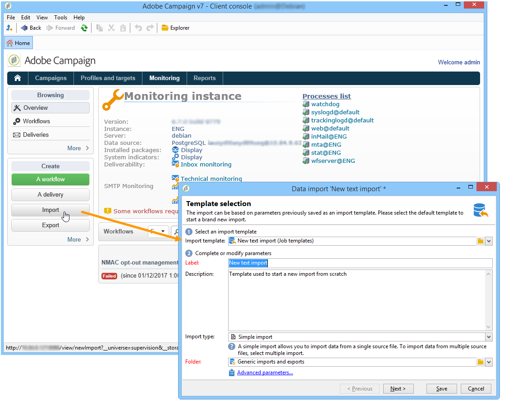

# Creare processi di importazione ed esportazione {#creating-import-export-jobs}

Una volta configurati i modelli, è possibile avviare le operazioni di importazione ed esportazione in diversi contesti in Adobe Campaign.

* Nella sezione **[!UICONTROL Profiles and targets]** dell&#39;area di lavoro di Adobe Campaign, fai clic sul collegamento **[!UICONTROL Jobs]**: per visualizzare l&#39;elenco delle importazioni ed esportazioni esistenti.

  Fare clic sul pulsante **[!UICONTROL Create]** e selezionare il tipo di processo che si desidera eseguire.

  

* È inoltre possibile avviare importazioni ed esportazioni dalla sezione **[!UICONTROL Monitoring]** dell&#39;area di lavoro: due collegamenti dedicati consentono di avviare direttamente l&#39;importazione o l&#39;esportazione.

  

* Infine, è possibile avviare le importazioni e le esportazioni da Adobe Campaign Explorer.

  

Tutte queste procedure guidate per l&#39;importazione o l&#39;esportazione di dati aperti. Sono descritte in dettaglio nelle seguenti sezioni:

* [Configurare un processo di importazione](../../platform/using/executing-import-jobs.md)
* [Configurare un processo di esportazione](../../platform/using/executing-export-jobs.md)
