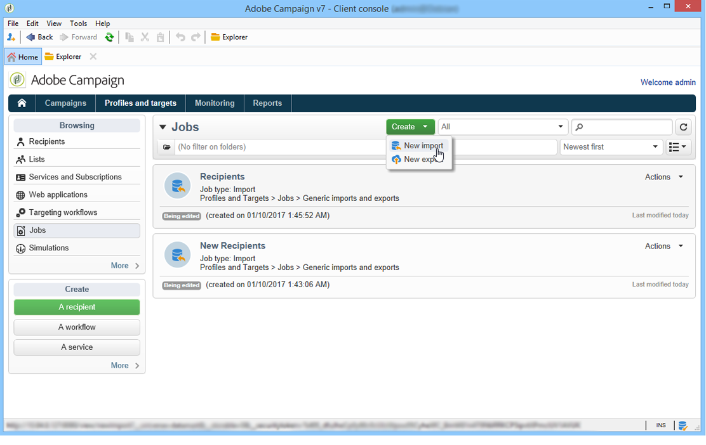

# Creazione di processi di importazione ed esportazione {#creating-import-export-jobs}

Una volta configurati i modelli, le operazioni di importazione ed esportazione possono essere avviate in diversi contesti  Adobe Campaign.

* Nella sezione **[!UICONTROL Profiles and targets]** dell&#39;area di lavoro  Adobe Campaign, fate clic sul collegamento **[!UICONTROL Jobs]**: viene visualizzato l’elenco delle importazioni e delle esportazioni esistenti.

   Fate clic sul pulsante **[!UICONTROL Create]** e selezionate il tipo di processo da eseguire.

   

* Potete inoltre avviare importazioni ed esportazioni dalla sezione **[!UICONTROL Monitoring]** dell&#39;area di lavoro: due collegamenti dedicati consentono di avviare direttamente l’importazione o l’esportazione.

   

* Infine, le importazioni e le esportazioni possono essere avviate dall&#39; Adobe Campaign Explorer.

   

Tutte queste procedure guidate per l&#39;importazione o l&#39;esportazione di dati aperti. Sono descritti in dettaglio nelle seguenti sezioni:

* [Configurazione di un processo di importazione](../../platform/using/executing-import-jobs.md)
* [Configurazione di un processo di esportazione](../../platform/using/executing-export-jobs.md)
