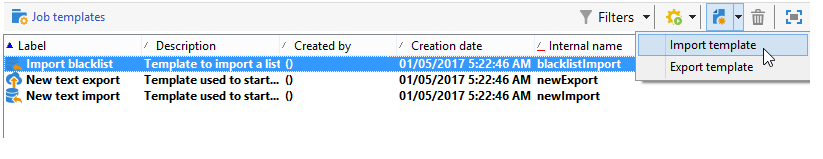

# Creare modelli di importazione ed esportazione {#creating-import-export-templates}

I modelli di importazione ed esportazione sono archiviati nella directory **[!UICONTROL Resources > Templates > Job templates]** della struttura Adobe Campaign.

Per impostazione predefinita, in questa directory sono presenti tre modelli di importazione e un modello di esportazione. Non devono essere modificati.

* Il modello nativo **[!UICONTROL Import denylist]** è già configurato per importare un elenco di indirizzi di posta elettronica aggiunti al inserisco nell&#39;elenco Bloccati di.

* I modelli **[!UICONTROL New text import]** e **[!UICONTROL New text export]** consentono di configurare un&#39;importazione o un&#39;esportazione da zero.

È possibile duplicare i modelli esistenti per creare modelli personalizzati o creare un nuovo modello tramite il menu **[!UICONTROL New > Import template]** / **[!UICONTROL Export template]**.

Il processo di configurazione di un modello è quindi lo stesso di quello presentato in queste sezioni:

* [Configurare un processo di importazione](../../platform/using/executing-import-jobs.md)
* [Configurare un processo di esportazione](../../platform/using/executing-export-jobs.md)
