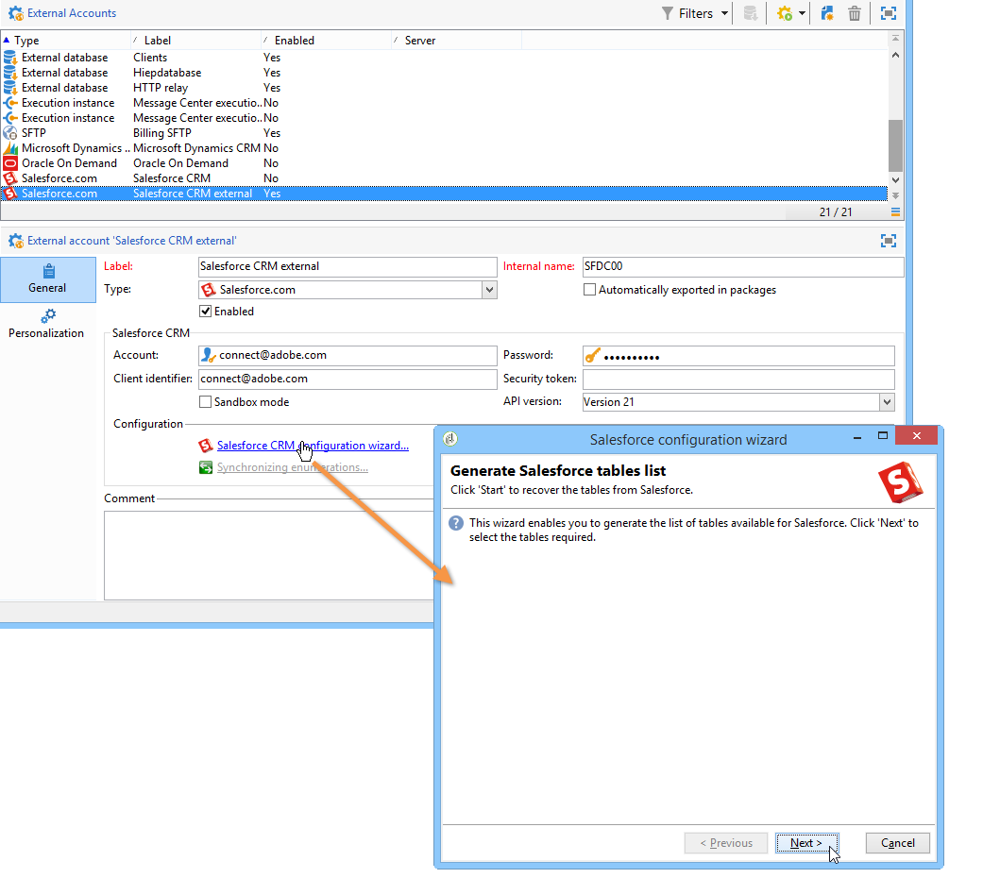
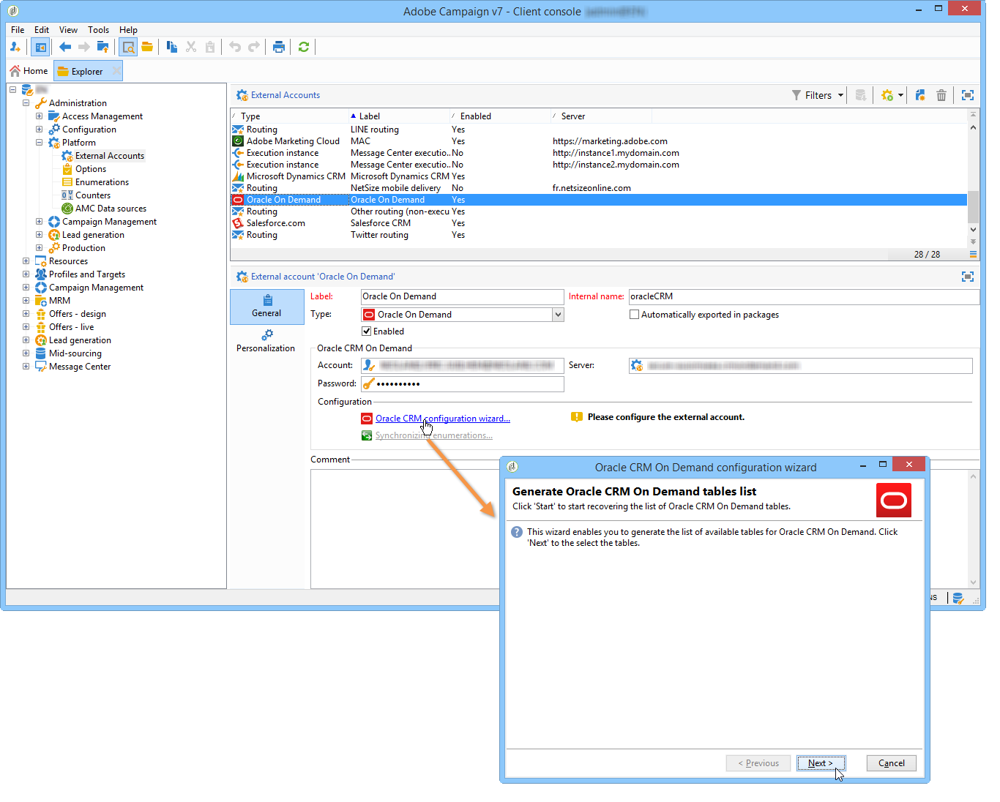
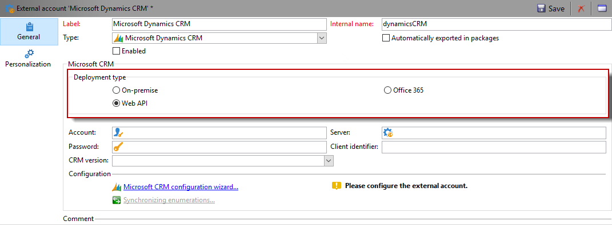

# Connettori di gestione delle relazioni con i clienti{#crm-connectors}

## Informazioni sui connettori CRM {#about-crm-connectors}

Adobe Campaign fornisce diversi connettori di gestione delle relazioni con i clienti per collegare la piattaforma Adobe Campaign ai sistemi di terze parti. Questi connettori di gestione delle relazioni con i clienti ti consentono di sincronizzare contatti, account, acquisti, ecc. Facilitano l’integrazione dell’applicazione con varie applicazioni di terze parti e aziendali.

Questi connettori consentono un’integrazione rapida e semplice dei dati: Adobe Campaign offre una procedura guidata dedicata per la raccolta e la selezione dalle tabelle disponibili nella gestione delle relazioni con i clienti. Ciò garantisce la sincronizzazione bidirezionale per far sì che i dati siano sempre aggiornati in tutti i sistemi.

>[!NOTE]
>
>Questa funzione è disponibile in  Adobe Campaign tramite il pacchetto dedicato dei connettori **** CRM.

La connessione a CRM viene eseguita tramite attività di flusso di lavoro dedicate. Tali attività sono descritte in dettaglio nel capitolo illustrato nella [presente sezione](../../workflow/using/crm-connector.md).

### Limitazioni e sistemi CRM compatibili {#compatible-crm-systems-and-limitations}

I CRM elencati di seguito possono essere integrati  Adobe Campaign.

Le versioni supportate sono dettagliate nella matrice Compatibilità campagna.

* **Salesforce.com**

   Per informazioni su come impostare la connessione con Salesforce.com, fare riferimento a [questa sezione](#example-for-salesforce-com) .

   >[!IMPORTANT]
   >
   >Quando si collega  Adobe Campaign a Salesforce.com, le limitazioni sono:
   >
   >    
   >    
   >    * Le istanze di produzione di prova sono supportate.
   >    * Le regole di assegnazione sono supportate.
   >    * Le enumerazioni di selezione multiple non sono supportate da  Adobe Campaign.

* **Oracle On Demand**

   Fare riferimento a [questa sezione](#example-for-oracle-on-demand) per apprendere come impostare la connessione con Oracle On Demand.

   >[!IMPORTANT]
   >
   >Quando si collega  Adobe Campaign a Oracle On Demand, le limitazioni sono:
   >
   >    
   >    
   >    *  Adobe Campaign può sincronizzare qualsiasi oggetto disponibile nei modelli standard di Oracle On Demand. Se in Oracle On Demand sono state aggiunte tabelle personalizzate, queste non verranno recuperate in  Adobe Campaign.
   >    * La versione API v1.0 consente di ordinare o filtrare i dati durante una query, ma non di eseguire entrambe le operazioni contemporaneamente.
   >    * Le date inviate da Oracle On Demand non contengono informazioni sul fuso orario.
   >    * Le enumerazioni di selezione multiple non sono supportate da  Adobe Campaign.

* **MS Dynamics CRM** e **MS Dynamics Online**

   Fare riferimento a [questa sezione](#example-for-microsoft-dynamics) per informazioni su come impostare la connessione con Microsoft Dynamics.

   Scopri  casi di utilizzo dell’integrazione con Adobe Campaign e Microsoft Dynamics in [questo video](https://helpx.adobe.com/it/campaign/kt/acc/using/acc-integrate-dynamics365-with-acc-feature-video-set-up.html).

   >[!IMPORTANT]
   >
   >Durante la connessione  Adobe Campaign con Microsoft Dynamics, le limitazioni sono:
   >
   >    
   >    
   >    * L&#39;installazione dei plug-in può modificare il comportamento di CRM, il che può causare problemi di compatibilità con  Adobe Campaign.
   >    * Le enumerazioni di selezione multiple non sono supportate da  Adobe Campaign.

## Configurazione della connessione {#setting-up-the-connection}

Per utilizzare i connettori CRM in  Adobe Campaign, attenetevi alla seguente procedura:

1. Creazione dell&#39;account esterno
1. Raccogliere le tabelle CRM
1. Sincronizzare le enumerazioni
1. Creare il flusso di lavoro di sincronizzazione

>[!NOTE]
>
>I connettori CRM funzionano solo con un URL sicuro (https).

### Esempio per Salesforce.com {#example-for-salesforce-com}

Per configurare il connettore **Salesforce.com** con  Adobe Campaign, procedere come segue:

1. Create un nuovo account esterno tramite il **[!UICONTROL Administration > Platform > External accounts]** nodo della struttura di Adobe Campaign .
1. Eseguire la procedura guidata di configurazione per generare le tabelle CRM disponibili.

   

   La procedura guidata di configurazione consente di raccogliere le tabelle e creare lo schema corrispondente.

   Fare clic **[!UICONTROL Start]** per eseguire l&#39;esecuzione.

   

   >[!NOTE]
   >
   >Per approvare la configurazione, dovete disconnettervi e tornare alla  console Adobe Campaign.

1. Controllare lo schema generato in  Adobe Campaign nel **[!UICONTROL Administration > Configuration > Data schemas]** nodo.

   

1. Una volta creato lo schema, puoi sincronizzare automaticamente le enumerazioni tramite CRM a  Adobe Campaign.

   A questo scopo, fai clic sul **[!UICONTROL Synchronizing enumerations...]** collegamento e seleziona l&#39;enumerazione Adobe Campaign  che corrisponde all&#39;enumerazione CRM.

   Puoi sostituire tutti i valori di un&#39;enumerazione Adobe Campaign  con quelli di CRM: a questo scopo, selezionate **[!UICONTROL Yes]** nella **[!UICONTROL Replace]** colonna.

   

   Fare clic **[!UICONTROL Next]** e quindi **[!UICONTROL Start]** iniziare a importare l&#39;elenco.

1. Selezionate i valori importati nel **[!UICONTROL Administration > Platform > Enumerations]** menu.

   

1. Per importare i dati Salesforce o per esportare  dati Adobe Campaign in Salesforce, è necessario creare un flusso di lavoro e utilizzare l&#39; **[!UICONTROL CRM connector]** attività.

   

### Esempio per Oracle On Demand {#example-for-oracle-on-demand}

Per configurare il connettore **Oracle On Demand** in modo che funzioni con  Adobe Campaign, procedere come segue:

1. Create un nuovo account esterno tramite il **[!UICONTROL Administration > Platform > External accounts]** nodo della struttura di Adobe Campaign .

   

1. Aprire la procedura guidata di configurazione:  Adobe Campaign mostra automaticamente le tabelle del modello dati Oracle. Selezionare le tabelle da raccogliere.

   

1. Fare clic **[!UICONTROL Next]** per iniziare a creare lo schema corrispondente.

   Lo schema di dati corrispondente diventa disponibile in  Adobe Campaign.

   

1. Avviare la sincronizzazione delle enumerazioni tra  Adobe Campaign e Oracle On Demand.

   

1. Per importare i dati di Oracle On Demand in  Adobe Campaign, creare il seguente tipo di flusso di lavoro:

   

   Questo flusso di lavoro importa i contatti tramite Oracle On Demand, li sincronizza con i dati Adobe Campaign  esistenti, elimina i contatti duplicati e aggiorna il database Adobe Campaign .

   L&#39; **[!UICONTROL CRM Connector]** attività deve essere configurata come illustrato di seguito:

   

1. Per esportare  dati Adobe Campaign in Oracle On Demand, creare il seguente flusso di lavoro:

   

   Questo flusso di lavoro raccoglie i dati pertinenti utilizzando le query, quindi li esporta nella tabella dei contatti di Oracle On Demand.

### Esempio per Microsoft Dynamics {#example-for-microsoft-dynamics}

Per configurare il connettore Microsoft Dynamics in modo che funzioni con  Adobe Campaign, eseguire i passaggi seguenti:

1. Create un nuovo account esterno tramite il **[!UICONTROL Administration > Platform > External accounts]** nodo della struttura di Adobe Campaign .

   

1. Selezionate il tipo **di** distribuzione: **[!UICONTROL On-premise]**, **[!UICONTROL Office 365]** o **[!UICONTROL Web API]**, a seconda del connettore che si desidera configurare.

   Adobe Campaign Classic supporta l&#39;interfaccia REST di Dynamics 365 con protocollo OAuth per l&#39;autenticazione.

   Se si seleziona una **[!UICONTROL WebAPI]** distribuzione, è necessario registrare un&#39;app nella directory di Azure e ottenere il **clientId** dalla directory di Azure. Questa registrazione è documentata in [questa pagina](https://msdn.microsoft.com/en-us/library/mt622431.aspx).

   >[!NOTE]
   >
   >Il parametro redirectURL non è richiesto da Adobe Campaign Classic.

   Il valore **clientId** viene utilizzato con nome utente/password per recuperare il token del portatore utilizzando la password del tipo di sovvenzione. Si chiama Concessione credenziali password proprietario **risorsa**. Per ulteriori informazioni, consulta [questa pagina](https://blogs.msdn.microsoft.com/wushuai/2016/09/25/resource-owner-password-credentials-grant-in-azure-ad-oauth/).

   

   Per ulteriori informazioni sulla compatibilità della versione CRM, fare riferimento alla matrice [di](https://helpx.adobe.com/it/campaign/kb/compatibility-matrix.html)compatibilità.

1. Aprire la procedura guidata di configurazione.  Adobe Campaign rileva automaticamente le tabelle dal modello dati di Microsoft Dynamics.

   

1. Selezionare le tabelle da recuperare.

   

1. Fare clic **[!UICONTROL Next]** e iniziare a creare lo schema corrispondente.

   

   >[!NOTE]
   >
   >Per approvare la configurazione, è necessario disconnettersi/riconnettersi alla console Adobe Campaign .

   Lo schema di dati corrispondente diventa disponibile in  Adobe Campaign.

   

1. Avvia la sincronizzazione delle enumerazioni tra  Adobe Campaign e Microsoft Dynamics.

   

1. Per importare i dati di Microsoft Dynamics in  Adobe Campaign, creare il seguente tipo di flusso di lavoro:

   

   Questo flusso di lavoro importa i contatti tramite Microsoft Dynamics, li sincronizza con i dati Adobe Campaign  esistenti, elimina i contatti duplicati e aggiorna il database Adobe Campaign .

   L&#39; **[!UICONTROL CRM Connector]** attività deve essere configurata come segue:

   

## Sincronizzazione dei dati {#data-synchronization}

La sincronizzazione tra  Adobe Campaign e CRM viene eseguita tramite un&#39;attività di flusso di lavoro dedicata: [Connettore](../../workflow/using/crm-connector.md)CRM.

Questa attività consente di:

* Importa da CRM (fare riferimento a [Importazione da CRM](#importing-from-the-crm)),
* Esportazione in CRM (fare riferimento a [Esportazione in CRM](#exporting-to-the-crm)),
* Importa oggetti eliminati nel CRM (fare riferimento a [Importazione di oggetti eliminati nel CRM](#importing-objects-deleted-in-the-crm)),
* Eliminare gli oggetti in CRM (fare riferimento a [Eliminazione degli oggetti in CRM](#deleting-objects-in-the-crm)).

Selezionare l&#39;account esterno che corrisponde al CRM con cui si desidera configurare la sincronizzazione, quindi selezionare l&#39;oggetto da sincronizzare (account, opportunità, lead, contatti, ecc.).

La configurazione di questa attività dipende dal processo da eseguire. Diverse configurazioni sono descritte di seguito.

### Importazione da CRM {#importing-from-the-crm}

Per importare dati tramite CRM in  Adobe Campaign, è necessario creare il seguente tipo di flusso di lavoro:

Per un&#39;attività di importazione, i passaggi di configurazione dell&#39;attività del connettore **** CRM sono:

1. Selezionare un&#39; **[!UICONTROL Import from the CRM]** operazione.
1. Fare clic sull&#39;elenco a **[!UICONTROL Remote object]** discesa e selezionare l&#39;oggetto interessato dal processo. Questo oggetto coincide con una delle tabelle create in  Adobe Campaign durante la configurazione del connettore.
1. Passate alla **[!UICONTROL Remote fields]** sezione e inserite i campi da importare.

   Per aggiungere un campo, fare clic sul **[!UICONTROL Add]** pulsante nella barra degli strumenti, quindi fare clic sull&#39; **[!UICONTROL Edit expression]** icona.

   

   Se necessario, modificare il formato dei dati tramite l&#39;elenco a discesa delle **[!UICONTROL Conversion]** colonne. I possibili tipi di conversione sono descritti in formato Dati.

   >[!IMPORTANT]
   >
   >L&#39;identificatore del record in CRM è obbligatorio per il collegamento di oggetti in CRM e in  Adobe Campaign. Viene aggiunto automaticamente all’approvazione della casella.
   >
   >Anche l&#39;ultima data di modifica sul lato CRM è obbligatoria per le importazioni di dati incrementali.

1. Puoi anche filtrare i dati da importare in base alle tue esigenze. A tale scopo, fare clic sul **[!UICONTROL Edit the filter...]** collegamento.

   Nell&#39;esempio seguente,  Adobe Campaign importa solo i contatti per i quali alcune attività sono state registrate dal 1° novembre 2012.

   

   >[!IMPORTANT]
   >
   >Le limitazioni collegate alle modalità di filtraggio dei dati sono dettagliate in [Filtro dei dati](#filtering-data).

1. L&#39; **[!UICONTROL Use automatic index...]** opzione consente di gestire automaticamente la sincronizzazione incrementale degli oggetti tra CRM e  Adobe Campaign, a seconda della data e dell&#39;ultima modifica.

   For more on this, refer to [Variable management](#variable-management).

#### Gestione delle variabili {#variable-management}

Abilitando l&#39; **[!UICONTROL Automatic index]** opzione è possibile raccogliere solo gli oggetti modificati dall&#39;ultima importazione.

Per impostazione predefinita, la data dell’ultima sincronizzazione è memorizzata in un’opzione specificata nella finestra di configurazione: **LASTIMPORT_&lt;%=instance.internalName%>_&lt;%=activityName%>**.

>[!NOTE]
>
>Questa nota si applica solo all&#39; **[!UICONTROL CRM Connector]** attività generica. Per altre attività CRM, il processo è automatico.
>
>Questa opzione deve essere creata manualmente e compilata in **[!UICONTROL Administration]** > **[!UICONTROL Platform]** > **[!UICONTROL Options]**. Deve essere un&#39;opzione di testo e il suo valore deve corrispondere al seguente formato: **aaaa/MM/gg hh:mm:ss**.
> 
>È necessario aggiornare manualmente questa opzione per qualsiasi ulteriore importazione.

Puoi specificare il campo CRM remoto da prendere in considerazione per identificare le modifiche più recenti.

Per impostazione predefinita, vengono utilizzati i campi seguenti (nell&#39;ordine specificato):

* Per Microsoft Dynamics: **modifiedon**,
* Per Oracle On Demand: **LastUpdated**, **ModifiedDate**, **LastLoggedIn**,
* Per Salesforce.com: **LastModifiedDate**, **SystemModestamp**.

Attivando l&#39; **[!UICONTROL Automatic index]** opzione vengono generate tre variabili che possono essere utilizzate nel flusso di lavoro di sincronizzazione tramite un&#39;attività di **[!UICONTROL JavaScript code]** tipo. Tali attività sono:

* **vars.crmOptionName**: rappresenta il nome dell&#39;opzione che contiene l&#39;ultima data di importazione.
* **vars.crmStartImport**: rappresenta la data di inizio (inclusa) dell&#39;ultimo recupero di dati.
* **vars.crmEndDate**: rappresenta la data di fine (esclusa) dell&#39;ultimo recupero di dati.

   >[!NOTE]
   >
   >Queste date sono visualizzate nel seguente formato: **aaaa/MM/gg hh:mm:ss**.

#### Filtrare dati {#filtering-data}

Per garantire un funzionamento efficiente con i diversi CRM, è necessario creare i filtri utilizzando le seguenti regole:

* Ogni livello di filtro può utilizzare un solo tipo di operatore.
* L&#39;operatore AND NOT non è supportato.
* I confronti possono riguardare solo valori null (tipo &#39;is empty&#39;/&#39;non empty&#39;) o numeri. Ciò significa che il valore (colonna a destra) è valutato e il risultato di tale valutazione deve essere un numero. I confronti tra tipi JOIN non sono pertanto supportati.
* Il valore contenuto nella colonna di destra viene valutato in JavaScript.
* I confronti JOIN non sono supportati.
* L&#39;espressione nella colonna a sinistra deve essere un campo. Non può essere una combinazione di più espressioni, un numero, ecc.

Ad esempio, le seguenti condizioni di filtraggio NON saranno valide per un&#39;importazione CRM, perché l&#39;operatore OR è collocato allo stesso livello degli operatori AND:

* L&#39;operatore OR è collocato allo stesso livello degli operatori AND
* I confronti vengono eseguiti sulle stringhe di testo.

#### Ordina per {#order-by}

In Microsoft Dynamics e Salesforce.com, puoi ordinare i campi remoti da importare in ordine crescente o decrescente.

A tale scopo, fare clic sul **[!UICONTROL Order by]** collegamento e aggiungere le colonne all&#39;elenco.

L&#39;ordine delle colonne nell&#39;elenco corrisponde all&#39;ordine di ordinamento:

#### Identificazione del record {#record-identification}

Invece di importare gli elementi inclusi (e possibilmente filtrati) in CRM, puoi utilizzare una popolazione calcolata in precedenza nel flusso di lavoro.

A questo scopo, selezionare l&#39; **[!UICONTROL Use the population calculated upstream]** opzione e specificare il campo contenente l&#39;identificatore remoto.

Selezionate quindi i campi della popolazione in entrata che desiderate importare, come illustrato di seguito:

### Esportazione in CRM {#exporting-to-the-crm}

L&#39;esportazione  dati Adobe Campaign in CRM consente di copiare l&#39;intero contenuto in un database CRM.

Per esportare i dati in CRM, devi creare il seguente tipo di flusso di lavoro:

Per un&#39;esportazione, applica la seguente configurazione all&#39;attività del connettore **** CRM:

1. Selezionare un&#39; **[!UICONTROL Export to CRM]** operazione.
1. Fare clic sull&#39;elenco a **[!UICONTROL Remote object]** discesa e selezionare l&#39;oggetto interessato dal processo. Questo oggetto coincide con una delle tabelle create in  Adobe Campaign durante la configurazione del connettore.

   >[!IMPORTANT]
   >
   >La funzione di esportazione dell&#39;attività Connettori **** CRM può inserire o aggiornare campi sul lato CRM. Per abilitare gli aggiornamenti di campo in CRM, devi specificare la chiave primaria della tabella remota. Se la chiave non è presente, i dati verranno inseriti (anziché essere aggiornati).

1. Nella **[!UICONTROL Mapping]** sezione, specifica i campi da esportare e la relativa mappatura in CRM.

   

   Per aggiungere un campo, fare clic sul **[!UICONTROL Add]** pulsante nella barra degli strumenti, quindi fare clic sull&#39; **[!UICONTROL Edit expression]** icona.

   >[!NOTE]
   >
   >Per un dato campo, se non è definita alcuna corrispondenza sul lato CRM, i valori non possono essere aggiornati: sono inseriti direttamente nel CRM.

   Se necessario, modificare il formato dei dati tramite l&#39;elenco a discesa delle **[!UICONTROL Conversion]** colonne. I possibili tipi di conversione sono descritti in formato Dati.

   >[!NOTE]
   >
   >L&#39;elenco dei record da esportare e il risultato dell&#39;esportazione vengono salvati in un file temporaneo che rimane accessibile finché il flusso di lavoro non viene completato o riavviato. Questo consente di riavviare il processo in caso di errori senza correre il rischio di esportare più volte lo stesso record o di perdere dati.

### Configurazioni aggiuntive {#additional-configurations}

#### Formato dati {#data-format}

È possibile convertire il formato dei dati al momento dell&#39;importazione in o da CRM.

A questo scopo, selezionare la conversione da applicare nella colonna corrispondente.

La **[!UICONTROL Default]** modalità applica la conversione automatica dei dati, che nella maggior parte dei casi corrisponde a una copia/incolla dei dati. Tuttavia, viene applicata la gestione del fuso orario.

Altre possibili conversioni sono:

* **[!UICONTROL Date only]**: in questa modalità vengono eliminati i campi Data + Ora.
* **[!UICONTROL Without time offset]**: questa modalità annulla la gestione del fuso orario applicata nella modalità predefinita.
* **[!UICONTROL Copy/Paste]**: questa modalità utilizza dati non elaborati come le stringhe (nessuna conversione).

#### Elaborazione errore {#error-processing}

Nel quadro delle importazioni o delle esportazioni di dati, è possibile applicare un processo specifico a errori e rifiuti. A questo scopo, selezionare le opzioni **[!UICONTROL Process rejects]** e **[!UICONTROL Process errors]** nella **[!UICONTROL Behavior]** scheda.

Queste opzioni consentono di posizionare le transizioni di output corrispondenti.

Quindi, inserite le attività pertinenti ai processi che desiderate applicare.

Per elaborare gli errori, ad esempio, potete aggiungere una casella di attesa e pianificare i tentativi.

I rifiuti vengono raccolti con il relativo codice di errore e il relativo messaggio, il che significa che è possibile impostare il tracciamento dei rifiuti per ottimizzare il processo di sincronizzazione.

>[!NOTE]
>
>Anche quando l&#39; **[!UICONTROL Process rejects]** opzione non è abilitata, viene generato un avviso per ogni colonna rifiutata con un codice di errore e un messaggio.

La transizione **[!UICONTROL Reject]** di output consente di accedere allo schema di output che contiene le colonne specifiche relative ai messaggi di errore e ai codici. Queste colonne sono:

* Per Oracle On Demand: **errorLogFilename** (nome del file di registro sul lato Oracle), **errorCode** (codice di errore), **errorSymbol** (simbolo di errore, diverso dal codice di errore), **errorMessage** (descrizione del contesto di errore).
* Per Salesforce.com: **errorSymbol** (simbolo di errore, diverso dal codice di errore), **errorMessage** (descrizione del contesto dell&#39;errore).

### Importazione di oggetti eliminati in CRM {#importing-objects-deleted-in-the-crm}

Per abilitare l&#39;impostazione di un ampio processo di sincronizzazione dei dati, puoi importare gli oggetti eliminati in CRM in  Adobe Campaign.

A questo scopo, eseguire i seguenti passaggi:

1. Selezionare un&#39; **[!UICONTROL Import objects deleted in the CRM]** operazione.
1. Fare clic sull&#39;elenco a **[!UICONTROL Remote object]** discesa e selezionare l&#39;oggetto interessato dal processo. Questo oggetto coincide con una delle tabelle create in  Adobe Campaign durante la configurazione del connettore.
1. Specificate il periodo di eliminazione da prendere in considerazione nei **[!UICONTROL Start date]** campi e nei **[!UICONTROL End date]** campi. Queste date verranno incluse nel periodo.

   

   >[!IMPORTANT]
   >
   >Il periodo di eliminazione degli elementi deve coincidere con le limitazioni specifiche del CRM. Ciò significa che per Salesforce.com, ad esempio, gli elementi eliminati oltre 30 giorni fa non possono essere recuperati.

### Eliminazione di oggetti in CRM {#deleting-objects-in-the-crm}

Per eliminare gli oggetti dal lato CRM, è necessario specificare la chiave primaria degli elementi remoti da eliminare.

La **[!UICONTROL Behavior]** scheda consente di abilitare l&#39;elaborazione dei rifiuti. Questa opzione genera una seconda transizione di output per l&#39; **[!UICONTROL CRM connector]** attività. For more on this, refer to [Error processing](#error-processing).

>[!NOTE]
>
>Anche quando l&#39; **[!UICONTROL Process rejects]** opzione è disabilitata, viene generato un avviso per ogni colonna rifiutata.

