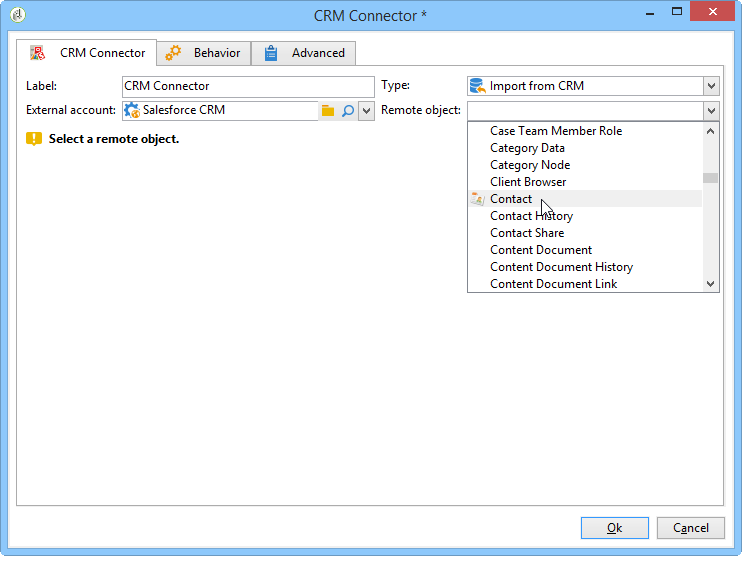
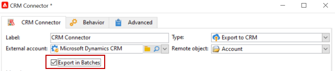

# Sincronizzare i dati tra Campaign e il sistema CRM {#data-synchronization}

La sincronizzazione dei dati tra Adobe Campaign e il sistema CRM viene eseguita tramite un’attività del flusso di lavoro dedicata: [Connettore CRM](../../workflow/using/crm-connector.md).

Ad esempio, per importare i dati di Microsoft Dynamics in Adobe Campaign, crea il seguente tipo di flusso di lavoro:

Questo flusso di lavoro importa i contatti tramite Microsoft Dynamics, li sincronizza con i dati esistenti di Adobe Campaign, li elimina e aggiorna il database di Adobe Campaign.

Il **[!UICONTROL CRM Connector]** l&#39;attività deve essere configurata per sincronizzare i dati.

Con questa attività è possibile:

* Importa dal CRM - [Ulteriori informazioni](#importing-from-the-crm)
* Esporta in CRM - [Ulteriori informazioni](#exporting-to-the-crm)
* Importa oggetti eliminati nel CRM - [Ulteriori informazioni](#importing-objects-deleted-in-the-crm)
* Elimina oggetti nel CRM - [Ulteriori informazioni](#deleting-objects-in-the-crm)

Seleziona l’account esterno che corrisponde al CRM con cui desideri configurare la sincronizzazione, quindi seleziona l’oggetto da sincronizzare: account, opportunità, lead, contatti, ecc.

La configurazione di questa attività dipende dal processo da eseguire. Di seguito sono descritte diverse configurazioni.

## Importa dal CRM {#importing-from-the-crm}

Per importare i dati tramite il sistema di gestione delle relazioni con i clienti in Adobe Campaign, devi creare il seguente tipo di flusso di lavoro:

Per un’attività di importazione, la **[!UICONTROL CRM Connector]** i passaggi di configurazione dell’attività sono:

1. Seleziona un **[!UICONTROL Import from the CRM]** operazione.
1. Vai a **[!UICONTROL Remote object]** e selezionare l&#39;oggetto interessato dal processo. Questo oggetto coincide con una delle tabelle create in Adobe Campaign durante la configurazione del connettore.
1. Vai a **[!UICONTROL Remote fields]** e immettere i campi da importare.

   Per aggiungere un campo, fai clic su **[!UICONTROL Add]** nella barra degli strumenti, quindi fare clic sul pulsante **[!UICONTROL Edit expression]** icona.

   

   Se necessario, modifica il formato dei dati tramite l’elenco a discesa del **[!UICONTROL Conversion]** colonne. I possibili tipi di conversione sono descritti in [Formato dati](#data-format).

   >[!IMPORTANT]
   >
   >L’identificatore del record nel CRM è obbligatorio per il collegamento di oggetti nel CRM e in Adobe Campaign. Viene aggiunto automaticamente quando la casella viene approvata.
   >
   >L’ultima data di modifica sul lato del sistema di gestione delle relazioni con i clienti è obbligatoria anche per le importazioni di dati incrementali.

1. Puoi anche filtrare i dati da importare in base alle tue esigenze. A questo scopo, fai clic su **[!UICONTROL Edit the filter...]** collegamento.

   Nell’esempio seguente, Adobe Campaign importa solo i contatti per i quali è stata registrata un’attività dal 1° novembre 2012.

   

   >[!IMPORTANT]
   >
   >Le limitazioni legate alle modalità di filtro dei dati sono descritte in dettaglio [Filtrare i dati](#filtering-data).

1. Il **[!UICONTROL Use automatic index...]** Questa opzione consente di gestire automaticamente la sincronizzazione incrementale degli oggetti tra il sistema di gestione delle relazioni con i clienti e Adobe Campaign, a seconda della data e dell&#39;ultima modifica.

   Per ulteriori informazioni, consulta [Gestione delle variabili](#variable-management).

### Gestisci variabili {#variable-management}

Abilita **[!UICONTROL Automatic index]** per raccogliere solo gli oggetti modificati dopo l&#39;ultima importazione.

Per impostazione predefinita, la data dell’ultima sincronizzazione viene memorizzata in un’opzione specificata nella finestra di configurazione: **LASTIMPORT_&lt;%=instance.internalName%>_&lt;%=activityName%>**.

>[!NOTE]
>
>Questa nota si applica solo al modello generico **[!UICONTROL CRM Connector]** attività. Per altre attività CRM, il processo è automatico.
>
>Questa opzione deve essere creata e compilata manualmente in **[!UICONTROL Administration]** > **[!UICONTROL Platform]** > **[!UICONTROL Options]**. Deve essere un’opzione di testo e il suo valore deve corrispondere al seguente formato: **`yyyy/MM/dd hh:mm:ss`**.
> 
>È necessario aggiornare manualmente questa opzione per ulteriori importazioni.

Puoi specificare il campo CRM remoto di cui tenere conto per identificare le modifiche più recenti.

Per impostazione predefinita, vengono utilizzati i campi seguenti (nell’ordine specificato):

* Per Microsoft Dynamics: **modifedon**,
* Per Salesforce.com: **LastModifiedDate**, **SystemModstamp**.

Attivazione di **[!UICONTROL Automatic index]** genera tre variabili che possono essere utilizzate nel flusso di lavoro di sincronizzazione tramite un **[!UICONTROL JavaScript code]** attività di tipo. Queste attività sono:

* **vars.crmOptionName**: rappresenta il nome dell’opzione che contiene l’ultima data di importazione.
* **vars.crmStartImport**: rappresenta la data di inizio (inclusa) dell’ultimo recupero di dati.
* **vars.crmEndDate**: rappresenta la data di fine (esclusa) dell’ultimo ripristino dei dati.

  >[!NOTE]
  >
  >Queste date sono visualizzate nel seguente formato: **`yyyy/MM/dd hh:mm:ss`**.

### Filtrare i dati {#filtering-data}

Per garantire un funzionamento efficiente con i vari CRM, i filtri devono essere creati utilizzando le seguenti regole:

* Ogni livello di filtro può utilizzare un solo tipo di operatore.
* Operatore AND NOT non supportato.
* I confronti possono riguardare solo valori nulli (tipo &quot;è vuoto&quot;/&quot;non è vuoto&quot;) o numeri. Ciò significa che il valore (colonna di destra) viene valutato e il risultato di questa valutazione deve essere un numero. I confronti tra tipi JOIN non sono pertanto supportati.
* Il valore contenuto nella colonna di destra viene valutato in JavaScript.
* I confronti JOIN non sono supportati.
* L&#39;espressione nella colonna di sinistra deve essere un campo. Non può essere una combinazione di diverse espressioni, un numero, ecc.

Ad esempio, le seguenti condizioni di filtro NON saranno valide per un’importazione CRM, perché l’operatore OR è posizionato allo stesso livello degli operatori AND:

* L&#39;operatore OR viene posizionato allo stesso livello degli operatori AND
* I confronti vengono eseguiti su stringhe di testo

### Ordina per {#order-by}

In Microsoft Dynamics e Salesforce.com è possibile ordinare i campi remoti da importare in ordine crescente o decrescente.

A questo scopo, fai clic su **[!UICONTROL Order by]** e aggiungere le colonne all&#39;elenco.

L’ordine delle colonne nell’elenco è il seguente:

### Identificazione record {#record-identification}

Invece di importare gli elementi inclusi (e possibilmente filtrati) nel CRM, puoi utilizzare una popolazione calcolata in precedenza nel flusso di lavoro.

A questo scopo, seleziona la **[!UICONTROL Use the population calculated upstream]** e specificare il campo contenente l&#39;identificatore remoto.

Seleziona quindi i campi del gruppo in entrata da importare, come illustrato di seguito:

## Esportazione nel CRM {#exporting-to-the-crm}

L’esportazione dei dati di Adobe Campaign nel sistema di gestione delle relazioni con i clienti consente di copiare l’intero contenuto in un database di gestione delle relazioni con i clienti.

Per esportare i dati verso il CRM, devi creare il seguente tipo di flusso di lavoro:

Per un’esportazione, applica la seguente configurazione alla **[!UICONTROL CRM Connector]** attività:

1. Seleziona un **[!UICONTROL Export to CRM]** operazione.
1. Vai a **[!UICONTROL Remote object]** e selezionare l&#39;oggetto interessato dal processo. Questo oggetto coincide con una delle tabelle create in Adobe Campaign durante la configurazione del connettore.

   >[!IMPORTANT]
   >
   >La funzione di esportazione del **[!UICONTROL CRM Connector]** L’attività può inserire o aggiornare campi sul lato CRM. Per abilitare gli aggiornamenti dei campi nel CRM, devi specificare la chiave primaria della tabella remota. Se la chiave non è presente, i dati verranno inseriti (anziché aggiornati).

1. Verifica **[!UICONTROL Export in Batches]** se hai bisogno di esportazioni più veloci.

   

1. In **[!UICONTROL Mapping]** , fare clic su **[!UICONTROL New]** per specificare i campi da esportare e la relativa mappatura nel CRM.

   

   Per aggiungere un campo, fai clic su **[!UICONTROL Add]** nella barra degli strumenti, quindi fare clic sul pulsante **[!UICONTROL Edit expression]** icona.

   >[!NOTE]
   >
   >Per un determinato campo, se non è definita alcuna corrispondenza sul lato CRM, i valori non possono essere aggiornati: vengono inseriti direttamente nel CRM.

   Se necessario, modifica il formato dei dati tramite l’elenco a discesa del **[!UICONTROL Conversion]** colonne. I possibili tipi di conversione sono descritti in [Formato dati](#data-format).

   >[!NOTE]
   >
   >L&#39;elenco dei record da esportare e il risultato dell&#39;esportazione vengono salvati in un file temporaneo che rimane accessibile fino al completamento o al riavvio del flusso di lavoro. In questo modo è possibile avviare nuovamente il processo in caso di errori, senza il rischio di esportare più volte lo stesso record o di perdere dati.

## Configurazioni aggiuntive {#additional-configurations}

### Formato dei dati {#data-format}

Puoi convertire al volo il formato dei dati quando li importi in o dal sistema CRM.

A questo scopo, seleziona la conversione da applicare nella colonna corrispondente.

Il **[!UICONTROL Default]** La modalità applica la conversione automatica dei dati, che nella maggior parte dei casi è uguale a una copia/incolla dei dati. Tuttavia, viene applicata la gestione del fuso orario.

Altre possibili conversioni sono:

* **[!UICONTROL Date only]**: con questa modalità i campi Tipo data + ora vengono eliminati.
* **[!UICONTROL Without time offset]**: con questa modalità viene annullata la gestione del fuso orario applicata nella modalità predefinita.
* **[!UICONTROL Copy/Paste]**: questa modalità utilizza dati non elaborati come stringhe (nessuna conversione).

### Elaborazione degli errori {#error-processing}

Nel quadro delle importazioni o delle esportazioni di dati, puoi applicare un processo specifico agli errori e ai rifiuti. A questo scopo, seleziona la **[!UICONTROL Process rejects]** e **[!UICONTROL Process errors]** opzioni in **[!UICONTROL Behavior]** scheda.

Queste opzioni inseriscono le transizioni di output corrispondenti.

Quindi inserisci le attività pertinenti ai processi che desideri applicare.

Per elaborare gli errori, ad esempio, puoi aggiungere una casella di attesa e pianificare nuovi tentativi.

I rifiuti vengono raccolti con il relativo codice di errore e il relativo messaggio, il che significa che puoi impostare il tracciamento dei rifiuti per ottimizzare il processo di sincronizzazione.

>[!NOTE]
>
>Anche quando **[!UICONTROL Process rejects]** se l’opzione non è abilitata, viene generato un avviso per ogni colonna rifiutata con un codice di errore e un messaggio.

Il **[!UICONTROL Reject]** la transizione di output consente di accedere allo schema di output contenente le colonne specifiche relative ai messaggi di errore e ai codici. Per Salesforce.com, questa colonna è **errorSymbol** (simbolo di errore, diverso dal codice di errore), **errorMessage** (descrizione del contesto dell’errore).

## Importa oggetti eliminati nel CRM {#importing-objects-deleted-in-the-crm}

Per abilitare l’impostazione di un processo di sincronizzazione dati esteso, puoi importare in Adobe Campaign gli oggetti eliminati nel sistema di gestione delle relazioni con i clienti.

A questo scopo, esegui i seguenti passaggi:

1. Seleziona un **[!UICONTROL Import objects deleted in the CRM]** operazione.
1. Vai a **[!UICONTROL Remote object]** e selezionare l&#39;oggetto interessato dal processo. Questo oggetto coincide con una delle tabelle create in Adobe Campaign durante la configurazione del connettore.
1. Specifica il periodo di eliminazione da considerare nella **[!UICONTROL Start date]** e **[!UICONTROL End date]** campi. Queste date verranno incluse nel periodo.

   

   >[!IMPORTANT]
   >
   >Il periodo di eliminazione dell’elemento deve coincidere con le limitazioni specifiche del sistema di gestione delle relazioni con i clienti. Ciò significa che per Salesforce.com, ad esempio, non è possibile recuperare gli elementi eliminati più di 30 giorni fa.

## Elimina oggetti nel CRM {#deleting-objects-in-the-crm}

Per eliminare oggetti sul lato CRM, devi specificare la chiave primaria degli elementi remoti da eliminare.

Il **[!UICONTROL Behavior]** Questa scheda consente di abilitare l’elaborazione dei rifiuti. Questa opzione genera una seconda transizione di output per **[!UICONTROL CRM connector]** attività. Per ulteriori informazioni, consulta [Errore di elaborazione](#error-processing).

>[!NOTE]
>
>Anche quando **[!UICONTROL Process rejects]** è disattivata, viene generato un avviso per ogni colonna rifiutata.
>
