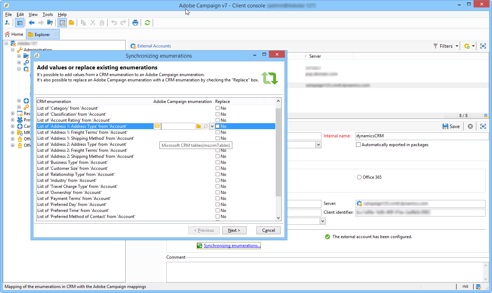

# Connettere Campaign e Microsoft Dynamics 365{#connect-to-msdyn}


In questa pagina imparerai a collegare Campaign Classic a **Microsoft Dynamics CRM 365**.

La possibile implementazione avviene tramite **API web** (consigliato). Fai riferimento a [la sezione seguente](#microsoft-dynamics-implementation-step) per informazioni sulla procedura per configurare la connessione con Microsoft Dynamics.

La sincronizzazione dei dati viene eseguita tramite un’attività del flusso di lavoro dedicata. [Ulteriori informazioni](../../platform/using/crm-data-sync.md).

## Passaggi di implementazione{#microsoft-dynamics-implementation-steps}

Per collegare Microsoft Dynamics 365 per lavorare con Adobe Campaign tramite **API web**, è necessario applicare i seguenti passaggi:

In Microsoft Dynamics CRM:
1. Ottieni ID client Microsoft Dynamics
1. Genera ID chiave e identificatore chiave del certificato di Microsoft Dynamics
1. Configurare le autorizzazioni
1. Creare un utente dell’app
1. Codifica la chiave privata

[Ulteriori informazioni](#config-crm-microsoft)

In Campaign Classic:
1. Crea un nuovo account esterno
1. Configurare l’account esterno con le impostazioni di Microsoft Dynamics
1. Utilizzare la configurazione guidata per mappare tabelle e sincronizzare enumerazioni
1. Creare il flusso di lavoro di sincronizzazione

[Ulteriori informazioni](#configure-acc-for-microsoft)


>[!CAUTION]
> Quando si collega Adobe Campaign con Microsoft Dynamics, non è possibile:
> * Installa plug-in che possono modificare il comportamento del sistema CRM e causare problemi di compatibilità con Adobe Campaign
> * Seleziona più enumerazioni

## Configurare Microsoft Dynamics CRM {#config-crm-microsoft}

Per generare il token di accesso e le chiavi per configurare l’account, devi accedere a [Directory di Microsoft Azure](https://portal.azure.com) utilizzando un **Amministratore globale** credenziali. Quindi segui i passaggi descritti di seguito.

### Ottieni ID client Microsoft Dynamics {#get-client-id-microsoft}

Per ottenere l&#39;ID client, è necessario registrare un&#39;app in Azure Active Directory. L’ID client è uguale all’ID applicazione.

1. Accedi a **Azure Active Directory > Registrazioni app** e fai clic su  **Registrazione nuova applicazione**.
1. Assegna un nome univoco che possa aiutare a identificare un’istanza, ad esempio **adobecampaign`<instance identifier>`**.
1. Scegli **Tipo di applicazione** as **App web/API**.
1. Utilizzare `http://localhost` per **URL di accesso**.

Una volta effettuato il salvataggio, si ottiene un **ID applicazione** che è l’identificatore client di Campaign.

Per ulteriori informazioni, consulta [questa pagina](https://docs.microsoft.com/powerapps/developer/common-data-service/walkthrough-register-app-azure-active-directory).

### Genera ID chiave e identificatore chiave del certificato di Microsoft Dynamics {#config-certificate-key-id}

Per ottenere **Identificatore chiave del certificato (customKeyIdentifier)** e **ID chiave (keyId)**, effettua le seguenti operazioni:

1. Accedi a **Azure Active Directory > Registrazioni app** e selezionare l&#39;applicazione creata in precedenza.
1. Fai clic su **Certificati e segreto**.
1. Fai clic su **Carica certificato** quindi sfoglia e carica il certificato pubblico generato.
1. Per generare il certificato è possibile utilizzare openssl.

   Ad esempio:

   ```
   - openssl req -x509 -sha256 -nodes -days 365 -newkey rsa:2048 -keyout '<'private key name'>' -out '<'public certificate name'>
   ```

   >[!NOTE]
   >
   >Puoi modificare il numero di giorni qui `-days 365`, nel codice di esempio per un periodo di validità del certificato più lungo.

1. Sarà quindi necessario codificarlo in base64. A tale scopo, è possibile utilizzare l&#39;aiuto di un codificatore Base64 o la riga di comando `base64 -w0 private.key` per Linux.

1. Fai clic sul pulsante **Manifesto** collegamento per ottenere **Identificatore chiave del certificato (customKeyIdentifier)** e **ID chiave (keyId)**.

Il **Identificatore chiave del certificato (customKeyIdentifier)** e **ID chiave (keyId)** sarà necessario in seguito per configurare l&#39;account esterno di Microsoft Dynamics CRM tramite il certificato **[!UICONTROL CRM O-Auth type]**.

### Configurare le autorizzazioni {#config-permissions-microsoft}

**Passaggio 1**: configura il **Autorizzazioni richieste** per l’app creata.

1. Accedi a **Azure Active Directory > Registrazioni app** e selezionare l&#39;applicazione creata in precedenza.
1. Clic **Impostazioni** in alto a sinistra.
1. On **Autorizzazioni richieste**, fai clic su **Aggiungi** e **Seleziona un’API > Dynamics CRM Online**.
1. Clic **Seleziona**, abilita **Accedere a Dynamics 365 come utenti dell’organizzazione** e fai clic su **Seleziona**.
1. Quindi, dall’app, seleziona la **Manifesto** sotto **Gestisci** menu.

1. Dalla sezione **Manifesto** editor, imposta `allowPublicClient` proprietà da `null` a `true` e fai clic su **Salva**.

**Passaggio 2**: concedi il consenso all’amministratore

1. Accedi a **Azure Active Directory > Applicazioni aziendali**.

1. Seleziona l’applicazione a cui desideri concedere il consenso dell’amministratore a livello di tenant.

1. Dal menu del riquadro a sinistra, seleziona **Autorizzazioni** in **Sicurezza**.

1. Clic **Concedere il consenso dell’amministratore**.

Per ulteriori informazioni, consulta [Documentazione di Azure](https://docs.microsoft.com/azure/active-directory/manage-apps/grant-admin-consent#grant-admin-consent-from-the-azure-portal).

### Creare un utente dell’app {#create-app-user-microsoft}

>[!NOTE]
>
> Questo passaggio è facoltativo con **[!UICONTROL Password credentials]** autenticazione.

L’utente dell’app è l’utente che verrà utilizzato dall’applicazione registrata in precedenza. Eventuali modifiche apportate a Microsoft Dynamics utilizzando l’app registrata in precedenza verranno eseguite tramite questo utente.

**Passaggio 1**: crea un utente non interattivo in Azure Active Directory

1. Clic **Azure Active Directory > Utenti** e fai clic su **Nuovo utente**.
1. Assegna un nome appropriato che desideri utilizzare e il nome utente deve essere in formato e-mail.
1. Scegli **Amministratore Dynamics 365** nel **Ruolo directory**.

**Passaggio 2**: assegna una licenza corretta all’utente creato

1. Da [Microsoft Azure](https://portal.azure.com), fai clic su **App di amministrazione**.
1. Vai a **Utenti > Utenti attivi** e fai clic sul nuovo utente creato.
1. Fai clic su **Modifica licenze prodotto** e seleziona la **Piano di coinvolgimento del cliente Dynamics 365**.
1. Fai clic su **Chiudi**.

**Passaggio 3**: crea un utente dell’applicazione in Dynamics CRM

1. Da [Microsoft Azure](https://portal.azure.com), passa a **Impostazioni > Protezione > Utenti**.
1. Fai clic sull’elenco a discesa, seleziona **Utenti dell’applicazione** e fai clic su **Nuovo**.
1. Utilizza lo stesso nome utente creato in Active Directory in precedenza

   >[!NOTE]
   >
   >Se si utilizza lo stesso nome, viene generato un errore di chiave duplicata; finché non viene confermato se questo passaggio è necessario, utilizza un nome utente diverso e procedi.
   >

1. Assegna la **ID applicazione** per [l&#39;applicazione creata in precedenza](#get-client-id-microsoft).
1. Fai clic su **Gestisci ruoli** e scegli la **Amministratore di sistema** ruolo all&#39;utente.

## Configurare Campaign {#configure-acc-for-microsoft}

>[!NOTE]
>
> Registrare la disattivazione di [RDS da Microsoft](https://docs.microsoft.com/previous-versions/dynamicscrm-2016/developers-guide/dn281891%28v=crm.8%29#microsoft-dynamics-crm-2011-endpoint), i tipi di distribuzioni CRM On-Premise e Office 365 non sono più compatibili con Campaign. Adobe Campaign ora supporta solo la distribuzione API web per la versione CRM **CRM dinamico 365**. [Ulteriori informazioni](../../rn/using/deprecated-features.md#crm-connectors).

Per connettere Microsoft Dynamics 365 e Campaign, è necessario creare e configurare una **[!UICONTROL External Account]** in Campaign.

1. Accedi a **[!UICONTROL Administration > Platform > External accounts]**.

1. Seleziona la **[!UICONTROL Microsoft Dynamics CRM]** account esterno. Seleziona l’opzione **[!UICONTROL Enabled]**.

1. Inserisci le informazioni necessarie per connettere Microsoft Dynamics 365 e Campaign.

   >[!NOTE]
   >
   >Configurazione account esterno di Microsoft Dynamics CRM con ogni **[!UICONTROL CRM O-Auth type]** è dettagliato [in questa sezione](../../installation/using/external-accounts.md#microsoft-dynamics-crm-external-account).

   

1. Fai clic su **[!UICONTROL Microsoft CRM configuration wizard...]** collegamento. Adobe Campaign rileva automaticamente le tabelle dal modello dati di Microsoft Dynamics.

   

1. Seleziona le tabelle da recuperare.

   

1. Clic **[!UICONTROL Next]** per iniziare a creare lo schema corrispondente.

   

   >[!NOTE]
   >
   >Per approvare la configurazione, devi disconnetterti/riconnetterti alla console Adobe Campaign.

   Puoi verificare che lo schema di dati corrispondente diventi disponibile in Adobe Campaign.

   

1. Fai clic su **[!UICONTROL Synchronizing enumerations...]** collegamento per avviare la sincronizzazione delle enumerazioni tra Adobe Campaign e Microsoft Dynamics.

   

Campaign e Microsoft Dynamics sono ora connessi. È possibile impostare la sincronizzazione dei dati tra i due sistemi. Per ulteriori informazioni, consulta [Sincronizzazione dei dati](../../platform/using/crm-data-sync.md) sezione.

>[!NOTE]
>
> È necessario assicurarsi di aggiungere all’di inserire nell&#39;elenco Consentiti due URL: l’URL del server e `login.microsoftonline.com` nella configurazione del server. Per ulteriori informazioni su come configurare le autorizzazioni URL, consulta questa [pagina](../../installation/using/url-permissions.md).

## Tipi di dati dei campi supportati {#ms-dyn-supported-types}

Di seguito sono elencati i tipi di attributo supportati/non supportati per Microsoft Dynamics 365:


| Tipo di attributo | Supportato |
| --------------------------------------------------------------------------------- | --------- |
| Tipi di base : boolean, datetime, decimal, float, double, integer, bigint , string | Sì |
| Denaro (doppio) | Sì |
| memo, entityname , primarykey, uniqueidentifier (come stringhe) | Sì |
| Stato, elenco a discesa (i valori possibili vengono memorizzati nelle enumerazioni), stato (stringa) | Sì |
| proprietario (come stringa) | Sì |
| Ricerca (solo ricerche di riferimento a entità singola) | Sì |
| cliente | No |
| Riguardo | No |
| PartyList | No |
| ManagedProperty | No |
| Set di opzioni MultiSelect | No |
