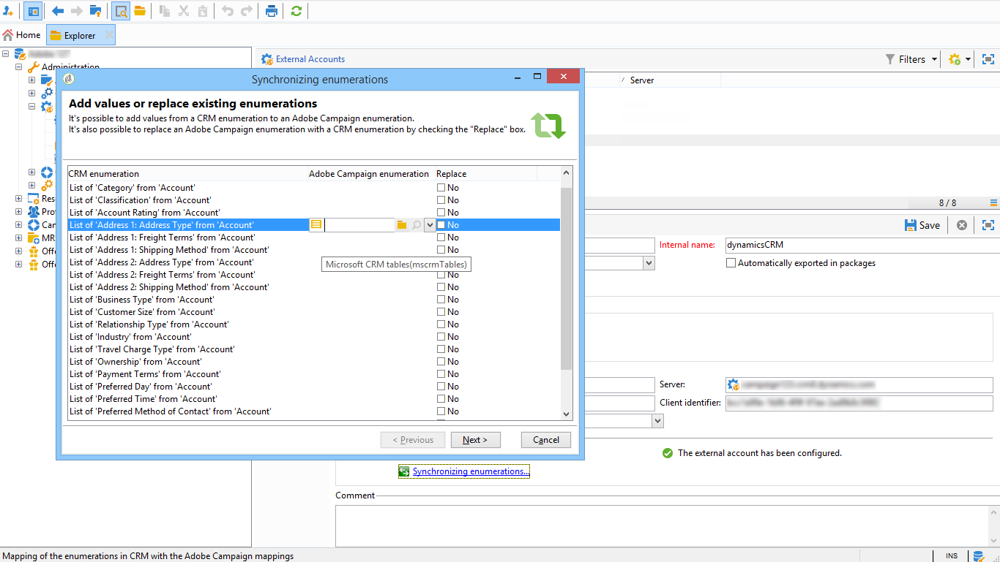

# Connetti Campaign e Microsoft Dynamics 365{#connect-to-msdyn}

In questa pagina imparerai a collegare Campaign Classic a **Microsoft Dynamics CRM 365**.

Le implementazioni possibili sono:

* tramite **API Web** (consigliato). Per informazioni su come impostare la connessione con Microsoft Dynamics, consulta [la sezione seguente](#microsoft-dynamics-implementation-step) .
* con **Office 365**. Per informazioni sui passaggi chiave per configurare questa integrazione, consulta [questo video](#microsoft-dynamics-office-365) .
* per una distribuzione **On-Premise**, applicare i passaggi chiave di Office 365.

La sincronizzazione dei dati viene eseguita tramite un’attività del flusso di lavoro dedicata. [Ulteriori informazioni](../../platform/using/crm-data-sync.md).

## Passaggi di implementazione{#microsoft-dynamics-implementation-steps}

Per collegare Microsoft Dynamics 365 al funzionamento con Adobe Campaign tramite **API Web**, è necessario applicare i seguenti passaggi:

In Microsoft Dynamics CRM:
1. Ottieni ID client Microsoft Dynamics
1. Genera segreto client di Microsoft Dynamics
1. Configurare le autorizzazioni
1. Creare un utente di app
1. Codifica la chiave privata

[Ulteriori informazioni in questa sezione](#config-crm-microsoft)

In Campaign Classic:
1. Creare un nuovo account esterno
1. Configurare l’account esterno con le impostazioni di Microsoft Dynamics
1. Utilizza la procedura guidata di configurazione per mappare le tabelle e sincronizzare le enumerazioni
1. Creare il flusso di lavoro di sincronizzazione

[Ulteriori informazioni in questa sezione](#configure-acc-for-microsoft)


>[!CAUTION]
> Quando si collega Adobe Campaign a Microsoft Dynamics, non è possibile:
> * Installa plug-in che possono modificare il comportamento del CRM e portare a problemi di compatibilità con Adobe Campaign
> * Selezionare più enumerazioni

>


## Configurare Microsoft Dynamics CRM {#config-crm-microsoft}

Per generare il token di accesso e le chiavi per configurare l&#39;account, è necessario accedere a [Directory di Microsoft Azure](https://portal.azure.com) utilizzando le credenziali **Amministratore globale**. Quindi segui i passaggi descritti di seguito.

### Ottieni ID client Microsoft Dynamics {#get-client-id-microsoft}

Per ottenere l’ID client, è necessario registrare un’app in Azure Active Directory. L&#39;ID client è lo stesso dell&#39;ID applicazione.

1. Passa a **Azure Active Directory > Registrazioni app** e fai clic su **Nuova registrazione applicazione**.
1. Assegna un nome univoco che possa aiutare a identificare un&#39;istanza, ad esempio **adobecamcampaign`<instance identifier>`**.
1. Scegli **Tipo di applicazione** come **App web / API**.
1. Utilizza `http://localhost` per **URL di accesso**.

Una volta salvato, ottieni un **ID applicazione** che è l’identificatore client per Campaign.

Ulteriori informazioni in [questa pagina](https://docs.microsoft.com/en-us/powerapps/developer/common-data-service/walkthrough-register-app-azure-active-directory).

### Genera il segreto client di Microsoft Dynamics {#config-client-secret-microsoft}

Il segreto client è la chiave univoca per l’ID client. Per ottenere l’identificatore della chiave di certificato, effettua le seguenti operazioni:

1. Passa a **Azure Active Directory > Registrazioni app** e seleziona l&#39;applicazione creata in precedenza.
1. Fai clic su **Certificati e segreto**.
1. Fai clic su **Carica certificato**, quindi sfoglia e carica il certificato pubblico generato.
1. Per generare il certificato puoi utilizzare openssl.

   Ad esempio:

   ```
   - openssl req -x509 -sha256 -nodes -days 365 -newkey rsa:2048 -keyout '<'private key name'>' -out '<'public certificate name'>
   ```

1. Fai clic sul collegamento **manifest** per ottenere l&#39; **identificatore della chiave del certificato** e l&#39; **ID chiave**.

### Configurare le autorizzazioni {#config-permissions-microsoft}

Devi configurare le **Autorizzazioni richieste** per l&#39;app creata.

1. Passa a **Azure Active Directory > Registrazioni app** e seleziona l&#39;applicazione creata in precedenza.
1. Fai clic su **Impostazioni** in alto a sinistra.
1. In **Autorizzazioni richieste**, fai clic su **Aggiungi** e **Seleziona un&#39;API > Dynamics CRM Online**.
1. Quindi fai clic su **Seleziona**, abilita la casella di controllo **Access Dynamics 365 come utenti dell’organizzazione** e fai clic su **Seleziona**.

### Creare un utente app {#create-app-user-microsoft}

L&#39;utente dell&#39;app è l&#39;utente che verrà utilizzato dall&#39;applicazione registrata in precedenza. Tutte le modifiche apportate a Microsoft Dynamics utilizzando l’app registrata sopra verranno eseguite tramite questo utente.

**Passaggio 1**: Crea un utente non interattivo nella directory attiva azure

1. Fare clic su **Azure Active Directory > Utenti** e fare clic su **Nuovo utente**.
1. Assegna un nome appropriato da utilizzare e il nome utente deve essere un formato e-mail.
1. Scegliere **Amministratore Dynamics 365** in **Ruolo directory**.

**Passaggio 2**: Assegnare una licenza corretta all&#39;utente creato

1. In [Microsoft Azure](https://portal.azure.com), fai clic su **Admin app**.
1. Vai a **Utenti > Utenti attivi** e fai clic sull&#39;utente appena creato.
1. Fai clic su **Modifica licenze prodotto** e seleziona il **Piano di coinvolgimento cliente Dynamics 365**.
1. Fai clic su **Chiudi**.

**Passaggio 3**: Creare un utente dell’applicazione in Dynamics CRM

1. Da [Microsoft Azure](https://portal.azure.com), passa a **Impostazioni > Protezione > Utenti**.
1. Fai clic sull&#39;elenco a discesa, seleziona **Utenti applicazioni** e fai clic su **Nuovo**.
1. Utilizza lo stesso nome utente dell&#39;utente creato nella directory attiva qui sopra

   >[!NOTE]
   >
   >L’utilizzo dello stesso nome genera un errore di chiave duplicato, quindi finché non viene ricevuta una conferma della necessità di questo passaggio, utilizza un nome utente diverso e procedi.

1. Assegna l&#39; **ID applicazione** per [l&#39;applicazione creata in precedenza](#get-client-id-microsoft).
1. Fai clic su **Gestisci ruoli** e scegli il ruolo **Amministratore di sistema** per l&#39;utente.

## Configura la campagna {#configure-acc-for-microsoft}

Per collegare Microsoft Dynamics 365 e Campaign, devi creare e configurare un account esterno dedicato in Campaign.

1. Passa a **[!UICONTROL Administration > Platform > External accounts]**.

1. Crea un nuovo account esterno, seleziona il tipo **[!UICONTROL Microsoft Dynamics CRM]** e l&#39;opzione **[!UICONTROL Enable]**.

1. Seleziona il tipo di distribuzione **[!UICONTROL Web API]**:

   Adobe Campaign Classic supporta l’interfaccia REST di Dynamics 365 con protocollo OAuth per l’autenticazione con **[!UICONTROL Certificate]** o **[!UICONTROL Password Credentials]**.

   Utilizza le impostazioni [definite in precedenza](#get-client-id-microsoft) nella directory di Azure per configurare l’account esterno.

   

   >[!NOTE]
   >
   >La configurazione dell’account esterno Microsoft Dynamics CRM è dettagliata [in questa sezione](../../installation/using/external-accounts.md#microsoft-dynamics-crm-external-account).

1. Fai clic sul collegamento **[!UICONTROL Microsoft CRM configuration wizard...]** : Adobe Campaign rileva automaticamente le tabelle dal modello dati di Microsoft Dynamics.

   

1. Selezionare le tabelle da recuperare.

   

1. Fai clic su **[!UICONTROL Next]** per iniziare a creare lo schema corrispondente.

   

   >[!NOTE]
   >
   >Per approvare la configurazione, è necessario disconnettersi/riconnettersi alla console Adobe Campaign.

   Puoi verificare che lo schema di dati corrispondente sia disponibile in Adobe Campaign.

   

1. Fai clic sul collegamento **[!UICONTROL Synchronizing enumerations...]** per avviare la sincronizzazione delle enumerazioni tra Adobe Campaign e Microsoft Dynamics.

   

Campaign e Microsoft Dynamics sono ora connessi. È possibile impostare la sincronizzazione dei dati tra i due sistemi. Ulteriori informazioni sono disponibili nella sezione [Sincronizzazione dati](../../platform/using/crm-data-sync.md) .

## Configurare l&#39;integrazione di Microsoft Dynamics CRM Office 365{#microsoft-dynamics-office-365}

Guarda questo video per scoprire come integrare Dynamics 365 con Adobe Campaign Classic nel contesto di una distribuzione di Office 365.

>[!VIDEO](https://video.tv.adobe.com/v/23837?quality=12)


## Tipi di dati campo supportati {#ms-dyn-supported-types}

Per i tipi di attributi supportati o non supportati da Microsoft Dynamics 365, consulta l’elenco seguente:


| Tipo di attributo | Supportato |
| --------------------------------------------------------------------------------- | --------- |
| Tipi di base : booleano, datetime, decimal, float, double, integer, bigint, string | Sì |
| Denaro (come doppio) | Sì |
| promemoria, entity yname , primarykey, uniqueidentifier (come stringhe) | Sì |
| Stato, elenco a discesa (memorizziamo i valori possibili nelle enumerazioni), stato (stringa) | Sì |
| proprietario (come stringa) | Sì |
| Ricerca (solo ricerche di riferimenti a entità singola) | Sì |
| cliente | No |
| Riguardo | No |
| PartyList | No |
| ManagedProperty | No |
